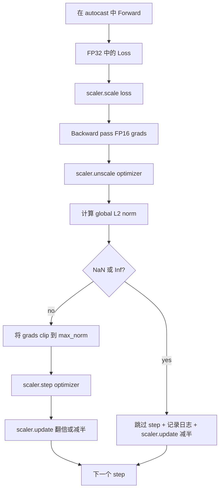

# Trình cắt và độ chính xác hỗn hợp

> Trong lớp 1 Optimizer và lịch trình  giả định Gradient là bình thường. Chúng thường không bình thường. Một loạt xấu về việc làm cho chuẩn gradient tăng lên ba cấp số.

**Type:** Build
**Languages:** Python
**Prerequisites:** Phase 19 lessons 30-37
**Time:** ~90 minutes

## Mục tiêu học tập

- 计算 tất cả các gradient tham số của L2 chuẩn toàn cầu, và vượt quá định dạng  giá trị khi nguyên địa clip.
- Sử dụng tự động đúc thêm GradScaler  gói bước huấn luyện, để FP16 đi trước và sau đi 能承受溢出.
- 检测 Loss hoặc Gradient Trung của NaN 和 Inf, nhảy qua bước tối ưu hóa,并 ghi lại lần nhảy này──
- Mỗi bước  báo cáo nhân tố quy mô của GradScaler, để tiếp tục một lượng lớn bỏ qua 能立刻可见.

## Vấn đề

Hôm qua cũng có thể làm sạch chạy tập luyện, trong bước 8.217 时 mất mát đường cong đột ngột đứng lên.                                                                                                                                                                                                                                                 

Hoạt động đào tạo chính xác hỗn hợp thông qua FP16  tính toán vượt qua phía trước và phần lớn vượt qua phía sau, sẽ nảy sinh tăng lên 2-3 lần. Giá cả là phạm vi biểu hiện của FP16 rất nhỏ. Một số điểm điển hình của quá tải trong FP16 sẽ trở thành Inf, và lây lan trong các tầng tiếp theo thành NaN, dẫn đến bước tối ưu hóa tiếp theo Đặt mỗi trọng lượng thành NaN.

构建问题在于正确连线. 首先 clip 再 unscale, 值就会作用在规模梯度上;先 unscale 再 clip,GradScaler 上的操作顺序就很重要.`scaler.scale(loss).backward()`, rồi rồi`scaler.unscale_(optimizer)`, rồi rồi`clip_grad_norm_`, rồi rồi`scaler.step(optimizer)`, cuối cùng`scaler.update()`Bất kỳ thứ tự nào khác cũng sẽ tạo ra một vòng lặp bị hỏng lặng.

## Khái niệm



### Tỷ lệ L2 toàn cầu

Tự chuẩn L2 toàn cầu là chuẩn Euclidean của vector gradient sau, chứ không phải là chuẩn của từng tham số. PyTorch sẽ thực hiện nó như`torch.nn.utils.clip_grad_norm_(parameters, max_norm)` Phụng tính này trở lại chuẩn trước khi clip, vì vậy bài học này có thể ghi lại giá trị tự nhiên và giá trị cắt, điều này là cần thiết cho việc chẩn đoán mỗi bước chúng ta đang cắt.

### autocast và GradScaler

`torch.amp.autocast(device_type)`là một quản lý bối cảnh, sẽ chọn性地 sử dụng FP16 运行符合条件的操作 (`torch.amp.GradScaler(device_type)`là một trợ lý, sẽ ở phía sau trước Loss thang, và trong bước tối ưu hóa trước ngược thang Gradient;; thứ hai là một thiết kế; chỉ sử dụng một trong số đó là cấu hình sai lầm, test nên nắm bắt vấn đề này;;

Bài học này sử dụng CPU tự độngcast, vì đó là nội dung của CI trung tâm có thể hoạt động; mô hình tương tự có thể được thông qua `device_type="cpu"`改为 `device_type="cuda"`Định hướng chuyển sang CUDA──CPU 上的 GradScaler là một stub(CPU autocast 默认已经运行以 BF16 运行, không cần quy mô mất mát), nhưng本课包含这些调用站点,让线程与 GPU loop 完全一致──

### Khám phá NaN và Inf

Chuyện kiểm tra xảy ra ở hai vị trí. Đầu tiên, mất đi chính xác sẽ trở lại.`torch.isfinite`检查;In hoặc NaN Loss sẽ không tạo ra hữu ích Gradient, sẽ trong vào Optimizer 前被跳过;;`scaler.unscale_(optimizer)`之后,本课会用 `has_non_finite_grad(...)`扫描 gradient không quy mô,并把任何Inf或NaN视为跳过──These two checks together cover forward-pass 和 backward-pass 两类失败模式──

### Chẩn đoán yếu tố quy mô

Scaling factor là trạng thái nội bộ của GradScaler.`scaler.get_scale()`,并把它与学习率和梯度规范 一起记录──健康的运行 会显示规模因子 以2 的上升,直到在`2^17`Hoặc`2^18`附近和── hành vi bất thường chạy sẽ cho thấy yếu tố trong dao động giữa giá trị cao và giá trị thấp, cho thấy mô hình của Gradient có lúc trong phạm vi, có lúc không có── không ghi nhật ký, tín hiệu chẩn đoán này là không thể nhìn thấy──


```figure
grad-clip-monitor
```

## Hãy xây dựng nó

`code/main.py`实现:

- `clip_global_l2_norm`- Đối với`torch.nn.utils.clip_grad_norm_`n n n n n n n n n n n n n n n n n n n n n n n n n n n n n n n n n n n n n n n n n n n n n n n n n n n n n n n n n n n n n n n n n n n n n n n n n
- `has_non_finite_grad`- 扫描 Gradient 中 NaN 和 Inf của trợ lý
- `AmpTrainState`- 包裹一个模型一个`AdamW`Một máy tối ưu hóa, một máy GradScaler, và một thiết bị tự động phát.`step(inputs, targets)`,运行完整的剪裁,扩展 和跳-on-NaN ống dẫn
- `StepLog`和 `SkipLog`-  cấu trúc ghi chép từng bước
- Một demo, sẽ tập một mini `nn.Linear`mô hình 20 个 bước, trong bước 5 hướng Gradient 注入 Inf 以触发跳路,并印得到的日志──

运行:

```bash
python3 code/main.py
```

脚本以 0 退出,并印每步日记,每行标记为 `STEP`Hoặc`SKIP`Ít nhất có một dòng là `SKIP`

## Các mẫu sản xuất

Bốn mô hình có thể làm cho vòng lặp này được nâng cao thành giai đoạn đào tạo sản xuất.

**Skip counter 应该是 alert，而不是一行 log。**Mỗi lần chạy tập  nhảy quá ít bước là khỏe mạnh. Mỗi thời kỳ xuất hiện hàng trăm lần bỏ qua là cảnh báo cứng: mô hình đã vào FP16 không thể chịu được khu vực, trong khi vòng lặp đang đang lặng lẽ thất bại.

**Clip threshold 放在 config 中。** `max_norm = 1.0`là giá trị mặc định của đào tạo ngôn ngữ-chương trình hiện đại. Trước đó, hãy phơi lên mô hình nhỏ. Một ngưỡng lớn hơn để mô hình có thể phục hồi từ một loạt các vấn đề thực sự khó khăn. Một ngưỡng nhỏ hơn sẽ có thể làm cho nó trở nên tồi tệ hơn, nhưng giá cả là đường cong mất mát hơn.

**Norm log 和 schedule 一起进入 CSV。**Cột CSV là `step, lr, grad_l2_pre_clip, grad_l2_post_clip, loss, skipped, skip_reason, scaler_scale` Người xem 打开文件后, có thể xem trong cùng một dòng lịch trình  Gradient 的故事、scaling factor,以及 skip outcome 含原因  把这些列 拆分多个文件,是制造错位分析的配方──

**`scaler.update()` 每个 step 都运行，即使 skip 也一样。**Trong bước sạch, trên, thang máy 读取 nó không-inf đếm,递增,并可能把因素 翻倍. Trong bước bỏ qua, trên, thang máy 放因素 减半并重置计.`update()`, là tạo ra yếu tố quy mô từ không thay đổi bug.

## Sử dụng nó

Các mô hình sản xuất:

- **Autocast device 匹配 optimizer device。**Ghiên tập GPU `torch.amp.autocast(device_type="cuda")`; CPU 使用 `torch.amp.autocast(device_type="cpu")`◊ Kết hợp thiết bị sẽ tạo ra lỗi kiểu tĩnh lặng, trên bề mặt là cong mất trông bình thường, nhưng mô hình không học ◊
- **Backward 前检查 Loss。** `torch.isfinite(loss).all()`là một lần giảm căng thẳng; chi phí có thể bỏ qua, trong khi trong NaN Loss 上省 là một bước đào tạo hoàn chỉnh.
- **`zero_grad` 中使用 `set_to_none=True`。**将 Gradient 设为 `None`Thay vì không, hãy cho Optimizer  nhảy qua không ảnh hưởng các nhóm tham số tính toán.

## Chuyển nó

`outputs/skill-clip-amp.md`Trong thực tế dự án trong hội thảo mô tả bước đào tạo Sử dụng thâm điểm clip và thiết bị tự động phát hành  CSV từng bước trong vị trí kiểm soát phiên bản, cũng như thâm điểm cảnh báo sản xuất skip-rate là gì.

## Các bài tập

1. Use real loss spike 替换合成 Inf 注入(把某批的目标 乘以1e8),并验证跳路 会触发。
2. 添加一个 `--bf16`chế độ, sẽ tự động cắt đến BF16 thay vì FP16;. Phạm vi biểu tượng của BF16 so với FP16 rộng hơn, thường rất ít cần quy mô mất mát; chứng minh cùng một demo ốc suất bỏ qua lên  giảm xuống 0.
3. 添加一个单位测试,验证在没有剪辑发生时,渐变剪辑包装 会正确返回 pre-clip 和 post-clip chuẩn mực
4. 添加滚窗跳速率 计算,以及一个CLI旗: nếu tốc độ 连续 100 个步 超过配置值,就让运行 失败。
5. sẽ vòng 接 đến CSV Canonical`step, lr, grad_l2_pre_clip, grad_l2_post_clip, loss, skipped, skip_reason, scaler_scale`) viết vào, và qua mỗi dòng sau khi lưu  xác nhận tài liệu có thể được giữ lại sau khi Ctrl-C

## Các điều khoản chính

| Term | What people say | What it actually means |
|------|-----------------|------------------------|
| Global L2 norm | "Clip target" | 所有可训练 parameter 的拼接 gradient vector 的 Euclidean norm |
| autocast | "Mixed precision" | 在 `with` block 内，对符合条件的 operation 选择性执行 FP16（或 BF16） |
| GradScaler | "Loss scaler" | 在 backward 前乘以 Loss，并在 optimizer step 前 inverse-scale Gradient 的 helper |
| Skip | "Bad step" | 因为 Gradient 或 Loss 是 non-finite 而拒绝执行的 optimizer step；scaler 会将 factor 减半 |
| Scaling factor | "Scaler state" | GradScaler 当前的 multiplier；干净区间后翻倍，每次 skip 时减半 |

## Đọc thêm

- [Micikevicius et al., Mixed Precision Training (arXiv 1710.03740)](https://arxiv.org/abs/1710.03740)- Đề xuất quy mô tổn thất ban đầu
- [Pascanu, Mikolov, Bengio, On the difficulty of training recurrent neural networks (arXiv 1211.5063)](https://arxiv.org/abs/1211.5063)- Gradient Clipping 参考论文
- [PyTorch torch.amp.GradScaler](https://docs.pytorch.org/docs/stable/amp.html)- 本课包裹的 Scaler API
- [PyTorch torch.nn.utils.clip_grad_norm_](https://docs.pytorch.org/docs/stable/generated/torch.nn.utils.clip_grad_norm_.html)- 本课使用的剪辑 nguyên thủy
- Giai đoạn 19 · 42 - 为 loop 提供 corpus 的 downloader
- Giai đoạn 19 · 43 - vòng 消耗的数据载体
- Giai đoạn 19 · 44 - Lập trình hợp tác với vòng lặp
