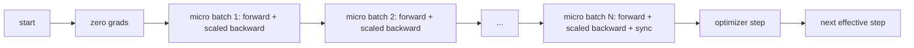
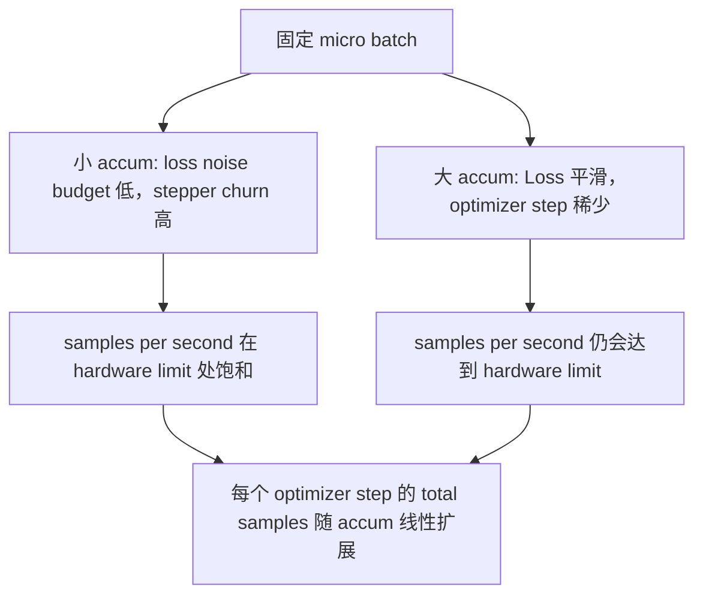

# Sự tích lũy dần

> Sử dụng một bộ vi nhỏ, tập luyện để có thể chịu trách nhiệm không chịu trách nhiệm.

**Type:** Build
**Languages:** Python
**Prerequisites:** Phase 19 lessons 42 to 45
**Time:** ~90 minutes

## Mục tiêu học tập

- 推导 hiệu quả lô 恒等式:`effective_batch = micro_batch * accum_steps`
- 实现 per-micro-batch mất quy mô, để tích lũy Gradient 匹配 một lần hoàn toàn toàn-batch ngược lại.
- Trong micro-batch cuối cùng  trước nhảy qua đồng bộ hóa tối ưu hóa
- 读取 thông qua so với đường cong lô hiệu quả,并解释 giảm lợi nhuận.

## Vấn đề

Bạn muốn sử dụng hiệu quả đợt 512  tập luyện, vì đường cong mất mát 更平滑, Optimizer bước trong quy mô này hợp lý hơn.

风险在于,Loss 不再是大批时的相同数值──将16 mini-batch的交叉进化 直接相加,将是一个全批输16倍──没有扩展时,Gradient方向是正确的,但幅度是错误的,优化步骤会大16倍──修复方法只有一次除法──修复也很容易忘了──

## Khái niệm



Hợp đồng 很短:

- Mỗi micro-batch của mất trong `backward()``accum_steps`✿PyTorch 默认会把 Gradient 累加到 ✿`param.grad`Trung; lần này phân định sẽ đưa số tiền chạy trở lại đúng thước.
- Bước tối ưu hóa Mỗi lô hiệu quả 触发 một lần, trong cuối cùng của micro-batch 后──中间步 会扭曲后续整个运行 根据每个参数──
- Tình trạng của Optimizer (momentum buffer, Adam moments) mỗi bước hiệu quả tiến lên một lần, thay vì mỗi micro-batch tiến lên một lần. Nếu không, các trung bình di động thoáng qua sẽ thấy tần số sai,并消耗掉 lịch trình.
- Trên một thiết bị, đó chỉ là kế toán. Trên một cluster nhiều cấp, cùng một mô hình sẽ không phải là micro-batch cuối cùng.`no_sync`Trong bối cảnh, nhảy qua Gradient tất cả- giảm; cuối cùng của micro-batch 会 một lần giảm  hoàn toàn tích lũy Gradient, thay vì thanh toán N 次 mạng成本。

### Bằng chứng tương đương trong mã

```python
loss = criterion(model(x_full), y_full)
loss.backward()
opt.step()
```

等价格

```python
for x, y in chunks(x_full, y_full, n):
    scaled = criterion(model(x), y) / n
    scaled.backward()
opt.step()
```

Ngoài sự khác biệt của thứ tự tổng điểm nổi  Loop kết thúc tích lũy gradient buffer với một lần đầy đủ lô ngược 会 tạo ra tensor tương tự  Khóa học trong `equivalence_check`Trung dùng nhỏ hơn 1e-4 của sự khác biệt max-abs 断言这一点.

### Đi đâu là chi phí

Mỗi micro-batch đều cần một lần đi về phía trước và một lần quay lại.`outputs/accum-curve.json`đường cong thông qua trung bình  hiển thị trong các micro-batch cố định bên dưới batch hiệu quả  tăng lớn sẽ xảy ra khi:



Không có bữa ăn trưa miễn phí.`accum_steps`翻倍, sẽ làm cho mỗi bước tối ưu hóa thời gian tường 翻倍── biến đổi là sự khác biệt của ước tính cấp độ: trong cùng ngân sách tường 下, bạn thực hiện bước tối ưu hóa hơn ít, nhưng mỗi lần đều trong nhiều hơn mẫu 上平均──文献把大批和小批视为不同的优化问题;本课关注的是机器,而不是统计──


```figure
cc-grad-accumulation
```

## Hãy xây dựng nó

`code/main.py`Đó là một vật thể có thể vận hành.

### Bước 1: Kiểm tra tương đương

`equivalence_check()`Sử dụng giống nhau  xây dựng hai bản sao của cùng một mạng. Một trong một lần đi trước nhìn thấy 16 mẫu lô. Một trong hai nhìn thấy bốn 4 mẫu lô,并把 Loss 除以四.`max_abs_diff < 1e-4`

### Bước 2: mô hình đồng bộ hóa bước cuối cùng

`train_one_optimizer_step`Trải qua các micro-batch. Trừ một micro-batch cuối cùng, mỗi thành phố sẽ vào.`no_sync_context(model)`Trong quá trình đơn, ngữ cảnh này là không có; trong DDP, đây sẽ nhảy qua Gradient all-reduce.`sync_counter`记录我们离开 no_sync scope 的次数; đối với N 个微批, số là mỗi bước hiệu quả một lần, chứ không phải là N 次。

### Bước 3: đường cong thông qua

`sweep_effective_batches`Sử dụng cố định micro-batch 和一组 bước tích lũy 运行同一个模型──每个设置都会记录:

- `samples_per_sec`: 看到的 tổng mẫu trừ thời gian tường
- `median_step_ms`: Mỗi bước hiệu quả của phần trăm 50
- `sync_calls`: 被触发的集体点
- `avg_loss`: pha của các bước tối ưu hóa 平均值

 xuất phát rơi trong `outputs/accum-curve.json`,并可从笔记本 复用──

运行:

```bash
python3 code/main.py
```

脚本先打印等效差,再打印扫表,最后打印 JSON path──Exit code zero──

## Sử dụng nó

Trong đào tạo sản xuất,Tăng tích gradient 藏在一个扣 后面──PyTorch's pattern is `accumulation_steps = effective_batch // (micro_batch * world_size)`△ Ở đây không cho phép sử dụng khung sẽ bao gồm cùng một vòng lặp, nhưng bước là giống như: Scale Loss, nhảy qua không cuối cùng của các micros 上 上的同步, tích lũy, bước một lần。

Thực tế có ba mô hình:

- Kích thước micro-batch được chọn vì năng lượng 满 bộ nhớ thiết bị.
- Các lô hiệu quả từ lịch trình tốc độ học tập 中选择──Các lô hiệu quả lớn 需要规模学习率和升温; đây là quy tắc quy mô tuyến tính được thảo luận kể từ năm 2017──
- Số tích lũy là một đường dẫn giữa hai người, cũng là bạn duy nhất có thể trong thời gian chạy tự do điều chỉnh và không viết lại nút tải dữ liệu.

## Chuyển nó

`outputs/skill-gradient-accumulation.md`Nhận công thức này, để người bạn cùng đi có thể đưa nó vào repo mới.`accum_steps`Loss quy mô, trong các micros không cuối cùng 上跳过 tối ưu hóa đồng bộ hóa, mỗi lô hiệu quả chỉ bước tối ưu hóa một lần, đưa thông suất so với lô hiệu quả 以 JSON 记录,让交易可见。

## Các bài tập

1. 用 `--num-steps 100`重新运行扫描,并绘制 mẫu mỗi giây so với loạt hiệu quả.
2. 添加一个错误扩展变异(不做除法),并显示 bước 1 时相对参考的参数差──
3. Để thay đổi SGD thành AdamW, xác nhận trạng thái tối ưu hóa Mỗi bước hiệu quả tiến lên một lần, thay vì mỗi micro-batch tiến lên một lần.
4. 引入真实 `DistributedDataParallel`bọc,并把 `no_sync_context`路由到它的方法── xác nhận đồng bộ_call Mỗi lô hiệu quả  giảm N-1──
5. 修改 kiểm tra tương đương, đối với hai loại phân chia nhỏ khác nhau ((2 x 8 vs 4 x 4),并解释你需要放宽任何宽容的──

## Các điều khoản chính

| Term | What people say | What it actually means |
|------|-----------------|------------------------|
| Micro batch | 你 forward 的 batch | 单次 forward pass 中能放进 memory 的 slice |
| Accum steps | 每个 step 的 backward pass 数 | 在一次 optimizer step 前累加的 backward 数量 |
| Effective batch | 这个 batch | Micro batch 乘以 accum steps，再乘以 data parallel world size |
| Loss scaling | 除以 N | Per-micro-batch division，使 summed gradients 匹配 full batch |
| Sync on last | 跳过其余部分 | 只在 window 中最后一次 backward 上运行 Gradient collective |

## Đọc thêm

- PyTorch docs 中关于 `DistributedDataParallel.no_sync`Nội dung,介绍 đồng bộ bước cuối cùng 技巧的制作 版本──
- Goyal et al., 2017, về việc mở rộng quy mô tuyến tính của đào tạo hàng loạt lớn, là một lý do điển hình cho việc thực hiện hàng loạt hiệu quả.
- PyTorch vấn đề theo dõi 中关于 Gradient tích lũy với sự cố không quy mô chính xác hỗn hợp.
- Các bài học giai đoạn 19 42 đến 45 覆盖本课所假设的模型、数据 loader、优化器 和教练架架──
- Giai đoạn 19 bài học 47 覆盖检查点 和复习,让长时间积累运行 能在墙钟顶下存活──
