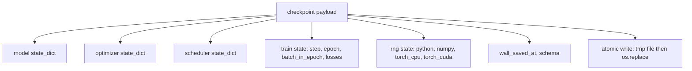
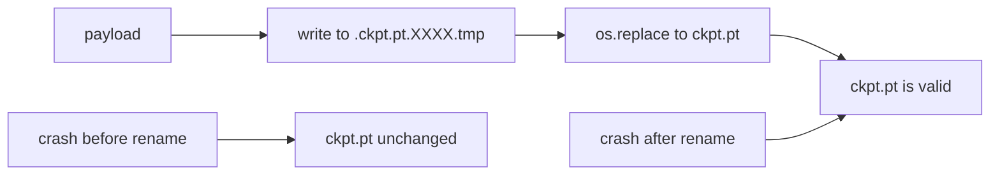
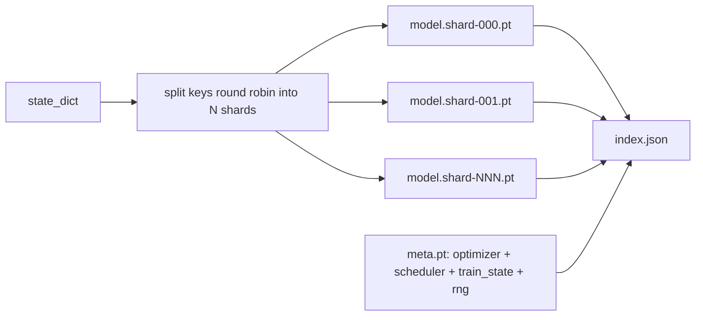

# Địa chỉ kiểm soát 保存与恢复

> 训练中断会杀死运行;checkpoint 让它们可以继续;; nguyên tử hóa lưu trữ mô hình;Optimiser;Scheduler;Loss history;step counter 和 RNG state,这样任何时刻都被终止时,磁盘都会留下一个有效文件;;

**Type:** Build
**Languages:** Python
**Prerequisites:** Phase 19 lessons 42 to 45
**Time:** ~90 minutes

## Mục tiêu học tập

- Để có thể tải lại một quá trình mới.
- Sử dụng cách viết trước thời gian đổi tên để thực hiện tiết kiệm nguyên tử, đảm bảo vụ tai nạn sẽ không bao giờ bị bỏ lại để viết đến một nửa của các tài liệu.
- Khôi phục trạng thái RNG của Python、NumPy 和 PyTorch, làm cho tiếp tục Loss 匹配未中断的基线──
- Để không còn có thể đặt vào mô hình của một tập tin đơn  xây dựng bố cục điểm kiểm tra phân mảnh, chứa các phân mảnh qua hash  xác nhận và một chỉ số JSON 

## 问题

Bạn đã đặt một nhiệm vụ đào tạo, dự kiến sẽ chạy 18 小时. Wallclock lên hạn là 4 小时.

Thực tế là một tài liệu duy nhất, trong đó lưu giữ tất cả mọi thứ cần thiết để tiếp tục đào tạo: mô hình tham số, trạng thái tối ưu hóa, trạng thái lập trình, sử dụng để vẽ Loss lịch sử, bước trước và thời đại và các bộ đếm hàng loạt thời đại, còn mỗi sự ngẫu nhiên nguồn gốc của trạng thái RNG. Không có trạng thái RNG, sau khi phục hồi, đường cong Loss sẽ là một đường cong khác.

Atomic save là một phần khác của hợp đồng này. Tên tập tin cuối cùng trực tiếp viết là tai nạn xảy ra trong quá trình viết sẽ để lại các tệp bị hỏng; Resume sẽ đọc đến rác.

## 概念



### 5 cái cái vỏ của tiểu bang

| Bucket | 为什么重要 |
|--------|------------|
| Model | Weights 和 buffers；也就是 model 本身。 |
| Optimizer | Momentum 和 adaptive moments；没有它们，下一步就是另一个 Optimization 问题。 |
| Scheduler | Learning rate 在 curve 上的位置；cosine schedules 尤其在意这一点。 |
| Train counters | Step、epoch、batch-in-epoch，以及绘制 dashboard 的 Loss history。 |
| RNG state | 为 dropout、data shuffling，以及 model 内部的任何 sampling 提供 determinism。 |

### Cung cấp nguyên tử



两条规则──第一,文件临时必须位于目标所在的同一目录中,这样重命名才会停留在同一个文件系统内;跨设备重命名 不是原子的──第二,临时名称对每次尝试都必须唯一,避免两个作者 相互覆盖──

### Các trạm kiểm soát bị phá vỡ

Khi mô hình 变大时, tải trọng đơn tài liệu sẽ trở nên quá lớn, tải không đủ nhanh, kiểm tra không dễ dàng, và trong chia sẻ mạng 读取中途动时 rất đau khổ.



Index  ghi lại số lượng mảnh vỡ ∙ từng mảnh vỡ của sha256, cũng như sha256 của tệp meta── Khi bất kỳ hash nào không phù hợp, loader sẽ rõ ràng thất bại── Các mảnh vỡ có thể rơi trên các đĩa vật lý khác nhau; meta  rất nhỏ, sẽ đọc trước──

### Thích từ thời đại Trung途继续

Để tiếp tục để chuẩn bị cho thời đại tiếp theo, sẽ lãng phí từ vài phút đến một ngày khác nhau.`(epoch, batch_in_epoch)`RNG trạng thái. Sau đó, vòng đào tạo sẽ tạo số ngẫu nhiên nhanh chóng qua quá trình hiện tại trong thời đại đã tiêu thụ các lô, sau đó từ`batch_in_epoch`继续──本课代码精确完成这一点;断言是恢复后损失轨迹会在 1e-4 范围内匹配未断的基线──


```figure
cc-atomic-checkpoint
```

## Hãy xây dựng nó

`code/main.py`提供四个原始和一个演示驱动器.

### Bước 1: 捕获并恢复 trạng thái RNG

`capture_rng_state`返回一个字句,包含Python 的 `random.getstate`、NumPy của `np.random.get_state`, cũng như CPU PyTorch và CUDA RNG bytes`restore_rng_state`会反向恢复它──CPU tensor là một bộ đệm 8 byte, RNG của PyTorch 知道如何消费它──

### Bước 2: tiết kiệm nguyên tử

`atomic_save`sẽ tải trọng  viết vào thư mục mục tiêu trong tệp tạm thời, sau đó sử dụng `os.replace`将其交换到最终名称──`atomic_write_json`Đối với chỉ số bị phân mảnh  thực hiện cùng một hoạt động.

### Bước 3: Đi lại hoàn toàn tại điểm kiểm soát

`save_checkpoint`Để mô hình, tối ưu hóa, lập trình, trạng thái tàu và RNG 打包到一个 dict 中.`load_checkpoint`Trở lại, và trở lại một.`TrainState`◊ trường schema là hook nâng cấp: futurformation变化会递增版本 string,而 loader 会进行发送──

### Bước 4: biến thể bị chia nhỏ

`save_sharded_checkpoint`以 round-robin 方式把参数键 分分到N个 shards 中, sử dụng riêng của riêng mình atom save 写入每个 shard,写入一个包含优化器,安排器和火车状态的地图文件,并写入包含 shard sha256 的 JSON索引.`load_sharded_checkpoint`会在融合前验证 mỗi mảnh.

### Bước 5: trình diễn tiếp tục

`run_resume_demo`会将一个小模特 训练 `total_steps`, trong `interrupt_at`保存检查点,然后继续运行――第二个过程 会恢复检查点并运行剩余步骤――该函数 返回断点 之后两条损失轨迹最大绝对差――有RNG恢复,差异为零或浮点噪音――

运行 nó:

```bash
python3 code/main.py
```

单文件和碎片演示 都断言最大差小于 1e-4──摘要会写入 `outputs/resume-demo.json`

## Sử dụng nó

生产训练会把检查点 作为教练的一部分交付──形状相同:model + Optimizer + scheduler + counters + RNG,以原子方式写入,并按步骤命名,便于找到最新文件── chia sẻ bố cục 通过并行阅读 支持大型模型加载;`index.json`Đó là phần của việc này.

Trực hành 3 mô hình:

- **Schema 是 payload 中的一个 string。**Di cư theo nó, không có nó, bạn sẽ không thể tiến hành trong một tình huống không phá vỡ hoạt động cũ.
- **对每个 shard 计算 Sha256。**静默截断的下载是最糟糕的 bug; loader phải么快速失败, phải么晚些失败──
- **让 checkpoint cadence 保持诚实。**Mỗi bước  lưu lại một lần, và mỗi vài phút  lưu lại một lần, lấy người ngắn hơn. Nếu không, tai nạn xảy ra trong một bước dài.

## Chuyển nó

`outputs/skill-checkpoint-save-resume.md`Đây là bất kỳ mô hình kịch bản đào tạo mới nào: hình thức tải trọng, viết nguyên tử, ghi RNG, chỉ mục được rút ngắn.`save_checkpoint`, trong khởi động 接入 `load_checkpoint`, vận hành là có thể giết người.

## Các bài tập

1. 用按参数组 分片替换圆形碎片`.weight`结尾的层 vs `.bias`Khi nào mỗi kiểu thiết kế sẽ phù hợp hơn?
2.  mở rộng vòng lưu, giữ lại cuối cùng K 个 kiểm soát điểm, và làm sạch những cái cũ hơn.
3. 添加一个 `--ckpt-every-seconds`cờ, theo khoảng thời gian đồng hồ tường 触发保存, không chỉ theo đếm bước.
4. Thêm một đường kiểm tra số lượng kiểm tra, trong khởi động 运行, mỗi điểm kiểm tra trong sổ sách quét,并 báo cáo những gì đã bị hỏng.
5. 实现一个 `migrate_v1_to_v2`hàm, vào tải trọng 添加一个新字段,并递增方案字符串──让载 同时兼容两个版本──

## Các điều khoản chính

| Term | 人们常说 | 实际含义 |
|------|----------|----------|
| Atomic save | “写入然后祈祷” | 写入同一目录中的 temp file，然后用 os.replace 放入 target name |
| State dict | “Weights” | Model parameters 和 buffers，按 parameter name 作为 key |
| Sharded checkpoint | “大 model file” | 多个文件，每个 shard 一个，加上一个 meta file 和一个包含 sha256 的 JSON index |
| RNG state | “Random seed” | python random、numpy、torch CPU、torch CUDA 的捕获状态；不只是 seed |
| Mid-epoch resume | “Restart” | 快进 RNG，并从同一 epoch 中的下一个 batch 继续 |

## Đọc thêm

- POSIX `rename`ngữ nghĩa, dùng để支 `os.replace`Đề xuất tính nguyên tử dựa trên:
- PyTorch  về `torch.save`和 `torch.load`                                                                                                                                                                                                                                                                                                                                                                                                                                                                                                                             `map_location`
- Giai đoạn 19 bài học 46 bao gồm tải trọng hữu ích của điểm kiểm soát này có thể được bảo quản qua sự tích lũy gradient.
- Giai đoạn 19 bài học 48 bao gồm các định dạng quy định của nhà nước đối với các gói phân phối đối phó.
- Linux kernel `fsync`Tài liệu, để giải thích tên hóa nguyên tử 背后的耐久性保证──
