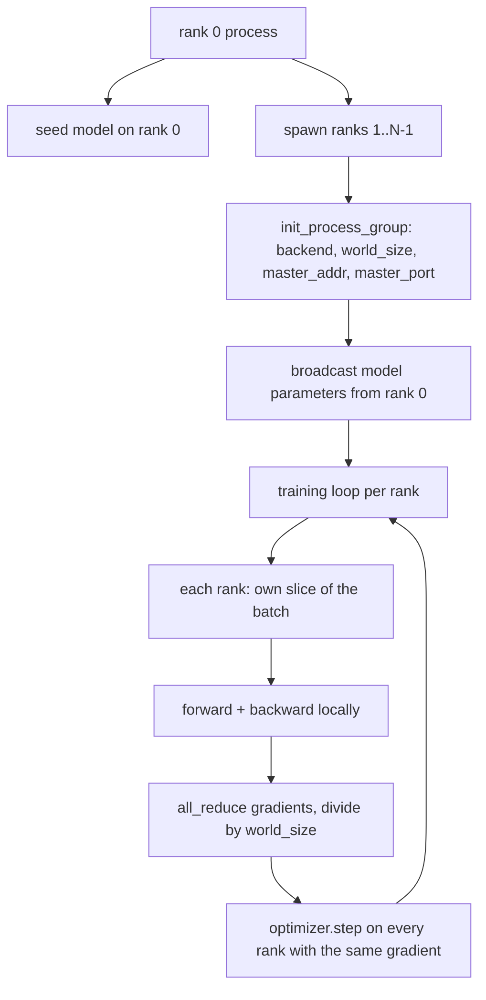
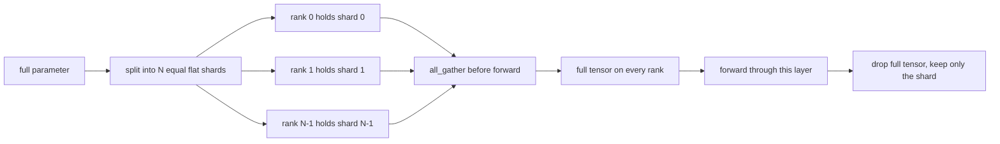

# Từ零 cấu trúc Dữ liệu phân tán song song và FSDP

> Việc đào tạo nhiều cấp là hai quy tắc tập thể và một điều luật.

**Type:** Build
**Languages:** Python
**Prerequisites:** Phase 19 lessons 42 to 45
**Time:** ~90 minutes

## Mục tiêu học tập

- Sử dụng `gloo`backend 启动跨 N 个级的过程组, không cần hardware đặc biệt.
- 实现 một gói DDP tối thiểu, trong xây dựng 时 phát sóng tham số, và ngược lại 后 tất cả giảm gradients。
- 证明 mỗi bậc gradient của tất cả giảm 匹配 kết nối đầu vào 上的单进程梯度──
- 勾勒 FSDP tham số phân mảnh: mỗi bậc 持 một mảnh, đi trước 时 thu thập đầy đủ tensor, sau đó giảm.

## 问题

模型能放进一个设备──数据设置 放不下──优化预算 要求你在每秒钟内看N 倍样本──第一个杆是数据平行:每个级别在批次不同片上运行同一个模型,然后在优化步骤前平均梯度──第二个杆是FSDP:模型本身也放不进一个设备,所以每个级别都持有每个参数的一部分,并通过 期间逐层重建全子──

Nếu các tham số trong hàng rào 漂移, lần này sẽ bị mất đi. Nếu bạn có độ lệch trung bình nhưng không có lỗ trung bình, bảng điều khiển sẽ nói dối. Nếu nhóm người không thể đạt được sự đồng thuận về topology, chạy sẽ mãi mãi treo.

本课在CPU上运行──不假设 CUDA──`gloo`Backend 随着每个 PyTorch xây dựng 一起提供,并接受 `torch.multiprocessing`công nhân; cùng một phần mã chuyển sang nhiều node GPU  上 的`nccl`时, cấu trúc không cần phải thay đổi.

## 概念



### Hai tập thể quan trọng

| Collective | 做什么 | 何时使用 |
|------------|--------------|------|
| `broadcast` | 将一个 tensor 从一个 rank 复制到所有其他 rank | Parameter init、scheduler state、任何 one-to-all sync |
| `all_reduce` | 在所有 rank 间对一个 tensor 求和（或 mean、或 max），每个 rank 都得到结果 | Backward 后的 Gradient averaging |
| `all_gather` | 每个 rank 贡献一个 tensor，每个 rank 都得到 concatenation | Logits collection、FSDP parameter unshard |

Hợp đồng DDP là xây dựng 时`broadcast`, lùi lại 后`all_reduce`❖ Bản phác thảo FSDP 在每一层前进通过 前加入 `all_gather`

### Tỷ lệ trung bình gradient 匹配 gradient đơn quá trình

Trong N 个级 上使用 B 个样本的批量 训练的模型,必须产生与单个过程 在 N * B 的批量 上训练相同的梯度──是对每级梯度 求和并除以 N,得到平均损失梯度,这正是减少交叉 Entropy 的平均减速.`max-abs-diff < 1e-3`

### Bản phác thảo của FSDP



Memory win is precise:per-rank parameter memory 降至1/N──代价是收集,每次前进通过都需支付──生产FSDP 会将收集与上层的计算重叠,所以壁表成本比简单核算预测的小得多──本课对每个参数做回路,并声称重建与原始比特等――

### CPU với backend màu

CUDA là mục tiêu sản xuất, nhưng CPU trên cũng có các con đường mã tương tự.`gloo`Đó là CPU cộng đồng backend. Nó ở trên GPU.`nccl`慢几个数量级, nhưng bề mặt API 完全相同.`backend="gloo"`始化,并用 `torch.multiprocessing`Đường sinh, thay vì `torchrun`; cả hai cuối cùng đều sẽ sử dụng cùng một cách `torch.distributed` Ở các nút đa GPU trên, sự thay đổi duy nhất là `backend="nccl"`、 thiết bị tensor, cũng như sử dụng `torchrun`n khởi động


```figure
cg-allreduce-ring
```

## Hãy xây dựng nó

`code/main.py`Đó là một vật thể có thể vận hành.

### Bước 1: Nhóm khởi động quy trình

```python
os.environ["MASTER_ADDR"] = "127.0.0.1"
os.environ["MASTER_PORT"] = str(port)
dist.init_process_group(backend="gloo", rank=rank, world_size=world_size)
```

`MASTER_ADDR`和 `MASTER_PORT`Đặt một vị trí: mỗi vị trí đều được đặt vào cùng một máy chủ trên cùng một cổng.

### Bước 2: xây dựng 时 phát sóng

`MinimalDDP.__init__`遍历每个参数 和缓冲,并调用 `dist.broadcast(tensor, src=0)`◊ Giá trị của hàng không 0 trở thành canonical init── không có bước này, mỗi hàng sẽ sử dụng hạt giống của riêng mình, hàng không từ bước đầu bắt đầu sự khác biệt──

### Bước 3: Trở lại 后 tất cả giảm gradients

```python
def all_reduce_grads_(module, world_size):
    for p in module.parameters():
        if p.grad is None:
            p.grad = torch.zeros_like(p.data)
        dist.all_reduce(p.grad.data, op=dist.ReduceOp.SUM)
        p.grad.data.div_(world_size)
```

Mỗi cấp bậc cuối cùng nhận được cùng một gradient trung bình. Bước tối ưu hóa hiện đang ở trên mỗi cấp bậc dựa trên hàm đầu vào tương tự, đó là lý do các tham số giữ đồng bộ trong suốt chạy.

### Bước 4: chứng minh giá cả

`manual_all_reduce_matches_single_process`Trong cấp 0 trên xây dựng cùng một mô hình,并 sẽ gradient hậu tất cả giảm với một quá trình trong đầu vào kết nối 上会计算出的 gradient 进行比较──max-abs-diff 约为1e-8──

### Bước 5: Chuyến đi về và về của FSDP

`fsdp_round_trip_sketch`Đơn bằng mỗi tham số, đệm đến`world_size`Đơn vị của mỗi bậc đều giống như nguyên bản. Đây là bước không chia cắt; ngược lại của nó.

运行:

```bash
python3 code/main.py
```

默认 kích thước thế giới là 2 ⋅ 2 CPU process spawn, qua `gloo`互通信,并以零 退出──输出`outputs/ddp-demo.json`捕获每个级别的参数总数、全部减少后的梯度规范、FSDP round-trip result,以及手动对参考梯度差──

## Sử dụng nó

Các tập luyện sản xuất 调用相同原始人──PyTorch 的 `DistributedDataParallel`增加了:post-backward gradient hooks, được sử dụng để giảm tất cả và chồng chéo ngược;bucketed all-reduce, sẽ多个小 gradients 合并为一次集体;以及课46 使用过的 `no_sync`ngữ cảnh

FSDP của PyTorch đã tăng thêm: mỗi tầng một quan điểm tham số phẳng, để mỗi cấp giữ một bộ đệm liền kề; tầng dưới không chia với các tính toán tầng trước; cũng như các chip CPU có thể chọn được.

hình dạng giữ không thay đổi: khởi động khi phát sóng, trở lại  sau giảm, các tham số 放不下时进行碎片──

## Chuyển nó

`outputs/skill-distributed-fsdp-ddp.md`携带新训练脚本的配方:用 `gloo` khởi động nhóm quy trình của CPU, sử dụng `nccl` khởi động nhóm quy trình của GPU, sẽ mô hình 包 trong vỏ DDP, trong quá trình xây dựng  phát sóng không ở phía sau  giảm,按需使用FSDP sơ đồ trong tất cả_gather pattern đối với các tham số 分片。

## Các bài tập

1. Sử dụng `--world-size 4`运行,并 xác nhận toàn bộ chạy trong phân tích phân tán 保持在 1e-3 以下。
2. 将 trung bình thủ công 替换为 `dist.all_reduce(op=dist.ReduceOp.AVG)`Không có sự khác biệt thời gian.
3.  Đưa bọc DDP  thêm nếp nhăn hậu hậu, để làm giảm tất cả với phần còn lại của hậu chồng chéo; đo lường đồng hồ tường  cải thiện。
4. 实现 FSDP re-shard step:forward pass 后, một lần nữa sử dụng local shard 替换 đầy đủ tensor。 xác nhận bộ nhớ theo cấp bậc 下降。
5. Trong CUDA 机器上将后端 换为 `nccl` ghi lại những biến môi trường  thay đổi, những gì không thay đổi 

## Các điều khoản chính

| Term | 人们的说法 | 实际含义 |
|------|-----------------|------------------------|
| Backend | "gloo or nccl" | 实现 collective ops 的 library；gloo 是 CPU，nccl 是 GPU |
| World size | "Total ranks" | group 中的 process 数量；group 是 collectives 操作的 unit |
| Rank | "Worker id" | group 内的 process identifier，从零开始索引 |
| All-reduce | "Sum the grads" | 在所有 rank 间对一个 tensor 求和，每个 rank 最终得到相同结果 |
| Unshard | "Gather the params" | 通过 all_gather 从 per-rank slices 重建 full tensor |

## Đọc thêm

- PyTorch `torch.distributed`tài liệu, hiểu được ngữ nghĩa tập thể dựa trên
- `gloo`Danh sách tập thể của thư viện, hình dạng của nó và hỗ trợ bởi CUDA `nccl`nguyên thủy tương tự.
- Giai đoạn 19 bài học 46, hiểu sẽ DDP tất cả giảm 包在 `no_sync`Phương pháp tích lũy gradient trung ương
- Chương trình 19 bài học 47, hiểu được thiết kế điểm kiểm soát có thể chạy trong DDP và FSDP
- PyTorch FSDP tài liệu, hiểu đây phác thảo của các tham số phân mảnh của việc thực hiện sản xuất.
