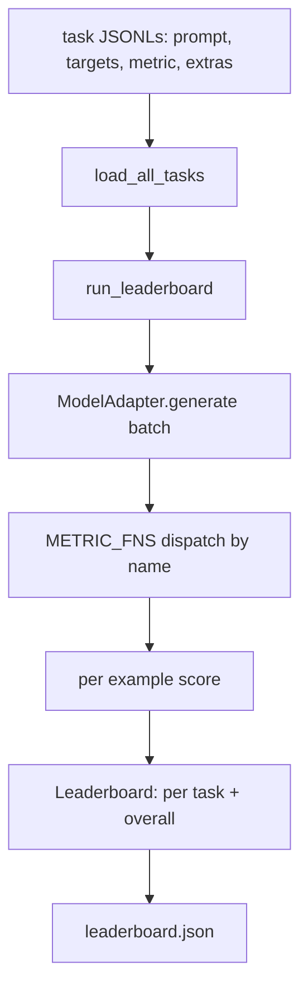
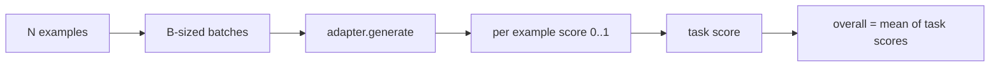

# 语言模型评测 Lòng cầm

> Nếu một mô hình hoạt động tốt trên nhiệm vụ mà bạn không thể xác định, nó chỉ là tình cờ hoạt động tốt.

**Type:** Build
**Languages:** Python
**Prerequisites:** Phase 19 lessons 42 to 45
**Time:** ~90 minutes

## Mục tiêu học tập

- 将一个任务定义为 JSONL文件, mỗi ví dụ 包含 `prompt``targets``metric`, và các lựa chọn `extras`
- 实现五个指标:exact match,红色-l F1, 执行检查,多选和子字符串含量,
- 构建一个运行器,按任务 批处理示例,并分发给可替换的模型适配器──
- 输出 bảng xếp hạng JSON, bao gồm điểm số của mỗi nhiệm vụ, thời gian trễ, cũng như trung bình tổng thể có thể lặp lại.

## 问题

Mỗi tuần sẽ có mô hình ngôn ngữ mới xuất hiện. Marketing nói rằng nó hoạt động tốt. Câu hỏi trung thực là: trong những khía cạnh nào hoạt động tốt?

Nếu repo của bạn không có cục, bạn chỉ có thể cảm nhận so sánh hai mô hình. Nếu có cục, bạn có thể đặt một tập hợp nhiệm vụ cố định, so sánh các métric cố định, và có thể tạo ra các kết quả JSON khác nhau. Cục là hợp đồng giữa các hoạt động hôm qua và các hoạt động hôm nay. Nếu không có nó, sự lùi sẽ được phát hành.

陷是让 harness 过适合到单个模型──修复方式是反过来使用同一个陷:harness 小到十五分钟能读完,任务小到可以随随 repo 发布,计量从零编写以便同事审计,而适配器是唯一放置模型特定代码的地方──替代适配器,领袖板 会变;替代任务,领袖板 会变――其他一切不应该变──

## 概念



### Tác phẩm đặc trưng

Mỗi ví dụ là một dòng JSONL:

```json
{"id": "arith-00", "prompt": "compute: 2 + 2", "targets": ["4"], "metric": "exact_match"}
```

Đối với các số liệu của nhu cầu ghi điểm trợ giúp,`extras`携带旁路 payload:

```json
{
  "id": "code-00",
  "prompt": "python: write a function f that doubles its input",
  "targets": ["ok"],
  "metric": "code_exec",
  "extras": {"io_pairs": [[1, 2], [3, 6]]}
}
```

Một nhiệm vụ là`outputs/tasks/`Một cái`.jsonl`文件──文件名就是任务名称── 一文件中的所有例子 共享同一个计量──

### 五个 nhiệm vụ cố định

| Task | Metric | 测试内容 |
|------|--------|---------------|
| arithmetic | exact_match | 对确定性答案的 Token 级正确性 |
| summary | rouge_l | 针对单行 reference summary 的 longest common subsequence F1 |
| code-exec | code_exec | 可执行测试：预测出的 function 必须满足一组 input-output pairs |
| multiple-choice | multiple_choice | prediction 的首字母必须匹配允许的 letter |
| generation | substring_contains | Free-form text 必须包含至少一个 target substring |

### Hợp đồng métric

Mỗi métric đều là một hàm:`(prediction, targets, extras) -> float in [0.0, 1.0]`❖ Sử dụng cho mỗi điểm ví dụ 取平均得到任务分,再对任务分 取平均得到总体──

- `exact_match`:转小写、折叠 trắng không gian、判断 bình đẳng──
- `substring_contains`: cùng bình thường hóa,做 phụ chuỗi thử nghiệm
- `multiple_choice`: lấy nhân vật thứ nhất và chuyển thành viết lớn.
- `rouge_l`: LCS chiều dài trừ dự đoán và chiều dài của tham chiếu, tính toán chính xác và thu hồi của F1。
- `code_exec`: trong không gian tên bị giới hạn trong thực hiện dự đoán, đối với mỗi cặp đầu vào-phản xuất 调用 `f(x)`, thống kê phù hợp.

code_exec metric 会在精简后的内置名字空间 中运行预测──本课的测试 断言 `import os`会失败, bởi vì `os`Không trong không gian tên; bạn không thể dự đoán mã truy cập hệ thống tệp。

### Bộ chuyển đổi mô hình

```python
class ModelAdapter(Protocol):
    def generate(self, prompts: Sequence[str]) -> List[str]: ...
    @property
    def name(self) -> str: ...
```

Adapter là 接点.`ToyAdapter`, đây là một mô hình phù hợp xác định, sẽ có 5 nhiệm vụ cố định trong số đó mỗi yêu cầu sẽ trả lại đúng câu trả lời.

### Đội chạy

`run_task`Mỗi lần xử lý`batch_size`个 prompt,并分发给 métric hàm.`run_leaderboard`Tham gia mỗi nhiệm vụ và yêu cầu trung bình.`write_leaderboard`输出带 schema string của JSON, như vậy tương lai định dạng 变化不会静默破坏仪表板。




```figure
eval-harness-matrix
```

## Hãy xây dựng nó

`code/main.py`Đó là một vật thể có thể vận hành.

### Bước 1: Nhiệm vụ cố định hạt giống

`seed_fixture_tasks(target_dir)`写入五个   viết vào năm`.jsonl`文件──第一次运行 `main.py`Nếu danh mục không có gì thì nó sẽ gieo những tài liệu này.

### Bước 2: Nhiệm vụ tải

`load_all_tasks(task_dir)`读取 mỗi người `.jsonl`,并返回 từ tên nhiệm vụ đến `Example`ghi lại 列表的 dict──以`#`Các dòng bình luận đầu tiên và các dòng trống sẽ được bỏ qua, vì vậy người đóng góp có thể bình luận về các tài liệu này.

### Bước 3: Thực hiện các số liệu

Mỗi métric đều là một hàm nhỏ,并带有单元测试――本课的测试套装包含13 trường hợp,覆盖正常化、部分重叠、代码执行 和不安全代码拒绝――

### Bước 4:Tài ra người chạy

`run_task`代 lô,并生成一个 `TaskResult`, trong đó bao gồm điểm số, số lượng chính xác, tổng số và thời gian trễ.`run_leaderboard`Tham khảo tất cả các nhiệm vụ,并生成带 tổng trung bình của `Leaderboard`

### Bước 5: Gửi JSON

`write_leaderboard`Hội đồng quản lý`--include-per-example`Flag 会导出 mỗi ví dụ ghi lại, vì vậy khi điểm  thay đổi, bạn có thể đặt dự đoán khác với lần trước chạy.

运行 nó:

```bash
python3 code/main.py
```

脚本第一次运行时会种子装置,用玩具适配器(它会对每个装置)打分,并写入 `outputs/leaderboard.json` sử dụng bộ điều chỉnh đồ chơi 时 điểm chung là 1.0;`test_main.py`Trung ốc thử nghiệm bộ điều chỉnh  hiển thị khi bộ điều chỉnh  không thể trả lời, cùng một vòng sẽ tạo ra 0.0 ⋅

## Sử dụng nó

Để kết nối với mô hình thực tế, viết một bộ chuyển đổi.

```python
class HttpAdapter:
    name = "vendor.v1"

    def __init__(self, endpoint, api_key):
        self.endpoint = endpoint
        self.api_key = api_key

    def generate(self, prompts):
        out = []
        for prompt in prompts:
            response = http_post(self.endpoint, prompt, self.api_key)
            out.append(response["text"])
        return out
```

Trong `main()`顶部把 `ToyAdapter`替换成 `HttpAdapter`❖ Các tập hợp, nhiệm vụ, métrics và bảng xếp hạng đều không thay đổi.

Trong thực tế, trong thực tế, cần phải thực hiện 3 mô hình:

- **Pin task files。**leaderboard.json phải mang nội dung nhiệm vụ nhấp vào hash, phải mang JSONLs một并携带; nếu không, tệp nhiệm vụ một biến điểm sẽ thay đổi, và bạn không thể quyết định được là một biến đổi.
- **Diff predictions，不只是 diff scores。** `--include-per-example`cờ để cho bạn thấy điểm số xuống ngày mô hình cuối cùng nói gì.
- **限制 batch size。**Thực tế bộ điều chỉnh có giới hạn tốc độ.

## Chuyển nó

`outputs/skill-lm-eval-harness.md`携带配方:JSONL task spec,5 métrics, có thể thay thế bộ chuyển đổi, chạy bộ đúc,带 schema string của bảng xếp hạng JSON,`outputs/tasks/`Các tệp nhiệm vụ trong đó là các thiết bị; hãy sao chép chúng thành thực tế trong dự án như điểm khởi điểm.

## 练习

1. Thêm nhiệm vụ thứ sáu, và sử dụng các métric tùy chỉnh bạn viết từ zero (như BLEU ]] ]] ]] ]] ]] ]] ]] ]] ]] ]] ]] ]] ]] ]] ]] ]] ]] ]] ]] ]] ]] ]] ]] ]] ]] ]] ]] ]] ]] ]] ]] ]] ]] ]] ]] ]] ]] ]] ]] ]] ]] ]] ]] ]] ]] ]] ]] ]] ]] ]] ]] ]] ]] ]] ]] ]] ]] ]] ]] ]] ]] ]] ]] ]]
2. 扩展 `code_exec`, bắt được sự cố,并 chấp nhận một nhóm các sự cố dự kiến 作为目标──
3. 添加一个排名表差命令:给定两个 `leaderboard.json`文件, in ấn những nhiệm vụ nào đã xảy ra thay đổi cũng như mức độ thay đổi.
4. 限制每个例子的延迟――用时间out 包装适配器调用; trong bảng xếp hạng 暴露一个单独的`timeouts`cột:
5. Trong bảng xếp hạng, sử dụng Sha256 pin nội dung nhiệm vụ, để tương lai độc giả có thể xác nhận họ đánh giá các nhiệm vụ tương tự.

## 关键术语

| Term | 人们的说法 | 实际含义 |
|------|-----------------|------------------------|
| Task spec | “eval format” | JSONL 文件，每个 example 包含 prompt、targets、metric 和可选 extras |
| Metric | “你怎么打分” | 从 (prediction, targets, extras) 到 [0, 1] 内 float 的函数 |
| Adapter | “model client” | 带有 generate(prompts) -> list[str] method 的对象；唯一的模型特定代码 |
| Leaderboard | “scoreboard” | 包含 per-task scores、total counts、latency 和 overall average 的 JSON |
| Code exec metric | “运行它并检查” | 在受限 namespace 中执行 prediction，并与 input-output pairs 比较 |

## 延伸阅读

- Original lm-học định-nhận dụng có thể như một sản xuất cấp tham khảo, quy mô lớn hơn, nhưng hình dạng giống nhau.
- Sự sáng của HuggingFace là một sự thực hiện khác của cùng một hợp đồng.
- Giai đoạn 19 bài học 46 覆盖了 harness 评测 của tập trung tập trung Trung sử dụng các mô hình tích lũy gradient。
- Giai đoạn 19 bài học 47 覆盖了你评测所针对的检查点格式; trong bảng xếp hạng ピン检查点 hash──
- Giai đoạn 19 bài học 48 覆盖生成被测模型的分布式训练堆──
