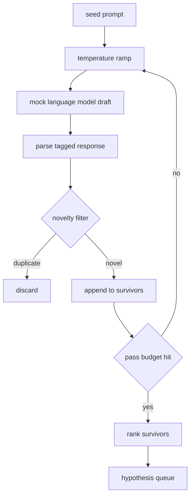

# Generator giả thuyết

> Một đại lý nghiên cứu nếu hỏi cùng một vấn đề hai lần, đó là một dấu hiệu lãng phí.

**Type:** Build
**Languages:** Python
**Prerequisites:** Phase 19 Track A lessons 20-29
**Time:** ~90 分钟

## Mục tiêu học tập
- Từ seed prompt 驱动 mẫu,并将其输出 转成带类型的假设记录.
- Trong mỗi lần vượt qua, tăng nhiệt độ mẫu, để dự thảo tiếp theo di chuyển xa hơn hơn.
- Sử dụng mô hình nhúng nhỏ và ngưỡng khoảng cách cosine 过近似重复项。
- Sử dụng hàm điểm điểm kết hợp của tính mới mẻ, đặc biệt và khả năng kiểm tra đối với thứ tự dự trữ.
- Hãy để mỗi bước giữ sự chắc chắn, để giống nhau luôn tạo ra cùng một hàng.

## Sao anh lại lại lại?

Một nhà hoạch định 调用 một mô hình một lần, chỉ có một giả thuyết. Đây là một ví dụ đã làm việc để nói không có vấn đề. Nhưng đối với vòng nghiên cứu để nói hình dạng không đối với.

Hai ý tưởng kết hợp để tạo ra hàng này. Thứ nhất là nhiệt độ tăng lên: mỗi lần qua mẫu 时都把 nhiệt độ tăng lên một điểm, để kế tiếp dự thảo 更愿意游走. thứ hai là sự lọc mới: mỗi dự thảo 之后, máy phát điện đo nó với khoảng cách nhúng của mỗi người sống sót trước, và từ chối bất kỳ thứ gì rơi vào cluster  nội dung bên trong.

本课提供一个模拟语言模型, nó sẽ nhắm vào cố định prompt 返回脚本化的代号序列──这个模拟足以跑完整条路径:seed prompt 输入,应用温度坡,解析候选,运行新奇的过器,输出排列列──

## Hiểu hình

```text
Hypothesis
  id             : int           (monotonic within a run)
  text           : str           (the claim)
  variables      : list[str]     (what changes between conditions)
  metric         : str           (what the runner will measure)
  baseline_ref   : str | None    (which paper or run the comparison cites)
  draft_pass     : int           (which sampler pass produced this)
  temperature    : float         (the sampler setting at draft time)
  novelty_score  : float         (distance from prior survivors, 0..1)
  rank_score     : float         (weighted sum used for ordering)
```

`variables`和 `metric`Không phải tự do văn bản. Nhận thức từ các câu trả lời của các thẻ.

`baseline_ref` 503 bài học  cần một đường cơ sở  để so sánh  Nếu giả thuyết  bỏ qua nó, nhà đánh giá sẽ quay lại cùng một số liệu trên lần chạy trước 


```figure
cg-novelty-ramp
```

## 架构



Chuyện này rất trực tiếp. Có nghĩa là mỗi hộp đều có hợp đồng nghiêm ngặt.

## Phạm nhiệt độ

Từ `t_min`开始, đến `t_max`Kết thúc, bước cho`(t_max - t_min) / (n_passes - 1)`◊ Mỗi lần qua đều sử dụng nhiệt độ hiện tại 调用 mẫu, từ `GeneratorConfig.schedule()` tạo ra `n_passes`个均间隔的值──mock model 通过在一小组按 `(prompt, temp_bucket)`索引的脚本化反应 之间切换来遵守温度──桶是开区间, do đó, những thay đổi nhỏ của nhiệt độ sẽ chọn một cái thùng khác nhau, và tạo ra một bản thảo khác nhau── trong quá trình sản xuất, mẫu sẽ là mô hình thực tế,并传入`temperature=t`

默认 lịch trình là từ `0.2`Đến`1.2`六次足以填满队列, không cần phải trả phí cho mẫu lọc mới 反正会拒绝`0.2`时,model 会复述种子──高于 `1.2`时, phản ứng 往往偏离主题并导致 parser 失败。

## Bộ lọc mới

Mỗi bản thảo được phân tích, bộ phát triển sẽ nhúng văn bản,并与每个已接受的假设比较.`1 - dot(a, b)`Nếu bị bắt đến bất kỳ người sống sót trước nào thì khoảng cách tối thiểu cao hơn`novelty_threshold`, nó đã qua ‖ ‖ ‖`0.25`

hashed embedding không cao. Nó là xác định tính, không phụ thuộc,并足以捕捉显而易见的情况: hai bản thảo 共享大多数名词.

## Điểm xếp hạng

```text
rank_score = w_novelty * novelty_score
           + w_specificity * specificity_score
           + w_testability * testability_score
```

Ba điểm phụ.`novelty_score`Là khoảng cách nhúng tối thiểu của người sống trước đó.`specificity_score`là giả thuyết số lượng biến cụ thể trong số số số mục tiêu.`testability_score`Trong giả thuyết cùng thời điểm xác định métric 和 cơ sở 时为一, chỉ xác định métric 时为二分之一, nếu không thì为零──

默认权重是 `0.4``0.3``0.3` quyền trọng nằm trong cấu hình máy phát, do đó các khóa học có thể điều chỉnh chúng, không cần phải cắm 代码。

## Mô hình ngôn ngữ giả

```python
class MockLLM:
    def sample(self, prompt: str, temperature: float, seed: int) -> str:
        ...
```

给定 `(prompt, temperature, seed)`3 lần, mẫu là xác định.`(prompt_signature, temperature_bucket)`Bảng đáp ứng văn bản của chỉ mục. Nếu bảng không có một mục khóa nào đó, người mẫu sẽ trả lại một bài để cho người phân tích thất bại. Một trong những bài kiểm tra sẽ bao gồm con đường này.

hạt giống sẽ hỗn hợp phản ứng, do đó cùng một `(prompt, temperature)`cặp 配上不同种子 会产生不同草案──测试中我们固定种子,以保持结果可复现── trong việc triển khai thực tế, hạt giống 会来自 hệ thống đồng hồ hoặc đối phó──

## Đường xếp đầu ra

输出是按 `rank_score`降序排序 của `Hypothesis`ghi danh 列表──第五十二课中的跑者 弹出头,运行实验,第五十三课中的评价者 写回判决──如果判决说假设 错了,跑者就弹出下一个──

Lịch trình là giới hạn. Khi nó được mở cửa, nhạc sĩ có thể mở rộng hạt giống ngay lập tức và chạy lại máy phát điện, hoặc ngừng và báo cáo ngân sách đã hết.

## 如何阅读代码

`code/main.py`定义 `Hypothesis``MockLLM``HypothesisGenerator`Và một xác định demo.`run(seed_prompt)`Phương pháp, quay lại排序后的排队; vượt qua số từ `GeneratorConfig.n_passes`读取, thay vì như một lập luận 传入──embedding là túi mã thông báo bị hashed──novelty filter là một chức năng độc lập──ranking score là một chức năng độc lập──không có gì phụ thuộc `numpy`;trình tích toán là một vấn đề đơn giản, vì vậy,本课保持便携式。

`code/tests/test_generator.py`覆盖 tuyến đường, đường từ chối trùng lặp, đường thất bại của trình phân tích, giới hạn đường băng nhiệt độ và thứ tự xếp hạng.

## Nó đi vào đâu

第五十三课读取两者的成果并写出判决―― 第五十一课取队列的头并运行文献搜索来确认或反驳它―― 第五十二课取同一个头并运行实际实验―― 第五十三课读取两者的成果并写出判决―― 第五十一课组组合成一个没有人参与的研究循环;人可以在任何边界介入――
