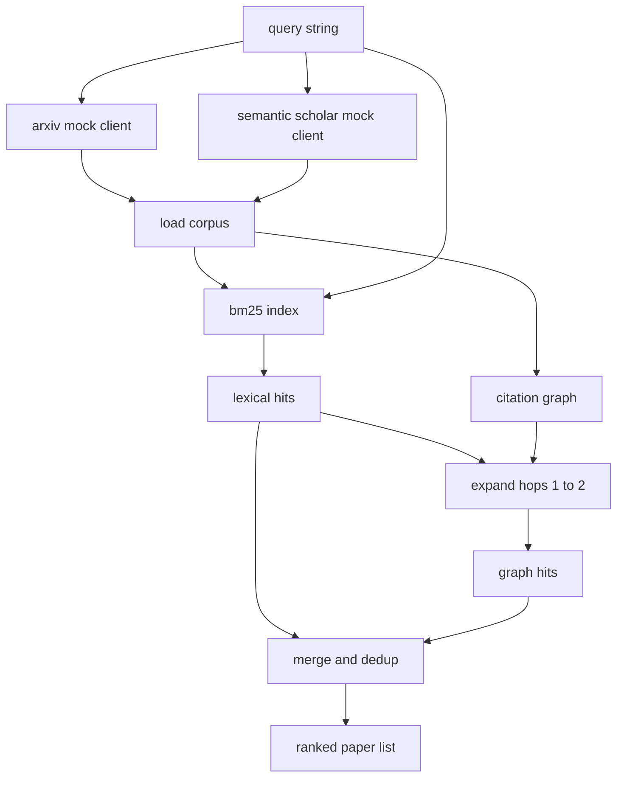

# 文献检索

> Một giả thuyết  rất rẻ  biết liệu có ai đã chứng minh nó, chỉ là một phần đắt tiền  xây dựng lớp lấy lại, trước khi chạy  khởi động hộp cát  trả lời câu hỏi này 

**Type:** Build
**Languages:** Python
**Prerequisites:** Phase 19 Track A lessons 20-29
**Time:** ~90 分钟

## Mục tiêu học tập
- 用循环 下游会读取的字段, cho một bản ghi giấy nhỏ 建模──
- Chỉ sử dụng các cấu trúc dữ liệu, trong bản tóm tắt trên xây dựng chỉ số BM25
- 遍历 trích dẫn biểu đồ,浮现 từ điển tìm kiếm 遗漏的论文──
- 通过稳定的纸 id,对词典和图 两轮命中结果去重──
- Để phân tích hai API bên ngoài giả  đóng gói trong một khách hàng  phía sau, như vậy thực điểm cuối  nối vào khi, trên trang web gọi 保持不变──

## Tại sao cần 2 vòng lấy lại

Đối với bản tóm tắt làm tìm kiếm từ khóa, sẽ quay lại với truy vấn cộng chia sẻ từ ngữ. Đây bao gồm phần lớn các tình huống trên tầng lớp. Nhưng nó sẽ bỏ qua hai loại tình huống.

本课会构建这两轮──摘要 上的 BM25 捕获词汇 hits──引用图穿越从种子集合 出发,向前和向后扩展一到两跳──二者的并集按纸 id 去重,并使用一个小型组合分数排序──

## giấy 形状

```text
Paper
  id          : str           (稳定 identifier，mock corpus 中为 "p001")
  title       : str
  abstract    : str
  year        : int
  authors     : list[str]
  references  : list[str]     (这篇 paper 引用的 paper ids)
  citations   : list[str]     (引用这篇 paper 的 paper ids)
  source      : str           (提供它的 mock api，"arxiv" 或 "s2")
```

References 和 citations 字段形成有向引用图──两个假 API 返回的字段有重叠但不完全相同,因此 corpus loader 会按 `id`Để chúng được tập hợp.


```figure
cg-citation-hops
```

## Kiến trúc



Trình khách truy cập 拥有这两轮和 merge──caller 传入一个查询,并拿回一个排名列表; trong đó mỗi条目都携带每纸分数 字段(`bm25_score``graph_distance``recency_score``final_score`), được sử dụng để giải thích

## Từ zero thực hiện BM25

实现使用标准 Okapi BM25,默认参数为 `k1=1.5``b=0.75`index là hai từ điển:`term -> doc_frequency`和 `term -> list of (doc_id, term_count)`△ dài tài liệu là trừu tượng của Token số.△ trung bình dài tài liệu trong index 构建时计算一次.△ đối với truy vấn 打分时,会 đối với các thuật ngữ truy vấn 求和:`idf * tf_norm`, trong số đó `tf_norm`                                                                                                                                                                                                                                                              

tokeniser là đầu tiên`lower`, tái theo không chữ số chữ phân chia. Nó không làm được kết quả.

```text
idf(t)      = log((N - df + 0.5) / (df + 0.5) + 1.0)
tf_norm(t)  = (f * (k1 + 1)) / (f + k1 * (1 - b + b * dl / avgdl))
score(d, q) = sum over t in q of idf(t) * tf_norm(t)
```

## Quay trình biểu đồ trích dẫn

biểu đồ 会从 corpus 构建一次──前边 从一篇论文指向它的引用──后边 从一篇论文指向它的引用──横向是宽度首次搜索,以顶部BM25 hits为种子,最多两跳──

两跳是刻意设置的上限──一跳太浅;agent 常常需要直接祖先或后代──三跳会让连接图的结果规模膨胀,并且很容易偏离主题──本课把跳限 暴露为一个配置键,这样下游循环可以紧紧紧它──

## Dedu và xếp hạng

两轮会回归重叠集合―― merge Sử dụng giấy ID 作为钥匙―― mỗi bài báo điểm số cuối cùng là một gia权混合――

```text
final_score = w_bm25 * bm25_score_norm
            + w_graph * graph_score
            + w_recency * recency_score
```

`bm25_score_norm`là điểm BM25 trừ điểm BM25 lớn nhất trong tập hợp hợp nhất (vì vậy, điểm này nằm ở giữa 0 đến 1).`graph_score`Đối với các cú đánh từ điển trực tiếp 为一,一跳为 `0.6`, 两跳为 `0.3`,否则为零──`recency_score`là từ corpus, từ 0 đến 1 trong năm nhỏ nhất.

默认 trọng lượng là `0.5``0.3``0.2`◊ trọng lượng là cấu hình; chủ đề cũ có thể sẽ làm giảm tính gần đây, trong khi chủ đề thay đổi nhanh sẽ làm tăng nó.

## Phong thể giả

Có 100 bài báo, từ `build_corpus()`生成──每篇篇都有一个手写标题和摘要,主题来自五类之一:trọng tâm ít ớt, tăng cường khôi phục, chuyển đổi cấp thấp, phân loại dữ liệu và đánh giá.

Hai khách hàng API giả`ArxivMockClient``SemanticScholarMockClient`(Arxiv 返回标题、抽象、年、作者──Semantic Scholar 增加引用 和引用──检索客户端 按 id 取并集;处理客户领域间的不一致 留到后续课程──

## Bài học 52 và 53 会读取什么

Bài học 52 Trung học viên sẽ học tập`paper.id``paper.title`, cũng như 3 câu trước của bản trừu tượng, như bối cảnh của thí nghiệm. Bài học 53 của Trung bình sẽ đọc`paper.year`和 `paper.references`, sẽ được chuyển sang một bài báo cụ thể.

truy xuất khách hàng  quay lại một `RetrievalResult`, trong đó cũng có danh sách xếp hạng và theo số liệu truy vấn: hit count, điểm trung bình, điểm top, tổng thời gian tường.

## 如何阅读代码

`code/main.py`定义了 `Paper``ArxivMockClient``SemanticScholarMockClient``BM25Index``CitationGraph``RetrievalClient`Và một mô hình xác định học, mô hình khách hàng và cơ thể được đặt trong cùng một tệp, như vậy khóa học giữ được chuyển đổi.

`code/tests/test_retrieval.py`覆盖词汇路径, đồ thị路径, hợp nhất, kết hợp và truy vấn trống

## Nó đặt ở vị trí gì

Bài học năm mươi  tạo ra một giả thuyết. Bài học năm mươi một  tìm kiếm văn học, phán xét giả thuyết đó là không hay đã có một định lý. Nếu không, Bài học năm mươi hai 运行 thí nghiệm. Bài học năm mươi ba 读取 thu thập kết quả và các chỉ số thí nghiệm, viết ra phán quyết.
