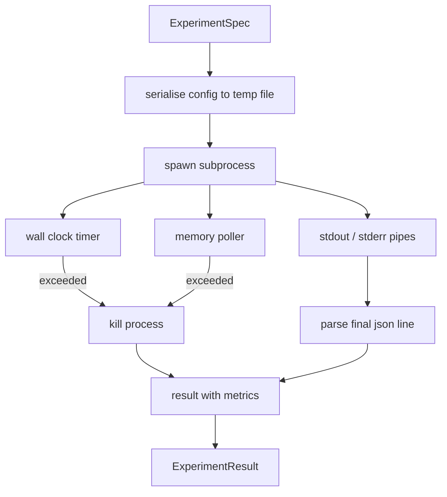

# Chuyện chạy thử nghiệm

> Loop của độ trung thực phụ thuộc vào các phép đo của nó.

**Type:** Build
**Languages:** Python
**Prerequisites:** Phase 19 Track A lessons 20-29
**Time:** ~90 分钟

## Mục tiêu học tập
- Để thử nghiệm được mã hóa thành một mô hình kiểu, người chạy có thể phân tích nó theo chuỗi cho một quá trình phụ.
- 启动 một bộ phận của một bộ nhớ mềm và một bộ nhớ cứng, và sẽ bị tiếp xúc với các điều kiện cuối cùng.
- Để bắt được một kết quả ghi lại trong
- 构建 ablation table, trong định dạng cơ sở cố định 上一次扫一个配置按──
- Khi được phân tích, hãy để mỗi kết quả đều được xác định, vì vậy người đánh giá trong nhiều lần chạy thấy cùng một số.

## Tại sao sử dụng phụ quy trình

vòng nghiên cứu 会运行 không tin cậy mã. giả thuyết từ mẫu, kịch bản thí nghiệm cũng đến từ cùng một đường;把任一任任任任任作安全的过程中代码,都在等待一次会拖管弦仪的崩.

Ở đây runner không thực hiện sandboxing hoàn chỉnh. Không có cgroup, không có bộ lọc seccomp, cũng không có việc tái lập không gian tên. Nó có thời gian làm việc của đồng hồ tường, sử dụng để kiểm tra sự tăng trưởng bộ nhớ, cũng như đường giết người của quá trình chấm dứt trên giới hạn.

## ExperimentSpec 形状

```text
ExperimentSpec
  spec_id        : str            (stable id，"exp_001")
  hypothesis_id  : int            (链接回 lesson 50 中的 queue)
  script_path    : str            (要运行的 python script 路径)
  config         : dict           (作为一个 json arg 传给 script)
  seed           : int            (experiment 的 deterministic seed)
  wall_timeout_s : float          (hard timeout，超出则 kill)
  memory_cap_mb  : int            (soft cap，轮询；超出则 kill)
  metric_keys    : list[str]      (evaluator 会读取的字段)
```

script  tồn tại trên đĩa;runner 会把 cấu hình 写入一个临时文件路径,script 再读取它──script 应该在 stdout 上打印单个 json line,其键是`metric_keys`Các siêu tập hợp. Các nội dung khác sẽ bị bắt, nhưng người phân tích métrics sẽ bỏ qua chúng.


```figure
cg-runner-limits
```

## Kiến trúc



runner là một lớp học, với một phương pháp chính. poller là một chuỗi nhỏ, mỗi khoảng thời gian bỏ phiếu  thức dậy một lần, và có thể sử dụng trong khi từ hệ thống tập tin proc  đọc các quá trình phụ của`psutil`tương đương; khi nền tảng không tiết lộ nó,退化为无 op──

## Tại sao là nắp bộ nhớ mềm

Tấm nhớ cứng 需要 `resource.setrlimit`, và chỉ trong POSIX 上工作. 本课提供一种便携式方法: từ nền tảng khảo sát đặt cỡ cư dân, nếu vượt quá giới hạn, sẽ giết chết các quá trình phụ.

Trong hệ thống không hỗ trợ kiểm tra quy trình, các nhà khảo sát sẽ ghi lại cảnh báo một lần và không tự tắt thời gian đồng hồ tường vẫn còn hiệu quả.

## 捕获 stdout 和 stderr

runner 会在完成时读取并排空两条管──Stdout 会逐行扫描; cuối cùng có thể phân tích cho json 并且包含所有必需的`metric_keys`Các đường sẽ được xem như các metrics blob.`intermediate_metrics`; người đánh giá có thể sử dụng chúng để vẽ đường cong học tập.

Stderr 会原样捕获到结果 中──runner 永远不会因为非零出口代码而升; nó sẽ đưa代码 记录在结果 中──任何非零出口都标记为`"crash"`, ngay cả khi kịch bản  đã in metrics, do đó đánh giá 默认将把部分运行当作失败.

## Bảng phân hủy

```python
def ablate(base: ExperimentSpec, knob: str, values: list[Any]) -> list[ExperimentSpec]:
    ...
```

给定基准规范 和按名称,该辅助会返回每个值对应的一个规范,并覆盖 `config[knob]`Mỗi người sẽ có một sinh viên.`spec_id`(`f"{base.spec_id}_{knob}_{value}"`◊runner 提供一个 `AblationRunner`, theo thứ tự chạy các thông số này, và trả lại một với giá trị nút như chìa khóa của `AblationTable`

Tại sao một lần chỉ thay đổi một nút. Tất cả các bộ sweeps thực tế sẽ tăng lên, và tạo ra một đánh giá không thể giải thích được kết quả.

## Định nghĩa

Mỗi mẫu đều mang theo một hạt giống. Người chạy sẽ thông qua định cấu hình sẽ chuyển hạt giống sang kịch bản.`config["__seed"] = spec.seed`(■)`code/experiments/`Trung học giả mạo các kịch bản thí nghiệm 会尊重 seed,并跨 runs 产生相同的指标──lesson53 Trung học đánh giá phụ thuộc vào điều này; không có quyết định, cái gọi là "đá hồi" có thể chỉ là sự khởi đầu ngẫu nhiên khác nhau──

## Phương pháp thí nghiệm giả

本课提供一个实验脚本:`code/experiments/sparsity_experiment.py`Nó là một kịch bản thực tế, sẽ đọc tập tin cấu hình của riêng mình, sử dụng numpy pass ngẫu nhiên 模拟一个小型训练 run,并打印一个 json metrics blob──script 支持 `sleep_s`nút dùng để kiểm tra thời gian ra, cũng hỗ trợ `allocate_mb`nút dùng để kiểm tra bộ nhớ.

mô phỏng không thực sự đào tạo bất cứ điều gì. Nó là một tính toán số, giống như hình dạng vòng đào tạo: đường cong mất mát, sự bối rối cuối cùng, thời gian tường.

## Kết quả 形状

```text
ExperimentResult
  spec_id              : str
  hypothesis_id        : int
  exit_code            : int
  terminal             : "ok" | "timeout" | "oom" | "crash"
  wall_time_s          : float
  peak_rss_mb          : float | None
  metrics              : dict
  intermediate_metrics : list[dict]
  stdout_tail          : str
  stderr_tail          : str
```

đánh giá 会先读取 `metrics`和 `terminal`Nếu cuối cùng không là`"ok"`, thí nghiệm tính toán vì thất bại chạy, phán quyết của nhà đánh giá sẽ tự động tạo ra.

## 如何阅读代码

`code/main.py`定义了 `ExperimentSpec``ExperimentResult``ExperimentRunner``AblationRunner`和一个决定性演示――子进程管理 是一个类――memory poller 是一个小线――ablation helper 是一个单独函数――

`code/experiments/sparsity_experiment.py`là thử nghiệm sử dụng thử nghiệm giả mạo. Nó từ argv 读取 config file path, và hoàn thành sau đó viết ra một dòng chỉ số json đơn lẻ.

`code/tests/test_runner.py`覆盖 thành công đường bộ, đường thời gian ra khỏi đường bộ, đường bộ sụp đổ đường bộ, bảng loại bỏ, cũng như kiểm tra xác định của hai lần chạy qua.

## Nó đặt ở vị trí gì

Bài học năm mươi 生成 giả thuyết. Bài học năm mươi một 过掉文学 已解决的内容. Bài học năm mươi hai 针对剩余部分运行实验. Bài học năm mươi ba 读取结果,运行意义测试,并写出管弦乐器 存储到假设 id 上的判决.
