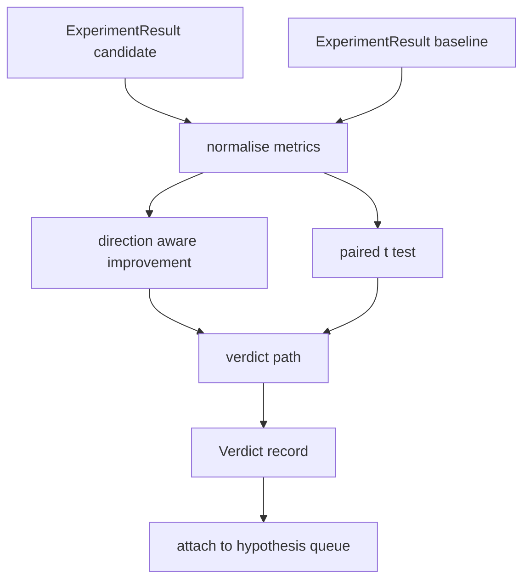

# 结果评估器

> runner 产出数字──evaluator 判断这些数字代表改进,回归,还是噪音──构建一条判决 路径,把 metrics 转换成一句结论──

**Type:** Build
**Languages:** Python
**Prerequisites:** Phase 19 Track A lessons 20-29
**Time:** ~90 minutes

## Mục tiêu học tập
- Sử dụng hướng đi và ngưỡng cố định, ứng cử viên sẽ chạy với đường cơ sở
- Từ đầu trong mỗi hạt giống của métrics trên chạy kết hợp t test,并读取得到的p值──
- Để làm bình thường hóa các métrics quy mô log, hãy làm theo báo cáo có thể kết hợp chúng với các métrics tuyến tính.
- 输出 mỗi giả thuyết phán quyết, để nhạc sĩ có thể thêm nó vào hàng thứ 50 của lớp.
- Hãy giữ cho từng bước của chúng ta là sạch sẽ, để những bước nhập vào luôn luôn tạo ra cùng một phán quyết.

## Tại sao một thử nghiệm đôi

Một số đơn lẻ được cho là runner không thể giải thích sự thay đổi có thực không. Một người thay đổi một hạt giống sẽ nhận được sự phức tạp khác nhau. Sự thay đổi có thể chỉ là tiếng ồn.

本课从头实现测试──没有`scipy.stats` Matematics đủ nhỏ, một màn hình có thể đọc xong

```text
diffs    = [a_i - b_i for i in seeds]
mean     = sum(diffs) / n
variance = sum((d - mean) ** 2 for d in diffs) / (n - 1)
t_stat   = mean / sqrt(variance / n)
df       = n - 1
p_value  = two_sided_p(t_stat, df)
```

Use regularised incomplete beta function。本课附带一个小实现, sử dụng phần nhỏ liên tục Lentz。 toàn bộ实现 chỉ là六十行 stdlib toán。

## Sự cải thiện nhận thức về hướng

Một số số số liệu 变大时表示改进(精度、吞吐量) ・・・另一些变小时表示改进(损失、混乱、墙时间) ・・・ đánh giá viên 在每个 số liệu 上携带一个 `direction`字段。

```text
if direction == "higher_is_better":
    improvement = (candidate - baseline) / abs(baseline)
elif direction == "lower_is_better":
    improvement = (baseline - candidate) / abs(baseline)
```

Sự cải thiện là có biểu tượng của. Đối với cao hơn là tốt hơn métric, sự cải thiện tiêu cực biểu ứng cử viên hơn khác hơn.

Một ngưỡng cố định`improvement_threshold=0.02`,百分之二) quyết định biến đổi có đủ lớn, có thể đưa ra phán đoán.


```figure
cg-paired-verdict
```

## Kiến trúc



người đánh giá 运行三个独立计算, và đưa ra phán quyết 路径中把它们合并──每个计算都是没有共享状态的纯函数──

## Tự chuẩn hóa nhật ký

Sự bối rối so với tổn thất là mối quan hệ chỉ số. Sự mất mát giảm 0.1 sẽ làm cho sự bối rối xuất hiện nhiều hơn.

本课会对 `scale`字段为 `"log"`Trong bất kỳ phép tính nào trong toán học cải thiện trước lấy log tự nhiên. ngưỡng sau đó sẽ được áp dụng trong log space.`log(28) - log(32) = -0.133`, cao hơn ngưỡng của phần trăm hai.

```text
if scale == "log":
    a = log(candidate)
    b = log(baseline)
else:
    a = candidate
    b = baseline
```

`scale="linear"`(默认) của các métrics sẽ nhảy qua chuyển đổi này.

## Kiểm tra cặp mỗi hạt

第五十二课的跑者会为每次跑出一个最终的测量分点――对于对测试,评估员需要候选人 每种子 一种子 一种子,基线 每种子 一种子 一种子――乐队员会在一组种子上使用两个配置运行相同实验,然后把两组`ExperimentResult`hồ sơ 交给评审员――

đánh giá viên 按种子 配对(种子 位于 `result.metrics["seed"]`), sau đó trải qua các số liệu yêu cầu. Nếu hai nhóm trong danh sách không phù hợp, nhà đánh giá sẽ bỏ ra.`PairingError`◊Orchestrator 应重新运行──

## Hình dạng của bản án

```text
Verdict
  hypothesis_id          : int
  metric                 : str
  direction              : "higher_is_better" | "lower_is_better"
  scale                  : "linear" | "log"
  candidate_mean         : float
  baseline_mean          : float
  improvement            : float       (signed, fraction; see direction rules)
  p_value                : float | None  (None if n < 2)
  significance_threshold : float
  improvement_threshold  : float
  verdict                : "improved" | "regressed" | "noise" | "failed"
  rationale              : str
```

phán quyết 路径 là một bảng quyết định nhỏ:

```text
1. If any candidate result has terminal != "ok": verdict = "failed"
2. else if |improvement| < improvement_threshold:  verdict = "noise"
3. else if p_value is None or p_value > significance: verdict = "noise"
4. else if improvement > 0:                          verdict = "improved"
5. else:                                             verdict = "regressed"
```

Lý luận là một câu được đọc bởi con người, dàn nhạc có thể đưa ra nó theo giả thuyết id  ghi lại đến log.

## Làm thế nào để đọc mã

`code/main.py`定义了 `MetricSpec``Verdict``Evaluator`、t thống kê và không đầy đủ các trợ lý beta, cũng như một bài kiểm tra xác định học.

`code/tests/test_evaluator.py`覆盖 cải thiện 路径、regressed 路径、噪音 路径(小改进)、噪音 路径(低 n)、失败终端 路径、log chuẩn hóa 路径、与已知参考值对比的 t测试,以及对对错──

## Ở đâu đây là chỗ

第五十二课产 出了假设队列──第五十一课过掉文献 已有定论的内容──第五十二课在多种种子 上用候选人和基线 配置运行实验──第五十三课读取这些运行 并写出判决──乐团主持人 把四者合在一起:

```text
for hypothesis in queue:
    literature = retrieval.search(hypothesis.text)
    if literature_settles(hypothesis, literature):
        attach(hypothesis, verdict="settled")
        continue
    candidates = runner.run_all(specs_for(hypothesis))
    baselines  = runner.run_all(baseline_specs_for(hypothesis))
    metric_spec = MetricSpec("perplexity", direction=LOWER, scale=LOG)
    verdict = evaluator.evaluate(hypothesis.id, metric_spec, candidates, baselines)
    attach(hypothesis, verdict)
```

Người dàn nhạc này không trong lớp học này; bốn lớp học này thông qua các lớp dữ liệu được xác định riêng của họ 组合进去, không cần bất kỳ dán phụ nào.
