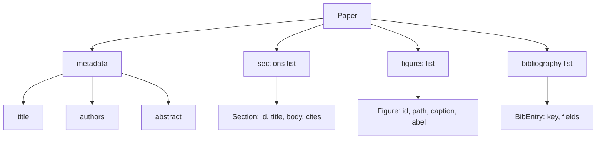
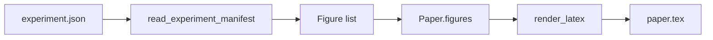
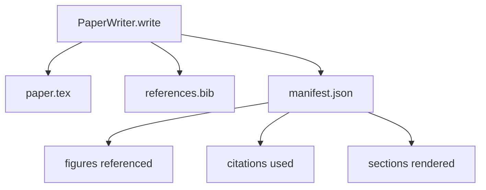

# 论文写作器

> Hàm xương LaTeX là hợp đồng giữa nhà nghiên cứu và người tạo kiểu. Nếu hợp đồng bị phá hủy, tài liệu sẽ không thể biên soạn, và thất bại sẽ rất rõ ràng.

**Type:** Build
**Languages:** Python
**Prerequisites:** Phase 19 lessons 50-53
**Time:** ~90 minutes

## Mục tiêu học tập

- Các bài nghiên cứu sẽ được xem là một đồ vật có cấu trúc của biểu đồ phần đã biết, chứ không phải là tài liệu dạng tự do.
- Trong viết bất kỳ bài thơ nào, trước khi tạo ra một tuyên bố trừu tượng, các phần, khe chữ số và chìa khóa thư viện của bộ xương LaTeX.
- Thông qua cơ chế khe xác định, sẽ đưa ra các kết quả thử nghiệm (khác đoạn và tiêu đề) trong các hình ảnh vào xương.
- n nối một máy phát hành thơ mỉa mai, nó từ đường viền cấu trúc n lấp đầy mỗi phần, để sử dụng có thể trong trường hợp không có mô hình.
- 输出单个 `paper.tex`Một người`references.bib`, thêm một danh sách cho mỗi con số tham chiếu và mỗi trích dẫn được sử dụng của biểu thức.


```figure
ch-paper-skeleton
```

## Tại sao đầu tiên là một bộ xương

Từ văn bản  bắt đầu dự thảo 会积累结构债务── giới thiệu 增长出三段本应放到相关作品内容── một số con số được trích dẫn trước khi được định nghĩa──bibliography 最终为同一篇论文产生三个关键──等作者注意到,成本重写已经高于成本写――

Skeleton 会反转这一点──结构 先以数据 形式声明──Bộ là带名和序的插槽──Bộ là带 id 和字幕的插槽──Bộ là带 id 和字幕的插槽──Bộ là带字幕的插槽──Bộ là trên cùng của các câu,并带着它们的指向的插槽──Bộ là một lần trong một插槽 地生成进去──Hành có thể viết bất kỳ câu nào 之前验证: Mỗi hình có插槽, mỗi trích dẫn đều có插槽, mỗi phần đều xuất hiện trong bảng nội dung 中──

Đây là một trong những chương trình học trước đó áp dụng cho các kế hoạch, các công cụ gọi và các dấu vết của kỷ luật trên.

## Hình dạng giấy



Mỗi trường đều là dữ liệu Python thông thường.`Paper`Đến hàm thuần túy của chuỗi LaTeX. Harness có thể được render trước nội dung bài báo: các phần thống kê, liệt kê các tập tin số liệu thiếu, kiểm tra mỗi `\cite{key}`Tất cả đều phù hợp.`BibEntry`

## Hợp đồng chuyển giao

1 , xương trong mỗi vị trí hình ảnh đều xuất ra một .`\begin{figure}`khối,并带有稳定标签,格式为 `fig:<id>`Thứ hai, mỗi phần đều xuất ra một.`\section{}`,并带有稳定标签, hình thức为`sec:<id>`, như vậy tham chiếu chéo có thể làm việc.`\bibliography`khối,其 `references.bib`精确包含纸上声明的条目,不多也不少──

违反任何一条都是报错,而不是警告──骨架就是合同;一个静默丢弃的图像的报复就是合同破解──

## Đèn hình ảnh từ thí nghiệm

本 track 前面的课程把实验输出生成为 JSON manifesto──每个 manifesto 携带一个文物列表,包含路径和简章──纸作家 读取该 manifesto 并生成`Figure`hồ sơ



Injection là xác định của──Tình id từ tên thí nghiệm 加上 monotonic counter 派生──Captions từ manifest──Paths 会相对于纸的输出目录做正常化,因此即使实验输出都位于磁盘其他位置,LaTeX也能编译──

## Bộ máy phát âm giả mạo

本课不会调用模型──`MockProseGenerator`读取 đường lối hình dạng,并 xác định 地输出散文── đường lối hình dạng là mỗi phần 一条短字符串──generator 会将该字符串扩展成两个短段落,并把部分标题 编织进去──生成散文 只会在线 声明时名字-滴图和引用──

Đây là một cách thực hiện thực tế sẽ chuyển máy phát điện thành mô hình gọi. Khung quanh nó không cần phải thay đổi. Đây là một cách tuyên bố của máy phát điện âm thanh.

## Khả năng xuất hiện

writer 会向输出目录 输出三个文件──



manifest là một đánh giá hoặc một vòng lặp phê bình 读取的内容──它不解析 LaTeX;它读取 manifest──下一课评论循环会将这个 manifest 作为输入,并产生反列表──这就是为什么 manifest 是合同的一部分,而 LaTeX 不是──

## Cổng xác thực

writer 在写入任何文件 之前运行四个门──

1. Trong giấy, mỗi chữ cái đều là một chữ cái duy nhất.
2. Mỗi phần của `cites`字段引用的图书馆关键已在纸上声明──
3. trừu tượng 非空──
4. Title 非空──

失败的门会抛出 `PaperValidationError`,并给出精确原因──harness 将该原因作为失败模式 暴露出来──没有部分写:要么输出全部三个文件,要么一个也也没有输出──

## Làm thế nào để đọc mã

`code/main.py`定义了 `Paper``Section``Figure``BibEntry``PaperValidationError``MockProseGenerator``PaperWriter`, và một `render_latex`chức năng`write`phương pháp 接收 output directory,并输出 `paper.tex``references.bib`和 `manifest.json``read_experiment_manifest`assistant 会将 thí nghiệm biểu hiện danh sách 转换为 `Figure`hồ sơ

`code/tests/test_paper_writer.py`覆盖: không có phần 时的骨格 render、带两个部分和两个数字的完整 render、缺失引用门、复制图像-id gate、显现内容,以及 LaTeX-string contract(每个部分输出一个 输出一个`\section{}`, mỗi con số 输出一个 `\begin{figure}`(■)

## Đi xa hơn nữa

Thực sự thực hiện sẽ cần hai phần mở rộng.`Paper`hình thức có thể biên soạn để sử dụng như mục viết, cũng như xem trước sử dụng HTML.`Paper`Chiến lược trên, tiếp thêm: Giấy nguồn cung cấp nguồn cung cấp nguồn cung cấp nguồn cung cấp nguồn cung cấp nguồn cung cấp nguồn cung cấp nguồn cung cấp nguồn cung cấp nguồn cung cấp nguồn cung cấp nguồn cung cấp nguồn cung cấp nguồn cung cấp nguồn cung cấp nguồn cung cấp nguồn cung cấp nguồn cung cấp nguồn cung cấp nguồn cung cấp nguồn cung cấp nguồn cung cấp nguồn cung cấp nguồn cung cấp nguồn cung cấp nguồn cung cấp nguồn cung cấp nguồn cung cấp nguồn cung cấp nguồn cung cấp nguồn cung cấp nguồn cung cấp nguồn cung cấp nguồn cung cấp nguồn cung cấp nguồn cung cấp nguồn cung cấp nguồn cung cấp nguồn cung cấp nguồn cung cấp nguồn cung cấp nguồn cung cấp nguồn cung cấp nguồn cung cấp nguồn cung cấp nguồn cung cấp nguồn cung cấp nguồn cung cấp nguồn cung cấp nguồn cung cấp nguồn cung cấp nguồn cung cấp nguồn cung cấp nguồn cung cấp nguồn cung cấp nguồn cung cấp nguồn cung cấp nguồn cung cấp nguồn cung cấp nguồn cung cấp nguồn cung cấp nguồn cung cấp nguồn cung cấp nguồn cung cấp nguồn cung cấp nguồn cung cấp nguồn cung cấp nguồn cung cấp nguồn cung cấp nguồn cung cấp nguồn cung cấp nguồn cung cấp nguồn cung cấp nguồn cung cấp nguồn cung cấp nguồn cung cấp nguồn cung cấp nguồn cung cấp nguồn cung cấp nguồn cung cấp nguồn cung cấp nguồn cung cấp nguồn cung cấp nguồn cung cấp nguồn cung cấp nguồn cung cấp nguồn cung cấp nguồn cung cấp nguồn cung cấp nguồn cung cấp nguồn cung cấp nguồn cung cấp nguồn cung cấp nguồn cung cấp nguồn cung cấp nguồn cung cấp nguồn cung cấp nguồn cung cấp nguồn cung cấp nguồn cung cấp nguồn cung cấp nguồn cung cấp nguồn cung cấp nguồn cung cấp nguồn cung cấp nguồn cung cấp nguồn cung cấp nguồn cung cấp nguồn cung cấp nguồn cung cấp nguồn cung cấp nguồn cung cấp nguồn cung cấp nguồn cung cấp nguồn cung cấp nguồn cung cấp nguồn cung cấp nguồn cung cấp nguồn cung cấp nguồn cung cấp nguồn cung cấp nguồn cung cấp nguồn cung cấp nguồn cung cấp nguồn cung cấp nguồn cung cấp nguồn cung cấp nguồn cung cấp nguồn cung cấp nguồn cung cấp nguồn cung cấp nguồn cung cấp nguồn cung cấp nguồn cung cấp nguồn cung cấp nguồn cung cấp nguồn cung cấp nguồn cung cấp nguồn cung cấp nguồn cung cấp nguồn cung cấp nguồn cung cấp nguồn cung cấp nguồn cung cấp nguồn cung cấp nguồn cung cấp nguồn cung cấp nguồn cung cấp nguồn cung cấp nguồn cung cấp nguồn cung cấp nguồn cung cấp nguồn cung cấp nguồn cung cấp nguồn cung cấp nguồn cung cấp nguồn cung cấp nguồn cung cấp nguồn cung cấp nguồn cung cấp nguồn cung cấp nguồn cung cấp nguồn cung cấp nguồn cung cấp nguồn cung cấp nguồn cung cấp nguồn cung cấp

Skeleton là cái này. Các phần, số liệu và trích dẫn 以 dữ liệu 形式声明, văn bản sinh thành trong các khe, biểu hiện với LaTeX một khởi đầu xuất khẩu.
