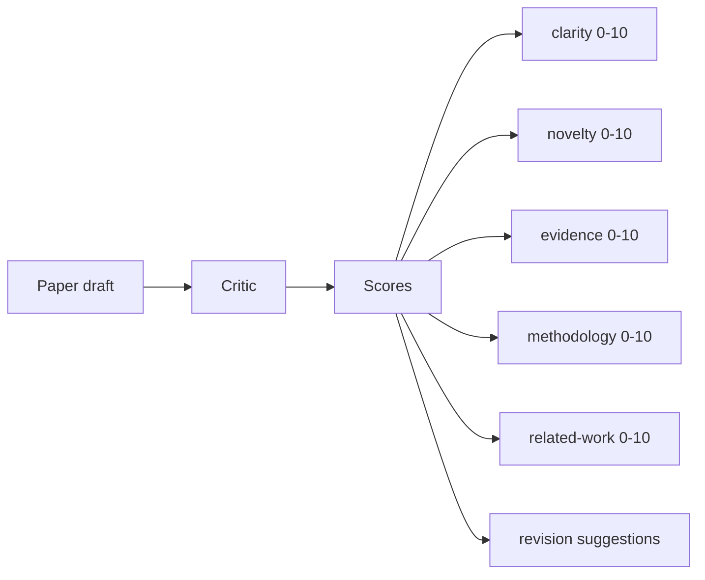
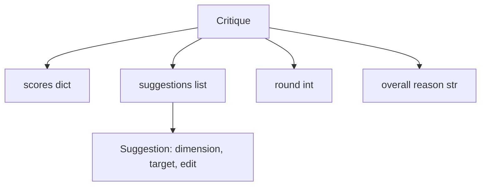
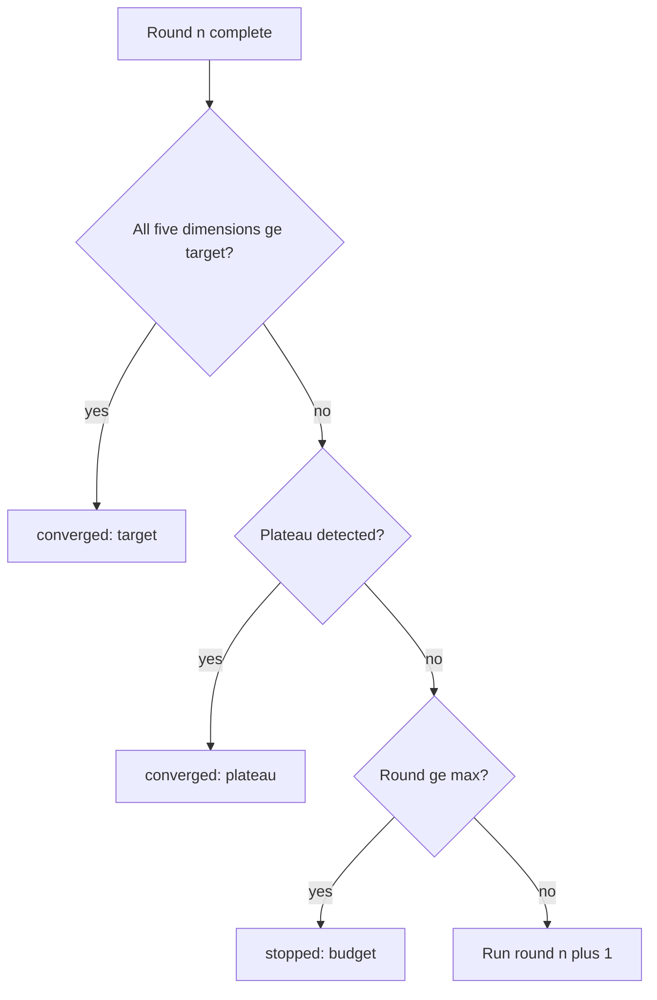
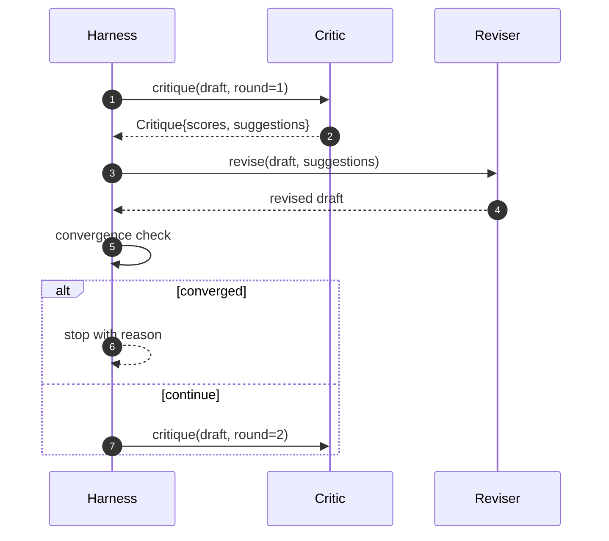

# Lòng phê bình

> Lần đầu tiên về trả lời "nên tốt" là một nhà phê bình xấu.

**Type:** Build
**Languages:** Python
**Prerequisites:** Phase 19 lessons 50-53
**Time:** ~90 minutes

## Mục tiêu học tập


```figure
ch-critic-converge
```

- 按五个固定维度为论文草稿打分: độ rõ ràng, mới mẻ, bằng chứng, phương pháp, công việc liên quan.
- Để mỗi vòng phê bình được áp dụng cho sửa đổi cấu trúc khác nhau, thay vì viết lại tự do.
- 通过比较多轮分数检测收; 停止在平原上 达到目标或预算耗尽时.
- Sử dụng tối đa lặp đi lặp lại  ngân sách hạn chế số lần, tránh không nhận được những lời chỉ trích 永远运行。
- 输出 từng vòng theo dõi, để bảng điều khiển hoặc giai đoạn sau có thể 染分数轨迹

## Tại sao sử dụng 5 chiều cố định

Phân tích tự do là một mô hình trả lời đề nghị đoạn đoạn.

5 chiều cho vòng xoáy một chả



分数 là một vector. Harness sẽ quan sát mỗi chiều trong các thay đổi trong vòng lặp. Một tăng độ rõ ràng. Nhưng hãy cho bằng chứng về sự sửa đổi giảm lớn, là bằng chứng về sự lùi lại, kiểm tra sự tương thích.

## Critique 结构



Mỗi đề xuất đều mang theo các cải tiến về kích thước, mục tiêu phần, cũng như sửa đổi có thể áp dụng.`edit`Chỉ thị: Revisor cũng là một cái gọi. 本课提供一个确定性修改器,它将编辑 chỉ thị giải thích cho phần phụ lục-to-section 操作.

## Quy tắc hội tụ, theo quy trình thực hiện

Loop phê bình sẽ kết thúc bất kỳ một trong ba điều kiện.



Mục tiêu là điều kiện nghiêm ngặt nhất: mỗi trong 5 quy mô (các quy mô: độ rõ ràng, mới mẻ, bằng chứng, phương pháp, công việc liên quan) phải đạt được.`>= target_score`(默认 `8.0`),loop 才会回归成功──平均值很高但有一个弱度不够──盘检测会比较当前轮平均值和上轮平均值──如果连续两轮改善 低于`plateau_epsilon`(默认 `0.1`), vòng họp`plateau`退出──预算 là giới hạn trên của số lượng vòng`5`),并以`budget`退出.

序很重要──目标 优先于高原,高原 优先于预算──如果第三轮在同一时间代中既达到目标又会触发高原,结果是`target`, không `plateau`

## Tại sao phát hiện cao nguyên 跨两轮运行

单轮平原是噪音──trực sự phê bình ngay cả đối mặt với dự thảo cố định, mỗi代 cũng sẽ trả lại một số phân số khác nhau, bởi vì điểm xác định  vẫn phụ thuộc vào những đề xuất và quy trình ứng dụng  yêu cầu liên tục hai轮平原 có thể vượt qua  loại tiếng ồn──Nếu sử dụng 报告平原,说明 dự thảo 确实 đã ngừng cải tiến──

## 本课中的确定性批评

本课不调用模型──提供评论是一个可调用的,会基于三个信号给草案 打分:平均部分 正文长度(澄清) 图数数 和引用数(证据),以及纸质元数据上的`originality_tag`字段(novelty) ⋅reviser 知道如何把每个分数推上──

```text
clarity      在平均 section 正文长度增加时增长
novelty      在 originality_tag 设置为 "high" 时增长
evidence     在某个 section 的 figure_refs 非空时增长
methodology  在存在标题为 "Method" 且有正文的 section 时增长
related-work 在存在标题为 "Related Work" 且有正文的 section 时增长
```

revisioner 会把每条建议 解释为定向增加.

## 完整循环 契约



Harness 拥有圆计, 追踪 和 趋向检查――批判 拥有分数――审核者 拥有差异――三者都不会触碰彼此的状态――

## Hình 输出

Mỗi vòng đều sẽ xuất ra một sự kiện theo dõi, bao gồm số vòng, điểm số vector, số lượng gợi ý và phán quyết hội tụ.

## 防止坏批评 的预算

Một nhà phê bình tạo ra những đề xuất không thể nâng cao số lượng phân tích, sẽ khóa vòng vào giới hạn tối đa.`budget`Người dùng sẽ xem nó là lỗi phê bình, chứ không phải lỗi dự thảo.

## 如何阅读代码

`code/main.py`定义了 `Critique``Suggestion``Critic`giao thức`Reviser`giao thức`CriticLoop`, và một `make_deterministic_critic_pair`Factory, nó sẽ quay lại xác định tính phê bình và phù hợp của sửa đổi.`Paper`结构, để bài học này có thể hoạt động độc lập.

`code/tests/test_critic_loop.py`覆盖: 1st round后单调改进,调整草案 上的目标融合, 2轮持平后的高原检测,没有建议能改进,预算耗尽,审核者对建议的应用,以及跟踪结构.

##  Tìm hiểu thêm

Thực tế thực hiện sẽ cần hai mở rộng. Thứ nhất, trọng lượng chiều kích: hội thảo 论文会重视更新品而不是方法; tạp chí 则相反.`Critique`结构之上――

关键注是分数向量── một khi chỉ trích được cấu trúc, tất cả các cải tiến khác, quy tắc hội tụ, bảng điều khiển, chỉ trích đôi, có thể được kết nối trong tình huống không thay đổi vòng lặp──
