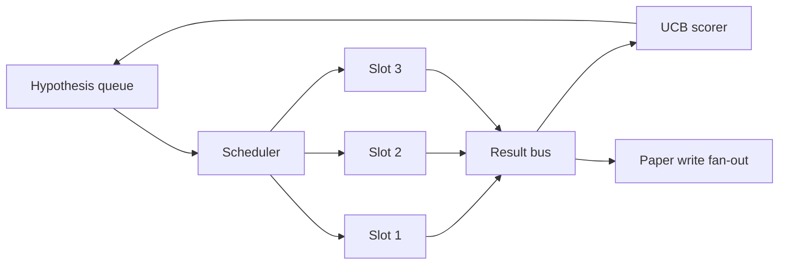
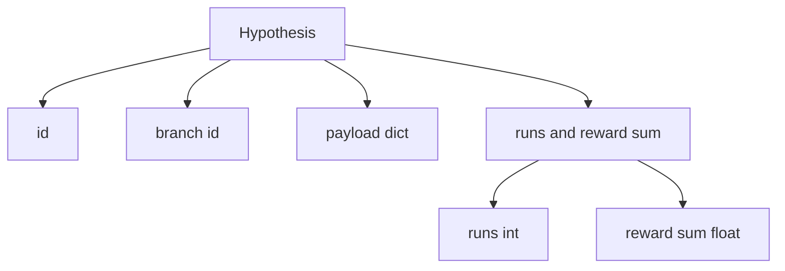
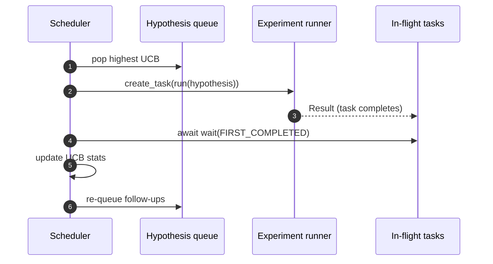

# Định trình lặp lại

> Không có một vòng nghiên cứu theo lịch trình, đó là một vòng xếp hàng với ảo tưởng.

**Type:** Build
**Languages:** Python
**Prerequisites:** Phase 19 lessons 50-53
**Time:** ~90 minutes

## Mục tiêu học tập


```figure
ch-ucb-scheduler
```

- Để làm cho dòng nghiên cứu trở thành một dòng giả thuyết, nó sẽ cung cấp các khe thử nghiệm, kết quả sẽ trở lại.
- Sử dụng đồng thời và chạy nhiều thí nghiệm, để lập trình viên có thể giữ tất cả các khe cắm bận rộn.
- Sử dụng UCB cho mỗi chi nhánh giả thuyết 打分, để lập trình viên có thể trong tình huống không bỏ qua khám phá cắt giảm sản xuất các chi nhánh.
- Các kết quả sẽ được hoàn thành và phát triển đến giai đoạn viết giấy và giai đoạn xếp hàng lại, để tạo ra các giả thuyết tiếp theo.
- 暴露 từng lần lặp đi lặp lại, bao gồm điểm nhánh, chiếm đóng khe và quyết định cắt đứt.

## Tại sao là lập trình viên, chứ không phải danh sách làm việc

平 danh sách làm việc sẽ được gửi theo thứ tự hoạt động công việc.  Khi mỗi công việc đều độc lập, đây không có vấn đề.

Có ý nghĩa trong việc chọn lựa là quy tắc ghi điểm. 贪心 scorer 总是选择当前领导,永远不探索. 平均 scorer 永远不利用. UCB (UCB) là đường trung gian: sử dụng nhà lãnh đạo, đồng thời cố gắng giữ dung lượng ít hơn.

## 系统结构



queue 保存 hypotheses──scheduler 在 slot 释放时选择 UCB最高的假设──每个插槽 异步运行一个实验──完成的实验将将结果将将到达车上.

## Hiểu thuyết 结构



`branch`Đây là chìa khóa của thống kê UCB. Nhiều giả thuyết có thể chia sẻ một ngành.`runs`là số lượng các thí nghiệm đã hoàn thành,`reward_sum`Đó là phần thưởng tích lũy.

## Điểm UCB

本课使用的 UCB公式是经典 UCB1──

```text
ucb(branch) = mean_reward(branch) + c * sqrt( ln(total_runs) / runs(branch) )
```

`total_runs`là tổng số các thí nghiệm đã hoàn thành trên tất cả các chi nhánh.`c`                                                                                                                                                                                                                                                              `sqrt(2)`◊ chạy 为零的分会得到 `+inf`, vì vậy các nhánh chưa thử 总是先调调.  trung bình phần thưởng của nhánh cao sẽ giữ điểm cao cho đến khi các nhánh khác 追上; chạy nhiều lần nhưng phần thưởng của nhánh không cao sẽ được chạy ít lần hơn.

Cổng cắt với người chọn phân chia.`prune_after_runs`Các thử nghiệm tiếp theo`3`) sau mức lương trung bình 低于绝对 floor(默认 `0.2`Khi cắt, sẽ chuyển nhánh này từ lịch trình tương lai vào trong chuyển nhượng.

## Sử dụng asyncio của các khe

lập trình sử dụng `asyncio.create_task`驱动 thí nghiệm. Mỗi nhiệm vụ 运行 thí nghiệm chạy.`async def`được gọi),并返回一个 `Result`△ Main loop 使用 `asyncio.wait(..., return_when=asyncio.FIRST_COMPLETED)`chờ đợi các nhiệm vụ trong chuyến bay 集合, và mỗi lần hoàn thành khi触发 điểm cập nhật.



三个槽并发运行――主循环 永远不会阻塞在单个实验上――调度器 会在槽 一释放时立即启动新任务,直到队为空且没有任务在飞行――

## Tăng: các kích hoạt giấy

Giá trị trung bình của một ngành 跨越 `paper_threshold`(默认 `0.7`), và khi ngành này chưa xuất bản giấy, người lập kế hoạch sẽ đưa ra một`paper.trigger`Trong bài học này, triggers sẽ được bắt trong danh sách, dễ dàng kiểm tra 断言。

## Phân tích: các giả thuyết tiếp theo

Khi kết quả cao sản xuất đến, lập trình viên có thể điều chỉnh các dịch vụ của người dùng.`expander`, trong cùng một ngành tạo ra một hoặc nhiều giả thuyết tiếp theo.`Result`Đến`list[Hypothesis]`Các hàm đơn giản của bài học này cung cấp một chất mở rộng tính xác định, sẽ mang lại cho bất kỳ phần thưởng nào vượt qua ngưỡng giấy kết quả sinh ra hai sự theo dõi.

## Ngân sách

2 ngân sách sẽ bảo vệ lập trình viên, tránh các vòng trục xuất.

```text
max_experiments    : 跨所有 branches 运行的 experiments 总数
max_seconds        : wall-clock cap (asyncio time)
```

Khi bất kỳ một tác động, lập trình viên sẽ ngừng điều chỉnh các nhiệm vụ mới, chờ đợi các nhiệm vụ trong chuyến bay  hoàn thành,并 quay lại dấu vết cuối cùng.`stop_reason`

## Theo dõi và báo cáo cuối cùng

Mỗi quyết định lập lịch (chọn, gửi, kết quả, chọn, chọn, chọn) đều sẽ xuất bản một sự kiện. Báo cáo cuối cùng sẽ được đưa ra.

## 如何阅读代码

`code/main.py`定义了 `Hypothesis``Result``BranchStats``IterationScheduler`, và một `make_deterministic_runner`Nhà máy, nó sẽ quay lại với một phần thưởng có thể dự đoán được của thí nghiệm không đồng bộ chạy.`delay_ms`(默认 `5ms`), hãy đồng thời 可观察──

`code/tests/test_scheduler.py`覆盖:UCB 优先选择未尝试分支、số chiếm đóng khe ngang、跨越门 时的纸引发器、低产出试验 后的分支剪裁、粉丝-out theo dõi giả thuyết,以及预算出口(

##  Tìm hiểu thêm

Thực tế thực hiện sẽ cần ba mở rộng. Thứ nhất, qua các phiên của UCB thống kê: hiện tại thống kê 存在内存里; thực tế lập trình viên 会 kiểm tra điểm 它们, để khởi động lại 保留已经花掉的探索预算. thứ hai, điểm số đa mục tiêu: mỗi kết quả không tái xuất một phần thưởng quy mô, mà xuất một Dấu tích, UCB trở thành người chọn kiểu Pareto. thứ ba, những tên cướp ngữ cảnh: người chọn dựa trên giả thuyết tính năng dài hạn.

Scheduler là một nơi nghiên cứu 超越工作清单的地方── một khi UCB 接好、插槽并行运行, tất cả những cải tiến khác có thể được lắp đặt trên nó──
