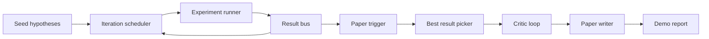
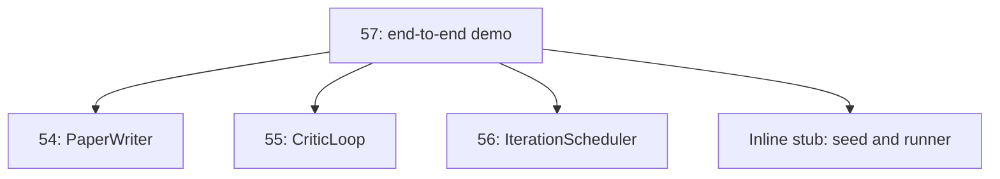
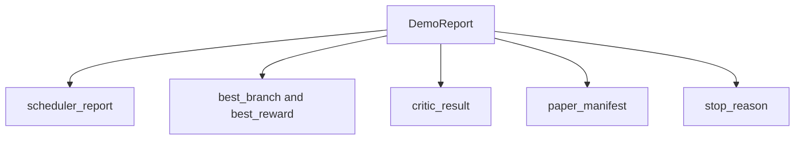

# Kết thúc nghiên cứu Demo

> Demo là nơi mà mọi hợp đồng bạn đã viết trước đó đều phải được tập hợp.

**Type:** Build
**Languages:** Python
**Prerequisites:** Phase 19 lessons 50-53
**Time:** ~90 minutes

## Mục tiêu học tập


```figure
ch-research-pipeline
```

- Để tự động nghiên cứu vòng lặp 端到端串连起来: giả thuyết hạt giống, thí nghiệm chạy bộ, lập trình viên, vòng lặp phê bình, bài viết người viết.
- 通过普通 Python nhập khẩu 组合前四节 Track D 课程中的原始, chứ không phải thông qua khung.
- 运行循环直到自行终止,并输出一个列出每个阶段 输出单一 Demo report。
- 保持 Demo xác định, để các bộ thử nghiệm có thể xác định hình dạng cuối cùng.
- Khi bất kỳ giai đoạn của hợp đồng bị phá hủy, lộ rõ ràng của chế độ thất bại, tránh giai đoạn tiếp theo Sử dụng phá vỡ đầu vào  tiếp tục vận hành.

## Đó là những gì được kết hợp.



五个阶段──种子 是三条假设的列表──调度器 使用三个平行槽 在它们之间运行六个实验──bus 报告一个或多个纸引发器──picker 选择单个最佳结果──批判循环 基于该结果 构建的草案 进行代──纸作家 输出最终的 LaTeX、BibTeX 和 manifesto──

## Tại sao nhập khẩu, thay vì sao chép

Mỗi chương trình của lớp học sẽ được giao một với các lớp dữ liệu công cộng và các chức năng của `main.py`✿Demo 通过调整 `sys.path`Đến mỗi phần của các mục tiêu của lớp học để nhập khẩu chúng. Đây không phải là hệ thống kết nối khung; nó tương tự như các tập tin thử nghiệm trong các lớp trước.



Stub inline  đại diện cho thứ 50 đến thứ 53 课: một máy phát triển giả thuyết hạt giống nhỏ và một chức năng thưởng đồng bộ. Người dùng có thể thông qua điều chỉnh hai nhập khẩu, sẽ thay thế stub inline thành những nguyên thủy thực trong các lớp học.

## Định nghĩa 保证

Demo trong cấu trúc là xác định. Người chạy thử nghiệm sử dụng hạt giống NumPy. Phân tích vòng lặp của người sửa đổi theo thứ tự cố định xuyên qua các chiều dài cố định.

给定相同种子,Demo 会输出相同报告――测试通过运行Demo 两次并比较显现 来断这一属性――

## Tương tự của báo cáo demo



Mỗi trường đều từ giai đoạn trên dòng. Demo không chuyển đổi bất kỳ sản xuất nào; nó chỉ là tập hợp chúng. Đây là thử nghiệm mà Demo thực sự thực hiện.

## Phương thức thất bại 处理

Mỗi giai đoạn phải thành công, phải đưa ra một lỗi đánh máy.

```text
Scheduler ........ returns SchedulerReport with stop_reason
                   in {queue_empty, max_experiments, deadline}
Best-result pick . raises NoTriggerError if no paper trigger fired
Critic loop ...... returns LoopResult with status converged or stopped
Paper writer ..... raises PaperValidationError on contract break
```

任意阶段的失败 都会使用 typed exception short-circuit Demo;;测试 固定了这个合同:`test_no_triggers_raises_typed_error`和 `test_best_picker_raises_when_no_triggers`Khi không có nhánh, khi kích hoạt, người chọn sẽ tăng lên.`NoTriggerError`- `BestResultError`, và nhà văn sẽ không bao giờ được sử dụng.

## Nhận kết quả tốt nhất

lập trình viên 会按分支 输出纸引引──picker 选择所有引引中中平均奖励最高的分支──ties 按分支 id的字母顺序打破,使Demo xác định式──picker 是一个小型纯函数;test 使用固定的 lập trình viên báo cáo 固定它的行为──

## 串接 vòng phân tích

第55 课中的批判循环 作用于`MiniPaper`❖ Demos  thông qua nhặt nhánh 构建一个 `MiniPaper`: dùng branch id 填充摘要,种子 两个部分(介绍 和结果),并根据 branch 的平均奖励 设置 `originality_tag`(Nếu `>= 0.8`Vì cao, nếu `>= 0.6`为 trung bình,否则为低)

Sau đó, người sửa đổi sẽ dự thảo 代到融合──output 会进入论文作家──

## 串接 biên tập viên giấy

Chương 54  bài viết trong bài viết 作用于包含数字 和 библиография的完整`Paper`hình dạng:`mini_to_full_paper`升级 hội tụ `MiniPaper`, nó sẽ được thêm vào một hình ảnh cho một ngành được chọn, và theo các chìa khóa trích dẫn đề xuất của nhà phê bình, và tập hợp xây dựng một thư viện tổng hợp nhỏ.

## 如何阅读代码

`code/main.py`定义了 `BestResultError``NoTriggerError``DemoReport``pick_best_branch``build_mini_paper``mini_to_full_paper`和 `run_demo`❖ Nhập khẩu hàng đầu sẽ được điều chỉnh một lần `sys.path`,并从各自课程中拉取 `PaperWriter``CriticLoop`和 `IterationScheduler`

`code/tests/test_e2e.py`覆盖:Demo 端到端运行并输出一个五个字段 全部填充的报告;两次运行之间的确定性;没有分支 过了门 时的 NoTriggerError;作者合同 破坏时的 PaperValidationError;纸质表包含选定的分支的数字;以及安排器停止原因是预期值之一――

## tiếp tục mở rộng

Khi demo 变绿后, có ba giá trị liên kết của mở rộng. Thứ nhất, trạng thái liên tục: kết quả của mỗi giai đoạn 写 vào một kho JSON nhỏ, để khởi động lại có thể không được vận hành lại.

Nhiệm vụ của demo là chứng minh thành phần đó là kiến trúc.
