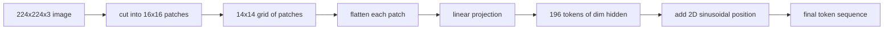

# 视觉编码器 Patches

> 读取像素的视觉模型需要像素分词器──补丁嵌入就是那个分词器──将图像切成正方形网格,展平每个正方形,投影到一个线性层,然后添加2D 位置信号,以便变形器知道每个正方形在原始图像中的位置──

**Type:** Build
**Languages:** Python
**Prerequisites:** 第19期第30-37课（B轨基础）
**Time:** ~90 分钟

## Học mục tiêu

- Chuyển hình ảnh thành chuỗi cài đặt bổ sung chiều dài cố định.
- 实现 dựa trên `Conv2d`ng hình ảnh, ng hình ảnh phù hợp với các hình ảnh toán học
- 构建确定性 2D 正弦位置嵌入, để để chỉ định顺序编码空间位置──
- 验证 kết hợp cố định                                                                                                                                                                                                                                                                                                                                                                                                                                                                                                                       `Conv2d`/ triển khai và hiệu quả

## 问题

Transformer 接收一系列向量──图像是一个3通道网格──将每个像素作为代码读取导致序列长度爆炸:224x224 RGB 图像是150,528个代码,这是12层 Transformer 无法承受──将图像读取为一个巨大的平面向量会丢弃局部性,而注意层无法从中恢复──编码器前端的工作是将像素网格压缩为数百代码,每个代码概括一个正方形区域──

补丁嵌入通过一个线性投影解决了这个问题. 补丁嵌入通过一个线性投影解决了这个问题. 补丁将224x224图像切成16x16块,生成包含196块的14x14网格.`(3, 16, 16) = 768`像素值展平为一个向量,然后线性层将其映射到模型的隐藏维度――Tranformator 见 196维度为`hidden`(thường là 768) mã thông báo cộng với một mã thông báo CLS. Đây là chuỗi phần còn lại của mạng có thể được vay vay.

## 概念



### Tại sao là sửa chữa, chứ không phải hình ảnh

chú ý là phương diện thứ hai của chiều dài chuỗi. 196 token của chuỗi mỗi tầng mỗi đầu chi phí.`196 * 196 = 38,416`注意力分数; 150,528 个代币序列的成本为 `150,528 * 150,528 = 22.6 billion`❖ Phong bổ sung có thể giảm lượng tính toán chú ý 590.000 lần, và một khu vực 16x16 đơn lẻ có thể mang đủ tín hiệu để thực hiện nhiệm vụ thị giác cao cấp.

### Tại sao việc chiếu trực tuyến là đủ?

Mỗi bộ bổ sung được xem là một khối lượng độc lập.`768 * 768 = 589,824`参数) và tốc độ tập luyện rất nhanh. Có nhiều tròn rộn sâu hơn, nhưng việc chiếu đường thẳng là tiêu chuẩn, và hầu hết các thiết bị lập tải trọng mở hiện đại đều có hình dạng chính xác như vậy.

### `Conv2d`技巧

Không có đầy ắp`Conv2d(in_channels=3, out_channels=hidden, kernel_size=patch_size, stride=patch_size)`√ đưa ra cùng một số lượng kết quả với mở và đường dẫn, vì mỗi vị trí đầu ra sẽ làm cho các hình ảnh bổ sung được thực hiện với một 波器. √ là dự án bổ sung, hầu hết các bộ nhớ mã sản xuất đều được cung cấp theo cách này, vì nó nhanh hơn trên GPU, và số lần tái tạo sử dụng ít hơn.

### 位置嵌入

token không mang theo bất kỳ thứ tự nào bên ngoài dự án. 2D 正弦嵌入为每个代币提供一个固定信号,用于编码它.`(row, col)`位置──嵌入维度的一半使用正弦/余弦编码对行位置在多频率下;另一半编码列位置──编码是确定性的,因此您可以交换分辨率而无需重新训练,并且它可以干净插值到模型中从未见过的网格──

|组件|形状|参数|
|-----------|-------|------------|
|补丁投影（`Conv2d`）| `(hidden, 3, patch, patch)` | `3 * P * P * hidden + hidden` |
|位置嵌入（固定）| `(num_patches, hidden)` | 0（计算，未学习）|
| CLS token（已学习）| `(1, hidden)` | `hidden` |

Đối với 224 phân giải ViT-Base/16: trong dự án có 590,592 tham số, trong mã thông báo CLS có 768 tham số, vị trí chân dây là zero.

### 作为健全性检查的等效性

补丁步骤 có hai cách viết:`Conv2d`投影和显式展开然后线性──它们必须以相同的重量产生相同的输出──如果不这样做,则展开数学是错误的,剩余部分编码器是建立在沙子上的──本课中的测试练习了这种等价性──


```figure
ch-patch-tokenizer
```

##  xây dựng nó

`code/main.py`实现:

- `PatchEmbed`- Tôi không biết.`nn.Module`包装 `Conv2d`Sử dụng để sửa chữa chiếu.
- `sinusoidal_2d(grid_h, grid_w, dim)`, một cấu trúc 2D  vị trí biểu đồ của hàm không trạng thái.
- `VisionFrontEnd`, nó sẽ bổ sung vào cls đặt trước và vị trí thêm hợp thành một lần chuyển tiếp trước
- Một `synthesize_image(seed)`trợ lý, có thể từ `numpy.random`构建确定性 224x224x3 cố định
- Một mô tả, thông qua mã hóa đầu cuối 运行一张 cố định 图像,并打印输出形状、CLS token 范数和一行位置嵌入──

运行 nó:

```bash
python3 code/main.py
```

输出:224x224 cố định được mã hóa thành hình dạng `(1, 197, 768)`Các chuỗi. Đơn vị đầu tiên là CLS; tiếp theo là 196 Đơn vị bổ sung.

## Sử dụng nó

Các sửa chữa tương tự xuất hiện trong mỗi mô hình ngôn ngữ hiện đại: CLIP ViT-L/14、SigLIP、DINOv2、Qwen-VL 系列和InternVL 堆都从`Conv2d`补丁投影加上位置信号开始──下游 各系列之间的差异(CLS 与无 CLS 池化、注册代码、不同的补丁大小 14 和 16、通过插值位置进行动态分辨率) ⋅ 前端本课程是每个模型的依赖基础──

## 测试

`code/test_main.py`涵盖:

- 补丁 số lượng phù hợp `(image_size / patch_size) ** 2`
- 输出形状匹配`(batch, num_patches + 1, hidden)`
- `Conv2d`投影等于在小型固定 上手动展开然后线性投影
- Nơi đứng của biểu tượng có tính xác định giữa các điều chỉnh
- CLS token跨批次dim广播而不会泄漏

运行它们:

```bash
python3 -m unittest code/test_main.py
```

## 练习

1. 用学习到的`nn.Parameter`Thay thế vị trí âm đạo, và so sánh các nhiệm vụ phân loại nhỏ, mất mát thứ nhất.

2. sẽ`Conv2d`替换为显式 `nn.Unfold`加 `nn.Linear`,并断言输出匹配在浮动容量差范围内── tương tự như toán học, có hai cách viết──

3. + + + + + + + + + + + + + + + + + + + + + + + + + + + + + + + + + + + + + + + + + + + + + + + + + + + + + + + + + + + + + + + + + + + + + + + + + + + + + + + + + + + + + + + + + + + + + + + + + + + + + + + + + + + + + + + + + + + + + + + + + + + + + + + + + + + + + + + + + + + + + + + + + + + + + + + + + + + + + + + + + + + + + + + + + + + + + + + + + + + + + + + + + + + + + + + + + + + + + + + + + + + + + + + + + + + + + + + + + + + + + + + + + + + + + + + + + + + + + + + + + + + + + + + + + + + + + + + + + + + + + + + + + + + + + + + + + + + + + + + + + + + + + + + + + + + + + + + + + + + + + + + + + + + + + + + + + + + + + + + + + + + + + + + + + + + + + + + + + + + + + + + + + + + + + + + + + + + + + + + + + + + + + + + + + + + + + + + + + + + + + + + + + + + + + + + + + + + + + + + + + + + + + + + + + + + + + + + + + + + + + + + + + + + + + + + + + + + + + + + + + + + + + + + + + + + + + + + + + + + + + + + + + + + + + + + + + + + + + + + + + + + + + + + + + + + + + + + + + + + + + + + + + + + + + +

4. Với số lượng lớn 1、8、64  phân tích các bước sửa chữa.

5. Trong 4 类合成形形数据集 ((圆形、正方形、三角形、星形) 上将前端训练为结特征提取器;; CLS token输出应线性分离;;

## 关键术语

|术语 |这意味着什么 |
|------|---------------|
|补丁|图像的方形子区域，通常为 14x14 或 16x16 |
|补丁嵌入 |一个扁平面片到hidden dim区域的线性投影 |
|序列长度|补丁token化后的 token数量，通常加上 CLS |
|正弦位置 |修复了编码 2D 网格坐标的 sin/cos 信号 |
| CLS token |学习向量作为池化头添加到序列前面 |

## 进一步阅读

- Đối với các bản bổ sung đầu tiên, hình ảnh có giá trị 16x16 个字符 ((ViT,2021)。
- Sự chú ý là tất cả những gì bạn cần (2017)
- Sử dụng để đăng ký ký ký ký hiệu của bài luận DINOv2, bạn có thể thêm một mở rộng như bài tập 6.
