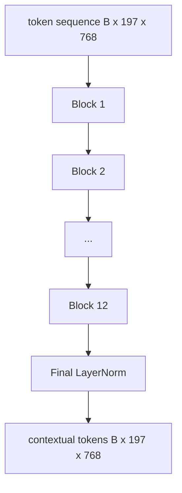

# 视觉 Transformer 编码器

> 补丁单独看不到──具有12 个注意头的12层预 LN Transformer sẽ chuyển đổi chuỗi mã thông báo bổ sung sang chuỗi mã thông báo sau, trong đó mã thông báo CLS trong trạng thái ẩn cuối cùng của nó sẽ tích tụ toàn bộ các đặc điểm hình ảnh──本课程是每个现代视觉语言模型的引擎室──

**Type:** Build
**Languages:** Python
**Prerequisites:** 第19期第30-37课（B轨基础）
**Time:** ~90 分钟

## Học mục tiêu

- 实现 có nhiều chủ đề tự chú ý và các khối chuyển đổi LN trước của tầng trước.
- 堆叠 12 个具有 12 个头的块, hình thành ViT-Base 编码器.
- Để sửa chữa trong bài học 58 kết nối đầu cuối với bộ lập trình và chạy trước hướng truyền.
- 验证 CLS token có tập hợp thông tin của mỗi sửa chữa không.

## 问题

补丁嵌入生成一系列197个代币,每个代币都是一个向量,不知道任何其他补丁.                                                                                                                                                                                                                                                  

标准配方 gồm 12 khối sâu,12 khối rộng, có sẵn LayerNorm 放置、GELU 激活和 4倍前扩展。配方 này là CLIP ViT-L、SigLIP、DINOv2、Qwen-VL 系列、InternVL以及 2025-2026 năm tất cả các trụ cột của các bộ lập trình viên trọng thị quyền mở rộng khác.

## 概念




### LN 前与 LN 后

LayerNorm là phiên bản của mô hình ngôn ngữ hình ảnh hiện đại, vì nó không cần học tốc độ dự kiến là kỹ thuật có thể ổn định. Sự khác biệt nằm ở một đường trong đường dẫn phía trước, độ sâu 12+  ở các dòng thang là đêm và ngày.

### Nhiều tâm trí tự

Mỗi đầu sẽ chỉ định khối lượng chiếu đến kích thước của riêng nó`head_dim = hidden / num_heads`của `(query, key, value)`Ba thành phần.`hidden = 768`和`heads = 12`, mỗi đầu có`dim = 64` 12 đầu đồng hành tham gia, sau đó các đầu ra kết nối trở lại 768 维并 thông qua đầu ra chiếu.

### Tại sao phải tiến hành 4 lần mở rộng

FFN 为 `hidden -> 4 * hidden -> hidden`, GELU nằm ở giữa. Các yếu tố 4 là kinh nghiệm, từ năm 2017 đã được áp dụng cho ngôn ngữ và hình ảnhTransformer.

|组件| ViT-Base 规模的参数 |
|-----------|------------------------------|
|每个块的 qkv 投影 | `3 * 768 * 768 = 1.77M` |
|每个块的输出投影| `768 * 768 = 590K` |
|每块 FFN（4 倍扩展）| `2 * 768 * 4 * 768 = 4.72M` |
|每块的 LayerNorm | `4 * 768 = 3K` |
|每块总计 |约 710 万 |
| 12 块 |约85M |
|加前端|总计约86M |

ViT-Base là một bộ lập trình số 86M. Theo tiêu chuẩn năm 2026, giá trị này rất nhỏ. SigLIP-So400M là 400M, Quwen-VL ViT là 675M, nhưng cấu trúc trên chiều rộng và chiều sâu là giống nhau.

### Ý nghĩa của mặt nạ không?

Vision Transformer chỉ chứa bộ lập trình và là hai chiều: token`i`Bạn có thể tham gia bất kỳ đối tượng nào `j` Không có mặt  Trong bài học 61  , sự chú ý giao tiếp sẽ sử dụng ẩn dấu kết quả, nhưng bên trong bộ lập trình video, sự chú ý là hoàn toàn kết nối 

### CLS token học đã học được gì

CLS token bắt đầu từ các tham số học, không có nội dung sửa chữa riêng của mình, và thông qua sự chú ý của mỗi khối để tích lũy thông tin.


```figure
ch-cls-funnel
```

##  xây dựng nó

`code/main.py`实现:

- `MultiHeadSelfAttention`, có`qkv`和输出投影、缩放点积注意力数学和形状断言──
- `FeedForward`,4 倍扩展 GELU MLP。
- `Block`, một khối LN trước, được tạo thành bởi sự chú ý và có sự khác biệt ở tầng trước.
- `ViT`,12 khối của một khối, có một LayerNorm cuối cùng.
- `VisionEncoder`, nó sẽ `VisionFrontEnd`Từ thứ 58 课连接到`ViT`堆,并公开返回上下文序列和池化 CLS hướng số lượng `forward()`
- Một mô tả, thông qua mã hóa hoàn chỉnh 运行 tổng hợp 224x224 vật cố định 图像,并 từng lớp in in hình dạng, xuất hình dạng, số lượng tham số và CLS 范数。

运行 nó:

```bash
python3 code/main.py
```

输出:fixture được编码为`(1, 197, 768)`张量──CLS 范数随着层组合漂移向上,然后稳定在最终LayerNorm──总参数报告约为86M──

## Sử dụng nó

Các bộ lập trình được định nghĩa ở chiều rộng và độ sâu giống với khối lượng VLM cung cấp trong mỗi khối lượng mở trong năm 2025-2026:

- **宽度和深度。**ViT-Large 为 `hidden=1024, depth=24, heads=16`; SigLIP So400M là `hidden=1152, depth=27, heads=16` 同一个块
- **池化头。**CLS池(本课) 与平均池(SigLIP) 与注意力池(后来的VLM)
- **位置处理。**固定正弦曲线 (第 58 课) với学习的 1D、ALiBi với 2D RoPE──块数学没有改变──
- **注册token。**DINOv2 前置 4 个额外学习的代码.

Các khối được lắp đặt là nền tảng.

## 测试

`code/test_main.py`涵盖:

- 单块保留形状并且对输入批量大小不变
-  Nhóm tập trung tập trung của trọng tâm (giống như 1 )
- 剩余路径已连接(零输入仍通过 CLS token产生非零输出)
- 4 tầng nếp nhăn trước hướng truyền tạo ra hình dạng chính xác
- 梯度 từ CLS 输出流向面片投影

运行它们:

```bash
python3 -m unittest code/test_main.py
```

## 练习

1. 添加寄存器token(CLS 后添加 4 学习向量)并重新运行──通过最后层的软max 分布的来比较注意力图的平滑度──

2. Để thay thế LN trước thành LN 后, và tập luyện trên các phân loại hình dạng tổng hợp một thời đại.

3. Việc ngăn chặn kết quả sẽ được thực hiện`attn_mask`Các phân tích, để cùng một khối có thể được sử dụng lại như một khối giải mã.`(seq, seq)`,下三角形──

4. Sử dụng `torch.profiler`分析批量大小为 1、8、64的前向传递── MLP Layer chủ yếu là thời gian tường, chứ không phải là chú ý──

5. Sử dụng LoRA 适配器 thay thế một đầu chú ý của q-k-v 投影, kết thúc phần còn lại,并验证梯度 chỉ di chuyển ở vị trí mong đợi của bạn.

## 关键术语

|术语 |这意味着什么 |
|------|---------------|
|预 LN | LayerNorm 应用在每个子层之前而不是之后 |
|自我关注 |每个token都以相同的顺序关注其他所有token |
|多头|隐藏的dim分布在 `H` 独立注意头中 |
| FFN 扩展 |前馈层在收缩之前加宽至 `4 * hidden` |
| CLS 池 |使用第一个token 的最终隐藏状态作为图像摘要 |

## 进一步阅读

- Đối với bộ phận lập trình, một张图像 trị giá 16x16 个单词
- DINOv2 (2023) 用于注册token和自监督预训目标──
- SigLIP (2023), được sử dụng trong lớp 62 ⇒
