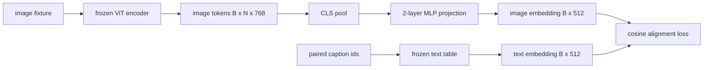

# Sử dụng mô hình đối với lớp chiếu

> 视觉编码器生成图像代币――文本解码器消耗文本代币――两者生活在不同的向量空间中――一个小型的两层MLP将图像代币投影到文本嵌入空间中,并针对配对标题的余弦对齐损失使两个空间保持一致――该投影是视觉语言模型中最小的部分,也是迁移最重要的部分――

**Type:** Build
**Languages:** Python
**Prerequisites:** 第19期第30-37课（B轨基础）
**Time:** ~90 分钟

## Học mục tiêu

- Xây dựng một MLP hai tầng, sẽ hình ảnh đặc điểm được chiếu vào văn bản嵌入空间.
- 构建一个模拟文本嵌入表(没有预训练的分词器,没有真正的语料库) ⋅
- 计算投影图像代码和配对标题嵌入之间的余弦对齐损失──
- Sử dụng 结视觉编码器和结文表单独训练投影──

## 问题

您有一个视觉编码器 ((第 58-59 课),可生成维度 `vision_hidden = 768`Bạn có một máy giải mã văn bản, bạn muốn sẽ được đặt kích thước cố định trong `text_hidden = 512`之上 (任何其他数字也同样合理) ――解码器需要文体形的代码――图像代码不是文体形的:它们存在于编码器在仅视觉预训期间学习的基础中,与解码器的词量没有关系――

两层 MLP 投影(线性、GELU、线性) bù đắp khoảng cách này──它足够小(大约`768 * 1024 + 1024 * 512 = 1.3M`参数), có thể được thực hiện trên một GPU trong vài phút, và nó là một phần duy nhất cần thiết trong giai đoạn học tập.

## 概念



### 投影前池化

视觉编码器发发出 197 个代币――文本侧具有单个标题级嵌入式――为了结合它们,每个样本需要一个图像级向量―― CLS 池化是最简单的:从编码器获取第一代币并对其投影――对所有197 代币进行平均池也是另一种选择,也是 SigLIP 使用的方法――要么将197 个向量合并为一个――

### Tại sao là hai tầng chứ không phải là một tầng?

 Động hình hình đơn tuyến có thể xoay và thu nhỏ lại, nhưng nếu hai cong không gian không phù hợp, thì không thể cố định cơ sở. GELU giữa hai tầng tuyến cung cấp cho chiếu một đường không tuyến, điều này trong kinh nghiệm đủ để đưa các đặc điểm của CLIP 风格 và mô hình ngôn ngữ được nhúng vào cùng.

|层|形状|参数|
|-------|-------|------------|
| FC1 | `(vision_hidden, projection_hidden)` | `768 * 1024 + 1024` |
|激活|格鲁| 0 |
| FC2 | `(projection_hidden, text_hidden)` | `1024 * 512 + 512` |

Một `768 -> 1024 -> 512`Có khoảng 1,3M tham số.

### 余弦对齐损失

Không có nghĩa là`image_emb == text_emb`                                                                                                                                                                                                                                                              `image_emb`Trong khoảng không gian`text_emb`Chỉ hướng cùng một hướng.`1 - cos_sim(image, text)`, phạm vi từ 0( hoàn toàn đối với) đến 2 ((相反)  Bài tập sẽ đưa ra cho mỗi đối với đối với 0,¬§ 62 课概括为对比批次 (InfoNCE), trong đó mỗi hình ảnh phải gần hơn so với bất kỳ tiêu đề nào khác trong các tập thể của mình; bài học này sử dụng mỗi đối số phiên bản, do đó động thái có thể thấy.

### 结编码器是门

视觉编码器 có 86M参数――文本表还有几百万――从模拟语料库中训练所有这些人是不可能的――结结两意味着投影的1.3M参数是唯一的变化,并且合成对几百步就足以降低损失――这正是每个适配器基于VLM的操作形状:重型部件保持结状态,轻型桥梁列车――


```figure
ch-projection-bridge
```

##  xây dựng nó

`code/main.py`实现:

- `MLPProjector(in_dim, hidden_dim, out_dim)`, có GELU 激活的两层线性 MLP──
- `MockTextEmbedding(vocab_size, dim)`, một bảng kết hợp, có sự bắt đầu xác định từ hạt.
- `make_pair(seed, vocab_size)`, sintet ein对(图像、标题) 样本──标题是短 id 序列;标题嵌入是对代币嵌入进行平均值池化──标题嵌入是对代币嵌入进行平均值池化──标题嵌入是对代币嵌入的平均值池化──标题是短 id 序列.
- `cosine_alignment_loss(image_emb, text_emb)`, mỗi đối với`1 - cos_sim`Đồ kính.
- Một vòng tập luyện, chạy trên 32 vòng tổng hợp với 200 bước chiếu, video biên tập và biểu đồ văn bản kết thúc, và mỗi 25 bước in một lần mất.

运行 nó:

```bash
python3 code/main.py
```

输出: training report trong 200 bước từ lỗ ban đầu khoảng 1.07 xuống xuống khoảng 0.80, cho thấy chỉ dựa vào chiếu chỉ có thể kéo hình ảnh vào không gian văn bản.

## Sử dụng nó

Mỗi VLM mở quyền trọng sẽ xuất hiện mô hình tương tự:

- **LLaVA 1.5.**Từ CLIP-ViT-L  ẩn đến LLaMA 嵌入在我的两层 GELU MLP 投影──结视觉编码器,结 LLM,仅训投影(然后在第二阶段解 LLM) 
- **BLIP-2.**Q-Former 通过针对图像代币的交叉关注获取32 个学习查询代币,然后投投到LLM 嵌入dim;; Q-Former 最后投投投头类似本课的MLP;;
- **MiniGPT-4.**Từ BLIP-2 Q-Former 输出 đến Vicuna 嵌入dim的单线性投影──
- **Qwen-VL.**Có nhiều lớp chuyển động tập trung, nhưng phần cuối cùng vẫn là đến LM 嵌入式投影.

形状 khác nhau, nhưng tác dụng là giống nhau:池图像代码,投影到文本嵌入dim,单独训练.

## 测试

`code/test_main.py`涵盖:

- 投影仪输出形状与配置的 `out_dim`匹配
- 结文本嵌入表的 `requires_grad`参数为零
- Lợi dây mất trên cùng một khối lượng là 0, trên khối lượng ngược đồng bằng là 2
- Một lần chuyển tiếp sau khi chiếu
- Chuyển tập giảm tổn thất giữa bước 0 và bước 200

运行它们:

```bash
python3 -m unittest code/test_main.py
```

## 练习

1. Thay thế CLS 池化 thành 196 mã thông báo váy, và so sánh với 200 bước sau khi mất tích cuối cùng. 池化 trung bình thường được đào tạo nhanh hơn trên dữ liệu tổng hợp; CLS trên hình ảnh tự nhiên có hiệu quả mẫu cao hơn.

2. Tăng nhiệt độ tiêu chuẩn được học thêm vào mất dây dư (`cos / tau`) 中,并观察当 `tau`太小了 (太小了) 太大了 (太大了) 太小了 (太大了) 太大了 (太大了) 太小了 (太大了) 太大了 (太大了) 太大了 (太大了) 太大了 (太大了) 太大了 (太大了) 太大了 (太大了) 太大了 (太大了) 太大了 (太大了) 太大了 (太大了) 太大了) 太大了 (太大了) 太太多了 (太多了) 太多了 (太多了) 太多了 (太多了) 太多了)

3. Thay thế hai lớp MLP thành một lớp tuyến tính đơn và định lượng mất mát khoảng cách.

4. Trong trọng lượng của thiết bị chiếu, thêm một hình phạt nhỏ L2, và xem nó tương tác như thế nào với các dây còn lại với nhau.

5. Bảo quản trọng lượng của thiết bị chiếu, sau đó tải lại và chạy theo dõi, không cần thiết thiết bị chỉnh sửa hình ảnh để chuyển tiếp sau, chỉ cần thiết bị chiếu khi được triển khai để xác minh.

## 关键术语

|术语 |这意味着什么 |
|------|---------------|
|模态对齐 |使图像和文本嵌入在一个共享空间中具有可比性的行为 |
|投影头|将一个空间映射到另一个空间的小模块，通常是 2 层 MLP |
|余弦相似度 |点积除以 L2 范数的乘积 |
|冻结编码器|视觉（或文本）模型的所有参数均带有 `requires_grad=False` |
|模拟语料库|使用合成对，因此训练不依赖于数据集下载 |

## 进一步阅读

- Sử dụng 2 giai đoạn đào tạo LLaVA 论文(项目,然后解 LM) 』
- Q-Former của BLIP-2 论文作为可学习的投影替代方案.
- Qwen-VL 技术报告,将交叉注意力适配器使用作更深的投影头――
