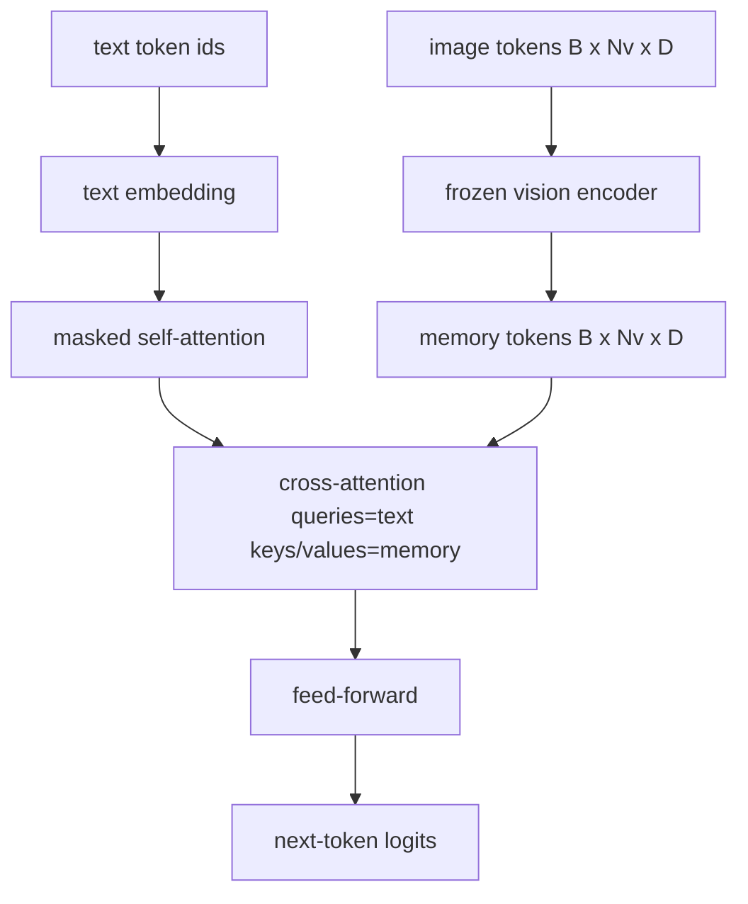
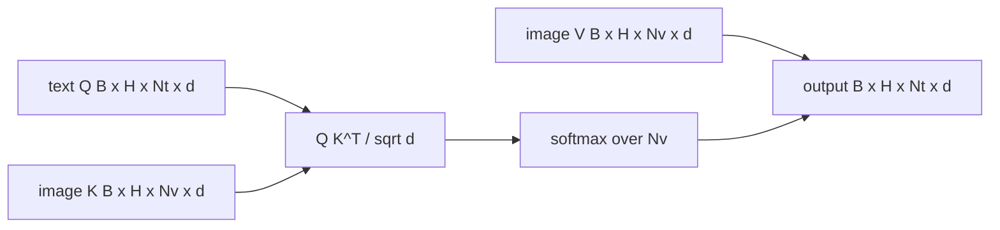

# 交叉注意力融合

> 投影层将图像向量与标题向量对齐. 实际视觉语言解码器需要每个文本代码都参与每个补丁代码,因此模型可以将每个单词放在一个区域中. 交叉注意力就是这种接地发生的方式. 文字查询; 视景关键和价值观给出答案. 本课构建交叉注意力块,因果文本自注意力以及保持两者合法的掩形.

**Type:** Build
**Languages:** Python
**Prerequisites:** 第19期第30-37课（B轨基础）
**Time:** ~90 分钟

## Học mục tiêu

- 实现多头交叉注意力, trong đó truy vấn流是文本,键/值流是视觉──
- 组成解码器块:因果自注意力+交叉注意力+前──
- 获得正确的掩模形:用于自注意的因果掩模,用于交叉注意的无掩模.
- Sử dụng mã hóa văn bản và mã hóa hình ảnh cố định

## 问题

Để kết nối các biểu tượng và biểu tượng văn bản vào một chuỗi là một lựa chọn kết hợp ([[Fusion_Fusion_Fusion_Fusion_Fusion_Fusion_Fusion_Fusion_Fusion_Fusion_Fusion_Fusion_Fusion_Fusion_Fusion_Fusion_Fusion_Fusion_Fusion_Fusion_Fusion_Fusion_Fusion_Fusion_Fusion_Fusion_Fusion_Fusion_Fusion_Fusion_Fusion_Fusion_Fusion_Fusion_Fusion_Fusion_Fusion_Fusion_Fusion_Fusion_Fusion_Fusion_Fusion_Fusion_Fusion_Fusion_Fusion_Fusion_Fusion_Fusion_Fusion_Fusion_Fusion_Fusion_Fusion_Fusion_Fusion_Fusion_Fusion_Fusion_Fusion_Fusion_Fusion_Fusion_Fusion_Fusion_Fusion_Fusion_Fusion_Fusion_Fusion_Fusion_Fusion_Fusion_Fusion_Fusion_Fusion_Fusion_Fusion_Fusion_Fusion_Fusion_Fusion_Fusion_Fusion_Fusion_Fusion_Fusion_Fusion_Fusion_Fusion_Fusion_Fusion_Fusion_Fusion_Fusion_Fusion_Fusion_Fusion_Fusion_Fusion_Fusion_Fusion_Fusion_Fusion_Fusion_Fusion_Fusion_Fusion_Fusion_Fusion_Fusion_Fusion_Fusion_Fusion_Fusion_Fusion_Fusion_Fusion_Fusion_Fusion_Fusion_Fusion_Fusion_Fusion_Fusion_Fusion_Fusion_Fusion_Fusion_Fusion_Fusion_Fusion_Fusion_Fusion_Fusion_Fusion_Fusion_Fusion_Fusion_Fusion_Fusion_Fusion_Fusion_Fusion_Fusion_Fusion_Fusion_Fusion_Fusion_Fusion_Fusion_Fusion_Fusion_Fusion_Fusion_Fusion_Fusion_Fusion_Fusion_Fusion_Fusion_Fusion

后期融合 có hai lợi thế. Thứ nhất, dòng văn bản giữ sạch, mô hình giữ nguyên chức năng văn bản thuần túy. Thứ hai, dòng hình ảnh tính toán từng hình ảnh một lần và sử dụng lại trong từng bước giải mã, vì vậy ngay cả đối với tiêu đề dài, tạo cũng rất rẻ.

## 概念





### 面具 hình dạng

Trong 2 khối, cần phải chú ý đến các ẩn dụ khác nhau:

|注意|查询长度 |密钥长度|面膜|为什么 |
|-----------|--------------|------------|------|-----|
|自我关注 | `Nt`（文本）| `Nt`（文本）|因果：下三角 `(Nt, Nt)` |自回归期间文本token可能不会向前看 |
|交叉注意力| `Nt`（文本）| `Nv`（愿景）|没有口罩|整个图像对每个文本位置都是可见的 |

Chương trình này bao gồm một hàm xác minh hình dạng, do đó, chúng được trộn lẫn với nhau như `ValueError`Đúng là một sai lầm, không phải là một sự cố vô cùng lớn.

### Tại sao sự chú ý không được che giấu?

Trước khi tạo bất kỳ văn bản nào, hãy nhìn kỹ vào hình ảnh.`t`Bạn có thể chú ý đến bất kỳ sửa chữa nào của hình ảnh; các khối hình ảnh không có thứ tự thời gian. Một số biến thể Flamingo đã thêm mô hình che giấu của mỗi mẫu khi giao lưu nhiều hình ảnh và đoạn văn bản, nhưng đối với một hình ảnh đơn lẻ thêm tiêu đề, sự chú ý giao lưu có thể thấy mọi thứ.

### 键/值缓存

图像键和值在解码开始时计算一次并存存储中――每个新文本代码都使用缓存而无需重新计算――这就是推理时字幕快速运行的原因:重型 ViT运行一次;交叉注意在每一步中重用其键和值――本课程公开缓存并测试缓存中路径――

### 块组成

解码器块运行:预 LN -> 自注意力 -> 残差 -> 预 LN -> 交叉注意力 -> 残差 -> 预 LN -> 前 -> 残差──三个子层, mỗi子层 có LayerNorm riêng của mình。 Flamingo 论文添加一个关于交叉注意的学习门,因此模型可以在训练时稳定性为代价选择退出图像路径;规范基线(这里使用)没有门──

```python
class DecoderBlock:
  def forward(self, text_tokens, image_tokens, text_mask, cross_mask):
      text_tokens = text_tokens + self.self_attn(self.ln1(text_tokens),
                                                 mask=text_mask)
      text_tokens = text_tokens + self.cross_attn(self.ln2(text_tokens),
                                                  image_tokens,
                                                  mask=cross_mask)
      text_tokens = text_tokens + self.ffn(self.ln3(text_tokens))
      return text_tokens
```


```figure
ch-crossattn-fan
```

##  xây dựng nó

`code/main.py`实现:

- `CrossAttention(hidden, heads)`, có độc lập`q`和 `kv`投影的多头交叉注意力──
- `CausalSelfAttention(hidden, heads)`, từ các tiêu chuẩn giải mã máy tính để ngăn chặn tự chú ý.
- `DecoderBlock`, dùng LN còn lại để tạo thành ba tầng.
- `VisionLanguageDecoder`, được cung cấp bởi các bộ giải mã bốn tầng được tạo ra bởi các bộ biên tập hình ảnh và các bảng đặt văn bản nhỏ.
- `causal_mask(length)` quay lại `(length, length)`Này, tôi đã nói với cậu.
- Một thí dụ, nó cung cấp cho một loạt hai chuỗi văn bản dài 10 dài 197 hình ảnh trong bộ nhớ, và in các hình dạng đầu ra, hình dạng tự chú ý ẩn và số lượng đầu ra chuyển động của mỗi vị trí.

运行 nó:

```bash
python3 code/main.py
```

输出: giải码器产生 `(2, 10, text_vocab)`logits 张量──面罩形为`(10, 10)`KV 缓存重用检查确认缓存与未缓存路径之间的相同逻辑。

## Sử dụng nó

Sự chú ý giao lưu xuất hiện trong hai loạt sản xuất:

- **Flamingo 和 IDEFICS。**Mỗi K 个语言模型块插入一个交叉注意力层,并使用结结的 LM──视觉语言适配器是交叉注意力块及其门──
- **BLIP-2.**Q-Former sử dụng từ một nhóm cố định 32 mã thông báo truy vấn để chuyển tập trung vào các đặc điểm hình ảnh, sau đó sẽ đưa các hình ảnh truy vấn vào LM 嵌入空间中.

Các hình dạng của các khối trong bài học này được trực tiếp mô tả lên cả hai.

## 测试

`code/test_main.py`涵盖:

- Vì kết quả ẩn là hình dạng của góc dưới và phù hợp với hình dạng của dự kiến
- Bất kể độ dài của khóa nào, giao thông tập trung vào các hình thức đầu ra đều là `(B, Nt, hidden)`
- KV 缓存路径与未缓存路径相匹配浮动容量差
- Sự không phù hợp giữa dòng văn bản và hình ảnh đã gây ra sự rõ ràng`ValueError`
- Complete decoder forward to pass tạo ra đúng dạng hàng loạt và chuỗi

运行它们:

```bash
python3 -m unittest code/test_main.py
```

## 练习

1. 将学习的门 门添加到交叉注意残差(Flamingo 技巧),并验证训练从接近零的初始门收──门从0开始;该模型在混合图像流之前恢复纯文本行为──

2. 实现交错注意力, trong đó cùng một trình giải mã tiêu thụ nhiều hình ảnh và nhiều đoạn văn bản.

3. Trong `Nt=64, Nv=576`(Bản dung lượng 24x24 trên phân tích phân tích phân tích tập trung và phân tích phân tích phân tích phân tích phân tích phân tích phân tích phân tích phân tích phân tích phân tích phân tích phân tích phân tích phân tích phân tích phân tích phân tích phân tích phân tích phân tích phân tích phân tích phân tích phân tích phân tích phân tích phân tích phân tích phân tích phân tích phân tích phân tích phân tích phân tích phân tích phân tích phân tích phân tích phân tích phân tích phân tích phân tích phân tích phân tích phân tích phân tích phân tích phân tích phân tích phân tích phân tích phân tích phân tích phân tích phân tích phân tích phân tích phân tích phân tích phân tích phân tích phân tích phân tích phân tích phân tích phân tích phân tích phân tích phân tích phân tích phân tích phân tích phân tích phân tích phân tích phân tích phân tích phân tích phân tích phân tích phân tích phân tích phân tích phân tích phân tích phân tích phân tích phân tích phân tích phân tích phân tích phân tích phân tích phân tích phân tích phân tích phân tích phân tích phân tích phân tích phân tích phân tích phân tích phân tích phân tích phân tích phân tích phân tích phân tích phân tích phân tích phân tích phân tích phân tích phân tích phân tích phân tích phân tích phân tích phân tích phân tích phân tích phân tích phân tích phân tích phân tích phân tiêu phân tiêu phân tiêu phân tiêu tiêu tiêu tiêu tiêu tiêu tiêu tiêu tiêu tiêu tiêu tiêu tiêu tiêu tiêu tiêu tiêu tiêu tiêu tiêu tiêu tiêu tiêu tiêu tiêu tiêu tiêu tiêu tiêu tiêu tiêu tiêu tiêu tiêu tiêu tiêu tiêu tiêu tiêu tiêu tiêu tiêu tiêu tiêu tiêu tiêu tiêu tiêu tiêu tiêu tiêu tiêu tiêu tiêu tiêu tiêu tiêu tiêu tiêu tiêu tiêu tiêu tiêu tiêu tiêu tiêu tiêu`Nt * Nv`, và chiếm vị trí chủ đạo trong độ phân giải hình ảnh cao.

4. Trong giao thông chú ý biểu đồ thêm kết thúc truy vấn dropup,并 đo trình bày nhiều dạng tiêu đề trong biểu diễn

5. Để thay thế các tầng chú ý giao lưu với các khối chú ý kiểu Q-Former, trong đó là 32 个索引查询池, mỗi tầng tập trung vào một hình ảnh đặc điểm.

## 关键术语

|术语 |这意味着什么 |
|------|---------------|
|后期融合|文本和视觉位于不同的流中；交叉注意力在每个区块上架起了桥梁|
|交叉注意力| Q 来自一个流，K 和 V 来自另一个流 |
|因果面具|下三角布尔掩码，可防止在自回归过程中向前看 |
| KV缓存|图像键和值存储一次并在每个解码步骤中重复使用 |
|记忆token|解码器进入的冻结图像token |

## 进一步阅读

- Flamingo (2022) sử dụng để có sự quan tâm giao thông có kiểm soát.
- BLIP-2 của Q-Former (2023), nó là một bộ phận tập trung tập trung tập trung tập trung tập trung tập trung tập trung tập trung tập trung tập trung tập trung tập trung tập trung tập trung tập trung tập trung tập trung tập trung tập trung tập trung tập trung tập trung tập trung tập trung tập trung tập trung tập trung tập trung tập trung tập trung tập trung tập trung tập trung tập trung tập trung tập trung tập trung tập trung tập trung tập trung tập trung tập trung tập trung tập trung tập trung tập trung tập trung tập trung tập trung tập trung tập trung tập trung tập trung tập trung tập trung tập trung tập trung tập trung tập trung tập trung tập trung tập trung tập trung tập trung tập trung tập trung tập trung tập trung tập trung tập trung tập trung tập trung tập trung tập trung tập trung tập trung tập trung tập trung tập trung tập trung tập trung tập trung tập trung tập trung tập trung tập trung tập trung tập trung tập trung tập trung tập trung tập trung tập trung tập trung tập trung tập trung tập trung tập trung tập trung tập trung tập trung tập trung tập trung tập trung tập trung tập trung tập trung tập trung tập trung tập trung tập trung tập trung tập trung tập trung tập trung tập trung tập trung tập trung tập trung tập trung tập trung tập trung tập trung tập trung tập trung tập trung tập trung tập trung tập trung tập trung tập trung tập trung tập trung tập trung tập trung tập trung tập trung tập trung tập trung tập trung tập trung tập trung tập trung tập trung tập trung tập trung tập trung tập trung tập trung tập trung tập trung tập trung tập trung tập trung tập trung tập trung tập trung tập trung tập trung tập trung tập trung tập trung tập trung tập trung tập trung tập trung tập trung tập trung tập trung tập trung tập trung tập trung tập trung tập trung tập trung tập trung tập trung
- IDEFICS (2023) dùng cho Flamingo 配方的开放重量复制品
