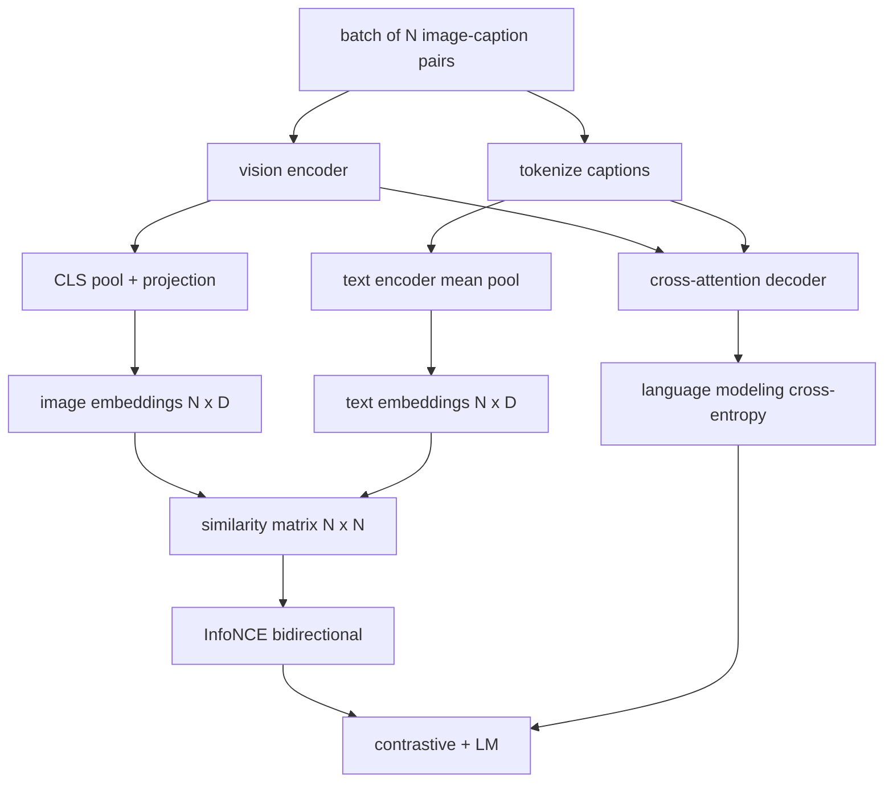

# 视觉语言预训练

> 编码器、投影和码器已接线──现在一起训练他们──两个目标驱动学习:对比图像文本损失(InfoNCE), sẽ phù hợp trong United嵌入空间拉拉在一起,以及语言建模损失, yêu cầu giải mã器 cho mỗi hình ảnh thêm tiêu đề── kết hợp, chúng dạy mạng tìm thấy hình ảnh phù hợp như tiêu đề và cho hình ảnh biên tập tiêu đề──

**Type:** Build
**Languages:** Python
**Prerequisites:** 第19期第30-37课（B轨基础）
**Time:** ~90 分钟

## Học mục tiêu

- Trong một loạt các tiêu đề hình ảnh để thực hiện InfoNCE đối với tổn thất
- Phân tích so sánh tổn thất với tự trở lại ngôn ngữ xây dựng mô hình tổn thất
- 合成 200 đối với bộ ấu hình hình 字幕 语料库, không cần phải tải xuống tập dữ liệu thực sự.
- 运行 50 步演示训练循环并观察损失减少──

## 问题

视觉语言模型需要两项技能――它必须排名: given headline,在众多图像中找到正确图像――它必须生成: given one image, write one headline―― chỉ nhắm vào một kỹ năng để chuẩn bị cho mô hình có thể có được một nửa hệ thống―― CLIP xác định xếp hạng, nhưng không thể cung cấp phụ đề―― GPT-4V có thể thêm phụ đề, nhưng sử dụng một cái nhìn riêng biệt để chuẩn bị―― nhiều mục tiêu chuẩn bị một lần để đạt được hai mục tiêu này――

InfoNCE  chịu trách nhiệm xếp hạng một nửa. Đối với một loạt các đối tượng, mô hình sẽ N 个 phù hợp với các đối tượng như đúng, sẽ `N^2 - N`Không phù hợp với ví dụ tiêu cực, sau đó đối với tạo ra`(N, N)`Sự tương tự của mô hình vận hành giao thông  mất mát. LM 损失处理生成的一半:以图像为条件的标准下一个代码预测.

## 概念



### InfoNCE 在一段话中

Để N 个图像嵌入堆叠为行, sẽ N 个文本嵌入堆叠为行. L2-将两者归结.`N x N`矩阵 `S = I T^T / tau`, trong số đó `tau`là học nhiệt độ. đối với góc line 条目 là phù hợp; không đối với góc line 条目 là âm số. ứng dụng giao thông, mục tiêu.`argmax`沿对角线运行:行 `i` nên ở trong hàng`i`Trong các bài viết có mục tiêu cao nhất.

### Nhiệt độ rất quan trọng

 nhiệt độ `tau`控制 softmax 的峰值程度──太小(例如 `tau = 0.01`(v) và độ cao chỉ xuất phát từ giá trị âm tính khó khăn nhất, tập luyện có tiếng ồn.`tau`作为参数; trình bày ở đây cũng làm điều tương tự.

### 语言建模损失

解码器通过交叉注意力消耗图像内存代币,并预测每个位置的下一个文本代币――损失是与下一个位置目标的标准交叉──填充位置被掩盖在损失之外──

### 合并损失

`total = contrastive + lm_weight * lm`, trong số đó `lm_weight`Đây là một hệ thống đa nhiệm được sử dụng bởi các mô hình kiểu CoCa, BLIP và SigLIP, với trọng lượng khác nhau.

|组件|损失面|影响|
|-----------|--------------|---------|
|信息NCE |联合空间中的配对排名 |编码器+投影+文字头|
| LM |以图像为条件的 token预测 |编码器+投影+解码器 |
|合并|多任务 |全栈|

### Tại sao 50 bước cho một buổi biểu diễn là đủ?

模拟语料库 là một bộ 200 bộ hợp nhất, chứa hình ảnh tự động và ID tiêu đề tự động. Sau 50 bước SGD của khối lượng nhỏ 16 , ngay cả khi giá trị tuyệt đối vẫn ở trên mức mà mô hình dữ liệu thực tế có thể đạt được, hai loại mất mát cũng sẽ giảm rõ ràng. Mục đích của biểu diễn là xác định độ thang độ của đường ống từ đầu đến cuối, và thêm LM  mất mát sẽ không phá vỡ sự ổn định của mục tiêu so với.


```figure
ch-infonce-diagonal
```

##  xây dựng nó

`code/main.py`实现:

- `MultimodalModel`, kết hợp với một ViT 编码器 nhỏ mảng MLP 投影仪, một 编码器 nhỏ bên văn bản 嵌入式 id 上的平均值池) và một 交叉注意解码器 trong bài học thứ 61.
- `info_nce_loss(image_emb, text_emb, temperature)`, 2 chiều CLIP 式 đối với lỗ
- `lm_loss(logits, target_ids, padding_id)`,屏蔽的下一个代码交叉──
- `make_mock_corpus(seed, n_pairs)`, quay lại 200 个确定性 (图像,标题) đối với
-  tập vòng chạy 50 bước, khối lượng lớn là 16,Adam 优化器和学习的对数温度参数── mỗi 5 bước in một lần hai lỗ──

运行 nó:

```bash
python3 code/main.py
```

输出: đối với tổn thất từ khoảng `ln(16) = 2.77`Giảm xuống còn 2,4; LM  mất từ `ln(512) ≈ 6.24`Các bước giảm xuống khoảng 4,7,6 lần đều chứng minh độ kết nối chính xác.

## Sử dụng nó

Đây là một sự khác biệt về thiệt hại:

- **CLIP (2021)。**仅图像-文本对比,具有单独结结编码器字幕探针──
- **CoCa (2022).**Một mô hình trong mô hình văn bản đối với các mô hình tiêu đề LM 损失―― mô hình thực tế của việc xây dựng bài học này――
- **BLIP (2022) 和 BLIP-2.**Đối với LM gia tăng tỷ lệ kết hợp.
- **SigLIP (2023).**Để chuyển đổi InfoNCE thành sigmoid đối với lỗ hổng; cùng một tác dụng đối với khác nhau, hình thức chức năng khác nhau.
- **LLaVA 系列。**两阶段训练, trong đó giai đoạn đầu tiên là đối với LM 结 上的余弦), giai đoạn thứ hai sử dụng LM chưa kết thúc 添加 LM 损失――第60 课对应第一阶段;本课对应第二阶段――

## 测试

`code/test_main.py`涵盖:

- InfoNCE 损失在图像/文本行之间是对称的
- Khi mô hình tương tự là số chính xác lớn hoàn hảo đối với đường góc,InfoNCE  mất mát trở lại 0
- LM mất tích đã được che giấu.
- 模型前向传递产生两种损失且没有错误
- 5 bước vòng tập luyện giảm mất tích hợp

运行它们:

```bash
python3 -m unittest code/test_main.py
```

## 练习

1. Để thay thế InfoNCE thành SigLIP 风格的 sigmoid đối với lỗ hổng, và mô phỏng 语料库上比较收性──

2. thêm các bước khai thác cứng tiêu cực: mỗi tập, chọn các phần khó nhất trong số các tập trước đó không đối đầu với nó sẽ được thêm vào.

3. Trong kết hợp được đặt vào đầu của mình thêm hình ảnh- văn bản phù hợp của các bộ phận thứ hai của mình.

4. Để thay thế bộ nhớ ngôn ngữ tương tự với chuỗi ID tiêu đề được lấy từ chuỗi Markov, các mô hình chuyển đổi của chuỗi Markov được điều kiện cho HACHI.

5. Sử dụng `lm_weight = 0`训练相同的模型, rồi sử dụng `lm_weight = 1`Chuyên luyện lần nữa:                                                                                                                                                                                                                                                            

## 关键术语

|术语 |这意味着什么 |
|------|---------------|
|信息NCE |噪声对比估计：相似度矩阵上的交叉熵 |
|温度|控制对比 softmax 的峰值程度的标量 |
|硬阴性|模型发现的非对角线对令人困惑，但对于采样很有用 |
| LM 损失 |字幕侧的标准下一个token交叉熵 |
|联合嵌入空间|投影后图像和文本向量所在的共享空间 |

## 进一步阅读

- Sử dụng giấy so với nguyên bản của bộ phận.
- CoCa 纸, được sử dụng trong một mô hình để so sánh với chữ cái.
- SigLIP 论文, giới thiệu các nguyên nhân tốt hơn của sigmoid đối với biến thể mất và sự mở rộng của nó.
