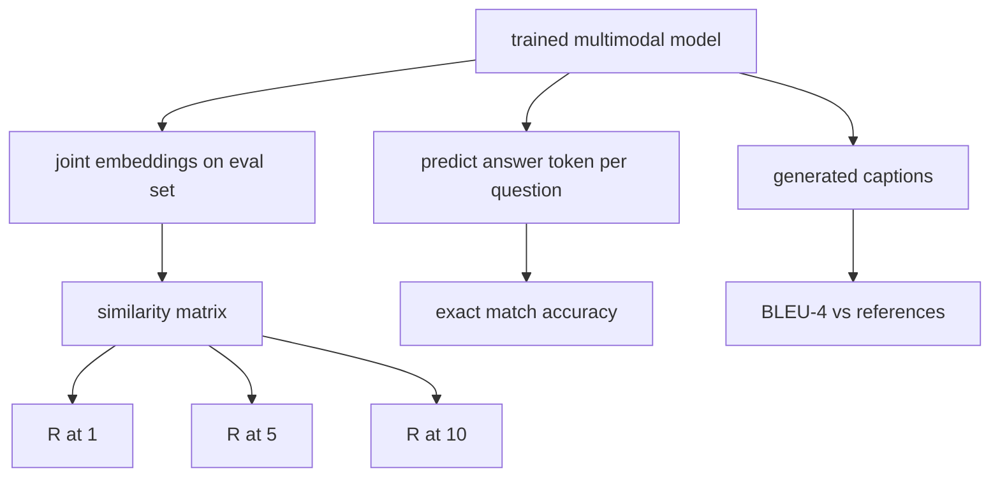

# 多模态评估

> 培训是循环的一半――另一半是测量――本课程从基元构建三个评估表面:图像标题检索报告为R@1、R@5、R@10;视觉问答报告为精确匹配准确度;图像字幕报告为BLEU-4──每个指标都是模型输出函数和在几秒内运行的综合评估套件──

**Type:** Build
**Languages:** Python
**Prerequisites:** 第19期第58-62课（Track E基础：编码器、Transformer、投影、交叉注意力融合、预训练）
**Time:** ~90 分钟

## Học mục tiêu

- 根据图像和标题嵌入之间的相似性矩阵计算 Recall@K。
- 根据将将(图像、问题) 根据映射到固定答案词汇的模型计算精确匹配的 VQA 准确度──
- Từ tạo và liên quan hệ thống mã thông báo được tính toán BLEU-4, không cần bất kỳ thư viện bên ngoài nào.
- 针对构建在第62课训练模型之上综合套件运行所有三个评估.

## 问题

Khi mất tập tập tập luyện xu hướng ổn định, chúng ta có thể tuyên bố mô hình đa mô hình đã hoàn thành. Mức độ mất tập luyện phù hợp với phân bố tập luyện; nó không thể đo lường liệu mô hình có thể xếp hạng đối với các nhóm dự trữ, trả lời câu hỏi hoặc viết các tiêu đề được chấp nhận bởi con người.

- **检索（R@1，R@5，R@10）。**Để hỏi tiêu đề xây dựng kết hợp nhúng; xếp hạng theo các chuỗi cho mỗi hình ảnh trong hồ đánh giá; báo cáo phù hợp hình ảnh có nằm trong hình thức trước 1、 trước 5、 trước 10 名── đối称(图像到文本) cùng cách vận hành.
- **视觉问答（完全匹配）。**给定(图像,问题),模型输出一个答案token──精确匹配是每个样本一个:预测答案是否等于参考答案?评估集的平均值──
- **字幕 (BLEU-4)。**生成字幕──根据参考标题计算 1 克到 4 克精度的几何平均值,并牺牲简洁性──多重参考是标准形式(一张图像,多个参考标题)。

Mỗi thước đo là một hàm mỏng. Chương trình này sẽ xây dựng tất cả chúng bằng mã, vì vậy toán học là cụ thể, và bề mặt vẫn nằm dưới sự kiểm soát của bạn.

## 概念



### Từ sự tương tự trong mô hình

 xây dựng hình ảnh và tiêu đề `(N, N)`余弦相似度矩阵── đối với mỗi dòng, theo sự tương đồng giảm序列 để sắp xếp. Recall@K là số phân số của các đường thẳng trong các vị trí trước K.

### VQA 精确匹配

Đối với mỗi hình ảnh, câu hỏi, câu trả lời), mã hóa hình ảnh, đặt câu hỏi, kết hợp thông qua máy giải mã, và đọc một biểu tượng tiếp theo. Để so sánh ID token dự đoán với ID tham khảo; nếu tương tự là đúng.

### BLEU-4

```text
BLEU-4 = BP * exp(mean(log p1, log p2, log p3, log p4))
```

Trong số đó `p_n`là n n 元语法精度 sau khi sửa đổi ((n số lượng cắt n 元语法 được tạo ra trong bất kỳ tài liệu tham khảo nào, trừ tổng số n 元语法 được tạo ra),`BP`Đó là một hình phạt đơn giản:

```text
BP = 1                if generated length > reference length
   = exp(1 - r/g)     otherwise, where r is reference length and g is generated
```

 Đối với một số `p_n`Đối với bất kỳ số零, phân tử và phân tử cộng 1), đây là giá trị mặc định an toàn nhất của hệ thống số thấp.

### 综合评估套件

Một bộ đánh giá 50 mẫu được xây dựng trong bộ nhớ dựa trên mô hình bộ nhớ ngôn ngữ tương tự được sử dụng trong bài học 62 và có chứa các giống được giữ lại.

- `pairs`:50 个 (图像,caption_ids) đối với các mục tiêu
- `vqa`:50 个(图像、问题 ID、答案 ID) 三元组──
- `caps`:50 个(图像, reference_caption_ids,...])条目, mỗi图像最多 3 个引用。

Bộ này được xác định từ hạt và được giữ lại trong bộ bưu trữ các ngôn ngữ đào tạo, do đó chỉ số là dựa trên mô hình chưa từng thấy dữ liệu tính toán.

|指标|范围 |随机基线 (N=50) |
|--------|-------|------------------------|
| R@1 | 0 到 1 | 0.02（1/N）|
| R@5 | 0 到 1 | 0.10 |
| R@10 | 0 到 1 | 0.20 |
| VQA EM | 0 到 1 | 1 / 词汇 |
| BLEU-4 | 0 到 1 |小但非零 |

Đối với 50 bước đào tạo hoạt động trên dữ liệu tổng hợp, chỉ số dự đoán sẽ không cao lắm; chúng dự đoán cao hơn so với đường cơ sở tùy chọn, đó là nội dung của kiểm tra demo.


```figure
ch-recall-window
```

##  xây dựng nó

`code/main.py`实现:

- `recall_at_k(sim_matrix, k)`, quay lại hai hướng `[0, 1]`Số điểm trung bình:
- `vqa_exact_match(predictions, references)`, quay lại`int`Giá trị trung bình tương tự.
- `bleu4(generated, references, smoothing=True)`, có nhiều sự ủng hộ liên quan.
- `build_eval_suite(seed, n_samples, vocab_size, max_len)`, quay lại danh sách đánh giá xác định
- `evaluate(model, suite)`, nó chạy tất cả ba chỉ số và quay lại .`dict`Số chữ:
- Một bài thuyết trình, tải các mô hình đa mô hình mới bắt đầu trong lớp 62 , đánh giá nó, sau đó thực hiện 50 bước tập luyện và đánh giá lại, in trước / sau chỉ số.

运行 nó:

```bash
python3 code/main.py
```

输出: trước/ sau biểu đồ đo hiển thị kiểm tra từ gần随机 đến mô hình học tín hiệu cải tiến, VQA  cải tiến cao hơn随机, BLEU-4  cải tiến(sự cấu trúc đủ để đạt được 4 克 độ chính xác nâng cao)

## Sử dụng nó

Mỗi chỉ số được trực tiếp chiếu vào cơ sở sản xuất:

- **检索。**MS-COCO 5K val、Flickr30K、ImageNet 零样本都是同一相似性矩阵上的R@K 问题──将合成 eval 替换为真文件,函数签名保持不变──
- **VQA。**VQA v2、GQA、OK-VQA sử dụng hình dạng phù hợp chính xác giống nhau, sử dụng soft-acc thay vì đơn trả lời EM của VQA v2).
- **BLEU-4.**MS-COCO 字幕、NoCaps、Flickr30K 字幕均使用BLEU-4加 CIDER 和 METEOR──添加 CIDER 是另一项功能──

Đối với thực tế chuẩn bị thử nghiệm, xin hãy`build_eval_suite`替换为真正的加载程序并保留函数体──数学与基准无关──

## 测试

`code/test_main.py`涵盖:

-recall@k trong hoàn hảo tình trạng tương tự矩阵 trở lại 1.0, trong翻转矩阵 trở lại 0.0 ((k < N)
-call@k 尊重 `k <= N`Ưu điểm
- Khi được tạo ra màu xanh dương4  hoàn toàn bằng với chỉ số 1,0, trả về 1.0
- bleu4 在不相交词汇上 回复 0.0
- vqa  chính xác phù hợp bằng với tương đương với số phân tử
- build_eval_suite  trả lại dự kiến đối số, vqa 项 và tiêu đề

运行它们:

```bash
python3 -m unittest code/test_main.py
```

## 练习

1. CIDER được sử dụng trên n-gram để tăng quyền TF-IDF, điều này sẽ mang lại những dấu hiệu phong phú cho thông tin.

2. 实施软精度 VQA: Mỗi câu hỏi có nhiều câu trả lời cá nhân, nếu có phù hợp, độ chính xác là `min(human_count / 3, 1)`❖复制 VQA v2──

3. 添加 `bleu4`Các biến thể an toàn của NaN, có thể xử lý không gian chuỗi sản xuất mà không bị phá vỡ.

4. Với R@K một khởi đầu tính toán trung bình số lượt xếp hạng (MRR) ―― MRR rất nhạy cảm với vị trí bên ngoài của K ở trên đỉnh của dự án chính xác; R@K rất nhạy cảm với việc R@K có bị rơi trước K không──

5. Trong quá trình đào tạo, 5 điểm kiểm tra đánh giá vận hành mô hình (steps 0、10、20、30、40、50) và vẽ đường học tập.

## 关键术语

|术语 |这意味着什么 |
|------|---------------|
| R@K |正确匹配出现在前 K 个结果中的查询比例 |
|精确匹配 |最简单的VQA评分：预测答案等于参考|
| BLEU-4 | 1 到 4 克精度的几何平均值，带有简洁性代价 |
|多参考|字幕指标接受每个图像的多个参考字幕 |
|保留 |评估集是从与训练语料库不相交的种子中采样的 |

## 进一步阅读

- Sử dụng các công thức chính xác và dữ liệu thống kê của VQA v2 论文.
- Sử dụng TF-IDF 加权 n-gram 字幕的 CIDEr 论文──
- BLEU 原始版本(Papineni 等人,2002) được sử dụng để làm biến thể bình thường.
- Sử dụng quy định để tham khảo thực hiện MS-COCO 字幕评估脚本.
