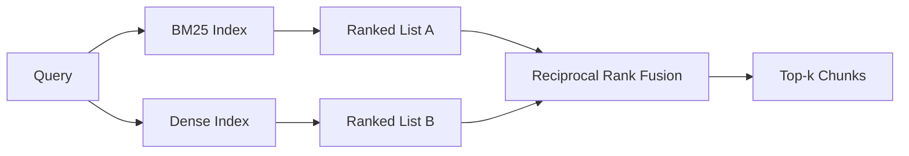

# BM25 và tích hợp tích hợp hỗn hợp

> 词汇和语义检索 trong phân bố truy vấn ngược lại thất bại.

**Type:** Build
**Languages:** Python
**Prerequisites:** 第 11 阶段课程 04（嵌入）、06（RAG）；第 19 阶段 Track B 基础（第 20-29 课）；第 19 阶段第 64 课（分块策略）
**Time:** ~90 分钟

## Học mục tiêu
- Theo Robertson và Spark Jones, từ đầu bắt đầu thực hiện BM25, có phần tử gia hạn, quy định độ tài liệu và có thể điều chỉnh k1 và b.
- Trong xác định mô hình được xây dựng trên các bộ viếng thăm mật thiết, để vòng quay hoạt động trên mạng.
- 完全按照 Cormack、Clarke 和 Buettcher, như đã được công bố trong năm 2009,实现倒数等级融合,并解释为什么它占据分数加权插值的主导地位.
- 调整 RRF k 常数和每种模态权重, và trong bộ máy nhỏ 语料库上读取权衡──

## 问题

Khi truy vấn mang theo các từ ngữ chứa từng chữ trong đó có các chữ ký ấu hiệu, từ ngữ tìm kiếm giành chiến thắng.`AbortMultipartOnFail`Các truy vấn sẽ được trả về đúng hàm Go bằng BM25 theo microsecond. Các truy vấn được đặt trong cùng một hàm nằm ở biên giới của ba tính tương tự, và bộ truy vấn mật sẽ xếp hạng các file sai ở vị trí đầu tiên.

Khi truy vấn được giải thích là từ từ từ từ trong thư viện, tìm kiếm mật sẽ giành chiến thắng. Người dùng hỏi: Làm thế nào để xử lý việc xóa bỏ từ từ từ từ từ từ từ từ từ từ không bao giờ nhập vào từ từ bỏ hoặc từ từ nhiều phần. BM25 trả lại từ từ từ từ từ từ từ từ từ từ từ từ từ từ từ từ từ từ từ từ từ từ từ từ từ từ từ từ từ từ từ từ từ từ từ từ từ từ từ từ từ từ từ từ từ từ từ từ từ từ từ từ từ từ từ từ từ từ từ từ từ từ từ từ từ từ từ từ từ từ từ từ từ từ từ từ từ từ từ từ từ từ từ từ từ từ từ từ từ từ từ từ từ từ từ từ từ từ từ từ từ từ từ từ từ từ từ từ từ từ từ từ từ từ từ từ từ từ từ từ từ từ từ từ từ từ từ từ từ từ từ từ từ từ từ từ từ từ từ từ từ từ từ từ từ từ từ từ từ từ từ từ từ từ từ từ từ từ từ từ từ từ từ từ từ từ từ từ từ từ từ từ từ từ từ từ từ từ từ từ từ từ từ từ từ từ từ từ từ từ từ từ từ từ từ từ từ từ từ từ từ từ từ từ từ từ từ từ từ từ từ từ từ từ từ từ từ từ từ từ từ từ từ từ từ từ từ từ từ từ từ từ từ từ từ từ từ từ từ từ từ từ từ từ từ từ từ từ từ từ từ từ từ từ từ từ từ từ từ từ từ từ từ từ từ từ từ từ từ từ từ từ từ từ từ từ từ từ từ từ từ từ từ từ từ từ từ từ từ từ từ từ từ từ từ từ từ từ từ từ từ từ từ từ từ từ từ từ từ từ từ từ từ từ từ từ từ từ từ từ từ từ từ từ từ từ từ từ từ từ từ từ từ từ từ từ từ từ từ từ từ từ từ từ từ từ từ từ từ từ từ từ từ từ từ từ từ từ từ từ từ từ từ từ từ từ từ từ từ từ từ từ từ từ từ từ từ từ từ từ từ từ từ từ từ từ từ từ từ từ từ từ từ từ từ từ từ từ từ từ từ từ từ từ từ từ từ từ từ từ từ từ từ từ từ từ từ từ từ từ từ từ từ từ từ từ từ từ từ từ từ từ từ từ từ từ từ từ từ từ từ từ từ từ từ từ

Sự lựa chọn giữa hai loại không phải là một phần không thay đổi. Phân bố phân bố là biến thể.

## 概念



### BM25 一段话

BM25 thông qua các yêu cầu về thuật ngữ truy vấn, sẽ nhân nhân nhân nhân nhân nhân nhân bao gồm độ dài của sự thống nhất chính xác của các  và các yếu tố tần suất thuật ngữ, để đánh giá các hồ sơ truy vấn.`k1`Control词频和度;默认值 1.5 là đề xuất đã được xuất bản, bạn không nên di chuyển nó trong tình huống không có cơ sở.`b`控制文档长度的重要性;默认值 0.75 表示较长文档会受到惩罚,但不是线性──

IDF 公式使用平滑的 Robertson 和 Spark Jones 定义,即 `log((N - df + 0.5) / (df + 0.5) + 1)`◊ Khi một thuật ngữ xuất hiện trong hơn một nửa bộ nhớ ngôn ngữ, việc gia tăng trong日志 sẽ giúp IDF giữ giá trị chính xác.

字段加权可让你告诉 BM25, sự phù hợp trên tên mã là quan trọng hơn so với sự phù hợp trong văn bản chính xác.

### Một đoạn trong quá trình kiểm tra mật

Sử dụng mô hình nhúng sẽ nhúng mỗi khối vào trong chiều dài cố định. Trong truy vấn, nhúng truy vấn, dựa trên sự tương đồng, mỗi khối được xếp hạng các chuỗi dư, và trở lại trước k 个. mô hình là quyết định chất lượng biến đổi.

Chương trình này sử dụng độ tích hợp dựa trên tính xác định của hash, vì vậy bạn không cần phải sử dụng mạng để đọc được kết hợp toán học.

### 倒数秩融合, đã công bố公式

两个排名榜―― đối với mỗi ứng cử viên xuất hiện trong danh sách, sẽ có số lượng đóng góp xếp hạng của mình`1 / (k + rank)`,k bằng 60 như là giá trị mặc định.

Công bố số lượng thường k = 60 không là tùy ý. Khi k = 60 时, xếp hạng 1 đóng góp là 1/61, xếp hạng 10 đóng góp là 1/70 ⋅ đóng góp suy giảm chậm, do đó, ứng cử viên sâu sắc vẫn bỏ phiếu.

Chúng ta có hai điều chỉnh trong thực hiện.`k`常数── trọng lượng của mỗi mô hình, vì vậy khi bạn có bằng chứng trước đó cho thấy một trong số đó tốt hơn trong bộ bưu trữ ngôn ngữ của bạn, bạn có thể nâng cao BM25 hoặc mật độ── sẽ đóng góp xếp hạng nhân trọng lượng là nguyên tắc đơn giản nhất để thực hiện; nó giữ được hình dạng giảm cấp và giữ được không có tiêu chuẩn──

### Tại sao sự kết hợp tốt hơn so với phần tử cộng quyền nhập giá trị

BM25 phân tử không bị giới hạn và phụ thuộc vào các nguồn thu.`alpha * bm25 + (1 - alpha) * cosine`需要每语料库 alpha 调整,并且每次重新索引时都会中断. Không phải vậy, dựa trên sự kết hợp cấp bậc. Hai cấp độ có tính tương đương trong các mô hình khác nhau. Kể từ năm 2010, các tuyến RRF được phát hành trên mỗi kênh TREC công cộng đã đánh bại số lượng phân tích.


```figure
rrf-fusion
```

##  xây dựng nó

`code/main.py`实现:

- `tokenize(text)`- 快速正则表达式代码器──
- `BM25Index`- cổ quyền,带有 `add`和 `search`Và có thể điều chỉnh k1,b¬
- `mock_embed``DenseIndex`- Nhập vào cùng một xác định như bài học 64 , do đó khối có tính tương đương.
- `rrf(rankings, k, weights)`- 已发布多模态权重融合──
- `HybridRetriever`- 结合了BM25和密集──
- Một buổi biểu diễn.`main()`, tải một bộ nhớ nhỏ 语料库, chạy 3 đặc biệt cho thấy các điểm tốt của mỗi máy kiểm tra, và in ấn từng mô hình tạo ra xếp hạng và kết hợp danh sách:.

运行 nó:

```bash
python3 code/main.py
```

并排读演示输出──文字标识符查询位于 BM25 排名 1、密集排名 4、RRF 排名 1──释义查询位于 BM25 排名 6、密集排名 1、RRF 排名 1──模糊查询位于 BM25 排名 3、密集排名 3、RRF 排名 1──它 nằm trong mỗi phân loại truy vấn trên hệ thống chiến thắng──

## 调整旋

|旋钮|默认|何时调高|何时调低|
|------|---------|----------------|------------------|
| BM25 k1 | 1.5 |文档中的术语会重复，且你希望频率更重要 |文档很短，术语重复主要是噪音 |
| BM25 b | 0.75 |长文档确实每个词携带的信息更少 |文档长度与主题无关 |
| RRF k | 60 |较深排名的候选仍应投票 |Top-1 应该占主导 |
| BM25 weight | 1.0 |语料库包含字面标识符，查询也按字面匹配 |查询多为用户改写 |
| Dense weight | 1.0 |查询多为改写或语义表达 |查询多为字面表达 |

Bằng cách tái sử dụng các công cụ đánh giá của Chương 68 trên các tập hợp truy vấn được giữ lại để điều chỉnh, chứ không phải trực tiếp.

## 演示将隐藏的故障模式

**词汇外token。**IDF của BM25 được tính toán dựa trên bộ phận ngôn ngữ, do đó chỉ có phần đóng góp từ ngữ trong truy vấn là 0.

**停止token统治。**BM25 针对单词the在语料库中产生统一的排名──过索引器中停止token或接受高 IDF 术语自然占主导地位──

**跨模态的内容相同。**Nếu bộ lưu trữ ngôn ngữ của bạn đủ nhỏ, cho đến mức top-1 của BM25 cũng là top-1 dày đặc, RRF sẽ cung cấp cho bạn cùng một top-1 của hàng xóm giống nhau. Đây là hành vi đúng, chứ không phải thất bại, nhưng nó làm cho sự kết hợp trông không thể nhìn thấy. Trong đánh giá, thêm các câu hỏi chống lại tính chất để xác minh kết hợp có thực sự hiệu quả không.

## Sử dụng nó

生产模式:

- 索引 BM25 正在处理中;瓶是词频字典,而不是向量──
- Trong kho riêng biệt chỉ số khối lượng 
- Và hành trình hai câu hỏi; sự kết hợp là sự kết hợp thời gian cố định đối với tập hợp.
- Giữ mỗi kiểm tra cho đến thời điểm đó, để người theo dõi có thể xem những hình thức nào ủng hộ nó.

## 发货

Chương 66  Học tập sử dụng kết hợp trên cùng trong lớp này và sử dụng bộ lập trình giao thông tái xếp hạng. Chương 68  Học tập sử dụng độ chính xác, tỷ lệ triệu hồi, MRR và nDCG đánh giá toàn bộ quy trình.

## 练习

1. sẽ`mock_embed`替代为供应商提供的真实模型──重新运行演示并报告 只有密集排名在释义查询上的变化──
2. 添加第三种模式: đơn độc chỉ dẫn của khối trích并融合为第三排名列表──量增益──
3. Để xem RRF k 扫 qua 10、30、60、100、200── vẽ k 值 ở điểm đỉnh của đường cong trong lớp 68.
4. Thực hiện chính xác BM25F (trong mỗi đoạn dài được tiêu chuẩn hóa thay vì kỹ thuật số nhân) và so sánh trên bộ phận ngôn ngữ quan trọng nhất phù hợp với các mã.

## 关键术语

|术语 |人们怎么说|它实际上意味着什么 |
|------|-----------------|------------------------|
| BM25 | “词汇搜索” | idf x 饱和 tf x 长度归一化的概率排名 |
|参考文献 | “等级融合”|各个排名列表的 1 / (k + 排名) 之和； k = 60 默认 |
| k1 | “TF 饱和度” |控制重复术语停止添加更多分数的速度 |
|乙| “长度惩罚” | 0 表示忽略文档长度，1 表示完全标准化 |
|场加权 | “符号提升”|在索引期间重复token以增强该字段中的匹配|
|基于排名与基于分数的融合 | “为什么 RRF 优于线性”|不同模式下的排名具有可比性；分数不|

## 进一步阅读

- Cormack、Clarke、Buettcher,倒数排名融合优于孔多塞和个人排名学习方法,SIGIR 2009
- Robertson、Walker、Beaulieu、Gatford、Payne,Okapi tại TREC-3(原始 BM25 论文)
- [Vespa：使用 BM25 和 Embeddings](https://docs.vespa.ai/en/tutorials/hybrid-search.html) tiến hành kiểm tra hỗn hợp
- [Weaviate：混合搜索](https://weaviate.io/developers/weaviate/search/hybrid)
- 第 11 阶段 第 06 课 - RAG 基础知识
- 第19 阶段 第64 课 - 分块器的输出 在此编制索引
- 第19 阶段 第66 课 - 消耗融合的 top-k 的交叉编码器 重排器
