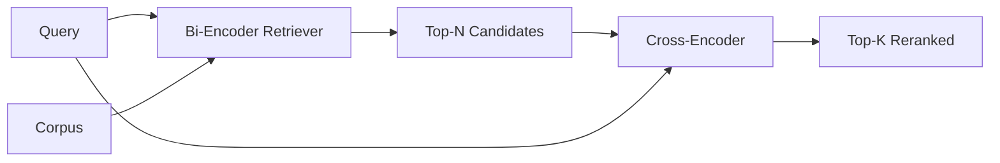

# 交叉编码器 重排序

> 双编码器 độc lập đặt truy vấn và tài liệu. 交叉编码器 sẽ kết nối chúng và cùng lúc đọc. 交叉编码器 là người đọc thông minh nhất, cũng là người chậm nhất.

**Type:** Build
**Languages:** Python
**Prerequisites:** 第11期第06课（RAG）、第11期第07课（高级RAG）；第 19 阶段 Track B 基础（第 20-29 课）；第 19 阶段第 65 课（混合检索喂养此阶段）
**Time:** ~90 分钟

## Học mục tiêu
- Thông qua các hình dạng nhập, số lượng tham số và mỗi lần truy vấn được phân biệt giữa bộ kiểm tra và bộ kiểm tra qua bộ kiểm tra.
- Từ đầu 实现 một bộ lập trình giao thông nhỏ như một khối Transformer, nó tiêu tốn nhiều hơn một loạt các truy vấn và phát hành một số lượng liên quan.
- 连接两阶段检索然后重新排序管道: sử dụng giá rẻ检索器检索前 N, sử dụng交叉编码器将 N 重新排序为前 K, quay lại K。
- Trong bộ phận nhỏ, các bộ phận phụ trách phân tích cũng có thể đo lường độ trì hoãn và chất lượng, và chọn đúng số lượng ngân sách trì hoãn cho một số ngân sách.

## 问题

双编码器 sẽ truy vấn và thư mục được hiển thị vào cùng một không gian khối lượng và xếp hạng theo chuỗi còn lại. Cả hai loại mã hóa này sẽ không bao giờ nhìn thấy nhau. mô hình này phải nén tất cả nội dung hữu ích trong thư mục thành một khối lượng đơn, không xem xét truy vấn. Đây là cách nhanh chóng để chỉ dẫn mỗi tài liệu một lần nhúng, mỗi truy vấn một lần nhúng và đây là cách duy nhất để xếp hạng trên quy mô thư viện ngôn ngữ.

代价就是精度── hai tài liệu có cùng chủ đề toàn diện có thể có gần như cùng một nhúng, ngay cả khi một trong số họ trả lời câu hỏi và một trong hai lập trình viên không thể phân biệt chúng──

交叉编码器通过一起读取查询和文件来解决这个问题――该模型接收`[query] [SEP] [document]`Như một chuỗi đơn lẻ, trong toàn bộ kết nối chạy đầy đủ sự chú ý, và tạo ra một liên quan tiêu chuẩn lượng. Mỗi token trong hồ sơ có thể tham gia vào mỗi token của truy vấn. mô hình dựa trên toàn bộ trên dưới đây để quyết định số lượng.

成本就是吞吐量. Trong trường hợp hai bộ lập trình được đặt vào một lần và liên tục truy vấn, mỗi bộ lập trình giao thông (交叉编码器) được chạy một lần. Đối với một bộ lưu trữ ngôn ngữ chứa 1000.000 tài liệu, mỗi truy vấn cần phải được chuyển tiếp 1000.000 lần.

解决方案是分阶段――使用双编码器检索前 N 个――使用双编码器将 N 重新排序为 top-K―― N 很小(50到200),交叉编码器质量提升集中在重要的地方――总延迟保持在请求预算内――总质量是交叉编码器质量,其上限是双编码器在N处召回率――

## 概念



### 交叉编码器的输入形状

标准包装为`[CLS] query_tokens [SEP] document_tokens [SEP]`◊ CLS  vị trí đầu ra được  gửi đến đầu tựa đơn của các mô hình liên quan đến đầu ra.

22M tham số交叉编码器( đã được phát hành`ms-marco-MiniLM-L-6-v2`(trong các mô hình khác nhau, các mô hình có thể được phân tích bằng các mô hình khác nhau, như các mô hình có thể được phân tích bằng các mô hình khác nhau.`bge-reranker-v2-m3`(v) lưu giữ cho việc xếp hạng lại hoặc xếp hạng lại trang đầu của K 较小的首页.

### Tại sao bài tập này là tập cho trẻ em?

Trong quá trình sản xuất, bạn tải lên một điểm kiểm tra và chạy nó. Trong khóa học này, mục tiêu của chúng tôi là cho bạn thấy hình dạng của mô hình và hình dạng của đường cong chất lượng chậm, chứ không phải là tập luyện các bộ sắp xếp tiên tiến nhất. Vì vậy, chúng tôi xây dựng một bộ nhỏ.`nn.Module`, trong đó có một khối Transformer, nhiều đầu tập trung (được mặc định là 4 đầu) và một đầu quay lại. Nó được khởi tạo từ hạt xác định, do đó biểu diễn có thể được tái tạo, không cần trọng lượng trên đĩa.

玩具模型从固定语料库学习正确形状:相关查询-文档对不相关对具有更高预测分数――端到端管对双编码器输出进行重新排序,并重新排序的顶-k与黄金标签相关――

### 延迟与质量

两阶段管道有一个可调参数:N. 在保留的查询集上将N từ 5 扫描到100,即可得到曲线.

|N |第 2 阶段的 recall@1 |每个查询的交叉编码器前向传递 |延迟 |
|---|--------------------|---------------------------------------|---------|
| 5 | 0.62 | 0.62 5 |低|
| 20 | 0.81 | 0.81 20 |中等|
| 50 | 50 0.86 | 0.86 50 | 50高|
| 100 | 100 0.86 | 0.86 100 | 100非常高|

Số trên chỉ là mô tả hình dạng, chứ không phải giá trị đo của bộ hình đó. hình dạng là thực.

Từ đường đánh giá chọn N trên dự án chậm trễ. Cụ thể lập trình không thể nâng cao tỷ lệ gọi của N ở mức cao hơn tỷ lệ gọi của bộ lập trình hai lần, do đó, N thấp hạn chế chất lượng, không chỉ là chậm trễ.


```figure
rerank-funnel
```

##  xây dựng nó

`code/main.py`实现:

- `CrossEncoder`- Một cái nhỏ.`torch.nn.Module`:token embed, một khối Transformer có nhiều đầu tập trung và trước, tạo ra một khối trung bình giá trị của một số điểm.
- `tokenize_pair(query, document)`- Đặt hai chữ cái vào một chuỗi ID, loại mã thông báo ID của nó
- `train_tiny(pairs)`- Để làm việc biểu tượng  biến đổi ((phán hỏi, tài liệu, liên quan) ba danh sách thực hiện một lần kiểm tra đào tạo, do đó mô hình có thể tạo ra số lượng hợp lý trên vật cố định.
- `rerank(query, candidates, top_k)`- 生产接口.
- `pipeline(query, retriever, top_n, top_k)`- 两级流――
- 演示 `main()`, từ thứ 65 课的模式加载语料库,检索前 N 个,重新排名到前 K 个,并排打印两个列表,并报告每个阶段的延迟――

运行 nó:

```bash
python3 code/main.py
```

输出显示双编码器的顶-N、交叉编码器的顶-K以及时间序摘要――交叉编码器的调用需要更长时间,但不会运行在完整的语料库――当选择双编码器排名第二或第三的答案时,两阶段总数保持在请求预算范围内――

## 演示将隐藏的故障模式

**交叉编码器不对称。** `rerank(q, d)`和 `rerank(d, q)`Đúng là khác nhau. Đúng là khác nhau.

**N 太低，无法暴露该 bug。**Nếu cài đặt N = K,交叉编码器 không thể sắp xếp lại; nó chỉ có thể được gọi lại重──电梯看起来为零──选择 N 至少三倍 K──

**训练数据泄漏到评估中。**Nếu các bài tập của các mã thông báo được thực hiện với các câu hỏi đánh giá, thì xếp hạng lại trông rất kỳ lạ.

**生产权重很密集。**22M 参数交叉编码器 trong float32 时为 88MB──在承诺低于100毫秒的 p95 之前规划模型服务器的内存──

**批处理很重要。**Trình biên tập giao thông thực sự trong một loạt các ứng cử viên.`_batch_encode`中执行此操作, nó sử dụng `torch.tensor(...)`构建批量 id 和类型 id 张量并运行一次前向传递──跳过批处理,延迟会乘以 N──

## Sử dụng nó

生产模式:

- Việc kết nối hai bộ lập trình, bộ lập trình giao tiếp và N với nhau.
- 通过 (query, document_id) 哈希缓存重排器的输出──稳定语料库上的相同查询会重排成相同顺序;缓存命中可以免费降低延迟──
- 记录排名第 1 的交叉编码器分数──top-1 分数低于语料库特定值的查询是域外命中;让LLM表达我不确定──

## 发货

Chương 68  bài học kết thúc đánh giá 2 giai đoạn này ống dẫn. Chương 69  bài học sẽ kết nối các bộ sạc này với các bộ sạc kết hợp của bài học 65  bài học                                                                                                                                                                                                                                                                                                                                                                                                                                                                                   

## 练习

1. N sẽ được scan từ 5 đến 50,并 vẽ lại các dòng output remember@1― tìm được các điểm trên của các điểm quay.
2. Để phân phối các bộ lập trình tập luyện 10 thời đại, thay vì 1 ⋅ đo khoảng cách số lượng giữa mỗi thời gian正负对.
3. Sử dụng biểu tượng CLS 头替换平均值池──比较该 fixture 的收性──
4. Thêm một đầu biên tập giao tiếp thứ hai, được sử dụng để dự đoán liệu câu trả lời trong tài liệu có phải vậy không.
5. sẽ thay thế định tính mô hình bộ lập trình hai lần vào bộ lập trình hai lần trong lớp 65 , và sẽ kết nối hai giai đoạn.

## 关键术语

|术语 |人们怎么说|它实际上意味着什么 |
|------|-----------------|------------------------|
|双编码器 | “矢量检索器” |独立编码查询和文档；余弦对它们进行排名 |
|交叉编码器 | “重排” |联合编码(query, doc)；输出一个相关标量 |
|两级管道 | “检索并重排” |便宜的检索器返回 N，昂贵的重排器保留 K |
| N（候选预算）| “重新排列池” |每个查询交叉编码器得分的候选者数量 |
|平均池头 | “最后隐藏的平均值” |将编码器的最后一层输出平均为一个向量 |

## 进一步阅读

- Nogueira, Cho,Passage Re-ranking với BERT,2019 年 - 规范的交叉编码器排名论文
- Reimers, Gurevych,Sentence-BERT: sử dụng tiếng Siamese BERT 网络的句子嵌入,2019 年 - 关于双编码器与交叉编码器
- [SentenceTransformers 交叉编码器文档](https://www.sbert.net/examples/applications/cross-encoder/README.html)
- [BGE Reranker v2 模型卡](https://huggingface.co/BAAI/bge-reranker-v2-m3)
- 第19 阶段 第65 课 - 混合检索器养此重新排序阶段
- Chương 68: Đánh giá sự tăng trưởng từ việc tái xếp hạng
