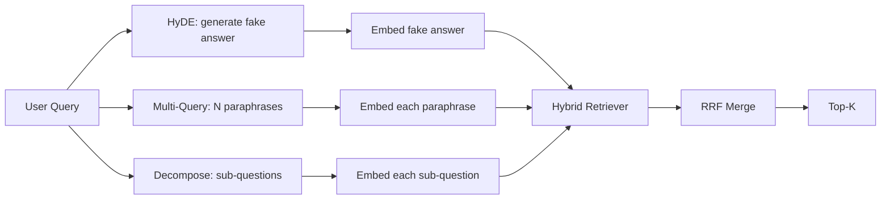

# 查询重写:HyDE、多查询和分解

> Các truy vấn nhập của người dùng không phải là truy vấn mà trình duyệt của bạn muốn. Việc viết lại đã bù đắp khoảng cách trước khi truy vấn, do đó nội dung được chỉ mục nhìn thấy gần hơn với câu trả lời.

**Type:** Build
**Languages:** Python
**Prerequisites:** 第 11 阶段课程 04（嵌入）、06（RAG）；第 19 阶段 Track B 基础（第 20-29 课）；第 19 阶段第 64 和 65 课
**Time:** ~90 分钟

## Học mục tiêu
- 实现假设文档嵌入 (HyDE): tạo một phả lời giả, đặt nó, dựa trên khối lượng đó thay vì khối lượng truy vấn để kiểm tra.
- 实现多查询扩展: sẽ viết lại một câu hỏi thành N个释义, từng câu hỏi, thông qua số lượng xếp hạng tụ tụng hợp并并集──
- 实现查询分解:将复杂问题分为子问题,按子问题检索,合并――
- So sánh 3 người viết lại trong một cuộc thi,并 giải thích mỗi chiến lược khi nào giành chiến thắng.
-  kết nối một mô hình LLM, tạo ra sản lượng cố định, để tái viết vòng quay trên mạng

## 问题

Người dùng nhập khi truyền tải thất bại và ngân sách hết, nhóm của chúng tôi sẽ làm gì?── một tài liệu trong kho lưu trữ nói:AbortMultipartOnFail sẽ ngừng S3 phân đoạn trên truyền tải, và giảm mỗi bucket của ngân sách thử nghiệm khi truyền tải thất bại── truy vấn và tài liệu không có chung tên từ ngắn语──BM25 không có dự định──双编码器 xếp hạng tài liệu ở thứ ba hoặc thứ tư, vì định hướng truy vấn rơi vào khu vực xóa nhiệm vụ  trong không gian nhúng, thay vì khu vực   dừng truyền tải  tài liệu── Nếu câu trả lời đã vào N trước, hai giai đoạn của lớp 66 có thể được xếp lại; nhưng nếu không có N trước, nó sẽ không bao giờ được xem.──

修复方法是在查询触及检索器之前重写查询. 2023年论文 Precise Zero-Shot Dense Retrieval without Relevance Labels(Gao 等人) giới thiệu HyDE: yêu cầu LLM 编写一篇能回答查询的文档,嵌入这个假设文档,并将其嵌入用于检查向量.

两种近亲技术与HyDE相结合――多查询扩展(使用微软的GraphRAG术语) tạo ra các truy vấn của N 个释义并检索每个释义,然后合并――分解(在2024年斯坦福 DSPy 工作中流行为子查询分解) sẽ xảy ra gì khi truyền thất bại và ngân sách hết) nhóm của chúng tôi sẽ làm gì chia thành hai câu hỏi:

Chương trình này sẽ thực hiện ba dự án này, và vận hành chúng theo cùng một bộ phận ngôn ngữ cố định.

## 概念



### HyDE 详细信息

HyDE sử dụng LLM 编写的假设文档向量替换用户的查询向量──提示很短:

```text
You are a domain expert. Write a one-paragraph passage that answers the question
below. Use the same vocabulary and phrasing the documentation in this domain would
use. Do not refuse. Do not say you do not know.

Question: {user_query}

Passage:
```

Câu trả lời của LLM như câu trả lời thực tế là sai, bởi vì LLM không biết tài liệu của bạn. Đó là tốt. Cục thám không quan tâm đến sự chính xác thực tế, chỉ quan tâm đến mã phân phối. giả định đoạn chứa các từ như abort, multipart, bucket, budget, vv, vì những từ này xuất hiện trong các đoạn văn bản thực tế của chủ đề.

Trong quá trình sản xuất, bạn sẽ hạn chế tài liệu giả định của bạn cho hai đến ba câu. giả định dài hơn sẽ thu thập nhiều tiếng ồn hơn.

### 多查询扩展详解

生成用户查询的 N 个释义──最简单的提示:

```text
Rewrite the following question in {N} different ways. Each rewrite must preserve
the original intent. Number them 1 to {N}. Do not add explanations.
```

检索每个释义的顶级k――将 N个排名列表与RRF 合并(与第65 课中的算法相同) ∼廉价、并行、确定性──

Khi từ ngữ của người dùng là một trong nhiều cách đặt câu hỏi hiệu quả như nhau, nhiều truy vấn thắng, và bất kỳ viết lại nào sẽ đưa ra tốt hơn.

### 详细分解

单一检索不能满足多方面的问题――分解要求 LLM 将问题拆成子问题,系统再检索每个子问题――提示:

```text
The following question may require information from multiple distinct topics.
Decompose it into a list of sub-questions. Each sub-question must be answerable
independently. If the question is already atomic, return it unchanged.

Question: {user_query}
```

检索每个子问题――合并―― Đối với các vấn đề bao gồm các từ liên kết、 nhiều từ các câu so sánh hoặc hai chủ đề không liên quan, phân giải là một công cụ chính xác―― công cụ của vấn đề nguyên tử là sai lầm; công việc của máy phân giải là trả lại một vấn đề riêng lẻ, chứ không phải phát minh một vấn đề giả.

### Tại sao ba cái này lại tồn tại?

三者是互补的──HyDE 弥补查询代币与语料库代币之间的差距──多查询覆盖释义方差──分解覆盖多主题查询──生产系统会运行这三种策略,并为每一个查询选择合适策略 ((第 69 课程的端到端系统会展示选器) ⋅

## 模拟 LLM

Chương trình này được tiến hành trực tuyến. Mẫu LLM là một bảng tìm kiếm nhỏ với các truy vấn của người dùng, cũng như các truy vấn chưa được xem sau.

- 对于每一个固定 查询:书面假设段落、三个释义和分解结果──
- 对于未知查询:确定性转换:获取查询的内容词,通过同义词映射对其进行扩展,然后返回结果──

模拟的形状才是重要的,而不是数据. Trong quá trình sản xuất, bạn sẽ thay thế模拟 cho thực tế.


```figure
cd-hyde-vector
```

##  xây dựng nó

`code/main.py`实现:

- `MockLLM`- n định tính thay thế
- `HyDERewriter`- 调用LLM编写假设文档,将重写机输出返回为`RewriteResult`, trong đó bao gồm giả định văn bản và kiểm tra thiết bị nên sử dụng các câu hỏi:.
- `MultiQueryRewriter`- 调用LLM để thực hiệnN个释义, trả lại danh sách truy vấn
- `DecomposeRewriter`- 调用LLM để phân giải, trả lại子问题――
- `retrieve_with_rewriter`- 采用重写器和检索器,运行重写,融合结果──
- Một bài thuyết trình, chạy trên bộ máy viết lại và in ra chiến lược đầu tiên trở lại tài liệu.

重复使用第 65 课中的检索器形状(混合 BM25 + 密集) ⋅融合 vẫn là cùng một RRF──唯一的新形状是重写器接口,它很小──

运行 nó:

```bash
python3 code/main.py
```

输出是每个策略的排名和最终摘要―― HyDE 在措辞不匹配的查询中获胜──多查询在释义方差查询上获胜──分解在多主题查询上获胜──后备方案 (无重写器) 至少在三者中失败──

## 演示将隐藏的故障模式

**HyDE 对语料库特定标识符的幻觉是错误的。**Các mô hình phát minh một hàm tên. bên phải của tài liệu giả định BM25 phân số đã sụp đổ, bởi vì tên phát minh hiện là một mã hiệu trọng lượng cao, không xuất hiện trong chỉ số. giới hạn trong sự kết hợp giả định của chiều dài và trọng lượng BM25 thấp hơn.

**多查询重写全部收敛。**弱模型 sẽ tạo ra ba giải thích gần như giống nhau. N 次检索返回相同的顶-k. RRF 合并不比单检索好.

**分解过度分割。**Các phân giải viên sẽ biến các vấn đề nguyên tử thành danh sách. Tất cả các bài kiểm tra đều trở lại cùng một tài liệu, nhưng xếp hạng giảm.

**延迟成倍增加。**HyDE 需要花费一次LLM 通话费用──多查询花费一次LLM 调用生成 N 次重写,然后生成 N 次检索──分解需要一次LLM 调用分解,然后进行M 次检索──检索并行进行;LLM 电话是发言权──

## Sử dụng nó

生产模式:

- 按查询长度选择每一个查询策略:原子短查询得到多查询,复杂多子句查询得到分解,行话重查询得到HyDE──
- 通过查询哈希缓存重写器输出──许多查询重复──
- Và chạy tất cả ba kết quả tập hợp, và sử dụng RRF sẽ kết hợp ba kết quả tập hợp thành một.

## 发货

Chương 69 sẽ đưa giai đoạn viết lại này đến trình kiểm tra của chương 65 và đặt nó trước trình kiểm tra của chương 66. Chương 68 sẽ đánh giá trình kiểm tra để ghi lại những cải tiến.

## 练习

1. 实现 RAG-Fusion (多查询的 2024年变体), trong đó có sự giải thích của重写器 có ý định đa dạng hóa, sau đó tái xếp hạng bước (第 66 课) chọn danh sách cuối cùng:
2. 添加第四种策略:step-back prompting(向 LLM 问问更一般的问题,检索该问题,然后再缩小范围)
3. Thử nghiệm của các phân tích phân tích là một trong những vấn đề về việc phân tích các nguyên tử.
4. Sử dụng mô hình thực tế để thay thế mô hình LLM.
5. để mỗi lần viết lại thêm phần tử tín nhiệm.

## 关键术语

|术语 |人们怎么说|它实际上意味着什么 |
|------|-----------------|------------------------|
|海德 | “伪造文件检索”| LLM写出答案；嵌入并检索它而不是查询 |
|多查询 | “释义扩展”| N次重写查询；检索N次，按RRF合并|
|分解 | “子查询分割” |多主题查询拆分为子问题，单独检索 |
|原子查询 | “单一主题” |如果不发明假子问题就无法分解 |
|后退一步| “抽象查询”|提出更一般性的问题，检索，然后缩小范围 |

## 进一步阅读

- 高、马、林、Callan,无相关标签的精确零样本密集检索(HyDE),2023
- 微软研究院, 检索的多查询扩展
- 斯坦福大学 DSPy,多跳 QA 的子查询分解
- [LlamaIndex 查询转换文档](https://docs.llamaindex.ai/en/stable/optimizing/advanced_retrieval/query_transformations/)
- 第11 阶段第07 课 - 高级 RAG 模式
- 第19 阶段 第65 课 - 重写器 cung cấp kiểm tra器
- 第19 阶段 第68 课 - 测重写器提升的评估
