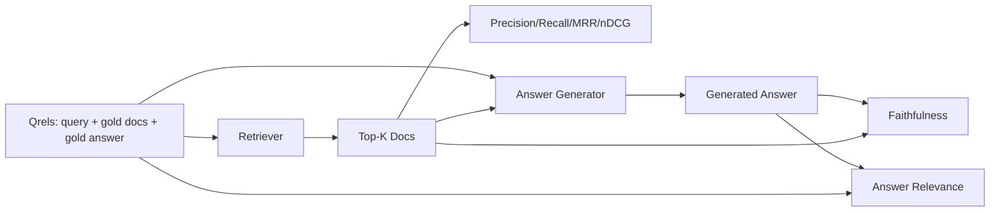

# RAG  đánh giá: xác định tỷ lệ, tỷ lệ triệu hồi, MRR, NDCG, độ trung thành, liên quan đến câu trả lời

> Nếu bạn không thể đánh giá cùng một lúc các truy vấn và câu trả lời, thì không thể vận chuyển hệ thống.

**Type:** Build
**Languages:** Python
**Prerequisites:** 第11期第06课（RAG）、10（评估）；第 19 阶段 Track B 基础（第 20-29 课）；第 19 阶段课程 64, 65, 66, 67
**Time:** ~90 分钟

## Học mục tiêu
- Theo số lượng vàng, tính toán có bốn chỉ số: precision@k、recall@k、MRR(平均倒数排名) và nDCG@k。
- 计算两个答案等级指标: trung thực (trực sự) 
- 构建一个由 eval 端到端读取的固定 qrels文件 (), 查询, 黄金文档 ID, 黄金答案文本)
- 读取 chỉ số giá trị vị trí của đường ống chẩn đoán xảy ra sự cố: kiểm tra, xếp hạng, sản xuất hoặc tiếp nhận.

## 问题

Hệ thống RAG có ít nhất bốn phần hoạt động: phân khối, kiểm tra, sắp xếp lại, tạo ra. Bất kỳ một trong số đó đều có thể dẫn đến câu trả lời sai. Nếu không có chỉ số của mỗi giai đoạn, bạn sẽ bị mù hiện tại.

Người dùng báo cáo lỗi trả lời. Đó là vì phân khối máy cắt trả lời跨度? Đó là vì bộ tìm kiếm không đưa phần vào top-k? Đó là vì bộ xếp hạng chính xác đưa phần vào thứ nhất sau đó? Đó là bởi vì bộ máy tạo bỏ qua phần đó và tạo nội dung? Chỉ với câu trả lời không thể phán xét. Bạn cần:

- Chỉ số kiểm tra, được sử dụng để đánh giá kết quả của máy kiểm tra.
- Các chỉ số được xếp hạng, để đánh giá vị trí của khối chính xác trong chuỗi.
- 忠实地对生成器是否停留在检查到的上下文进行评分──
-  Trình liên quan của câu trả lời với đánh giá đã giải quyết hoàn toàn vấn đề.

Chương trình này được xây dựng trên tất cả sáu chỉ số trên các tài liệu cố định.

## 概念



### 精度@k

Trong các tài liệu trước k 个 được trả về trong bộ truy vấn, tỷ lệ của khối vàng là bao nhiêu? Nếu vàng có 3 tài liệu, và top-3 trả về hai tài liệu trong số đó và một tài liệu sai, thì độ chính xác@3 là 2 / 3。 Khi chi phí của khối truy vấn không liên quan rất cao khi máy phát triển trên nó lãng phí token, hoặc khối đã phá vỡ câu trả lời), xin sử dụng độ chính xác。

### recall@k

Trong tài liệu vàng, top-k chiếm bao nhiêu phần? Nếu vàng có 3 tài liệu, và top-5 chứa tất cả 3 tài liệu này, thì nhớ lại@5 là 1.0。

Trong sản xuất RAG, chỉ số thường được sử dụng là recall@k。 tạo có thể dễ dàng xóa các khối không liên quan; nó không thể phát minh ra các câu trả lời từ các khối chưa từng thấy.

### MRR(平均倒数排名)

Đối với mỗi truy vấn, tìm vị trí của các tài liệu liên quan thứ nhất trong danh sách xếp hạng. Số lượng xếp hạng là 1/ vị trí.

MRR đối với vị trí 1 có trọng lượng rất lớn.

### nDCG@k

标准化贴现累积收益――公式完整为每检索到的文件分配增益 (通常为 1表示相关,0表示不相关),根据位置对数进行折扣,求和,然后除以理想的DCG (如果您排名完美,您将拥有DCG) 范围 0到1――

NDCG 适应分级相关性:黄金可以说文档 A 是 3,文档 B 是 2,文档 C 是 1── MRR 和recall@k 将所有内容平化为二进制──当语料库每个查询有多部分相关文档时,请使用nDCG──

### 忠诚

Đối với mỗi tuyên bố trong câu trả lời được tạo, kiểm tra xem liệu các chỉ số trên có hỗ trợ tuyên bố này hay không.

忠诚 nắm bắt mô hình phát triển nội dung của người tạo lỗi mô hình. Ngay cả khi người kiểm tra trả lại đúng khối, tạo ra ảo giác người tạo cũng sẽ bị hỏng.

Trong khóa học này, thông qua xác định mô hình phán xét để đạt được độ trung thực, đó là phán xét kiểm tra các biểu tượng của mỗi tuyên bố có phải là với giá trị chồng lên trên dưới được kiểm tra. Trong sản xuất, bạn chuyển sang mô hình thực tế.

### 答案相关性

答案是否真的解决问题?忠诚问答案是否基于上下文?──答案相关性问答案是否基于问题?──答案是否基于问题?──答案是否基于问题?──答案是否基于问题?──答案是否基于问题?──答案是否基于忠诚性,但偏离主题的答案是否基于忠诚性,否则相关性方面得分较低──答案简短的、切题的、忽略下文的答案是否相关性高,但其实基于忠诚性得分较低──标准实现也使用M作为判断:

## Thiết bị krel

```python
{
  "qid": "q1",
  "query": "what is the abort threshold for multipart uploads",
  "gold_doc_ids": ["d1", "d3"],
  "gold_answer_substring": "three failed parts",
  "graded_relevance": {"d1": 3, "d3": 2},
}
```

Mỗi câu hỏi mang theo:
- 查询字符串,
- Một nhóm ID tài liệu vàng (được sử dụng cho xác định/ tỷ lệ triệu hồi/MRR),
- 分级相关性字典( đối với nDCG),
- 黄金答案字串( như là lưu trữ dữ liệu tham khảo của mỗi qurel; sự trung thành trong bài học này được tính toán bằng cách dựa trên các câu hỏi trên và không phải là các chuỗi này để phán xét các tuyên bố được rút ra để tính toán)

Trong quá trình sản xuất, bạn có thể thực hiện các sự kiện này. Chương trình này cung cấp một thiết bị xây dựng thủ công, do đó đánh giá có thể được mở hộp ngay lập tức.


```figure
ci-rag-metric-ladder
```

##  xây dựng nó

`code/main.py`实现:

- `precision_at_k(retrieved, gold, k)`- 字面定义──
- `recall_at_k(retrieved, gold, k)`- 字面定义──
- `mean_reciprocal_rank(retrieved_list_of_lists, gold_list)`-  giá trị trung bình của câu hỏi:
- `ndcg_at_k(retrieved, graded_relevance, k)`- DCG / IDCG có lợi thế thứ hai hoặc phân cấp
- `extract_claims(answer)`- Để trả lời chia thành hình chữ chủ đề:
- `faithfulness(claims, context_texts, judge)`- được xác định là một phần của yêu cầu hỗ trợ.
- `answer_relevance(question, answer, judge)`- 判断答案是否解决问题──
- `MockJudge`- Định nghĩa của các giao dịch để đánh giá hoạt động.
- `evaluate_pipeline(pipeline_fn, qrels, ks)`- 运行 mỗi chỉ số của bộ điều phối viên
- 针对 qrel 运行三种管道变体(分块基线、混合检索、混合 + 重新排名)并印标签表的演示──

运行 nó:

```bash
python3 code/main.py
```

输出 hiển thị độ chính xác của từng biến thể trong chỉ số đơn lẻ k、recall@k、MRR、nDCG@k、 độ trung thành và liên quan đến câu trả lời。

## 读取指标来诊断故障

|症状|可能的原因 |修复什么问题 |
|---------|-------------|-------------|
|低召回率@k，低精度@k |分块剪切答案或检索器找不到它 |分块边界（第 64 课）或检索器模态（第 65 课） |
|不错的召回率@k，低 MRR |右块位于 top-k 中但不在位置 1 |重新排序（第 66 课）|
|高MRR，低忠诚度|尽管上下文正确，生成器仍然发明内容 |生成提示；强制引用或拒绝 |
|忠诚度高，相关性低 |答案有根据但偏离主题 |查询重写器（第 67 课）或生成提示 |
|均四高，用户仍抱怨|评估集不具有代表性 |使用真实用户查询扩展 qrels |

## 演示将隐藏的故障模式

**LLM-as-judge 偏差。**Khi mô hình đánh giá bản thân, thường sẽ cho rằng nó trung thực hơn tình huống thực tế.

**Qrel 腐烂。**随着 sự thay đổi của cơ sở dữ liệu, câu trả lời vàng cũng sẽ thay đổi. Ước tính của quý 1 tháng 1 năm 2024 không còn là câu trả lời chính xác nữa vào tháng 10 năm 2024, vì nhóm đã đổi tên chức năng này.

**忠诚度微观检查错过了宏观声明。**Sự trung thành của mỗi câu có thể được thông qua, trong khi cấu trúc của câu trả lời tổng thể sẽ tạo ra sai lầm.

**Recall@k 掩盖了每个查询的失败。**Tỷ lệ trung bình quay lại 90% có thể ẩn một câu hỏi loại luôn là tình huống bị mất đi.

## Sử dụng nó

生产模式:

- Đối với mỗi kiểm tra hoặc máy phát triển thay đổi hoạt động đánh giá.
- Bảo trì mỗi truy vấn chỉ số theo dõi. Khi người dùng phàn nàn, tìm kiếm các quẹt phù hợp, xem nó sẽ bị bắt hay không.
- Đối với các nhóm: 20 tập hợp thuốc trong các tổ chức CI; 200 tập hợp thu hồi trong mỗi đêm; 2000 tập hợp sâu trong mỗi tuần.

## 发货

Chương 69 课连接整个管道 ((分块器、检索器、重排器、生成器),并针对端到端系统运行此评估──

## 练习

1. 添加第五个检索指标:hit-rate@k。将其与recall@k 进行比较──当它们不同时进行解释──
2. 实行分级忠诚度:0(不支持) 、1(部分支持) 、2(完全支持) ∼相应地更新标标──
3. Sử dụng mô hình thực tế để thay thế mô hình để phán xét.
4. 添加查询类片(字面、释义、多主题) 报告──每片标点──
5. 添加答案长度标标并将其与忠诚相关联──绘曲线──

## 关键术语

|术语 |人们怎么说|它实际上意味着什么 |
|------|-----------------|------------------------|
|精度@k | “命中率超过检索” | top-k 中黄金的比例 |
|recall@k | “命中了 gold 吗”| top-k 中包含 gold chunk 的比例 |
| MRR | “第一击位置”| 1 的平均值/第一个相关文档的排名 |
| nDCG@k | “分级排名质量”| top-k 上的 DCG 除以理想 DCG |
|诚信| “接地气” |检索到的上下文支持的答案声明的比例 |
|答案相关性 | “它解决了这个问题吗？” |答案是否符合问题的意图 |
|问题 | “金标”|带标签的查询集及其黄金文档和答案 |

## 进一步阅读

- Buckley, Voorhees, đánh giá đánh giá đo độ ổn định,SIGIR 2000 - 关于排名指标的规范论文
- Jarvelin、Kekalainen,IR 技术的基于累积增益的评估 - nDCG 论文
- [Ragas：RAG 管道的自动评估](https://docs.ragas.io)
- [人择，评估 RAG](https://www.anthropic.com/news/evaluating-rag)
- 第11 阶段 第10 课 - 评估框架基础
- 第 19 阶段课程 64-67 - 处评估组件
- Chương 69 - Chương trình đánh giá đánh giá kết thúc
