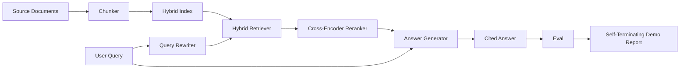

# 端到端 RAG 系统

> 组件的六课――一个管道――一个评估循环――一个自动终止的演示――这是您交付的系统――

**Type:** Build
**Languages:** Python
**Prerequisites:** 第11期第06课（RAG）、10（评估）；第 19 阶段 Track B 基础（第 20-29 课）；第 19 阶段课程 64, 65, 66, 67, 68
**Time:** ~90 分钟

## Học mục tiêu
- Để phân chia khối máy, hỗn hợp kiểm tra máy, truy vấn viết lại máy, qua lập trình máy xếp lại máy và máy tạo câu trả lời tập hợp một đầu vào đầu ống.
- 实现一个答案生成器,通过块点引用其声明,并具有低信任拒绝回归功能──
-  đánh giá các hoạt động ống tốt được lắp ráp, và chứng minh các giai đoạn xây dựng trên mỗi chỉ số đều tốt hơn các thành phần riêng lẻ tương tự.
- Xây dựng một trình bày CLI tự động kết thúc, trình bày sẽ thu thập bộ nhớ ngôn ngữ cố định, chạy bộ truy vấn cố định, và đưa ra báo cáo tóm tắt.

## 问题

6 thành phần riêng biệt không thể chứng minh gì. Bộ phân khối có thể được xếp hạng trong recall@5 trên chiến thắng trong thu, nhưng không thành công trong recall@5 trên hệ thống, vì bộ phân tích không thể xếp hạng được nội dung của bộ phân khối. Bộ phân phối có thể nâng cao MRR trên hồ sơ ứng cử viên tổng hợp, nhưng không thể xử lý được ứng cử viên bộ phân lập thực sự, vì tỷ lệ triệu hồi của bộ phân lập dưới ngân sách phân phối thấp.

Thử nghiệm tích hợp là toàn bộ ống dẫn đối với cùng một thiết bị rắn ròng chạy từ đầu đến cuối, có cùng một chỉ số, và sử dụng một tệp sắp xếp sẽ kết nối tất cả nội dung với nhau. Đó là nội dung của bài học này. Nếu chỉ số của ống dẫn tích hợp tốt hơn chỉ số của biểu diễn độc lập của từng giai đoạn, bạn đã chứng minh hệ thống.

## 概念



### 接线选择

管道是一个小图――每个阶段都是一个具有清晰签名的函数――

|舞台|输入|输出|
|-------|-------|--------|
|块块|文档正文 |块记录列表 |
|检索器 |查询字符串 | Top-N chunk 记录 |
|重写器（可选）|查询字符串 |重写列表+假设|
|重新排序 |查询，候选人 |带有交叉分数的 Top-K 块记录 |
|发电机|查询，top-K Chunk 记录 |带有引文的答案字符串 |

Khi mỗi chữ ký ổn định, sự kết hợp là rất đơn giản.`Pipeline`类包含五阶段和按顺序运行它们的 `query`Phương pháp: Mỗi giai đoạn đều có thể trao đổi: truyền vào các bộ phận khác nhau, kiểm tra, viết lại, xếp lại hoặc tạo, ống vẫn có thể hoạt động.

### 带引文的答案生成器

发电机 là cấp độ cuối cùng, cũng dễ bị hỏng nhất.

1. 取出前 K 个重新排序的块──
2. tối đa chọn hai văn bản bao gồm các khối mã thông báo nội dung có mức độ cao nhất với sự chồng chất truy vấn.
3. 发出一个答案, câu trả lời đó là liên kết của một câu trong mỗi cụm từ được chọn, mỗi câu sau một câu `[doc_id:chunk_index]`点──
4. Nếu không có khối chồng lên cao hơn từ chối giá trị, thì phát hành 我不知道且不带引用

Trong quá trình sản xuất, bạn có thể sử dụng mô hình gợi ý sẽ được mô hình thay thế cho LLM thực sự:

```text
You are answering a question using only the snippets below.
Cite every claim with the anchor in parentheses.
If the snippets do not answer the question, say "I do not know".

Question: {query}

Snippets:
{enumerated chunks with anchors}

Answer:
```

低信度拒绝路径 là nguyên nhân toàn bộ của các trình xếp hạng trên các trình lập trình 1 分数. Nếu nó thấp hơn giá trị của bộ nhớ ngôn ngữ, thì trình tạo sẽ từ chối.

### Từ cuối biểu diễn

Bài trình bày này in từng giai đoạn của câu hỏi, đánh giá hoạt động, in chỉ số, nếu tất cả các chỉ số thứ 68 đều đáp ứng giá trị được thiết lập trong bài trình bày, thì sẽ trở lại trạng thái 0 ⋅ Nếu bất kỳ chỉ số nào thấp hơn giá trị ⋅, bài trình bày sẽ trở lại và hiển thị trạng thái không bằng 0 ⋅, và hiển thị một thông báo, chỉ số thất bại ⋅

Đây là hình thức của CI 冒烟测试. Cụ thể, bất kỳ một bài học nào trong chương trình 6 phần đều sẽ dẫn đến sự thất bại của chương trình.


```figure
rag-pipeline-flow
```

##  xây dựng nó

`code/main.py`实现:

- `Chunk`- 穿穿所有阶段的记录(使用chunk_index 和源 doc_id 扩展第 64 课的形状) ⋅
- `Chunker`- Từ第 64 课中选择策略 () ⋅
- `HybridIndex`- 捆绑 BM25 + 密集 + RRF từ第65 课――
- `Rewriter`(可选) - dựa trên sự tồn tại của từ khóa 67 của câu hỏi dài và liên kết chọn HyDE, nhiều câu hỏi, phân giải một.
- `Reranker`- 第66 课时训练过交叉编码器, sử dụng bộ tập tập tập nhỏ hơn, do đó có thể được nhận trong vài giây.
- `Generator`- 具有引用和低信任度拒绝的确定性模拟生成器──
- `Pipeline`- 使用返回 `Result(answer, top_k, latency_ms_per_stage)`của `query(question)`方法组成五个阶段――
- `run_demo()`- 摄取语料库,运行三个固定查询,运行评估,印结果,并按值设置退出代码──

运行 nó:

```bash
python3 code/main.py
```

输出 là một đoạn truy vấn được in dấu, trình đánh giá hoàn chỉnh và trạng thái vượt qua/ thất bại cuối cùng.

## 演示将隐藏的故障模式

**分块器边界漂移。**Nếu bạn trao đổi giữa quá trình đánh giá các token và trình bày của các chiến lược phân khối, ID tài liệu vàng không được xếp lại.

**Reranker 训练集泄漏到 eval 中。**Trong chương 66 , 14 tập thể tập thể bao gồm các câu hỏi tương tự như câu hỏi đánh giá. Trong quá trình sản xuất, các câu hỏi đánh giá được giữ lại nghiêm ngặt.

**模拟生成器隐藏了幻觉风险。**模拟 không thể tạo ra ảo giác, bởi vì nó chỉ phát hành văn bản từ các khối được kiểm tra đến.

**无流式传输。**Ống ống sẽ hoàn thành câu trả lời khi kết thúc mỗi giai đoạn. Hệ thống sản xuất sẽ truyền tải các máy điện và các máy điện.

**延迟是离线的。**模拟 LLM 调用是恒定时间──真正的LLM电话占主导地位──在请求范围内规划延迟预算;本课程的每阶段计时时仅仅测量CPU工作──

## Sử dụng nó

生产模式:

- Chuyển các tệp ống đến một bộ sắp xếp có một giai đoạn liên kết rõ ràng dưới một bộ sắp xếp.
- Trong mỗi giai đoạn liên quan, kết hợp trước đó chạy eval. Nếu eval giảm, thì kết hợp sẽ không rơi xuống.
- Giữ theo dõi chỉ số hoạt động của mỗi CI, để bạn có thể trở lại với giai đoạn trao đổi.
- Thêm 20 truy vấn về tập hợp thuốc lá (回归集的子集), thời gian vận hành không quá 30 giây; tập hợp hoàn chỉnh về tập hợp mỗi đêm vận hành.

## 发货

Các tài liệu ống trong khóa học này là hình dạng được sử dụng trong phần còn lại của khóa học Track F giai đoạn thứ 19. Các khóa học tiếp theo sẽ được thêm vào việc tự động hóa, tăng lượng tái chỉ dẫn, đo lường và cấp độ dịch vụ trên.

## 练习

1. Trong重写器中添加每个查询策略选择器:第67 课的启发式 (长度,连词,行话比例) chọn HyDE,多查询,分解,
2. Trong khi đó, các công cụ này được sử dụng để tạo ra các mô hình khác nhau.
3.  mở rộng trình diễn để có được tải về thực sự `--corpus path`标志──重新运行评估和值检查──
4. 向分块器添加 `--strategy`标志── đo lường đóng góp của mỗi chiến lược đối với hồi tưởng cuối đến cuối──
5. 添加流生成器接口并将其输入到 eval 中── xác nhận độ trung thành dựa trên chuỗi cuối cùng chứ không phải trên流式前计算──

## 关键术语

|术语 |人们怎么说|它实际上意味着什么 |
|------|-----------------|------------------------|
|管道| “RAG 管道”|从摄取到引用答案的撰写阶段|
|引文锚| “来源链接” |每个声明附加的 (doc_id, chunk_index) 引用 |
|低置信度拒答| “我不知道” |当重排器 top-1 分数低于阈值时，生成器不返回答案 |
|smoke set | “CI 评估”|每次 PR 检查中运行的最小 qrels 子集 |
|阶段接口| “函数签名”|各个管道阶段的稳定输入输出类型 |

## 进一步阅读

- [人择、建筑搜索与检索](https://www.anthropic.com/news/contextual-retrieval)
- [Pinterest，MCP 内部搜索](https://medium.com/pinterest-engineering)- 参考生产架构
- [Ragas：RAG 管道的自动评估](https://docs.ragas.io)
- 第 11 阶段 第 06 课 - RAG 基础知识
- 第19阶段课程 64-68 - 组成组件
