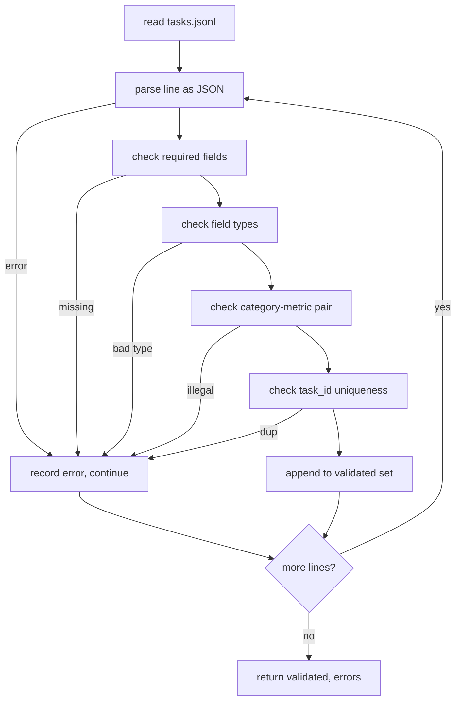

# 任务规范格式

> 评估安全带的好坏取决于其任务执行的合同. Trước khi viết một hàm đánh giá đơn lẻ, xin kết nối JSONL 形状和量词汇.

**Type:** Build
**Languages:** Python
**Prerequisites:** 19期B轨地基
**Time:** ~90 分钟

## Học mục tiêu


```figure
ci-task-spec-gate
```

- 定义一个 JSONL 任务记录模式,以一种形式涵盖算术,多项选择,代码执行,分类和自由文本摘要──
- 固定量名称的封闭词汇表,以便下游课程 (71-73) có thể được phân chia trên từng đoạn.
- Đặt một số ít mẫu mẫu và quy tắc xử lý sau được xác định là một phần của nhiệm vụ, chứ không phải là một phần của runner, do đó các gợi ý tương tự sẽ tạo ra mục tiêu tương tự giữa các mô hình.
- 实施严格验证器, trong hình thức sai lệch ghi lại trước khi đạt đến các nhà vận chuyển.
- 发布 một tập hợp cố định bao gồm 10 nhiệm vụ, được sử dụng cho mỗi chi nhánh của quy tắc kiểm tra, để kiểm tra có một số thứ thực sự có thể──

## Tại sao phải kết thúc quy tắc

Nghiên cứu bộ sưu tập code ở evalu 脚本 ở tốc độ ở tốc độ ở ở ở ở ở ở ở ở ở ở ở ở ở ở ở ở ở 6 tháng sau, mỗi sổ ghi chép có hình dạng JSON của riêng nó, mỗi chỉ số được tái thực hiện hai lần, và không thể so sánh giữa các hoạt động.

Hình dạng này lấy từ BIG-bench、HELM 和 lm-eval 风格线束的想法, nhưng字段名称是我们的.

## 记录形状

任务是单行上的 JSON对象──线束读取 `tasks.jsonl`并独立验证每条线――坏线将停止该记录,而不是运行――

```json
{
  "task_id": "arith_001",
  "category": "arithmetic",
  "prompt": "Compute the result. Question: 17 + 24\nAnswer:",
  "targets": ["41"],
  "metric_name": "exact_match",
  "few_shot_examples": [
    {"prompt": "Question: 2 + 2\nAnswer:", "completion": "4"}
  ],
  "post_process": "strip_whitespace",
  "metadata": {"difficulty": "easy"}
}
```

                                                                                                                                                                                                                                                                                                                                                                                                                                                                                                                             `task_id``category``prompt``targets``metric_name``post_process``few_shot_examples`和 `metadata`                                                                                                                                                                                                                                                              

## 字段规则

`task_id`là một chuỗi không trống.

`category` `arithmetic``mcq``code_exec``classification``summary`Một trong số các loại này hạn chế những phép đo và xử lý sau đó đối với là hợp pháp.`code_exec`任务 phải sử dụng `metric_name = code_exec`- Tôi không biết.`mcq`任务 phải sử dụng `metric_name = exact_match`

`prompt`là một chuỗi không空. n n n n n n n n n n n n n n n n n n n n n n n n n n n n n n n n n n n n n n n n n n n n n n n n n n n n n n n n n n n n n n n n n n n n n n n n n n n n n n n n n n n n n n n n n n n n n n n n n n n n n n n n n n n n n n n n n n

`targets`Là một danh sách chữ không trống.`exact_match`, bất kỳ yếu tố phù hợp đều được tính vào.`f1`和`rouge_l`, điểm số cao nhất mục tiêu chiến thắng.`mcq`, danh sách chỉ chứa một yếu tố.

`metric_name` `exact_match``f1``bleu_4``rouge_l``accuracy``code_exec`Một. Từ ngữ là đóng cửa. Một chỉ số mới cần một bài học mới và một điều khoản mới.

`few_shot_examples` `{prompt, completion}`Đối với danh sách của các nhà kiểm chứng sẽ giới hạn danh sách cho tám mục, để giới hạn các gợi ý.

`post_process` `none``strip_whitespace``lower``extract_letter``extract_code_block``extract_first_line`Một. Mỗi quy tắc có một hành vi xác định.

## Hành vi của máy kiểm chứng



验证器 trả về hai danh sách: đã chứng minh hồ sơ và ghi chép sai lầm, trong đó có các vi phạm quy tắc ▌vi phạm quy tắc và các đoạn sai lầm  Nếu danh sách sai lầm không trống, thì các nhà điều hành từ chối khởi động, trừ khi thiết lập rõ ràng `--allow-bad-tasks`标志──

##                                                                                                                                                                                                                                                               

runner sẽ chỉ ra một vài ví dụ trước đó với các phân vùng không gian kết nối lên. Mỗi mô hình đều chạy cùng một đường mã, do đó, nguồn khác biệt duy nhất là mô hình chính nó.

```python
def render(task):
    parts = []
    for ex in task.get("few_shot_examples", []):
        parts.append(ex["prompt"] + " " + ex["completion"])
    parts.append(task["prompt"])
    return "\n\n".join(parts)
```

## 后处理规则

后处理步骤在生成后、指标之前运行──它 là xác định và không trạng thái──

- `none`返回字符串不变──
- `strip_whitespace`│ │ │ │ │ │ │ │ │ │ │ │ │ │ │ │ │ │ │ │ │ │ │ │ │ │ │ │ │ │ │ │ │ │ │ │ │ │ │ │ │ │ │ │ │ │ │ │ │ │ │ │ │ │ │ │ │ │ │ │ │ │ │ │ │ │ │ │ │ │ │ │ │ │ │ │ │ │ │ │ │ │ │ │ │ │ │ │ │ │ │ │ │ │ │ │ │ │ │ │ │ │ │ │ │ │ │ │ │ │ │ │ │ │ │ │ │ │ │ │ │ │ │ │ │ │ │ │ │ │ │
- `lower`小写字符串──
- `extract_letter`返回与 `[A-E]`匹配的第一个字符, dùng cho MCQ.
- `extract_code_block`Trở lại chủ thể đầu tiên của khối phân lập, được sử dụng để thực hiện mã.
- `extract_first_line`Trở lại đầu tiên không空行, dùng cho汇总分类──

需要此列表之外的规则的任务属于新课程──

## 本课不做什么

Nó phải phân biệt. Nó không sử dụng mô hình. Nó không vận hành mã. Những nội dung này xuất hiện trong các bài học 71, 72 và 75.

10 个任务 fixture 覆盖两个算术项,两个 MCQ项,两个代码执行项,两个分类项和两个摘要项, 验证器通过所有 10 条规则,一个单独的 fixture (`tasks_bad.jsonl`(b) sẽ kích hoạt từng quy tắc, và số lượng sai lầm của máy kiểm chứng trả lại đúng như những sai lầm này.

## 如何阅读代码

`main.py`定义了 `TaskSpec``validate_task``validate_file`和 CLI 进入点── cố định 加载器是 `load_fixtures`染和后处理辅助 viên 位于验证逻辑旁边, do đó người chạy trong lớp 75 chỉ cần nhập một mô-đun riêng lẻ

Từ trên xuống đọc `main.py`然后读取 `code/tests/test_spec.py`️️️️️️️️️️️️️️️️️️️️️️️️️️️️️️️️️️️️️️️️️️️️️️️️️️️️️️️️️️️️️️️️️️️️️️️️️️️️️️️️️️️️️️️️️️️️️️️️️️️️️️️️️️️️️️️️️️️️️️️️️️️️️️️️️️️️️️️️️️️️️️️️️️️️️️️️️️️️️️️️️️️️️️️️️️️️️️️️️️️️️️️️️️️️️️️️️️️️️️️️️️️️️️️️️️️️️️️️️️️️️️️️️️️️️️️️️️️️️️️️️️️️️️️️️️️️️️️️️️️️️️️️️️️️️️️️️️️️️️️️️️️️️️️️️️️️️️️️️️️️️️️️️️️️️️️️️️️️️️️️️️️️️️️️️️️️️️️️️️️️️️️️️️️️️️️️️️️️️️️️️️️️️️️️️️️️️️️️️️️️️️️️️️️️️️️️️️️️️️️️️️️️️️️️️️️️️️️️️️️️️️️️️️️️️️️️️️️️️️️️️️️️️️️️️️️️️️️️️️️️️️️️️️️️️️️️️️️️️️️️️️️️️️️️️️️️️️️️️️️️️️️️️️️️`main.py`底部的演示会验证捆绑的固定并印摘要──

## Hơn nữa nữa

Các bộ đánh giá thực sự được thực hiện theo cách tăng trưởng các phân loại theo mô hình. Kích thước của sự tỉnh táo là từ chối thêm các phân loại mà không thêm các chỉ số. Quy tắc xử lý sau và ít nhất một nhiệm vụ cố định.
