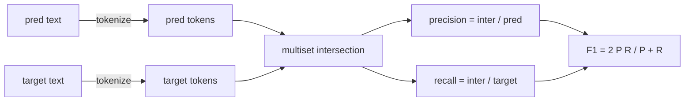
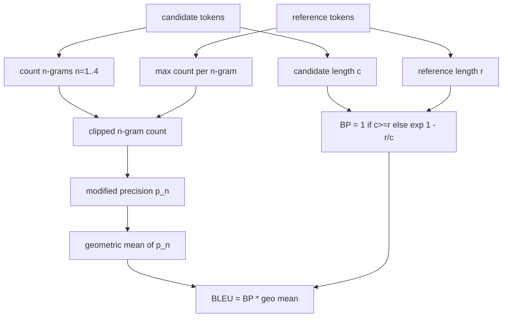

# 经典指标

> Bleu, Rouge-L, F1 精确匹配,准确率, 5 chỉ số vẫn chiếm phần lớn số liệu đánh giá của LLM đã được xuất bản, từ nguyên tắc đầu tiên để thực hiện mỗi chỉ số, bạn chỉ biết ý nghĩa của số.

**Type:** Build
**Languages:** Python
**Prerequisites:** 第 19 期 Track B 基础，第 70 课
**Time:** ~90 分钟

## Học mục tiêu


```figure
cd-bleu-overlap
```

- Thông qua các quy tắc xác định của token hóa để đạt được mức độ xác định của token ∞ F1 和准确性∞
- Từ đầu  thực hiện BLEU-4: sửa đổi n n n n n n n n n n n n n n n n n n n n n n n n n n n n n n n n n n n n n n n n n n n n n n n n n n n n n n n n n n n n n n n n n n n n n n n n n n n n n n n n n n n n n n n n n n n n n n n n n n n n n n n n n n n n n n n n n n n n n n n n n n n n n n n n n n n n n n n n n n n n n n n n n n n n n n n n n n n n n n n n n n n n n n n n n n n n n n n n n n n n n n n n n n n n n n n n n n n n n n n n n n n n n n n n n n n n n n n n n n n n n n n n n n n n n n n n n n n n n n n n n n n n n n n n n n n n n n n n n n n n n n n n n n n n n n n n n n n n n n n n n n n n n n n n n n n n n n n n n n n n n n n n n n n n n n n n n n n n n n n n n n n n n n n n n n n n n n n n n n n n n n n n n n n n n n n n n n n n n n n n n n n n n n n n n n n n n n n n n n n n n n n n n n n n n n n n n n n n n n n n n n n n n n n n n n n n n n n n n n n n n n n n n n n n n n n n n n n n n n n n n n n n n n n n n n n n n n n n n n n n n n n n n n n n n n n n n n n n n n n n n n n n n n n n n n n n n n n n n n n
- Sử dụng các chuỗi phụ công cộng dài nhất và các kết hợp F-beta của độ chính xác và tỷ lệ triệu hồi để thực hiện ROUGE-L.
- 调度第70 课中的 metric_name 字段, để người chạy giữ trạng thái không liên quan đến chỉ số.
- Sử dụng các mô hình tham chiếu được lấy từ các ví dụ làm việc thay vì từ các thư viện bên thứ ba để cố định hành vi.

## Tại sao lại tái hiện

Bạn sẽ đọc báo cáo của BLEU 28.3 và một báo cáo khác của BLEU 0.283. Bạn sẽ thấy sự khác biệt phân số ROUGE-L của hai thư viện là 10 phần trăm, vì một thư viện cắt cho viết nhỏ, và một thư viện khác không cắt. Cách nhanh nhất để dừng hỗn hợp là tự viết chỉ số, sau đó hướng đến các đường đi của các thiết bị định nghĩa và ứng dụng trình độ. Sau đó, số giữa các bài báo so sánh đã trở thành vấn đề đặt lượng đọc, chứ không phải tranh luận thư viện.

Stdlib加上numpy就足够了──BLEU là tính toán và vị trí──ROUGE-L là động thái lập kế hoạch──F1 là tập hợp giao dịch trên token── phần khó khăn nhất là chọn token và cố gắng vào nó──

## token hóa

分词器是`re.findall(r"\w+", text.lower())`✿小写、字母数字运行、删标点符号── trong bài học này, mỗi chỉ số đều sử dụng cụ thể phân từ này── runner không có quyền chọn── nếu bạn trao đổi phân từ, bạn sẽ chạy các bài kiểm tra chuẩn khác──

```python
TOKEN_RE = re.compile(r"\w+", re.UNICODE)
def tokenize(text):
    return TOKEN_RE.findall(text.lower())
```

Đây là một sự đơn giản hóa có ý định. Thiết lập sản xuất sẽ quan tâm đến CJK, viết tắt và mã thông báo. Điểm quan trọng của bài học này là, máy tạo mã là một hợp đồng, chứ không phải là một vòng xoay.

## 精确匹配

```python
def exact_match(pred, targets):
    return float(any(pred.strip() == t.strip() for t in targets))
```

Mỗi nhiệm vụ trả về 1.0 hoặc 0.0 ⋅ sự tập hợp của tập dữ liệu là giá trị trung bình ⋅ đó là sức mạnh chính của toán học ⋅ MCQ 和短分类任务 ⋅

## token cấp F1

设置 để dự đoán và mục tiêu của token multiplexing──精度 là multiplexing交换除了预测的 multiplexing──召回率 là cùng một交换除了目标的 multiplexing── F1 là调和平均值──应实现处理空预测和空目标边缘情况──



Đối với các nhiệm vụ đa mục tiêu, chúng tôi chọn F1 tốt nhất trong danh sách mục tiêu.

## BLEU-4

BLEU là chỉ số dịch thuật máy tính quy định, nó vẫn xuất hiện trong việc rút ngắn. Công thức chúng tôi sử dụng là BLEU-4, có tiêu chuẩn đơn giản về trừng phạt và số lượng n nguyên ngữ pháp lý được sửa đổi sau đó được tăng lên một lần, do đó 4 nguyên ngữ pháp bị thiếu sót sẽ không đưa số điểm xuống 0.

Đối với mỗi ứng cử viên - tham khảo đối với, chúng ta tính toán n chính xác ngôn ngữ sau khi sửa đổi 1、2、3、4 giờ.



Quy tắc trơn là phương pháp của Lin và Och: trước khi lấy số, hãy thêm 1 vào mỗi n nguyên tử của phân tử và phân tử chính xác. Khi trích dẫn không phù hợp 4 gram và giữ gần với giá trị không trơn khi ứng cử viên dài, điều này có thể tránh được.`log 0`

## 脂-L

ROUGE-L so sánh chuỗi biểu tượng ứng cử và chuỗi biểu tượng tham khảo là chuỗi công cộng dài nhất. LCS  bắt từ không bắt buộc tính liên tục, đó là lý do tại sao nó là số lượng tổng hợp mặc định. Chúng tôi sử dụng bảng xếp hạng tiêu chuẩn tính toán độ dài của LCS, sau đó đưa ra tỷ lệ triệu hồi.`lcs / reference length`, 精度为`lcs / candidate length`,并与F-beta 结合, trong đó đối称F1 形式的β等于1──

```python
def lcs_length(a, b):
    n, m = len(a), len(b)
    dp = numpy.zeros((n + 1, m + 1), dtype=int)
    for i in range(n):
        for j in range(m):
            if a[i] == b[j]:
                dp[i+1, j+1] = dp[i, j] + 1
            else:
                dp[i+1, j+1] = max(dp[i+1, j], dp[i, j+1])
    return int(dp[n, m])
```

Numpy 表使实现清晰易读;纯 Python 列表也可以工作──选择 ROUGE-L's任务为每个任务支付 O(n m) 成本──对于保持在毫秒以下的典型摘要长度──

## 准确度

Đối với nhiều mục tiêu phân loại nhiệm vụ, độ chính xác sẽ giảm xuống để phù hợp chính xác với mục tiêu tiêu tiêu chuẩn hóa đơn lẻ. Chúng tôi sẽ mở nó thành một chức năng riêng biệt, để các quy trình điều chỉnh có thể được`metric_name`Trên để điều chỉnh, và không cần phải trong runner để thực hiện các chữ cái liên kết so sánh.

## 派遣合同

Đơn nhập cảnh`score(metric_name, prediction, targets)`Nó quay lại.`[0, 1]`Số điểm trung lưu: người chạy sẽ không phân chia theo tên chỉ số: nó sẽ chuyển giao gọi và ghi vào kết quả: đây là lớp 75 sẽ gắn liền với bề mặt quy tắc nhiệm vụ của lớp 70.

```python
def score(metric_name, pred, targets):
    if metric_name == "exact_match":
        return exact_match(pred, targets)
    if metric_name == "f1":
        return max(f1_score(pred, t) for t in targets)
    if metric_name == "bleu_4":
        return max(bleu4(pred, t) for t in targets)
    if metric_name == "rouge_l":
        return max(rouge_l(pred, t) for t in targets)
    if metric_name == "accuracy":
        return accuracy(pred, targets)
    raise ValueError(f"unknown metric_name: {metric_name}")
```

`code_exec`Trong bài học thứ 72 xử lý và nhập vào trong quy trình điều chỉnh đó.

## 本课不做什么

Nó không thực hiện BLEURT hoặc BERTScore (cần các mô hình và nằm trong các khóa học khác nhau) (có thể là: 5 chỉ số, 1 token, 1 điều chỉnh).

## 如何阅读代码

`main.py`Để xác định mỗi chỉ số là một hàm tự do cộng với quy trình điều chỉnh.`_reference_examples`块中── bài trình bày này hướng tới 8 ví dụ về các quy trình điều chỉnh hoạt động và in số lượng của mỗi chỉ số──`code/tests/test_metrics.py`Trung trong các bài kiểm tra cố định tham chiếu và nhấn mạnh từng bên của tình huống (空预测,空参考,无共享代码,精确匹配,重复短语剪辑)

Từ trên xuống đọc `main.py`Các chức năng này được sắp xếp theo độ phức tạp. Sự phù hợp và chính xác của các thứ tự.

## Hơn nữa nữa

Ưu điểm cổ điển là cần thiết, nhưng còn không đủ. Họ thưởng cho bề mặt chồng lên và bỏ qua ý nghĩa. Một khi bạn tin vào tầng đáy cổ điển, phương pháp giải quyết là dựa trên các chỉ số phân cấp của mô hình.
