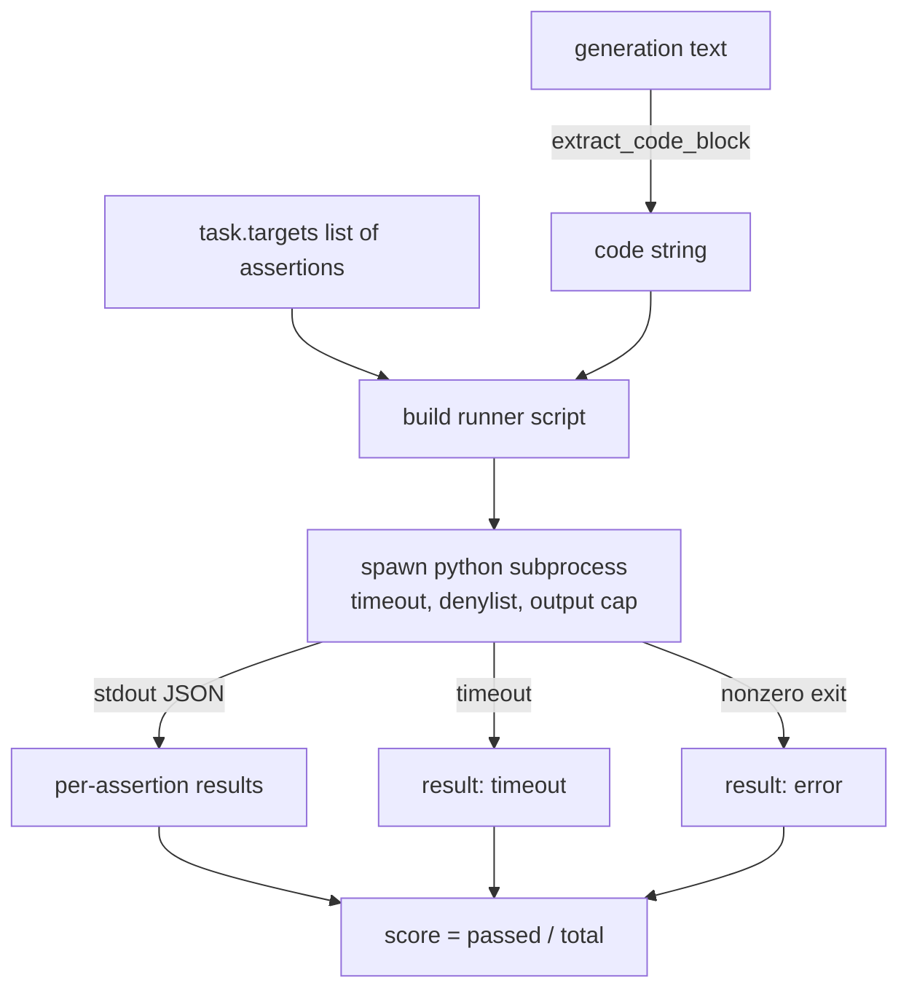
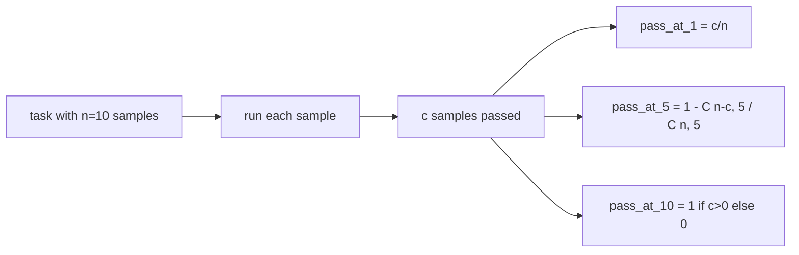

# 代码执行指标

> Cód phát triển sau khi thử nghiệm là đúng. Công cụ đánh giá phải lấy mã, chạy nó trong trường hợp không gây ra sự sụp đổ của máy chủ, và thực sự có tỷ lệ thống kê.

**Type:** Build
**Languages:** Python
**Prerequisites:** 第 19 期 Track B 基础，第 70 和 71 课
**Time:** ~90 分钟

## Học mục tiêu


```figure
sandbox-runner
```

- 以 tương thích với các quy tắc xử lý sau trong bài học 70 từ tự do hình thức tạo trong提取代码块.
- Trong quá trình tách biệt của danh sách có thời gian quá cao, xuất khẩu và nhập khẩu từ chối thực hiện mã ứng cử.
- 根据提供的断言字符串中通过候选人的分数来进行任务评分.
- 计算 từ một mô hình thực hiện nhiều nhiệm vụ như vậy qua-at-k.
- Để làm cho hộp rơi, ngôn ngữ sai lầm và siêu thời gian xem như một dòng thất bại mô hình, và có các mã thoát khác nhau có thể ghi lại.

## Tại sao cần một quá trình tách biệt

Nội kết`exec`Có sự an toàn và ổn định ẩn ấp ấp.`while True: pass`永远阻止 eval――生成的 `import shutil; shutil.rmtree('/')`Thực sự như nghe có vẻ như là thảm họa. Phương pháp giải quyết là để mỗi ứng cử viên tạo ra một trình giải thích Python mới, trong khi đó, nó sẽ chuyển giao mã, viết kết quả của tuyên bố vào stdout, và kết thúc quá trình.

HumanEval、MBPP、BigCodeBench 和 LiveCodeBench等 thực sự đánh giá đều sử dụng các bộ phận của quá trình. Một số tầng Docker nằm ở trên đỉnh. Chúng ta dừng lại trong quá trình của con vì một lý do: nó có thể di chuyển, nó là stdlib, và nó đã nắm bắt một mô hình lỗi quan trọng đối với đánh giá giáo dục.

## 代码执行任务的形状

`code_exec`nhiệm vụ mang theo`targets`Trong khi đó, các bộ phận khác nhau của các hệ thống điều hành được tạo ra từ các khối mã được tách ra, xung quanh nó xây dựng các công cụ thử nghiệm, sau đó vận hành kết quả.



分数 là `[0, 1]`Trung tâm số điểm: có ba câu hỏi về nhiệm vụ, trong đó hai lần đạt điểm 0.667. Bất kể có sự cố nào xảy ra, người chạy đều sẽ quay lại cùng một hình dạng: quá trình bị phá vỡ sẽ được hiển thị vào mã lỗi tiêu chuẩn hóa, thay vì trở lại Python của khối tròn.

## 拒绝名单

拒绝列表是基于导入.                                                                                                                                                                                                                                                          `ImportError("denied")`Ước tính của nó:`os.system``subprocess``socket``requests``urllib``urllib.request``urllib.error``urllib.parse``ctypes``shutil`、 `http.client``asyncio.subprocess`

Chúng tôi sẽ không giả vờ rằng đây là một mã chống lại chính xác có thể thoát khỏi bất kỳ quá trình nào trong Python.

```python
DENIED = {
    "os.system": True,
    "subprocess": True,
    "socket": True,
    "shutil": True,
    "requests": True,
    "urllib": True,
    "ctypes": True,
}
```

Chúng tôi đã qua qua trước mặt thêm `import sys`Và một thông qua 子补丁 `os.system`Để đưa ra các bảo vệ để đóng gói ứng cử viên.`main.py`Ở giữa.

## 挂钟超时

Mỗi quá trình của con có một ngân sách mặc định trong 3 giây.`subprocess.run(..., timeout=t)`Nếu quá thì người chạy sẽ bị bắt.`TimeoutExpired`, kết thúc quá trình, ghi lại nhiệm vụ `timeout`退出原因──该任务分数为零──跑者继续进──

Mỗi nhiệm vụ có thể vượt quá thời gian.`task.metadata.timeout_s`进行配置――长时间运行的单元测试可能会要求更多; 证证器 trong lớp 70 sẽ giới hạn giá trị này trong 30 giây, để giữ được biên giới của bộ.

## 输出上限

子进程可能会淹没标准输出,耗尽主机内存──runner sẽ stdout 流式传输到缓冲区, và tổng số chạy vượt quá 256 KB 时立即终止子进程──结果记录为`exit_code = error`,详细信息字符串为 `"output overflow"` Khi một thế hệ không nghĩ đến việc viết ra một vòng lặp vô hạn, nó sẽ xuất hiện trong thực tế

## 通过-k

Pass-at-k là một thiết bị đánh giá không phân biệt sử dụng bởi người dùng và bạn bè.`n`独立样本和其中的 `c`通过, từ `n`   `k`Các mẫu có ít nhất một khả năng thông qua giải pháp là:

```text
pass_at_k(n, c, k) = 1 - C(n - c, k) / C(n, k)
```

Khi đó`n - c < k`时, molecules未定义, giá trị为 `1`◊ phải thực hiện việc xử lý trực tiếp tình hình bên cạnh.`pass_at_k(n, c, k)`供排行榜层使用──



## 退出代码

Người chạy trở lại với 5 kết quả của mỗi nhiệm vụ:

- Khi mỗi câu nói qua thời gian`pass`
- `assertion_fail`Có ít nhất có một câu nói thất bại.
- `syntax_error`Khi code không nhập hoặc có lỗi ngôn ngữ
- `timeout`Khi chờ đợi
- `error`Để bất kỳ sự cố nào khác, bao gồm từ chối danh sách dự định và xuất khẩu tràn`"output overflow"`                                                                                                                                                                                                                                                              

Số lượng vẫn là zero. Khóa code xuất phát là dữ liệu. Khóa học có thể quyết định liệu sẽ được tính toán siêu thời gian thành zero hay bị mất dữ liệu.

## 本课不做什么

Nó sẽ không cung cấp cho bạn một hộp rác thực sự. Nó sẽ không chạy mã không tin cậy từ mạng mở. Nó không xử lý các nhiệm vụ hiện tại, chẳng hạn như các tệp I/O hoặc cuộc gọi mạng.

## 如何阅读代码

`main.py`定义了 `extract_code``run_candidate``score_code_exec`和 `pass_at_k`△子进程runner脚本构建为字符串,并作为 `-c`传递给新的 Python 解释器――`code/tests/test_exec.py`Trung trong các bài kiểm tra nhằm vào các ví dụ về việc làm từ HumanEval 风格中提取 đã thực hiện bốn mã rút lại và pass-at-k――

Từ trên xuống đọc `main.py`流道模板是承重件──着断言循环,直到你能预测它写回父进程的 JSON 信封──

## Hơn nữa nữa

Một khi hình dạng quy trình hoạt động, vấn đề tiếp theo là khả năng di chuyển. Các phiên bản Python khác nhau trong Windows xử lý SIGKILL khác nhau. Cách giải quyết sạch nhất là đưa các nhà điều hành vào Docker 镜像.
