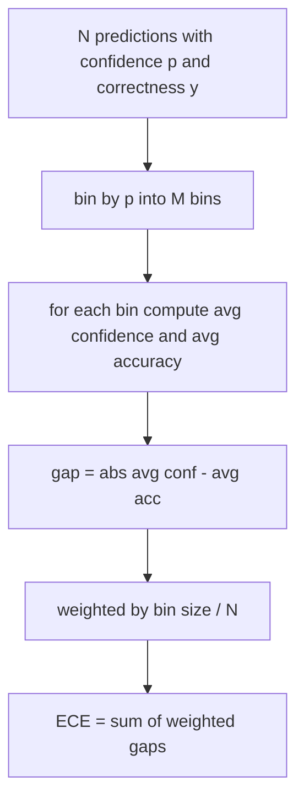
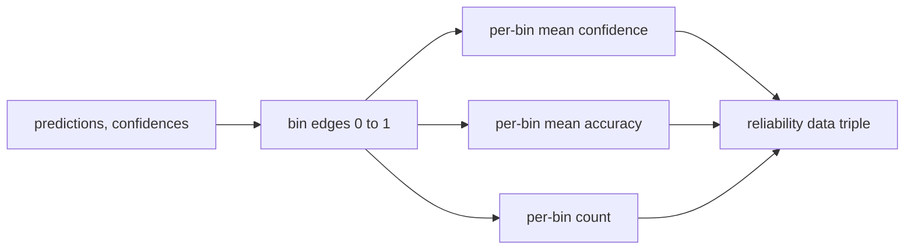

# 困惑度和校准

> Nếu mô hình của bạn cho thấy 90% tin tưởng vào 1000 câu trả lời, và trả lời đúng 600, thì nó không qua được sự xác định tốt.

**Type:** Build
**Languages:** Python
**Prerequisites:** 第 19 期 Track B 基础，第 70 和 71 课
**Time:** ~90 分钟

## Học mục tiêu


```figure
cd-reliability-diagram
```

- 根据模型适配器提供的代币负对数概率计算保留语料库上的代币级困惑度──
- 根据分箱预测概率计算分类器或多项选择评估的预期校准误差 (ECE) ⋅
- 计算 Brier 分数 (BRI) (đối với chỉ số chính xác của các chỉ số)并解释 nó đã thực hiện khi nào ECE không thực hiện các hoạt động.
-  xây dựng hình ảnh đáng tin cậy dữ liệu cần thiết để tạo ra đường cong độ tin tưởng và chính xác
- Tất cả 3 kết nối vào vòng đánh giá để người chạy có thể chạy được.`perplexity``ece`和 `brier`编号附加到模型报告中──

## 困惑 nói cho anh biết gì

困惑度是每个代币的指数平均负对数似然──越低越好──困惑度为 1 có nghĩa là mô hình cho mỗi代币分配概率 1──词汇量大小的困惑 có nghĩa là mô hình là thống nhất và không học được bất cứ điều gì── thực tế số giữa hai:

Các công cụ tự nó không tính toán cho số tỷ lệ xác suất. Những thứ này đến từ các mô hình thích ứng.

```python
def perplexity(neg_log_probs, token_counts):
    total_nll = sum(neg_log_probs)
    total_tokens = sum(token_counts)
    return math.exp(total_nll / total_tokens)
```

Việc thực hiện xử lý các điểm số bên cạnh tình huống và khẳng định tỷ lệ tỷ lệ số không phải là tiêu cực.`log p`Không phải`-log p`Các ứng dụng sẽ tạo ra ít hơn 1 sự bối rối, điều này là không thể.

## ECE  biện pháp là gì

 dự đoán sự khác biệt trong độ xác định dựa trên độ tin sẽ được phân tích theo số lượng cố định trong hộp, sau đó đo khoảng cách trung bình giữa độ tin và độ chính xác của từng hộp, và theo hộp tăng sức mạnh.



标准公式在 `[0, 1]`上 sử dụng 10 个等宽的bin. 应实现支持任何正整数计数.`bins`Các tham số, để người vận hành có thể chọn giữa việc phát hành quy định (10) và so sánh quy định (15)

ECE vì số hộp và mẫu có sự khác biệt. Sử dụng 10 bin và 100 dự đoán, bạn không thể phân biệt 0.02 ECE và tiếng ồn theo thời gian.

## Brier 分数 là ECE 没有的

ECE chỉ quan tâm đến khoảng cách trung bình. Nếu mô hình quá tự tin đối với một nửa hộp dữ liệu, và thiếu tự tin đối với một nửa hộp dữ liệu khác, thì ECE của nó có thể thấp hơn, đồng thời định chuẩn địa phương cũng rất kém.

Đối với kết quả 2元, Brier là`mean((p_i - y_i)^2)` Nó phân chia thành độ tin cậy, độ phân giải và không chắc chắn.

```python
def brier(p, y):
    return float(np.mean((p - y) ** 2))
```

## Dữ liệu có tính độ tin cậy

Đơn vị này trả lại ba phân tử: mỗi bin 平均 độ tin cậy、 mỗi bin 平均准确度和每个 bin 计数──đơn vị có mã nằm dưới cùng; 本课停在数据形上──



返回的元组是调用层绘图图或计算自定义 ECE 变体(自适应 ECE、扫描 ECE等) 需要的元组──我们返回 numpy 数组,因此下游代码不必进行转换──

## 置信来源

Công cụ không giả định tin cậy từ Softmax.`[0, 1]`Trong số bất kỳ số nào. Đối với nhiều nhiệm vụ chọn, tự nhiên là`softmax over option log-likelihoods`Đối với văn bản tự do, tự tin là tỷ lệ tự báo cáo của mô hình hoặc chỉ số trung bình đối với số giống như vậy.

## 边缘 tình hình

- Tất cả các dự đoán đều sai: ECE là trung bình, Brier là giá trị cao, bối rối là mô hình đối với quan điểm của văn bản.
- 所有预测均以高信任度正确:ECE 接近零,Brier 接近零──
- p=0.5 时 hoàn toàn không xác định yếu tố dự đoán:ECE là 0.5  giảm độ chính xác,Brier là 0.25  giảm độ chính xác.
- 空输入:ECE、Brier 和可靠性返回 `0.0`(或零填充数组) ⋅ Đối với tình huống零token, Khác hoạn  trả lại `NaN` Những con đường này không phát ra cảnh báo; người chạy kiểm tra các giá trị này và quyết định liệu có báo cáo hay nhảy qua hay không.

Những trường hợp này được đưa vào thử nghiệm. Mô hình thực tế trong thử nghiệm thực tế không đánh bại chúng, nhưng có một bộ điều chỉnh hoặc mô hình nhỏ bị hỏng sẽ đánh bại chúng, và các bộ điều hành không nên bị sụp đổ.

## 调度

校准不像F1 那样是针对每个任务的指标――这是每个模型的报告――runner积累在整个评估过程中`(confidence, correct)`Đối với,并计算一次 ECE、Brier 和可靠性数据──困惑度 được tính toán trên cơ sở dữ liệu văn bản được giữ lại, phân chia với đánh giá của từng nhiệm vụ.

界面 là:

```python
report = CalibrationReport.from_predictions(confidences, correct)
report.ece          # float
report.brier        # float
report.reliability  # tuple of three numpy arrays
report.populated_bins  # int
```

`PerplexityResult.from_token_nll(neg_log_probs, token_counts)`Trả lại mỗi token của sự bối rối và trung bình đối với số lượng giống như vậy.

## 本课不做什么

Nó không sử dụng mô hình. Nó không thực hiện softmax. Nó không ước tính độ tin cậy của đầu ra; nó không làm việc của bộ điều chỉnh. Nó không thực hiện nhiệt độ gia hạn hoặc gia hạn hoàn toàn.

## 如何阅读代码

`main.py`定义 `perplexity``expected_calibration_error``brier_score``reliability_diagram`和 `CalibrationReport`- `PerplexityResult`Các mô hình dữ liệu. Phương trình này hoạt động trên dự đoán tổng hợp các thực tế cơ bản được biết: một mô hình được chuẩn bị tốt, một mô hình tự tin quá mức và một mô hình không đủ tự tin.`code/tests/test_calibration.py`Trung trong các thử nghiệm cố định từng tình huống cạnh và giá trị tham chiếu của biến số dự đoán tổng thể.

Từ trên xuống đọc `main.py`◊ Phân tích thứ tự từ mô hình đến mô hình để báo cáo. Mỗi hàm có một chuỗi văn bản ngắn, trong đó bao gồm toán học và hợp đồng.

## Hơn nữa nữa

校准 là một trong những phân tích được công bố dễ bị bỏ qua nhất. Hầu hết các bảng xếp hạng đều báo cáo một con số chính xác và gọi nó là hoàn thành. Một mô hình chiến thắng trong độ chính xác và thất bại trên Brier là một mô hình có điểm thấp hơn trong độ chính xác nhưng đáng tin cậy báo cáo mô hình không chắc chắn của nó hơn nữa.
