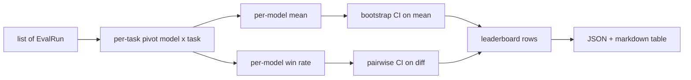
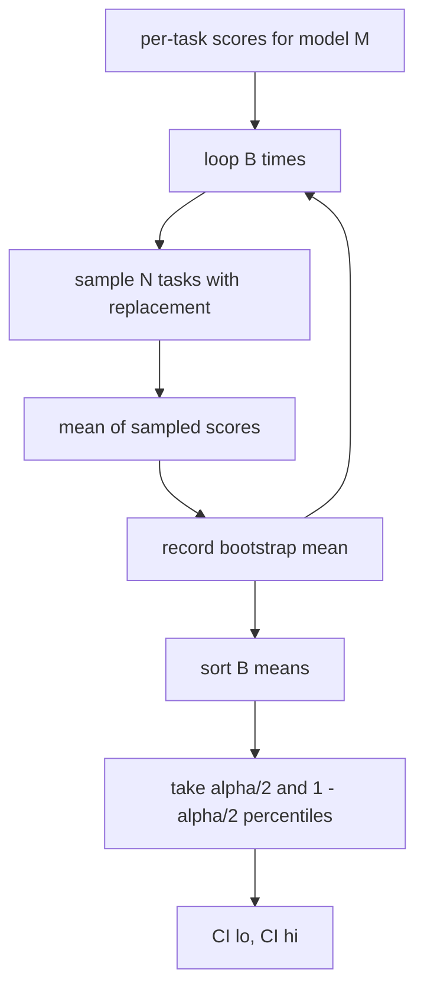

# 排行榜聚合

> Mỗi nhiệm vụ có thể được phân tích dễ dàng hơn. Mỗi mô hình của các nhiệm vụ khác nhau được xếp hạng khó khăn hơn.

**Type:** Build
**Languages:** Python
**Prerequisites:** 第19期B轨基础，第70、71、73课
**Time:** ~90 分钟

## Học mục tiêu


```figure
ci-leaderboard-ci
```

- Kết hợp nhiều mô hình và từng nhiệm vụ của mỗi nhiệm vụ vào một bộ mô hình hoàn chỉnh trong mỗi hành trình.
- 标准化异质分数, để tỷ lệ thông qua và giá trị BLEU không ảnh hưởng quá nhiều đến tổng计.
- 根据平均值和胜率对模型进行排名,并解释每个模型何时是正确的总结――
- 计算每个模型的平均分和成对差异的引导置信区间──
- Để xuất ra danh sách xếp hạng cho báo cáo JSON và biểu tượng Markdown, người chạy trong bài học thứ 75 có thể dán nó vào CI 评论中.

## 输入的形状

聚合器使用 `EvalRun`记录列表:

```python
@dataclass
class EvalRun:
    model_id: str
    task_id: str
    metric_name: str
    score: float          # in [0, 1]
    category: str
```

第 75 课中的跑者为每一个`(model, task)`Để phát hành một bản ghi.`[0, 1]`Ở giữa.

## 输出

出来三张表:



排行榜行包含:`model_id``mean_score``mean_ci_lo``mean_ci_hi``win_rate``tasks_completed`Và cho mỗi loại giá trị trung bình có thể lựa chọn.`categories`Địa điểm

## 标准化

Nếu một nhiệm vụ có điểm số`[0, 1]`, một nhiệm vụ khác được ghi điểm`[0, 100]`,则第二任务默默主导平均值──聚合器验证每个输入分数是否位于`[0, 1]`Trung, nếu không từ chối vận hành.

## 平均值和胜率

Hai chương trình xếp hạng phục vụ các mục tiêu khác nhau.

平均分数 là giá trị trung bình của mỗi mô hình của mỗi nhiệm vụ. Đây là báo cáo xếp hạng số tiêu đề. Nó rất nhạy cảm với các giá trị bất thường và sự mất cân bằng của nhiệm vụ.

胜率计算模型在同一任务中击败所有其他模型的频率── đối với mỗi任务, điểm số cao nhất của模型 đạt được胜率──胜率等于赢得次数除了模型得分的任务数──它 không quá nhạy cảm với sự khác biệt về giá trị và quy mô, nhưng sẽ mất thông tin──

```python
def win_rate(model_id, runs_by_task, all_models):
    wins, total = 0, 0
    for task_id, runs in runs_by_task.items():
        scores = {r.model_id: r.score for r in runs if r.model_id in all_models}
        if model_id not in scores:
            continue
        total += 1
        best = max(scores.values())
        if scores[model_id] >= best:
            wins += 1
    return wins / total if total else 0.0
```

Harness 会同时报告两者──第 75 课中的跑者 默认按平均排名排序; 胜率的Markdown 列也保留在那里,以便用户偏好这种视角时使用──

## tự đặt niềm tin

Mỗi mô hình có giá trị trung bình qua nhiệm vụ để hướng dẫn tái采样 ước tính của đặt phòng.`B`lần thứ hai, và`alpha`级别获取百分位间隔──



Đối với việc so sánh, chúng tôi hướng dẫn sự khác biệt của mỗi nhiệm vụ.`score_A - score_B`, lấy phần trăm vị trí khoảng cách và báo cáo nó. Người dùng đọc xem khoảng cách không bao gồm không không 0.

低级助手`bootstrap_mean_ci``bootstrap_pairwise_diff`(nhiên định)`B=1000`; công cộng聚合器`aggregate``pairwise_diffs`) theo ý kiến của`b=500`, vì vậy, bài thuyết trình và thử nghiệm giữ nhanh.

## 类别

Nếu đã đặt `EvalRun.category`, cluster cũng sẽ báo cáo giá trị trung bình của mỗi loại. Đây là một trong những thứ hạng trên mỗi thứ hạng, trên đó viết `math``reasoning``code``safety`Nó có thể cho người chạy thấy mô hình có tốt trên toàn bộ nhưng mã yếu, đó là thông tin ẩn trung bình tiêu đề.

## Đánh dấu 染

排行榜呈现为 Markdown 表:

```text
| Rank | Model | Mean | 95% CI | Win rate | Tasks |
|------|-------|------|--------|----------|-------|
| 1    | gpt   | 0.78 | 0.74-0.82 | 0.62 | 50 |
| 2    | claude| 0.75 | 0.71-0.79 | 0.34 | 50 |
| 3    | random| 0.10 | 0.07-0.13 | 0.04 | 50 |
```

Các biểu đồ theo phân loại trung bình. CI giữ hai điểm nhỏ. Long Model ID được cắt thành 20 chữ cái.

## 本课不做什么

Nó không vận hành mô hình. Nó không điều chỉnh cấp độ đo. Nó không thực hiện tự thích ứng ECE hoặc các biến thể chuẩn khác.`weight`字段 sẽ giữ cho 子 mở, nhưng bỏ qua nó trong bộ sáp. Nếu cần, có thể thêm trọng lượng trong các bài học tiếp theo.

## 如何阅读代码

`main.py`定义了 `EvalRun``LeaderboardRow``aggregate``bootstrap_mean_ci``bootstrap_pairwise_diff`和 `render_markdown` Bài trình bày này xây dựng một bộ tổng hợp gồm ba mô hình và 12 nhiệm vụ, tập hợp và in bảng xếp hạng và biểu đồ đối với sự khác biệt.`code/tests/test_leaderboard.py`Trung trong các bài kiểm tra đã xác định bootstrap, đánh dấu xuống, tỷ lệ thắng, tình huống và hành vi nhập không.

Từ trên xuống đọc `main.py` Data形状`EvalRun``LeaderboardRow`(văn) xuất hiện đầu tiên, tiếp theo là bộ sáp, thứ ba là bootstrap, cuối cùng là 染.

## Hơn nữa nữa

Bước tiếp theo của tự nhiên là sự quan trọng của nhiệm vụ đối tác, chứ không phải là một quy trình hướng dẫn không đối tác. Nếu mô hình A và B đều chạy cùng một trăm nhiệm vụ, thì thử nghiệm thích hợp là một quy trình hướng dẫn đối tác mà chúng ta thực hiện đối với sự khác biệt của từng nhiệm vụ. Ngoài ra, bạn cũng cần một quy trình hướng dẫn phân cấp của chuỗi nhiệm vụ tôn trọng.
