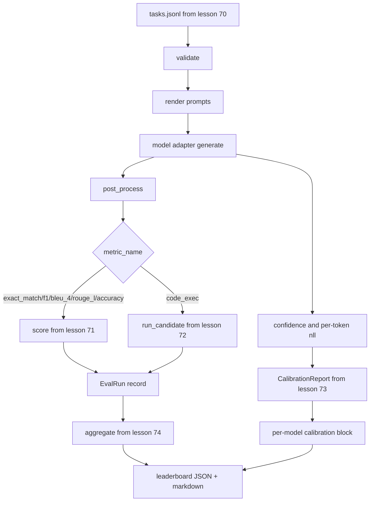

# 端到端评估运行器

> 五堂管道安装课,一堂水课, runner读取第70课中的任务规范,通过适配器调用模型, đánh giá cho第71课和第72课,附加第73课中的校准报告,并发出第74课中的排行列,演示自动终止──

**Type:** Build
**Languages:** Python
**Prerequisites:** 第 19 期 Track B 基础，第 70 至 74 课
**Time:** ~90 分钟

## Học mục tiêu


```figure
eval-grid
```

- 定义 bất kỳ mô hình nào 模拟、本地、API) có thể được thông qua các phương pháp nhỏ trên bề mặt thỏa mãn `ModelAdapter`接口.
- Trong tập tin JSONL 文件上运行评估, và trong nhóm làm việc并行执行任务──
- Một lần sẽ được kết hợp với các lớp chuẩn.
- 发出每个模型的 `EvalRun`记录并将其直接输入排行榜聚合器──
- Đồng thời xuất JSON  báo cáo và biểu đồ đánh dấu; xuất phát từ 0 khi kết thúc trong quá trình vận hành khô, không xuất phát từ 0 khi kiểm chứng hoặc vận hành thất bại.

## 管道



runner là điểm tổng hợp. Mỗi bài học trong lớp 70 đến 74 đều có một mô-đun được runner viết. runner sẽ không sao chép bất kỳ logic nào trong các mô-đun này: nó sẽ nhập chúng.

## 适配器接口

适配器 là giao tiếp giữa người chạy và bất kỳ mô hình nào.

```python
class ModelAdapter:
    model_id: str

    def generate(self, prompt: str, task: TaskSpec) -> Generation: ...
```

`Generation`là một loại dữ liệu, có:

- `text`:模型的自由格式输出
- `confidence`- Có thể là:`[0, 1]`Trung số điểm浮点, biểu thị mô hình tự báo cáo tỷ lệ trả lời
- `token_nll`: tạotoken của có thể chọn đối với số giống như tất cả
- `token_count`: tạotoken của số lượng tùy chọn

运行器中的模拟适配器提供三种风格:`RuleBasedAdapter`(确定性, gần như hoàn hảo),`NoisyAdapter`(过度自信,经常错误) và`BiasedAdapter`(擅长一个类别,糟糕于另类) 

## Không thực hiện

runner sử dụng `concurrent.futures.ThreadPoolExecutor`按模型并行运行任务──工作线程数据认为8 和任务数中较小的人──线程就足够了,因为实际模型调用的瓶是网络 I/O──代码执行路径在任务内生成自己的子进程,执行器只安排等――

Đối với xác định kiểm tra, runner会公开`run_eval(adapters, tasks, parallel=False)`, để test có thể xác định các lệnh thực hiện.

## 单遍评分循环

Đối với mỗi nhiệm vụ:

1. 染提示(một vài cú trước 加上提示正文)
2. 呼叫适配器并为呼叫计时──
3. Theo quy tắc nhiệm vụ, việc tạo ra và xử lý sau đó.
4. 调度到度量层――
5. Sử dụng phân số và chỉ số xây dựng dữ liệu`EvalRun`记录──
6. sẽ`(confidence, correct)`Đối với khu vực tiếp theo

对于精确匹配样式标标`exact_match``accuracy``code_exec`),`correct`信号 là `score >= 1.0`, đối với chỉ số phân cấp,`score >= 0.5`信号 là `score >= 0.5`值位于 `_correct_from_score`Trung, và các nhà vận hành sẽ không được công khai tiếp cận.

## 聚合

Sau khi đạt được kết quả của mỗi nhiệm vụ, người chạy đua sẽ được tuyển vào lớp 74.`aggregate`和 `pairwise_diffs`Và trong lớp 73`CalibrationReport.from_predictions`△输出 là một JSON 信封:

```json
{
  "leaderboard": [...],
  "pairwise": [...],
  "calibration": {
    "model_id_a": {"ece": 0.04, "brier": 0.10, "populated_bins": 8, ...},
    ...
  },
  "summary": {
    "tasks": 10,
    "models": 3,
    "wall_seconds": 1.2
  }
}
```

runner cũng sẽ đánh dấu biểu biểu viết vào tiêu chuẩn xuất, để người dùng có thể sẽ kết quả dán vào PR 评论中。

## Từ cuối biểu diễn

Chương trình sẽ chạy trên 10 bộ phận của lớp 70  nhiệm vụ trên 3 bộ máy thích ứng.

清洁运行标准是:

- Chương 70 课中验证的每项任务
- Chương 71 và 72 mỗi bài tập đều có tính toán.
- Chương 73   课下汇总校准报告没有错误――
- 排名 sẽ dựa trên quy tắc 适配器严格排在随机适配器之上.

Nếu bất kỳ một trong số đó bị gián đoạn, runner sẽ được trả về với giá trị không bằng 0, và xuất hiện trong thư JSON một lỗi cấu trúc.

## 本课不做什么

Nó không thực hiện API 密钥流 hoặc tốc độ hạn chế xử lý. Nó không thực hiện dòng chảy hoặc phần sản xuất.

## 如何阅读代码

`main.py`Đó là một tập hợp. Nó đi qua một cái nhỏ.`_load_sibling` giúp chương trình nhập từ 5 mô-đun khác, giúp chương trình phân tích chúng qua các đường tương đối.`Generation``EvalReport`和 `ModelAdapter`模拟适配器 nằm ở phần dưới của tài liệu.

Từ trên xuống đọc `main.py`◊浏览进口, rồi查看 `run_eval`, rồi là`_score_one`, sau đó là bộ dụng cụ.

`code/tests/test_runner.py`Trung tâm kiểm tra liên kết bộ phận phù hợp cố định, vòng lặp đơn đường, cùng đi với các thứ tự tương tự, khu vực缓冲 chuẩn và hình dạng mạng bao gồm JSON.

## Hơn nữa nữa

Đây là một hệ thống đánh giá sản xuất.`(task_id, model_id, model_version)`Các kết quả của kiểm soát khóa lưu trữ  Track các chi phí phân loại tài khoản và các token của mỗi lần vận hành  Kiểm tra các chi phí phân loại tài khoản  Kiểm tra tỷ lệ hạn chế của các lớp thử nghiệm nặng  Kiểm tra-at-k chiến lược lấy các nhiệm vụ cũng như các định dạng lưu lượng ra ngoài của bộ dài ⋅ Mỗi trong số đó là một điểm quan tâm riêng biệt, nó bao gồm các bộ vận hành, và không cần phải thay đổi chỉ số hoặc lớp hợp nhất ⋅ Sự phân tách này là trọng điểm của hợp đồng ⋅

模拟工作后,为真正的提供程序添加适配器――选择一个免费级别,写三十行水,看排列清亮――然后添加第二个提供程序并让线束完成工作――
