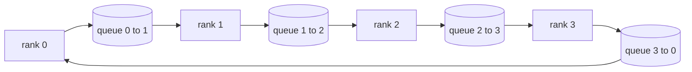

# Từ zero thực hiện các hoạt động tập thể

> Để tập hợp các tập thể hoạt động được phân phối được kết hợp với bốn hoạt động là allreduce, broadcast,allgather vàreduce_scatter.`multiprocessing.Queue`网格上构建一次它们,根据参考实现验证它们, phần còn lại của轨道就变成管道.

**Type:** Build
**Languages:** Python
**Prerequisites:** 第 19 阶段 Track C 课程 42-49
**Time:** ~90 分钟

## Học mục tiêu

- Trong hai lần truyền tải thực hiện vòng tất cả giảm trước giảm_scatter, sau đó tất cả tập hợp)并 chứng minh mỗi dòng giao tiếp lượng cho mỗi yếu tố 2(N-1) /N 字节。
- Trong `multiprocessing.Queue`Ưu điểm đối với điểm gửi Ưu điểm xây dựng 广播、allgather 和 reduce_scatter。
- Theo cùng một nhập khẩu`torch.distributed`Glow 参考验证每个原语──
- Trong hình dạng tập thể, hậu hạn và giới hạn rộng trên, bảo vệ vòng và lựa chọn của cây.

## 问题

N 级上的简单 allreduce 将张量 N 次发送到根并广播 N 次。 Mỗi bậc có带宽缩缩为O(N),根成为瓶,并且挂钟楼层是最慢的链接乘以N。环 allreduce将其展平为大小为T/N的2(N-1) 块,因此每个级字节降至2T(N-1)/N,与集群大小无关──树 allreduce 在小N和高延迟链路上获胜,因为深度是log2(N) 跳而不是2(N-1) ─集群形状选择错误的拓,最慢的决定时间步骤──

Mỗi khuôn khổ tập luyện phân tán bạn sẽ đọc trong bài giảng này đều phụ thuộc vào bốn ngôn ngữ nguyên bản này. PyTorch DDP sẽ làm giảm gradient với mỗi thùng tham số cùng bước. ZeRO sẽ làm phân đoạn các điều kiện tối ưu hóa bằng cách giảm_scatter, và thông qua tất cả các điều kiện được cập nhật trên toàn bộ. FSDP sẽ hoàn toàn chuyển thành tất cả các điều kiện cộng với giảm_scatter.

## 概念



### 分两次进行 allreduce

Để phân chia lượng lên N 个相等块,索引为 0..N-1── mỗi bậc 拥有与其级相等块索引──第 1遍,reduce_scatter,运行 N-1 步骤──在步骤 s,rank r 发送块 (r - s) mod N 到rank (r + 1) mod N,并从rank (r - 1) mod N 接收块 (r - s - 1) mod N, sẽ nhận được块 积累到本地副本中──经过N-1 步骤后,全部 r 拥有块 r总和和──第 2 阶段,全部收集,运行 N-1 个步骤,并绕环旋完成块,直到每个级别都保存了全部总和.

|原语|每 rank 字节 |步骤|何时使用 |
|-----------|---------------|-------|-------------|
|Ring allreduce| 2T(N-1)/N | 2(N-1) |大 T、fat-pipe 同构集群 |
|Tree allreduce | T log2(N) | 2 log2(N) |小 T 或高延迟链路 |
|广播| T | log2(N) 树 |参数初始化，标量配置|
|allgather| T(N-1)/N | N-1 |分片转发，ZeRO 取消分片 |
|reduce_scatter | T(N-1)/N | N-1 | ZeRO 梯度分片 |

### 队列网格 như là thay thế cho NCCL

NCCL trên PCIe và NVLink hoạt động, và giảm phần cứng tải xuống.`multiprocessing.Queue`Để cung cấp cho bạn giao hàng với các nhà sản xuất và người tiêu dùng đơn lẻ, việc giao hàng điểm đối điểm giảm xảy ra trong không gian người dùng, do đó bạn cần phải trả Python 开销, nhưng mô hình kết nối với vòng NCCL đều giảm tương tự.

### 针对 gloo  tiến hành kiểm tra

Mỗi ngôn ngữ gốc sẽ tiến hành thử nghiệm đơn vị, đưa ra sản lượng của nó với cùng một lượng sử dụng trên cùng một thế giới nhỏ.`torch.distributed`Nếu vòng của bạn giảm tất cả sự phân biệt của gloo vượt quá float32 epsilon, thì test thất bại.


```figure
ci-ring-allreduce
```

##  xây dựng nó

`code/main.py`实现:

- `Mesh`类,将 N 个 `multiprocessing.Queue` trường hợp kết nối với vòng trung,并按等级公开 `send(dst, tensor)`和 `recv(src)`
- `ring_allreduce(mesh, rank, world_size, tensor)`运行两遍算法──
- Đối với cây số`broadcast(mesh, rank, world_size, tensor, src)`
- `allgather(mesh, rank, world_size, tensor)`Sử dụng N-1 轮换
- `reduce_scatter(mesh, rank, world_size, tensor)`Như tất cả giảm đi của phần đầu tiên.
- `_gloo_reference(op, world_size, tensor)` Thông qua `torch.distributed`运行相同输入,并使用 gloo 进行字节相等比较──

运行 nó:

```bash
python3 code/main.py
```

输出: So sánh hàng đầu 输出 mỗi bảng chứng minh, sau đó theo sau một chứng minh 2T(N-1) /N 缩放的每列节计器──

## 野外生产模式

三种模式使基元 đủ vững chắc, có thể giao.

**在 allreduce 之前对梯度进行分桶。**Mô hình số 1B có hàng ngàn thang số lượng 张量── mỗi thang số được thực hiện một lần tất cả giảm thiểu 会支付 N 倍的延迟下限── DDP sẽ lưu trữ thang số lượng khoảng 25 MB của khối, và phát ra một allreduce cho mỗi thùng lưu trữ; 小张量骑大张量的后面── Nếu không phân tách thùng,延迟开销 sẽ chiếm ưu thế──

**通信与计算重叠。**Trở lại theo thứ tự ngược lại từng tầng tính toán gradient. Khi tầng cuối cùng của gradient sẵn sàng, bắt đầu nó giảm tất cả, đồng thời tầng dưới tiếp tục tính toán.

**根据消息大小而不是宗教来选择环或树。**NCCL cung cấp một máy kiểm tra thông tin có thể cao hơn ~ 1 MB, có thể thấp hơn 1 MB, có thể có thể có thể có thể có thể có thể có thể có thể có thể có thể có thể có thể có thể có thể có thể có thể có thể có thể có thể có thể có thể có thể có thể có thể có thể có thể có thể có thể có thể có thể có thể có thể có thể có thể có thể có thể có thể có thể có thể có thể có thể có thể có thể có thể có thể có thể có thể có thể có thể có thể có thể có thể có thể có thể có thể có thể có thể có thể có thể có thể có thể có thể có thể có thể có thể có thể có thể có thể có thể có thể có thể có thể có thể có thể có thể có thể có thể có thể có thể có thể có thể có thể có thể có thể có thể có thể có thể có thể có thể có thể có thể có thể có thể có thể có thể có thể có thể có thể có thể có thể có thể có thể có thể có thể có thể có thể có thể có thể có thể có thể có thể có thể có thể có thể có thể có thể có thể có thể có thể có thể có thể có thể có thể có thể có thể có thể có thể có thể có thể có thể có thể có thể có thể có thể có thể có thể có thể có thể có thể có thể có thể có thể có thể có thể có thể có thể có thể có thể có thể có thể có thể có thể có thể có thể có thể có thể có thể có thể có thể có thể có thể có thể có thể có thể có thể có thể có thể có thể có thể có thể có thể có thể có thể có thể có thể có thể có thể có thể có thể có thể có thể có thể có thể có thể có thể có thể có thể có thể có thể có thể có thể có thể có thể có thể có thể có thể có thể có thể có thể có thể có thể có thể có thể có thể có thể có thể có thể có thể có thể có thể có thể có thể có thể có thể có thể có thể có thể có thể có thể có thể có thể có thể có thể có thể có thể có thể có thể có thể có thể có thể có thể có thể có thể có thể có thể có thể có thể có thể có thể có thể có thể có thể

## Sử dụng nó

生产模式:

- **PyTorch DDP。**Trong hướng sau调用 trên thang phân桶 `dist.all_reduce`斗大小可调; đối với 100Gbit 以太网,默认 25 MB là hợp lý.
- **DeepSpeed ZeRO。**发出减_scatter để phân chia từng phần trên thang, và trước khi chuyển phát, để tập hợp lại để xây dựng lại các tham số hoàn chỉnh.
- **FSDP.**前向从allgather  bắt đầu xử lý các lớp để loại bỏ các phân tử, tính toán, sau đó sử dụng reduce_scatter  xử lý giảm và bỏ bỏ các phân tử.

## 发货

Sử dụng số 77-81 课中的队列网格原语。第77课电线全部简化为DDP。第78 课将减少_散射 连接到ZERO。第79 课将广播连接到管道激活中。第81 课将所有内容组成端到端演示。

## 练习

1. thêm cây tất cả giảm biến thể, và theo thông tin lớn trong vòng và cây chuyển đổi.
2. 添加 `recv_timeout_ms`, để xếp hạng bị đình trệ sẽ xuất hiện sai lầm thời hạn kết thúc, thay vì mãi mãi đọng lên.
3. Nói 4 ngôn ngữ gốc`multiprocessing.Queue`替换为 TCP 套接字──相同的测试,真线──
4. 添加带宽检测挂, để ghi lại mỗi chuỗi các tính toán tử đến JSONL。
5. So sánh với 1KB,1MB,116MB của 4 bậc trên vòng và cây treo thời gian.

## 关键术语

|术语 |人们怎么说|它实际上意味着什么 |
|------|----------------|------------------------|
|allreduce| “跨等级总和”|调用后，每个等级都保留相同的简化张量 |
|戒指| “快速拓扑”| N-1 个大小为 T/N 的块绕周期流动两次 |
|树| “日志拓扑”|归约遵循二叉树；深度为 log2(N) 跳 |
|allgather| “连接碎片”|每个等级都以其他等级的碎片结束 |
|reduce_scatter | “平分总和”|每个排名仅以一个块的总和结束 |
|桶| “融合小张量”|将N个小的全部合并为一个大的|

## 进一步阅读

- [PyTorch 分布式：NCCL 集体](https://pytorch.org/docs/stable/distributed.html#collective-functions)
- [Horovod环全减纸](https://arxiv.org/abs/1802.05799)
- NCCL拓和算法选择](https://docs.nvidia.com/deeplearning/nccl/user-guide/docs/index.html(văn)
- [Patarasuk 和 Yuan，带宽最优 allreduce 算法](https://www.cs.fsu.edu/~xyuan/paper/09jpdc.pdf)
- 第 10 阶段 第 05 课 - 分布式训练概述
- 第19阶段 第77课 - DDP 连接在这些原语之上
