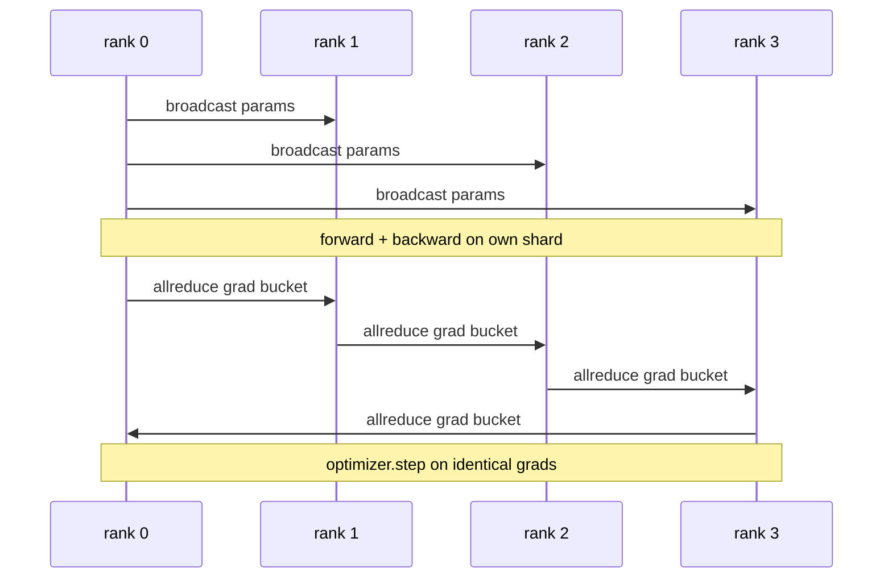

# Từ đầu dữ liệu và DDP

> DistributedDataParallel là một 子 trên tất cảreduce 子. Bao gồm một mô hình, từ 0 级 bắt đầu phát sóng các tham số ban đầu, vì vậy mỗi cấp độ đều bắt đầu giống nhau, lắp đặt một 子 về phía sau trên mỗi phát hành 子 của tất cảreduce 子, còn lại là 子 xuống ︎.

**Type:** Build
**Languages:** Python
**Prerequisites:** 第 19 期 Track C 课程 42-49
**Time:** ~90 分钟

## Học mục tiêu

- 连接一个 `DistributedDataParallel`形包装器, 包装器广播 始参数 và giảm gradient phía sau
- Spawn N CPU trong các tập tin dựa trên các cuộc họp của gloo  hậu kết  xếp hạng `torch.multiprocessing.spawn`
- Bằng cách tập luyện theo thứ tự trên cùng dữ liệu cùng mô hình và hiển thị tính tương đương của từng bước để chứng minh tính chính xác của thang đồng bộ.
- 捍卫储备桶 (梯度融合) và重叠 (向后通信) sử dụng, sẽ được xem là hai thay đổi của việc làm DDP 转换为生产 DDP.

## 问题

Có 12 GB tích cực mô hình 10 tỷ tham số không phù hợp với một tiêu dùng cấp GPU. Ngay cả khi phù hợp, đào tạo cũng cần vài tuần thời gian. Các tập dữ liệu sẽ được phân chia thành N 个 cấp, mỗi cấp tính toán về phía trước và phía sau của nó, và trong mỗi bước, từng cấp độ của các cấp độ sẽ được cộng lại, để tất cả các N 个 sao chép duy trì giống nhau.

Nếu không có thang đồng bộ,N 个副本 sẽ xảy ra sự phân chia ở bước 2 ∙ Mô hình này không còn là một mô hình được đào tạo trên nhiều dữ liệu hơn, mà tình cờ chia sẻ trọng lượng ban đầu của N 个独立模型. Nếu thang đồng bộ không tốt hơn (nếu mỗi tham số được giảm tất cả, không có chồng lên, không có thùng phân), mạng sẽ trở thành một chai, GPU sẽ chờ đợi tuyến.

## 概念



### DDP cần 3 hoạt động

|舞台|集体|为什么 |
|-------|-----------|-----|
|初始化|从排名 0 开始广播 |每个排名都以相同的参数开始 |
|后退|各梯度的 allreduce |平均梯度是优化器所采用的 |
|有时|缓冲区广播| Batchnorm 运行统计数据保持同步 |

### Tại sao là giá trị trung bình chứ không phải tổng cộng

Allreduce-SUM trừ với world_size lấy ra trung bình gradient。 giá trị trung bình đối với world_size là không thay đổi: tỷ lệ học tập trong một lớp điều chỉnh là hiệu quả trong bốn lớp, vì mỗi bước độ độ không thay đổi。 không có trừu tượng Allreduce-SUM sẽ buộc bạn phải làm tương tự trong mỗi lần thay đổi大小时重调学习率。 DDP 包装 SUM 并进行除法; trong khóa học làm tương tự。

### Tại sao phải dùng cái lồng thang?

Transformer có hàng ngàn số lượng tham số. Mỗi số lượng sẽ giảm tất cả một lần sẽ trả toàn bộ 延迟下限 hàng ngàn lần chi phí. DDP sẽ phân nhóm các thang độ vào khoảng 25 MB trong thùng chứa, và phát hành một allreduce cho mỗi thùng chứa.

### Tại sao phải cố định hạt giống

Mỗi cấp phải được điều chỉnh`torch.manual_seed(seed + rank)` để làm rửa, nhưng调用`torch.manual_seed(seed)` tiến hành khởi tạo các tham số.  Một hạt chia sẻ có nghĩa là mỗi cấp đều thấy cùng một chuỗi hàng loạt.  Đánh bại dữ liệu;  Một hạt cụ thể của các tham số có nghĩa là các tham số ban đầu không phù hợp với float epsilon, và thang đồng đều không còn làm cho bản sao giống nhau.


```figure
ci-ddp-grad-sync
```

##  xây dựng nó

`code/main.py`实现:

- `MiniMLP`3: MLP, nhỏ đến đủ để nhận trong vài giây, lớn đến đủ để lộ ra.
- `DistributedDataParallel(model, world_size)`: trong xây dựng, quay lại một bộ đóng gói,其`sync_grads`sẽ tích lũy tất cả giảm 求和梯度除以世界_size.
- `worker(rank, world_size, ...)`: Tham qua Gloo、前进、后退、同步、步进 tiến hành`torch.distributed`init's complete training cycle:
- `_reference_single_process_loop(...)`: trên một cấp độ theo thứ tự trên cùng dữ liệu đào tạo mô hình giống nhau, được sử dụng sau mỗi bước để kiểm tra các pha tử và các tham số tương đương.

运行 nó:

```bash
python3 code/main.py
```

输出: mỗi bước biểu đồ đào tạo, sẽ chỉ đơn quá trình mất mát và các tham số thử nghiệm và so sánh với DDP chạy trên 4 cấp độ 🏼 🏼 🏼 🏻 🏻 🏻 🏻 🏻 🏻 🏻 🏻 🏻 🏻 🏻 🏻 🏻 🏻 🏻 🏻 🏻 🏻 🏻 🏻 🏻 🏻 🏻 🏻 🏻 🏻 🏻 🏻 🏻 🏻 🏻 🏻 🏻 🏻 🏻 🏻 🏻 🏻 🏻 🏻 🏻 ♀️ ♀️ ♀️ ♀️ ♀️ ♀️ ♀️ ♀️ ♀️ ♀️ ♀️ ♀️ ♀️ ♀️ ♀️ ♀️ ♀️ ♀️ ♀️ ♀️ ♀️ ♀️ ♀️ ♀️ ♀️ ♀️ ♀️ ♀️ ♀️ ♀️ ♀️ ♀️ ♀️ ♀️ ♀️ ♀️ ♀️ ♀️ ♀️ ♀️ ♀️ ♀️ ♀️ ♀️ ♀️ ♀️ ♀️ ♀️ ♀️ ♀️ ♀️ ♀️ ♀️ ♀️ ♀️ ♀️ ♀️ ♀️ ♀️ ♀️ ♀️ ♀️ ♀️ ♀️ ♀️ ♀️ ♀️ ♀️ ♀️ ♀️ ♀️ ♀️ ♀️ ♀️ ♀️ ♀️ ♀️ ♀️ ♀️ ♀️ ♀️ ♀️ ♀️ ♀️ ♀️ ♀️ ♀️ ♀️ ♀️ ♀️ ♀️ ♀️ ♀️ ♀️ ♀️ ♀️ ♀️ ♀️ ♀️ ♀️ ♀️ ♀️ ♀️ ♀️ ♀️ ♀️ ♀️ ♀️ ♀️ ♀️ ♀️ ♀️ ♀️ ♀️ 

## 野外生产模式

三种模式使 DDP 硬化到足以发货.

**查找未使用的参数。**Một số chuyển phát đường có điều kiện nhảy qua các tham số (từ trước trôi qua các phương tiện khác)  Các tham số nhảy qua không có thang, nhưng các tham số sẵn sàng để bucket của DDP vẫn chờ đợi chúng và giảm tất cả các khóa chết `find_unused_parameters=True`Hãy nói với DDP trước khi giảm xem các tham số nào đạt được thang độ.

**静态图优化。**Khi chuyển phát qua các bước ổn định,`static_graph=True`让DDP 预先计算储备桶调度―― tối ưu hóa quy mô rất quan trọng: dự tính từng bước tiết kiệm vài millisecond, trong đó có 10.000 bước phức tạp――

**梯度累积需要小心。**Trong K 个微批, các bước khác nhau trên mức tích lũy sẽ đạt được tăng trưởng dung lượng 10 lần.`no_sync()`Công khai cho quản lý văn bản dưới đây, dùng để tạm dừng sau sau để giảm tất cả.

## Sử dụng nó

生产模式:

- **PyTorch DDP。**规范的实现―― `torch.nn.parallel.DistributedDataParallel(model)`连接分桶、重叠和 no_sync 上下文。
- **HuggingFace Accelerate。**添加一个处理 `torchrun`环境变量和模型包装的启动器──底层的DDP 相同──
- **Megatron-LM 数据并行。**Kết hợp DDP với các dòng chảy khối lượng để sử dụng cho các mô hình lớn; phần đường chảy dữ liệu là cùng một mô hình giảm tất cả sau ngược.

## 发货

第 78 课程: ZeRO 分片) sẽ thay thế tất cả các tham số của nó thành reduce_scatter, do đó mỗi cấp chỉ lưu trữ các phần của trạng thái của các trình tối ưu hóa của nó.

## 练习

1. Thêm được quy định các thùng thang nhỏ, và đo trên mô hình sâu hơn với mỗi tham số một allreduce của tốc độ tỷ lệ.
2. sẽ`no_sync()`实现为上下文管理器,并验证梯度累积与K个微批次单进程基线相相匹配.
3. thêm`find_unused_parameters`模式, trong đó trước đến đôi khi nhảy qua một trong các lớp MLP; nếu không có dấu hiệu này, hoạt động sẽ rơi vào 局。
4. sẽ thay thế cho`torch.distributed.barrier()`- chỉ có sự đồng bộ, cảm nhận được sự khác biệt giữa sự đồng bộ dựa trên tất cả các giảm và sự đồng bộ dựa trên rào cản.
5. 量批量大小为 1、16、256 的梯度同步开销作为步长时间的一部分,并解释缩小比例──

## 关键术语

|术语 |人们怎么说|它实际上意味着什么 |
|------|----------------|------------------------|
|DDP | “数据并行” |广播参数并减少每一步梯度的包装器 |
|桶| “保险丝梯度”| N组小都化为一大|
|重叠| “隐藏通讯” |当后面的层仍在向后计算时发出 allreduce |
|无同步 | 「积累」|跳过后向 allreduce 进行梯度累积 |
|查找未使用的 | “分支前进”|减少之前检测无梯度的参数 |

## 进一步阅读

- [PyTorch 分布式数据并行文档](https://pytorch.org/docs/stable/generated/torch.nn.parallel.DistributedDataParallel.html)
- PyTorch DDP内部教程](https://pytorch.org/tutorials/intermediate/ddp_tutorial.html(văn)
- [Li等人，PyTorch分布式：加速数据并行训练的经验](https://arxiv.org/abs/2006.15704)
- 第19阶段 第76 课 - Tập đoàn thành lập của DDP
- 第19 阶段 第78 课 - ZeRO 分片 sẽ giảm tất cả các参数 thay vì giảm_scatter
