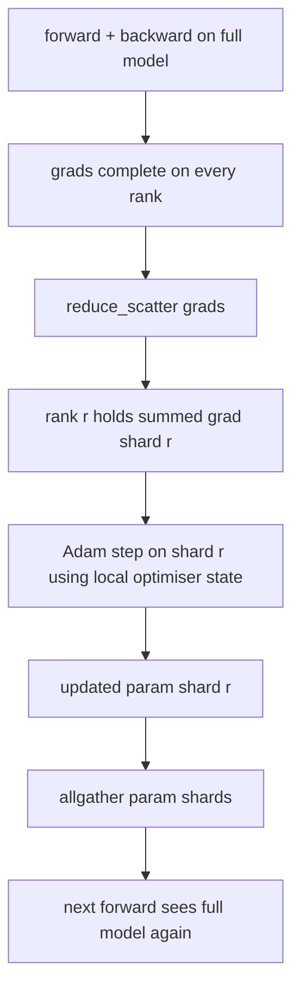

# ZeRO 优化器 trạng thái分片

> Adam dành cho mỗi bộ nhớ phân tích hai định giá, đều được lưu trữ theo dạng float32 ⋅ ⋅ ⋅ ⋅ ⋅ ⋅ ⋅ ⋅ ⋅ ⋅ ⋅ ⋅ ⋅ ⋅ ⋅ ⋅ ⋅ ⋅ ⋅ ⋅ ⋅ ⋅ ⋅ ⋅ ⋅ ⋅ ⋅ ⋅ ⋅ ⋅ ⋅ ⋅ ⋅ ⋅ ⋅ ⋅ ⋅ ⋅ ⋅ ⋅ ⋅ ⋅ ⋅ ⋅ ⋅ ⋅ ⋅ ⋅ ⋅ ⋅ ⋅ ⋅ ⋅ ⋅ ⋅ ⋅ ⋅ ⋅ ⋅ ⋅ ⋅ ⋅ ⋅ ⋅ ⋅ ⋅ ⋅ ⋅ ⋅ ⋅ ⋅ ⋅ ⋅ ⋅ ⋅ ⋅ ⋅ ⋅ ⋅ ⋅ ⋅ ⋅ ⋅ ⋅ ⋅ ⋅ ⋅ ⋅ ⋅ ⋅ ⋅ ⋅ ⋅ ⋅ ⋅ ⋅ ⋅ ⋅ ⋅ ⋅ ⋅ ⋅ ⋅ ⋅ ⋅ ⋅ ⋅ ⋅ ⋅ ⋅ ⋅ ⋅ ⋅ ⋅ ⋅ ⋅ ⋅ ⋅ ⋅ ⋅ ⋅ ⋅ ⋅ ⋅ ⋅ ⋅ ⋅ ⋅ ⋅ ⋅ ⋅ ⋅ ⋅ ⋅ ⋅ ⋅ ⋅ ⋅ ⋅ ⋅ ⋅ ⋅ ⋅ ⋅ ⋅ ⋅ ⋅ ⋅ ⋅ ⋅ ⋅ ⋅ ⋅ ⋅ ⋅ ⋅ ⋅ ⋅ ⋅ ⋅ ⋅ ⋅ ⋅ ⋅ ⋅ ⋅ ⋅ ⋅ ⋅ ⋅ ⋅ ⋅ ⋅ ⋅ ⋅ ⋅ ⋅ ⋅ ⋅ ⋅ ⋅ ⋅ ⋅ ⋅ ⋅ ⋅ ⋅ ⋅ ⋅ ⋅ ⋅ ⋅ ⋅ ⋅ ⋅ ⋅ ⋅ ⋅ ⋅ ⋅ ⋅ ⋅ ⋅ ⋅ ⋅                                                                               

**Type:** Build
**Languages:** Python
**Prerequisites:** 第 19 期 Track C 课程 42-49
**Time:** ~90 分钟

## Học mục tiêu

- N 个级的碎片优化器状态(第一时刻、第二时刻、fp32 主副本), do đó mỗi cấp có 1/N。
- Sử dụng giảm_scatter chỉ truyền tải từng cấp độ của các phần, sau đó tất cả sẽ được cập nhật các phần tử phần phát sóng trở lại.
- 根据普通 DDP 计算阶段 1、阶段 2、阶段 3 的内存节省表──
- Trong mô hình lớn và rộng ngân sách bảo vệ 1 giai đoạn 2, 2 giai đoạn và 3 giai đoạn lựa chọn.

## 问题

Vanilla DDP đã sao chép tất cả mọi thứ: các tham số, thang và trạng thái tối ưu hóa ở mỗi cấp độ đều hoàn toàn tồn tại. Đối với mô hình tham số 7B trong fp16, điều này có nghĩa là mỗi cấp độ 14 GB tham số, 14 GB thang và 28 GB trạng thái tối ưu hóa.

ZeRO giai đoạn thứ nhất thực hiện phân đoạn cho trạng thái tối ưu hóa. Mỗi cấp có 1/N của Adam 时刻. Sau đó, ZeRO sẽ không giảm toàn bộ phân đoạn và tiến vào địa phương, mà giảm_scatter, do đó mỗi cấp chỉ nhận được tổng số phân đoạn của mình.

## 概念



### giai đoạn của ZeRO

|阶段|分片对象 |每 rank 内存|每 step 通信|
|-------|----------------|------------------|---------------|
| DDP |无 |params + grads + optim | 1x allreduce |
| ZeRO-1 |optimizer state |params + grads + optim/N | 1x reduce_scatter + 1x allgather |
| ZeRO-2 |optim + grads |params + grads/N + optim/N | 1x reduce_scatter + 1x allgather |
| ZeRO-3 |optim + grads + params |params/N + grads/N + optim/N |每层 1x allgather + 每层 1x reduce_scatter |

giai đoạn thứ nhất là chiến thắng chi phí thấp nhất, vì tình trạng tối ưu hóa chủ yếu là ngân sách. giai đoạn thứ hai cần các bước chia tích lũy, nhưng cũng có cùng tỷ lệ. giai đoạn thứ ba (FSDP) trả cho mỗi bước đi trước và sau mỗi bước chi phí giao thông, để có được các tham số chia trong bộ nhớ giảm.

### 记忆数学, thực số

Đối với mô hình sử dụng Adam 以混合精度训练 có P 参数:

|术语 |vanilla|ZeRO-1 |为什么 |
|------|---------|--------|-----|
| fp16 参数 | 2P字节| 2P字节|需要转发|
| FP16 梯度 | 2P字节| 2P字节|需要落后|
| fp32 母版 | 4P字节| 4P/N 字节 |只有最优化的人才会使用它 |
| fp32 第一时刻 | 4P字节| 4P/N 字节 |只有最优化的人才会使用它 |
| fp32 第二时刻 | 4P字节| 4P/N 字节 |只有最优化的人才会使用它 |
|总计 | 16P字节| 4P + 12P/N 字节 |   |

N=8 时:vanilla 16P,ZeRO-1 5.5P, giảm 65%。 N=64 时:vanilla 16P,ZeRO-1 4.19P, giảm 74%。

### Tại sao giảm_scatter  tốt hơn tất cả giảm-sau-các mảnh

Allreduce cho mỗi cấp độ cung cấp đầy đủ nhu cầu và thang độ. Nếu chỉ cần phần r, thì giảm của thang độ của(N-1) /N sẽ mất phí trên. Reduce_scatter 准确交付每个级别拥有的分片; mỗi cấp độ của字节与allreduce相同(因为allreduce是reduce_scatter +allgather), nhưng nửa sau sau sau được thay thế một chút.


```figure
cd-zero-shard
```

##  xây dựng nó

`code/main.py`实现:

- `flatten_params(module)`和 `unflatten_into(module, flat)`Để phân tích mô hình được gói gọn thành một khối lượng liên tục và giải quyết lại.
- `ZeroOptimizer(model, world_size, rank, lr)`Có bản sao chính và những mảnh vụn cấp bậc của thời điểm đó.
- `step()`Trong trình độ bình thường, chạy giảm_scatter, sẽ sử dụng Adam  ứng dụng cho phân đoạn xếp hạng, và sẽ thu thập tất cả các tham số mới lại.
- Một bài thuyết trình, tập luyện 3 tầng MLP 20 bước, và in ấn ngân sách lưu trữ của mỗi bước cũng như đường cơ sở DDP thông thường.

运行 nó:

```bash
python3 code/main.py
```

输出: mỗi bước mất và biểu đồ ghi nhớ cho thấy ZeRO-1 so với bản sao hoàn chỉnh của DDP, giữ được trạng thái tối ưu hóa 1/N trên mỗi cấp độ.

## 野外生产模式

三种模式使 ZeRO 足以交付──

**分片检查点很重要。**Các điểm kiểm tra phải ghi lại những gì mà các cấp độ có. Chương 80 đã xây dựng một danh sách các điểm kiểm tra phân đoạn, trong đó danh sách này đã phục hồi hoạt động của ZeRO trên cùng một thế giới nhỏ. Nếu không có nó, trạng thái lưu trữ sẽ không thể đọc được khi khởi động lại.

**混合精度是重点。**ZeRO là một công nghệ độ chính xác hỗn hợp; fp32 主副本是分片的. Trong trường hợp không có độ chính xác hỗn hợp, ZeRO sẽ đưa ra thuế lưu trữ trong fp32 master, mà không có tương ứng của fp16 trước để chiến thắng.

**第一阶段几乎是免费的。**通信在带宽方面与DDP相似──内存节省与N 成线性关系──唯一成本是优化器分片的簿记──生产堆默认为阶段1,除非参数分片内存也是一个问题;然后第二或第三阶段用通信换取内存──

## Sử dụng nó

生产模式:

- **DeepSpeed ZeRO。**Để thực hiện.`deepspeed_config.json`选择阶段 1/2/3 和分区大小──
- **PyTorch FSDP。**PyTorch 原生等效项`ShardingStrategy.SHARD_GRAD_OP`是ZeRO-2; `FULL_SHARD`- Đó là ZeRO-3.
- **HuggingFace Accelerate。**Để DeepSpeed và FSDP 封装 trong cấu hình thống nhất

## 发货

第 79 课 管并行) là một trục phân đoạn: ống không phải là một mô hình khác nhau đối với trạng thái tối ưu hóa để thực hiện phân đoạn, mà là một trình độ khác nhau để thực hiện phân đoạn.

## 练习

1. Thông qua thang độ phân đoạn mở rộng đến ZeRO-2: Mỗi cấp chỉ lưu trữ thang độ phân đoạn của mình, thông qua phần không phân đoạn sau đó sẽ được thực hiện trong ngược lại.
2. Thêm một bộ phân tích bộ nhớ, được sử dụng để in thực tế fp32 字节 sử dụng và các trường hợp dự đoán chính thức trên lớp 0 
3. 测量普通 DDP với ZeRO-1 mỗi bước đính kèm thời gian,并将其分解为前向、后向、通信。
4. Trong ZeRO-1 下实现梯度裁剪: phải thông qua các phương diện số lượng vuông của tất cả giảm 跨所有分片计算 L2 范数。
5. Sử dụng allreduce thay vì reduce_scatter 实现naive ZeRO, đo lường đường thời gian khác biệt.

## 关键术语

|术语 |人们怎么说|它实际上意味着什么 |
|------|----------------|------------------------|
|ZeRO-1 | “优化器分片”|每个等级拥有 1/N 的 fp32 master + Adam 时刻 |
| ZeRO-2 | “grads 也分片”|每个 rank 在 reduce_scatter 后也会丢弃非本分片的梯度 |
|ZeRO-3 | “分片参数” |每个等级保存 1/N 的 fp16 参数；向前每层allgather |
|master copy| “fp32 权重”|高精度参数复制优化器更新|
|reduce_scatter | “平分总和”|仅提供每个等级其分片的梯度总和 |

## 进一步阅读

- [Rajbhandari 等人，ZeRO：训练万亿参数模型的内存优化](https://arxiv.org/abs/1910.02054)
- [DeepSpeed ZeRO 文档](https://www.deepspeed.ai/tutorials/zero/)
- [PyTorch FSDP 文档](https://pytorch.org/docs/stable/fsdp.html)
- 第19阶段 第76课 - 本课涉及的减少_散播和全集
- 第19 阶段 第80 课 - ZeRO 状态必须使用的分片检查点
