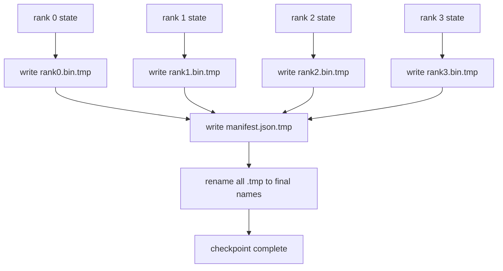

# 分片 kiểm tra điểm và nguyên tử phục hồi

> Mỗi vài giờ, chúng tôi sẽ tạm dừng các hoạt động đào tạo của các tham số 70B vì sự cố của các nút. Các hình thức của các điểm kiểm tra quyết định bạn bị mất 30 phút hay 30 giờ. Các điểm kiểm tra phân đoạn sẽ cùng nhau viết vào mỗi phân đoạn của mỗi cấp độ và ghi lại quyền sở hữu trong danh sách.

**Type:** Build
**Languages:** Python
**Prerequisites:** 第 19 期 Track C 课程 42-49
**Time:** ~90 分钟

## Học mục tiêu

- Các điểm kiểm tra nhiều cấp được lưu lại cho từng cấp độ phân loại các tài liệu và ghi lại những gì cấp độ có.
- Sử dụng nguyên tử viết vào mô hình ([[写入临时路径然后重命名]]), do đó sự sụp đổ trong quá trình viết không bao giờ tạo ra một điểm kiểm tra hoàn thành nửa.
- Từ kiểm toán trong phục hồi, xác nhận từng cấp độ trên fp16 参数 và ZeRO 优化器状态字节相等状态.
- 保护清单架构免受三种故障模式的影响: toàn局大小变更、分片计数不匹配和部分写入──

## 问题

Các điểm kiểm tra thường sẽ đọc tất cả các tham số và trạng thái tối ưu hóa đến cấp 0, thu thập và viết vào một tập tin đơn lẻ. Đối với mô hình 70B, thông qua cổng mạng cấp một cấp cung cấp 1.1 TB trạng thái. Việc viết sẽ ngăn chặn tất cả các cấp độ khác, vì chúng trống chờ để thu thập.

Các điểm kiểm tra phân đoạn đã chuyển đổi mô hình: mỗi cấp sẽ có phân đoạn của mình và viết vào các tài liệu của mình. Các điểm kiểm tra phân đoạn ghi lại các cấp có phân đoạn nào, do đó, việc phục hồi có thể đưa mỗi phân đoạn trở lại nguồn gốc của nó.

## 概念



### 清单架构

```json
{
  "world_size": 4,
  "step": 1234,
  "wall_clock_seconds": 4521,
  "shards": [
    {"rank": 0, "path": "rank0.bin", "sha256": "...", "param_shard_offset": 0, "param_shard_numel": 65536},
    {"rank": 1, "path": "rank1.bin", "sha256": "...", "param_shard_offset": 65536, "param_shard_numel": 65536}
  ],
  "schema_version": 1
}
```

Ba trận đấu đều có trọng lượng.`world_size`Để làm cho các đơn giản lớn khác nhau thất bại, thay vì bị hư hỏng lặng lẽ.`sha256`抓取部分或损坏的写入──每个分片的 `param_shard_offset`和 `param_shard_numel`让载体在正确位置重建平面参数张量──

### 原子写入

标准模式:将每个分片写入 `<name>.tmp`,将清单写入 `manifest.json.tmp`,fsync Mỗi phân đoạn, sau đó đặt tên lại. POSIX trong hệ thống tài liệu đó đặt tên lại là nguyên tử; hoặc là tài liệu mới hoàn toàn tồn tại, hoặc là tài liệu cũ hoàn toàn tồn tại.

### 模式 phải phòng thủ của 3 kiểu cố định

|失败|症状|防御|
|---------|---------|---------|
|世界规模的变化|在 N=8 上恢复，并从 N=4 开始清单 |清单中的 world_size 不匹配，大声失败 |
|分片数量不匹配 |resume 看到的 rank*.bin 文件少于 manifest 中的分片 |枚举分片，验证每个分片都存在 |
|部分写入|分片文件在刷新过程中被截断|加载时进行 sha256 验证 |

Mỗi phòng thủ sẽ từ chối tải trọng xấu sớm nhất có thể; một lựa chọn khác là bị hư hỏng tĩnh lặng, khi mất mát biến thành NaN, sau 100 bước sẽ xảy ra những hư hỏng này.

### Tại sao là một tài liệu của từng cấp độ, chứ không phải là một tài liệu lớn

 Thông qua `O_APPEND`Để một file được phát hành để viết được áp dụng cho các chữ cái POSIX để viết, nhưng thực tế, sự chuyển động trong một phân đoạn trong một phần vượt qua một khu vực lớn của MB, và được khóa chiếm vị trí thống trị. Khi hệ thống tài liệu tầng dưới là đồng hành, mỗi cấp độ của các file không được tranh chấp, và có thể được hưởng lợi từ các điều khoản. Do đó, sản xuất tập tin: DeepSpeed, FSDP, NeMo đều sử dụng mỗi cấp độ.


```figure
ci-sharded-checkpoint
```

##  xây dựng nó

`code/main.py`实现:

- `ShardManifest`Các loại dữ liệu, có cấu trúc trên`to_json`- Không.`from_json`
- `save_sharded(state_dict_per_rank, dir, step)`Sử dụng nguyên tử tạm thời rồi đặt tên lại mô hình sẽ viết mỗi cấp độ của trạng thái thứ hai vào tài liệu của riêng mình, sau đó viết vào danh sách.
- `load_sharded(dir, expected_world_size)`读取清单,验证 từng phần của sha256,并返回 từng cấp độ của trạng thái字典──
- 往返测试:构建每列状态、保存、加载、断言字节相等──

运行 nó:

```bash
python3 code/main.py
```

输出:4 个分片文件以及写入的清单, sau đó qua字节相等验证重新加载──

## 野外生产模式

三种模式使检查点 đủ vững chắc để vận chuyển.

**异步写入。**生产堆 trên một đường hoặc quá trình riêng biệt phát hành điểm kiểm tra để ghi lại, để đào tạo tiếp tục tiến hành.`async_io`标志正是这样做. 标志正是这样做. 标志正是这样做.

**先本地快速磁盘，然后异步上传。**写入本地 NVMe(快速), sau đó异步上传到S3 hoặc GCS──两层模式使集群内检查点能够快速恢复,同时将持久副本发送到集群外进行存档──清单携带本地路径;上传清单携带远程路径──

**轮换很重要。**Trong khi đó, các máy tính sẽ được sử dụng để kiểm tra các điểm kiểm tra đầu tiên. Nếu không quay, đĩa sẽ được lấp đầy trong quá trình kiểm tra, và điểm kiểm tra tiếp theo sẽ thất bại.

## Sử dụng nó

生产模式:

- **DeepSpeed 检查点。** `deepspeed.save_checkpoint(tag=step)` viết vào mỗi cấp hồ sơ và chỉ dẫn các nhãn hoạt động `latest`文件──
- **PyTorch FSDP 检查点。** `torch.distributed.checkpoint`Sử dụng quyết định của mỗi cấp độ`Planner`保存分片状态──
- **NeMo.**Sử dụng thêm dữ liệu thống nhất`save_to_checkpoint`API 封装 DeepSpeed và FSDP

## 发货

Chương 81 课保存端到端 DDP+ZeRO 运行的分片检查点, và tải lại nó trên cùng một thế giới nhỏ, để chứng minh sự tái lập của hiệp ước.

## 练习

1. 添加异步写入: 在线程中启动保存并让训练继续──阻止下一次保存,直到下一次保存完成──
2. 添加 `last_5_steps`轮换: giữ lại 5 điểm kiểm tra gần đây nhất, xóa các điểm kiểm tra cũ nhất, sau đó lưu lại các điểm kiểm tra mới.
3. Để trong vòng lặp tái tải thêm chỉ CRC của đường nhanh kiểm tra (快速验证路径)
4. 添加跨世界小的负载: thông qua đọc清单、连接和重新分片, sẽ phân đoạn tái cân bằng từ N=4 đến N=8。
5. 将上传添加到假S3(第二目录)并编写上传清单──捍卫两层存储策略──

## 关键术语

|术语 |人们怎么说|它实际上意味着什么 |
|------|----------------|------------------------|
|分片检查点 | “按等级保存”|每个rank并行写入自己的分片文件|
|清单 | “索引”|记录分片路径、偏移量和 sha256 的 JSON 文件 |
|原子写| “tmp 然后重命名” |写入 .tmp，然后 POSIX 重命名，以便崩溃使先前的文件保持活动状态 |
|部分写入| “截断的碎片” |写入过程中的崩溃会产生损坏的分片； sha256 抓住它 |
|旋转| “保留最后 K”|在写入新检查点以限制磁盘使用量之前删除最旧的检查点 |

## 进一步阅读

- [DeepSpeed 检查点](https://www.deepspeed.ai/tutorials/checkpointing/)
- [PyTorch torch.distributed.checkpoint](https://pytorch.org/docs/stable/distributed.checkpoint.html)
- [POSIX重命名原子性](https://pubs.opengroup.org/onlinepubs/9699919799/functions/rename.html)
- 第19阶段 第78 课 - 此检查点旨在保存的ZERO状态
- 第19 阶段 第81 课 - 端到端演示往返保存的状态
