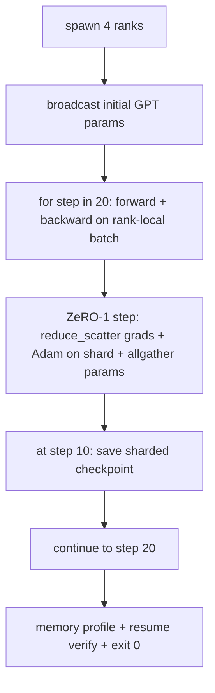

# 端到端分布式训练

> 第 76 课到第 80 课各拼 一件作品──这是组件: một GPT kiểu nhỏ được đào tạo trên 4 模拟队列, sử dụng DDP để thực hiện thang đồng bộ, ZeRO-1 sử dụng cho trạng thái tối ưu hóa phân mảnh, cũng như điểm kiểm tra phân mảnh ở giữa điểm.

**Type:** Build
**Languages:** Python
**Prerequisites:** 第 19 期 Track C 课程 42-49
**Time:** ~90 分钟

## Học mục tiêu

- 将 DDP(第 77 课) 加上 ZeRO-1(第 78 课) 加上分片检查点(第 80 课) thành lập một vòng tập luyện.
- Trong bộ bưu tập ngôn ngữ tổng hợp nhỏ tập luyện 2 tầng Transformer 语言模型, trải qua 4 lớp mô phỏng thực hiện 20 bước.
- 印每步丢失表,每列内存配置文件以及在同一世界小上恢复字节相等的检查点清单.
- Defendre: Mỗi tác phẩm có thể được thử nghiệm độc lập trong các bài học trước đó, bài học này chứng minh chúng là bài hát.

## 问题

Capstone là bằng chứng cho thấy các phần được kết hợp lại với nhau. Chương 76 thực hiện tập thể. Chương 77 sẽ đưa chúng vào DDP. Chương 78 sử dụng giảm_scatter phân chia tối ưu hóa trạng thái. Chương 79 phân tích đường ống. Chương 80 lưu giữ một phân đoạn kiểm tra điểm. Mỗi chương có thử nghiệm của riêng mình.

Chương trình này hoạt động từ cuối đến cuối trình bày并验证四个不变量: a) Khá lỗ trong 20 bước trong tiếng ồn浮动 đơn调减少, b) Mỗi cấp giữ số tham số trong mỗi bước, c) Mỗi cấp tối ưu hóa trong bộ nhớ tương đương với ZeRO-1 公式 12P/N 字节, và d) bước 10 điểm kiểm tra ở các bước tái khởi động khi tái tải 字节 phases, vv. trình tự kết thúc: 20 bước, đơn lệnh, xuất 0.

## 概念



### 迷你 GPT

Mô hình này cố tình rất nhỏ: 2 个Transformer块、嵌入dim 32、4 个注意力头、词汇 64、序列长度 16、批次 4。 vài ngàn参数。 đủ lớn để thực hiện mỗi kết nối quyết định(多头注意力运行标准屏蔽路径;LayerNorm có thể đồng bộ hóa trọng lượng;LM 头是返回词汇的单独线性投影)。 đủ nhỏ, 4 个 CPU cấp độ 20 个步骤可以完成在几秒内──

### 组成规则

|课程片段 |它拥有什么 |它留给循环什么？
|--------------|--------------|----------------------------|
| DDP广播 |初始参数同步 |构建时一次调用 |
| ZeRO-1 步骤 |梯度同步、母版更新、参数广播 |每一步调用一次，替换 optimiser.step |
|分片检查点 |保持每等级状态，用 sha256 体现 |通过 allgather 收集状态，调用等级 0 |
|训练循环 |向前、向后、丢失记录 |按顺序调用以上三个 |

Các vòng lặp không biết về giảm_scatter hoặc hẹn 文件── ZeRO và kiểm tra điểm mô-đun mở các giao tiếp khép kín của vòng lặp thành lập──

### Tại sao là GPT nhỏ và không chỉ là MLP

Trong bài học thứ 77 MLP 足以验证梯度同步── một GPT nhỏ đã thêm ba điều: một đầu LM riêng biệt trên từ ngữ, trong bài học này, để rõ ràng bắt đầu, sẽ giải thích nó; GPT hoàn chỉnh thường sẽ liên kết với đầu vào token (bước lên),softmax+交叉 như một tổn thất (nếu có nhiều giá trị số hơn MSE), cũng như một hướng trước không đối xứng (nếu được đặt vào và sau đó là chú ý, sau đó là mỗi lớp MLP)── cố gắng sử dụng MLP như một Capstone sẽ ẩn chứa liệu LayerNorm hoặc các lớp được xử lý đúng không.

### Từ cuối nghĩa là rút khỏi 0

循环运行固定的20 步并退出──没有`while True`, không có người can thiệp, không có sự phục hồi từ trạng thái bên ngoài. Bạn có thể chạy trong tình trạng vô người và sau khi hoàn thành, bạn có thể tìm thấy toàn bộ ghi chép của Capstone là chứng minh hệ thống kết nối chính xác của Capstone. Nếu bất kỳ phần nào bị mắc kẹt trong 局, màn trình diễn sẽ không bao giờ quay lại, và thiết bị thử nghiệm sẽ bắt được nó.


```figure
ci-distributed-assembly
```

##  xây dựng nó

`code/main.py`实现:

- `MiniGPT`Có 2 tầng của đầu LM tự tập trung và độc lập
- `make_corpus(seed, total_tokens)`: xác định性的下一个token预测数据──
- `_train_worker`: theo cấp độ tạo;广播初始化参数,运行循环,调用 ZeRO 步骤,在步骤 10 写入分片检查点──
- `verify_resume`: sau khi chạy chủ, kiểm tra bước thứ 10 trong quá trình tải lại,并 khẳng định lưu trữ phần chủ với bộ nhớ trong nhanh照逐字节匹配.
- `main`: sắp xếp toàn bộ trình bày, in mất bảng, lưu trữ hồ sơ cấu hình và kết quả xác minh

运行 nó:

```bash
python3 code/main.py
```

输出:20 行丢失表,4 行 mỗi列内存配置文件, kiểm tra điểm清单, cũng như thành công của RESUME VERIFIED行。

## 野外生产模式

三种模式完成真实运行的构图.

**每 K 分钟检查一次，而不是每 K 步骤一次。**步骤时间随着次数的长度和微量计数而变化――无论模型大小如何,10分钟的检查点节奏都捕获相同的计算――为了简单而起见,本课程使用步骤的方法;生产采用挂钟的方法――

**及早检测分歧。**生产运行在向后添加 NaN 防护和丢失尖峰检测器; nếu mất mát trong bước nhảy hơn 2 lần, thì quay lại đến điểm kiểm tra trước, thay vì để cho tối ưu hóa vào trạng thái suy giảm.

**跨等级聚合内存配置文件。**Mỗi cấp có hoạt động thực tế trong các cấp độ khác nhau với cấp độ có cấp độ ống lớn nhất có nhiều hoạt động hơn)  ghi chép sản xuất của mỗi cấp độ có giá trị tối đa cộng với giá trị trung bình; bài viết này được in theo cấp độ để hiển thị các công thức phù hợp 

## Sử dụng nó

生产模式:

- **DeepSpeed.**Trong một cấu hình kết hợp DDP + ZeRO + ống +  kích hoạt điểm kiểm tra.
- **PyTorch FSDP。**本机等效项.`FullyShardedDataParallel`和 `ShardingStrategy.SHARD_GRAD_OP`- Đó là ZeRO-2.
- **NeMo 和 Megatron-LM。**Đối với mô hình lớn nhất, thêm 张量并行; nếu không, cấu trúc của hợp chất giống nhau.

## 发货

完整曲目到此结束── 6 khóa học này cùng nhau tạo thành một nhóm thực sự sẽ xây dựng hệ thống đào tạo phân tán trước khi áp dụng DeepSpeed; trừu tượng này đã được chứng minh nhắm vào toàn cầu, và mô hình cố tình đã được sử dụng──第17 阶段 (基础设施和生产) là nơi nó sẽ chuyển thành tập hợp thực sự.

## 练习

1. Tăng lượng và mất tích của đầu tập trung tăng lên và giảm đi.
2. Thêm 4 khối nhỏ tích lũy độ, và chứng minh độ bằng với một khối lớn độ.
3. Thêm thêm một bài từ bước 10  bắt đầu trở lại, đường này thực sự tiếp tục tập luyện đến bước 20, và tạo ra cùng một tổn thất cuối cùng với hoạt động ban đầu.
4. sẽ chỉ định xuất hiện (), để sau đó có thể hiển thị các hoạt động.
5. Thêm một NaN  phòng thủ, quay lại vào điểm kiểm tra trước khi bị mất, và sử dụng một bước LR  nhân số đỉnh mạnh để thực hiện quay lại.

## 关键术语

|术语 |人们怎么说|它实际上意味着什么 |
|------|----------------|------------------------|
|端到端| “将一切连接起来”|一次运行构成了每个部分，而不是每个部分的单元测试 |
|内存简介 | “每级 GB”|每个等级上保存的参数、梯度、优化器状态的字节数 |
|简历合同 | “保存并加载”|检查点往返后每列状态字节相等 |
|自动终止 | “有界奔跑”|固定步数，完成后退出 0，循环中没有人 |

## 进一步阅读

- DeepSpeed端到端训练教程](https://www.deepspeed.ai/getting-started/(văn)
- PyTorch FSDP进阶教程](https://pytorch.org/tutorials/intermediate/FSDP_advanced_tutorial.html(văn)
- Megatron-LM training脚本参考](https://github.com/NVIDIA/Megatron-LM(văn)
- 第 19 阶段 第 76 - 80 课 - 本课组成的每首曲子
- 第17 阶段 - sẽ chuyển tập hợp sang thực tập
