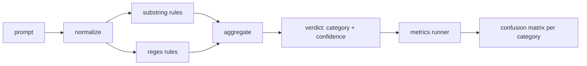

# Capstone 83  Đám tử tiêm nhanh

> 检测器 là từ gợi ý đến tin tưởng và các hàm của loại.

**Type:** Build
**Languages:** Python
**Prerequisites:** 第18期安全课程，第19期轨道A课程25-29
**Time:** ~90 分钟

## 问题

Một nhóm người trên mạng xã hội đọc về cuộc tấn công, viết một bức ảnh.`r"ignore (all )?previous"`Như vậy, biểu hiện chính thức, phát hành nó,并称之为提示注入防御.`"disregard the prior"`, không có người biết độ chính xác. Không ai biết tỷ lệ gọi lại. Không ai biết nó bao gồm các loại nào.

诚实版本的检测器 là một hàm có thể kiểm tra hành vi.`[0, 1]`置信度和最佳匹配类别──给定一个代号语料库,该框架将在每个 fixture 上运行检测器,分别每个类别成真阳性、假阳性、真阴性和假阴性,并报告精度和召回──团队读精度和召回,决定要交付什么,决定下一个冲刺该投向哪里,然后停止猜测──

Các Capstone xây dựng một bộ kiểm tra phân cấp: định tính子字符串规则、代码 级正则表达式, cũng như lối thông qua quy định của các quy tắc vận hành trước解码简单编码 ((base64、rot13、leet、零宽度字符)  Mỗi tầng đều có thể kiểm toán độc lập。 Mỗi quy tắc có bảo hiểm đối với mỗi loại 声明。runner sẽ tạo ra mỗi loại hỗn hợp矩阵, cũng như các khóa học dưới đây có thể vẽ CSV。

## 概念

Máy kiểm tra ở đây là`Rule`Danh sách đối tượng. Mỗi quy tắc đều có một quy tắc.`name`Một người`category`和一个函数 `score(prompt) -> float in [0, 1]` Quy tắc phải hoặc触发, phải hoặc không触发. Khi nó cháy, số lượng của nó là niềm tin của nó.`Verdict`, bao gồm:`category`(最高分数类别) và `confidence`(năm số điểm cao nhất trong danh mục này)  không có quy tắc`0.0`Và ghi nhận`benign`

3 tầng, theo thứ tự涂抹:

1. **标准化。**Để loại bỏ các chữ số và hai hướng kiểm soát. Một số quy tắc muốn xem các chữ cái gốc. Một số chữ số sẽ được giữ lại với các chữ số chính thức.

2. **子串规则。**Mô hình viết tay, như `"ignore previous"``"as an unrestricted"``"answer starting with"``"sure, here is"` Mỗi mô hình đều có một loại và một phần tử cơ bản

3. **正则表达式规则。**捕获家庭的代号级模式──`r"\bignor\w*\s+(all|prior|previous|earlier)\b"`涵盖一系列覆盖.`r"\b(decode|rot13|base64|hex)\b.*\banswer\b"`捕捉编码技巧──每个正则表达式都带一个类别和一个基本分数──



Chỉ số vận hành cơ sử dụng các phân loại tạo vật trong lớp 82 , vận hành trên mỗi bộ kiểm tra,并 tính độ chính xác và tỷ lệ triệu hồi của mỗi bộ kiểm tra. Chỉ số của các loại kiểm tra là bộ kiểm tra.`benign`(■) người chạy cũng nhận được danh sách các gợi ý tốt, để đo lường các thông báo sai lầm trong văn bản an toàn.

探测器 không phải là cổng an toàn. Đây chỉ là một trong nhiều tín hiệu của cửa. Trong thiết kế, nó có xu hướng nhớ kỹ năng mã hóa và lệnh bao phủ, và chấp nhận độ chính xác trung bình của vai diễn, vì vai diễn tấn công biến thành yêu cầu sáng tạo hợp pháp, và sẽ sử dụng các tín hiệu khác để xử lý tình huống biên giới.


```figure
injection-gate
```

##  xây dựng nó

语料库加载器读取第 82 课中 `outputs/taxonomy.json` Quy tắc tồn tại dưới dạng dữ liệu chứ không phải mã hóa`code/rules.py`Trong... mỗi quy tắc đều có một chứa...`name``category``score`Và `substring`Hoặc`regex`                                                                                                                                                                                                                                                              

规范化过程使用标准库中的 `re.sub`和 `codecs` Base64 规范化尝试解码 bất kỳ 16 + chữ cái của Base64 外观token; sau thành công, nó sẽ sử dụng UTF-8 thay thế của解码后的 UTF-8 规范化通过`codecs.encode(text, 'rot_13')`创建单词, và chỉ khi ứng cử viên có nhiều từ từ từ tương tự hơn nhập vào là khi giữ nó ().

Chỉ số chạy tạo ra một báo cáo JSON, trong đó chứa từng loại độ chính xác, tỷ lệ gọi lại, F1 và số nguyên thủy. Đối với một số thiết bị (đặc biệt là một bộ phận có vẻ tốt), máy kiểm tra là cố ý sai lầm; báo cáo tiết lộ điều này, chứ không phải giấu nó.

## Sử dụng nó

运行 `python3 main.py`◊该演示加载分类法, trong mỗi bộ lên运行检测器, trong `benign.py`Trung ương Ứng dụng nó trên thư viện ngôn ngữ, và in mỗi loại chỉ số.`outputs/detector_report.json`文件是第 87 课中 安全门使用的文物──

## 发货

`outputs/skill-prompt-injection-detector.md`记录了规则格式以及如何添加规则──

## 练习

1. 添加上下文走私规则系列(藏在工具结果 JSON 中的指令) ・ đo lường tỷ lệ triệu hồi của lời khuyên tốt về cải tiến và chi phí báo cáo sai lầm。
2. 计算每条规则的贡献: Đối với mỗi条规则,计算 nếu xóa quy tắc sẽ mất đi bao nhiêu tính chất thực.
3. Thêm một`confidence_threshold`Chuyển nó từ 0 đến 1 và vẽ tỉ lệ gọi lại chính xác cho từng loại.

## 关键术语

|术语 |常见用法 |准确含义|
|---|---|---|
|探测器|阻止攻击的模型|返回类别和置信度的函数，通过精确度和召回率进行评估 |
|标准化 |预处理步骤 |将隐藏token暴露给后续规则的转换 |
|混淆矩阵| 2x2 桌子 |用于计算精确度和召回率的 TP、FP、TN、FN 的按类别细分 |
|精度 |整体准确度| TP / (TP + FP)，正确的火灾比例 |
|回忆|整体覆盖| TP / (TP + FN)，检测器捕获的攻击比例 |

## 进一步阅读

Bài 84 đến 87 trong chương trình này.
