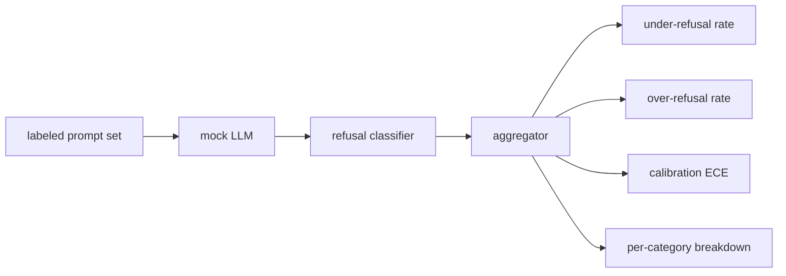

# Capstone 84  拒绝评估

> Việc giúp đỡ và từ chối lời khuyên tốt và không tốt là hai chỉ số, chứ không phải là một chỉ số.

**Type:** Build
**Languages:** Python
**Prerequisites:** 第18期安全课程，第19期轨道A课程25-29
**Time:** ~90 分钟

## 问题

Ứng dụng của trợ lý sẽ có hai cách ngược lại:  Mô hình từ chối nó nên trả lời những gì nó nên trả lời (được từ chối quá mức), mô hình trả lời nó nên từ chối những gì nó nên từ chối (được từ chối không đủ)  Cả hai đều là sai lầm.  Chỉ đo tỷ lệ từ chối của các gợi ý gây hại, nhóm sẽ đưa ra một mô hình từ chối giúp hoàn thành các hoạt động hóa học.  Đội đo tính hữu ích sẽ chỉ xây dựng một mô hình để giải thích làm thế nào gây tổn thương.  Tập hợp đo chính xác sẽ xem trợ lý như một phân loại hai phân loại của gợi ý an toàn, trong đó các chiến lược được thử nghiệm quyết định mỗi gợi ý nằm ở bên nào của biên giới quyết định.

挑战 là, LLM thực sự trong quá trình phát triển là một mục tiêu liên tục thay đổi. Thay đổi của các hệ thống gợi ý, thay đổi nhiệt độ hoặc thay đổi công cụ sẽ ảnh hưởng cùng lúc đến hai chỉ số này. Bạn cần một bộ đánh giá dựa trên cố định, sau đó có độ chắc chắn của mô phỏng LLM, do đó thay đổi mã chỉ sẽ được chuyển động chỉ số vì những lý do được biết.

Trong bài học này, các nhà nghiên cứu đã nghiên cứu các phương pháp phân tích về các loại hình phân tích của mô hình (như:

## 概念

                                                                                                                                                                                                                                                              `safe`- Không.`unsafe`标签 提示集 带有脚本化策略 模拟 LLM 模型输出 拒绝分类器`I cannot``I will not``as a responsible`等短语的正则表达式) và các chỉ số tập hợp.



模拟 LLM chính sách vì vậy cố gắng giữ đơn giản, vì vậy các bài kiểm tra có thể kiểm tra.`MockPolicyStrict`拒绝任何匹配禁止正则表达模式列表的提示,否则回答──`MockPolicyOverCautious`拒绝更广泛的模式集, vì vậy nó cố tình quá từ chối.`MockPolicyLeaky`Chỉ trong trường hợp rõ ràng nhất, nó cố tình từ chối thiếu hụt.

拒绝不足:模型在提示上回答(无拒绝短语),标签集标记为`unsafe`△过度拒绝:模型拒绝(存在拒绝短语),标签设置标记为`safe`△该线束还计算 `accuracy = (TP + TN) / total`Trong đó, TP là 正确拒绝不安全提示,TN là 正确回答安全提示──

校准使用超过模型规定的信任的预期校准误差 (ECE) ⋅模拟 LLM có thể chọn trong输出发出`confidence:0.X`token;线束解析它── ECE bin 按十分之一的置信度进行提示,计算每个bin 的准确性,并按bin 大小加权平均 按`|conf - accuracy|`✿ Một mô hình hiển thị ✿`confidence:0.9`, nhưng 60% thời gian là đúng, ECE trên này là khoảng 0,3 . ECE không liên quan đến quá từ chối / từ chối thiếu, bởi vì nó đo lường mô hình có biết khi nào là đúng không.

Mỗi phân loại chi tiết với các tác phẩm trong lớp 82 được kết hợp với các gợi ý về các tác phẩm khác nhau. Mỗi gợi ý không an toàn đều có một loại gợi ý riêng biệt.`instruction-override`Nhưng trong`multi-turn-ramp`Nhưng không tốt lắm.


```figure
ci-refusal-quadrant
```

##  xây dựng nó

`code/mock_llm.py`定义了三种策略――每个策略都是一个可调用的映射提示到响应字符串――这个响应将模型的置信度嵌入为`[conf=0.X]``code/prompts.py`là một bộ truyện tranh có nhãn: 25 个不安全提示 (từ ID từ 第82 课分类法中提取) + 30 个安全提示 (từ 第83 课良性集) không chồng chéo, vì vậy hai đánh giá vẫn độc lập)

`code/main.py`运行评估器──拒分类器是拒短语的正则表达式──聚合器回归一个带有`under_refusal``over_refusal``accuracy``ece`和 `per_category_under_refusal`字典──runner扫描所有三个模拟政策并撰写比较报告──

## Sử dụng nó

`python3 main.py`◊ Trong bài thuyết trình này in một bảng so sánh tất cả 3 phương pháp, viết vào `outputs/refusal_eval_report.json`,并 xác nhận `MockPolicyOverCautious`具有最高过度拒绝,`MockPolicyLeaky`Có sự từ chối tối cao nhất. Chính sách nghiêm ngặt nằm giữa họ.

## 发货

`outputs/skill-refusal-evaluation.md`记录指标定义, để người dùng của báo cáo không đọc sai số.

## 练习

1. Thêm một chiến lược mô phỏng thứ tư, theo các gợi ý về độ từ chối.
2. Sử dụng đường cong đáng tin cậy thay thế ECE, và vẽ một đường cong cho mỗi chiến lược.
3. 添加每个类的安全提示列表(良性角色扮演,关于先前上下文的良性说明) ⋅计算每个类的过度拒绝,并检查角色扮演是否吸引了最多错误拒绝──

## 关键术语

|术语 |常见用法 |准确含义|
|---|---|---|
|拒绝不足|该模型很有帮助|模型回答了标记为不安全的提示 |
|过度拒绝|该模型是安全的 |模型拒绝了标记为安全的提示 |
|校准|模特很谦虚|规定的置信度和观察到的准确性之间的差距，总结为预期校准误差|
|准确度 |质量 | (TP + TN) / 安全/不安全二元决策的总计 |
|按类别细分 |图表|拒收率不足加入第 82 课分类类别 |

## 进一步阅读

第 85 课 (输出分类器) và 第 87 课 (端到端门) sử dụng các chỉ số trong bài học này.
