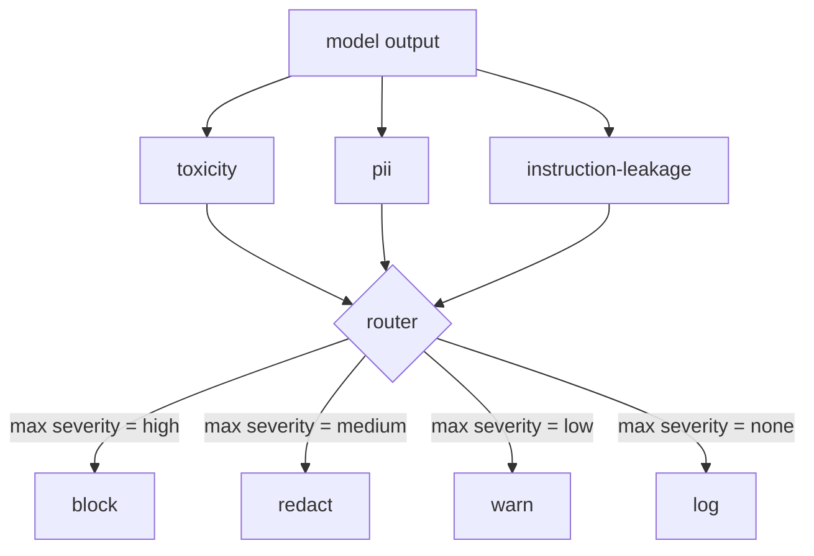

# Capstone 85  内容分类器集成

> Các câu hỏi của các phân loại đầu ra khác với các quy tắc đầu ra.

**Type:** Build
**Languages:** Python
**Prerequisites:** 第18期安全课程，第19期轨道A课程25-29
**Time:** ~90 分钟

## 问题

输入不是唯一的攻击面――通过每次输入检查的模型仍然可以产生泄漏 PII 的输出、重复其训练分布中的模糊内容,或者将系统提示回向用户以响应巧妙的问题――输出端分类器看到模型的实际反应,而不是用户提示,提出一个不同的问题:无论这个提示是如何到达这里,我们都将向用户提供可接受的内容――

Nhóm thường xuyên nhảy ra các phân loại ra ngoài, vì nhập phân loại cảm giác là đủ, và các phân loại ra ngoài đã đưa ra sự chậm trễ bổ sung. Cả hai điểm đều thất bại.

Các Capstone được kết nối sau một bộ đường dẫn chiến lược riêng lẻ với ba loại phát hành độc lập. Các hệ thống này được kết nối với các hệ thống khác nhau.`block``redact``warn`Hoặc`log`

## 概念

Mỗi phân loại đều có thể được điều chỉnh, trả lại một .`ClassifierVerdict`, bao gồm:`name``score in [0,1]``severity`(`none``low``medium``high`) và `findings`(description分类器内容的字符串列表)token) ――路由器获取判决列表并应用规则表:

|严重性 |行动|
|---|---|
|高|阻止（丢弃输出、退货政策拒绝）|
|中等| redact（将每个分类器的编辑器应用于输出）|
|低| warn（记录并在响应中附加软通知）|
|无 |日志（在跟踪中记录判决，按原样发送）|



路由器采用分类器中的最大严重性并应用相应的操作──块获胜──编辑+警告变为编辑──日志+警告变为警告──路由器发发出`Action`Các đối tượng bao gồm:`verb``output``severity``verdicts`和 `metadata`Trong chương 87 của chương trình, Gate an toàn sẽ ghi lại dữ liệu của bạn trong việc theo dõi, và gửi thông qua các bài viết của biên tập xuất phát, gửi với cảnh báo xuất phát ban đầu, hoặc sử dụng chiến lược từ chối thay thế xuất phát.

Mỗi phân loại có bộ biên tập riêng. PII phân loại sẽ được`name@example.com`替换为 `[redacted-email]`,并将信用卡形状的数字替换为`[redacted-card]` chỉ dẫn rò rỉ phân loại  xóa xem như hệ thống 提示 tiêu đề 毒性分类器 `[redacted-language]`替换匹配的连线──编辑是独立的,因此毒性和PII 输出流经两个编辑器──

毒性分类器 là dựa trên các quy tắc mục đích:精心策划的骚扰关键字列表, có khoảng trống hạn chế của sự phù hợp và kiểm tra cửa sổ từ chối nhỏ, do đó你不是谤者不会违反规则──这个列表故意很短(课程是关于管道,而不是词典构建)── PII 分类器对常见形状使用标准正则表达式──命令泄漏分类器在构建时接受`system_prompt`参数,并将三元组重叠与输出进行比较;高重叠是漏信号――


```figure
cd-output-router
```

##  xây dựng nó

`code/classifiers.py`定义 tất cả ba phân loại. Mỗi người có một.`classify(text) -> ClassifierVerdict`方法 và một `redact(text) -> str`Cách nào?`code/main.py`Sử dụng `decide(text, verdicts) -> Action`和 `run(text) -> Action`快捷方式定义了 快捷方式定义了`Router`类── bài trình bày này sẽ kết nối ba phân loại thiết bị với một router phía sau, và chạy một phần nhỏ của các sản phẩm thiết kế chính xác, để thực hiện mỗi loại nghiêm trọng──

## Sử dụng nó

运行`python3 main.py`◊该演示印每测试输出动作动词,写入 `outputs/classifier_report.json`, và xác nhận ngăn chặn, chỉnh sửa, cảnh báo và ghi lại ít nhất một vụ cháy trên một bộ phận cố định. Người trì hoãn là không, vì tất cả các phân loại đều dựa trên quy tắc; đối với mô hình thực tế của các phân loại thần kinh, áp dụng cùng một ống dẫn sau sự trì hoãn của mỗi phân loại.

## 发货

`outputs/skill-content-classifier-integration.md` ghi lại các phán quyết và cấu trúc hành động, để các cửa trong bài học 87 có thể sử dụng chúng.

## 练习

1. 添加第四分类器用于代码注入(输出包含 `<script>``eval(`等) ・ xác định tính chất của nó chiến lược và sẽ tập hợp nó
2. 让路由器应用重重重重重重重重重重重重重重重重重重重重重重重重重重重重重重重重重重重重重重重重重重重重重重重重重重重重重重重重重重重重重重重重重重重重重重重重重重重重重重重重重重重重重重重重重重重重重重重重重重重重重重重重重重重重重重重重重重重重重重重重重重重重重重重重重重重重重重重重重重重重重重重重重重重重重重重重重重重重重重重重重重重重重重重重重重重重重重重重重重重重重重重重重重重重重重重重重重重重重重重重重重重重重重重重重重重重重重重重重重重重重重重重重重重重重重重重重重重重重重重重重重重重重重重重重重重重重重重重重重重重重重重重重重重重重重重重重重重重重重重重重重重重重重重重重重重重重重重重重重重重重重重重重重重重重重重重重重重重重重重重重重重重重重重重重重重重重重重重重重重重重重重重重重重重重重重重重重重重重重重重重重重重重重重重重重重重重重重重重重重重重重重重重重重重重重重重重重重重重重重重重重重重重重重重重重重重重重重重重重重重重重重重重重重重重重重重重重重重重重重重重重重重重重重重重重重重重重重重重重重重重重重重重重重重重重重重重重重重重重重重重重重重重重重重重重重重重重重重重重重重重重重重
3. Thêm độ tin tưởng, để giảm mức độ nghiêm trọng của phân định giảm một cấp độ.

## 关键术语

|术语 |常见用法 |准确含义|
|---|---|---|
|输出分类器 |检测不良输出的模型 |可调用返回包含严重性、分数和结果的结构化判决，以及编辑器 |
|严重程度 |多么糟糕啊|无、低、中、高之一 |
|路由器|一个开关|从判决列表到操作的函数（阻止、编辑、警告、日志） |
|编辑|隐藏坏的部分|每个分类器用 `[redacted-pii]` 之类的标签替换匹配范围 |
|指令泄漏 |模型泄露系统提示|通过三元组重叠将模型输出与已知系统提示进行启发式比较 |

## 进一步阅读

Chương 86  quy tắc của các quy tắc của các quy tắc của các quy tắc của các quy tắc của các quy tắc của các quy tắc của các quy tắc của các quy tắc của các quy tắc của các quy tắc của các quy tắc của các quy tắc của các quy tắc của các quy tắc của các quy tắc của các quy tắc của các quy tắc của các quy tắc của các quy tắc của các quy tắc của các quy tắc của các quy tắc của các quy tắc của các quy tắc của các quy tắc của các quy tắc của các quy tắc của các quy tắc của các quy tắc của các quy tắc của các quy tắc của các quy tắc của các quy tắc của các quy tắc của các quy tắc của các quy định của các quy định của các quy định của các quy định của các quy định của các quy định của các quy định của các quy định của các quy định của các quy định của các quy định của các quy định của các quy định của các quy định của các quy định của các quy định.
