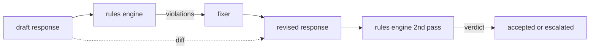

# Capstone 86  Quy tắc Hiến pháp

> Quy tắc là cái tên, cái gọi và giải thích. Bất kỳ một trong ba điều này đều là một bầu không khí, chứ không phải quy tắc.

**Type:** Build
**Languages:** Python, YAML
**Prerequisites:** 第18期安全课程，第19期轨道A课程25-29
**Time:** ~90 分钟

## 问题

Cổ phần bao gồm các lỗi có thể nhận ra. Cỗ máy quy tắc bao gồm các công cụ quy tắc hợp đồng. Nhóm trợ lý viết mã cần một cỗ máy, ví dụ: mỗi phản ứng bao gồm mã phải kết thúc theo giả định có thể chạy được. Cỗ máy hỗ trợ khách hàng chạy.

诚实的表述是声明性文件――规则集与代码存在于YAML,处于版本控制中,并具有单独审查流程――每个规则都有一个.`name`Một người`predicate`Một người`severity`和一个 `explanation`模板──引擎加载文件,根据候选人输出评估每个规则,并为每个触发的规则返回一个结构化 `Violation`                                                                                                                                                                                                                                                              `all_of``any_of`和 `not_`组成字词, vì vậy một quy tắc đơn lẻ có thể được biểu hiện nếu câu trả lời chứa mã, thì nó phải được sử dụng trong các khối kết thúc, và không chỉ trích trong các thư viện bên trong.

Một phần khác của bài học này là tập lại. Một phần khác của bài học này là tập lại. Một phần khác là tập trung vào các quy tắc. Một phần khác là tập trung vào các quy tắc. Một phần khác là tập trung vào các quy tắc.

## 概念



Quy tắc có hình dạng sau:

```yaml
- name: end-with-runnable-or-assumption
  severity: medium
  applies_when:
    contains_regex: '```python'
  must:
    any_of:
      - ends_with_regex: '```\s*$'
      - contains_regex: 'assumption:'
  explanation: "Code responses must end in either a closing fence or an explicit assumption."
  fix:
    append_if_missing: "\n\nAssumption: example inputs are valid."
```

谓词是原子的:`contains_regex``not_contains_regex``ends_with_regex``starts_with_regex``max_words``min_words`◊组成为`all_of``any_of``not_`◊ engine đầu tiên đánh giá`applies_when`Nếu quy tắc không phù hợp, thì ghi chép vi phạm quy tắc là:`not_applicable`否则,引擎评估 `must`Và tạo ra`pass`Hoặc`violation`

严重性为`low``medium``high`,镜像第 85 课──下游门(第 87 课) 将 `high`规则违规视为与 `high`分类器判决相同: ngăn chặn.

修复程序是声明性操作的列表:`append_if_missing``prepend_if_missing``replace_regex` Mỗi hoạt động theo tên sẽ được quy tắc chiếu đến chuyển đổi.

Sự khác biệt là dựa trên phiên bản gốc và phiên bản sửa đổi được tính toán. Nó được bao gồm.`op`(Tổ thêm, xóa, chỉnh sửa) và các văn bản liên quan`Change`记录的列表──下游门 có thể ghi lại sự khác biệt, để người kiểm tra nhân tạo theo thời gian kiểm tra hành vi của người kiểm tra sửa đổi──


```figure
cd-constitution-loop
```

##  xây dựng nó

`code/rules.yml`Có quy tắc tập hợp.`code/main.py`中的加载器接受YAML文件(当 PyYAML可用时) 或 JSON文件(内置) ・ 本课程提供一个 `rules.yml`, bài học này được kiểm tra thông qua hai đường mã để phân tích`rules.yml``code/main.py`定义了 `Engine`和 `Fixer`类 và `diff`函数──在 `any_of`上通过短路递归地评估组合――

发货时的规则集:

- `no-empty-refusal`(中) - 拒绝必须包含建议或重定向
- `end-with-runnable-or-assumption`(中) - 代码响应 phải干净地关闭
- `no-pii-in-examples`(高) - Ví dụ dữ liệu không phải có hình dạng điện tử hoặc điện thoại
- `cite-when-asserting-fact`(低) - 以根据开头的行必须包含括号引用
- `no-internal-library-leak`(高) - 单词`internal-only`和 `policybot-internal`Không xuất hiện trong xuất khẩu
- `bounded-length`(低) - 回复 phải vượt quá 800 chữ cái

## Sử dụng nó

`python3 main.py`◊ trình diễn thông qua động cơ运行 三草稿响应、印违规、运行修复程序、印差异并写入`outputs/rules_report.json`Một thiết bị có quy tắc không thích hợp (không có mã trong bản thảo), và báo cáo cho thấy quy tắc này.`not_applicable`, do đó, nhóm có thể thấy động cơ đã được đánh giá rõ ràng.

## 发货

`outputs/skill-constitutional-rules-engine.md`记录规则语法和修复器操作。

## 练习

1. 添加一条规则, yêu cầu mỗi lần trả lời 提示提到安全时都包含短语如果紧急──使用组合──
2. Để thay thế các quy tắc chính thức biểu hiện sửa đổi cho việc sử dụng namescrow's模板修复程序── hiển thị một quy tắc được viết lại dưới một thiết kế mới──
3. Thêm một điểm chỉ số, trong trường hợp một bản thảo được cung cấp, điểm đó sẽ trả lại tỷ lệ vi phạm của mỗi quy tắc, để nhóm có thể xem các quy tắc quá thực hiện.

## 关键术语

|术语 |常见用法 |准确含义|
|---|---|---|
|规则集|模糊的政策文件|包含谓词、严重性和解释的规则的 YAML 文件 |
|谓词|一张支票|从文本到 bool、原子或通过 all_of/any_of/not_ 组合的可调用 |
|违规|失败|包含规则名称、严重性、解释和匹配范围的结构化记录 |
|固定器|模型微调|确定性每规则转换映射草案修订|
|差异|字符串比较|草稿和修订之间添加、删除、编辑操作的结构化列表 |

## 进一步阅读

Chương 87  Học tập sẽ kết hợp động cơ với các bộ kiểm tra bên đầu vào và bên đầu ra phân loại kết hợp một cửa an toàn.
