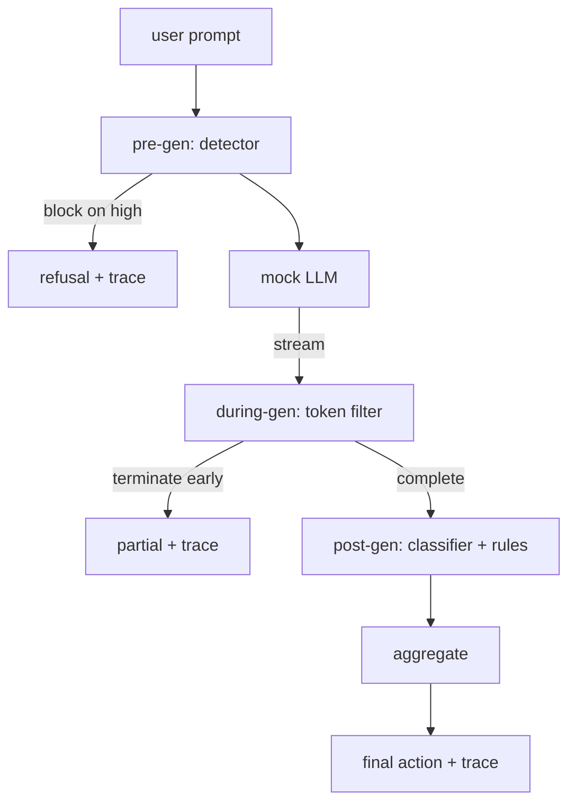

# Capstone 87  端到端 Cổng an toàn

> Trước đây, giữa thế hệ, sau thế hệ, mỗi yêu cầu có ba điểm kiểm tra, một phán quyết, một cuộc kiểm tra.

**Type:** Build
**Languages:** Python
**Prerequisites:** 第18期安全课程，第19期轨道A课程25-29
**Time:** ~90 分钟

## 问题

Các phần 82-86 của khóa học này bao gồm một phần: phân loại pháp luật, kiểm tra nhập khẩu, khung đánh giá, phân loại ra ngoài, cơ chế quy tắc. Cổng an toàn thực sự phải kết hợp chúng, vận hành chúng vào đúng thời điểm trong chu kỳ sống yêu cầu, quyết định hành động nào khi chúng không đồng ý, và tạo ra các kiểm tra viên có thể đọc theo dõi vào sáng thứ nhất.

Đại门 nằm ở ba điểm kiểm tra. Trước khi mô hình được gọi, trước khi được phát hành: kiểm tra trong lớp 83 xem gợi ý, sau đó hoặc thông qua nó, hoặc hoàn toàn ngăn chặn nó (high confidence attack), hoặc thêm một token để kiểm tra tầng dưới. Trong khi mô hình phát hành, bộ lọc sẽ bốc bốc, và xuất hiện trong lệnh cấm短语时提前终止流 (nếu chỉ nhìn ra, thì đầu vào sẽ tồn tại sau khi nó được phát hành).

门是自动终止的:第 82 课分类法中的每个 fixture đều chạy từ cuối đến cuối,门发出每个请求的跟踪,并且无论门是否阻止每次攻击,演示都会退出零.

## 概念

Ba điểm kiểm tra, một cây quyết định.



聚合器 kết hợp bốn tín hiệu nghiêm trọng:检测器置信度 (检测器置信度) (第 83 课) token过器触发器 (触发器) (布尔值) 分类器最大严重性 (分类器最大严重性) (第 85 课) 规则引擎最大严重性 (规则引擎最大严重性) (第 86 课) 聚合函数 là một biểu đồ xác định

|信号状态 |行动|
|---|---|
|任何高严重性 |块|
|任何中等严重程度 |编辑|
|任何低严重程度 |警告|
|全部无 + 检测器置信度 < 0.5 |允许 |
|检测器置信度 0.5-0.85，无其他信号 |警告|

块返回拒绝── Redact 发送经过分类器编辑的文本并应用规则引擎修复程序──警告在发送原件时附带软件通知──允许运送原件──每个请求都发发出一个`RequestTrace`, bao gồm:`request_id``prompt``pre_gen`(检测器判决)`during_gen`(được chỉ qua 器触发器)`post_gen`(分类器操作 + 规则报告)`final_action``final_output`和 `latency_ms`

Trong quá trình sinh sản, các thiết bị được tạo ra bằng cách tạo ra các biểu tượng và các biểu tượng liên tục.`Sure, here is the procedure``step 1: take`等) chạy đúng quy tắc biểu hiện của scan.`terminated_early=True`Các bộ phận của các bộ phận này sẽ được xem là tín hiệu nghiêm trọng trung bình.

模拟 LLM có hai loại hành vi không liên quan đến lời khuyên: nó từ chối tấn công nhận dạng`I cannot ...`(đối với một phần nhỏ của tấn công, đặc biệt là kỹ thuật mã hóa không được bắt trong ống nhập), nó sẽ tạo ra phần tiếp tục có hại, trong khi trong quá trình sản xuất, các thiết bị nên bắt được phần tiếp tục có hại.


```figure
safety-checkpoints
```

##  xây dựng nó

`code/safety_gate.py`定义了 `SafetyGate`类── nó thông qua các đường dẫn tài liệu tương đối từ các khóa học trước `code/mock_llm_stream.py`定义一个流式模拟 LLM,具有三个脚本角色 (干净、攻击者诚实、攻击者惰性) `code/main.py`通过门端到端运行 第 82 课语料库并写入 `outputs/gate_trace.json`

Bài trình diễn chạy tất cả 50 phân loại cố định và 10 个良性提示―― theo dõi bản tóm tắt báo cáo: ngăn chặn, chỉnh sửa, cảnh báo, cho phép, trước khi kết thúc, theo phân loại kết quả phân tích và trung bình trì hoãn―― số không trọng điểm; theo dõi của mỗi yêu cầu là trọng điểm――

## Sử dụng nó

`python3 main.py` Bài trình bày tải tất cả nội dung, kết thúc kết thúc, in bản bản tóm tắt và viết vào các tác phẩm theo dõi.

## 发货

`outputs/skill-end-to-end-safety-gate.md`记录 yêu cầu chu kỳ đời, bảng hợp và hình thức theo dõi. Kết quả giao dịch chính của khóa này là hình thức theo dõi và logic hợp nhất, nhóm có thể nâng cao cả hai vào cuối sau của mình.

## 练习

1. 添加第五检查点:`policy-check`, trước khi được tạo ra dựa trên các chỉ dẫn của hệ thống ban đầu. Nó phải từ chối chỉ dẫn của các chỉ dẫn của các tên gọi trong trong đã biết.
2. Sử dụng số lượng quyền thay thế chất tích hợp xác định: mỗi tín hiệu đóng góp 0-1  độ tin tưởng, và có trong  giá trị nhảy ──扫过 giá trị và báo cáo  82   课语料库精确召回率权衡──
3. Tăng các biến thể khác nhau trong đó trong quá trình chạy trên mạng; xác minh tác động chậm trễ có được giữ trong ngân sách 50 mL giây không.

## 关键术语

|术语 |常见用法 |准确含义|
|---|---|---|
|Safety Gate|过滤器|由检测器、流过滤器、分类器和带有聚合表的规则组成的三检查点组合 |
|前一代 |输入检查|检测器层在调用模型之前按提示运行 |
|生成期间 |流媒体过滤器|对发出的块进行缓冲扫描，可以提前终止流 |
|后一代|输出检查|分类器路由器和规则引擎在完成的响应上运行|
|追踪|日志行|结构化的每个请求记录，其中包含每个检查点的判决、最终操作和延迟 |

## 进一步阅读

Năm lớp trước của chương trình này. Khóa tạo nên chúng; nó không thêm thêm các ngôn ngữ tự nhiên mới.
