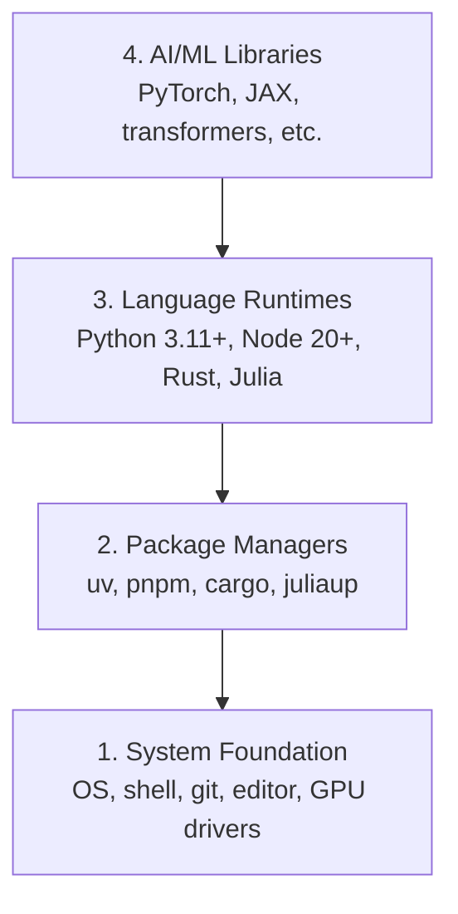

# 开发环境

> 你的工具会塑造你的思考方式.

**Type:** Build
**Languages:** Python, Node.js, Rust
**Prerequisites:** None
**Time:** ~45 分钟

## 学习目标
- 从零开始设置Python 3.11+、Node.js 20+ 和Rust工具链
- 配置虚拟环境和包管理器,实现可复现的构建
- 使用CUDA/MPS 验证GPU访问,并运行一个测试电压操作
- 了解四层堆:系统,包,运行时间,人工智能图书馆

## 问题
你将使用Python,TypeScript,Rust 和 Julia学习200+节的AI工程课程. 如果你的环境坏了,每节都会变成工具作斗争,而不是学习.

很多人会跳过环境设置. 然后他们花了几个小时去调试进口错误,版本冲突和缺失的CUDA驱动程序.

## 概念
一个人工智能工程环境有四层:



我们自从安装了. 每层都依赖于下层.


```figure
s0-env-stack
```

## 构建它
### 步骤1:系统基础

检查你的系统并安装基础组件.

```bash
# macOS
xcode-select --install
brew install git curl wget

# Ubuntu/Debian
sudo apt update && sudo apt install -y build-essential git curl wget

# Windows (use WSL2)
wsl --install -d Ubuntu-24.04
```

### 步骤 2: 用UV的Python

我们使用`uv`它比比快10-100倍,并且会自动处理虚拟环境.

```bash
curl -LsSf https://astral.sh/uv/install.sh | sh

uv python install 3.12

uv venv
source .venv/bin/activate  # or .venv\Scripts\activate on Windows

uv pip install numpy matplotlib jupyter
```

验证:

```python
import sys
print(f"Python {sys.version}")

import numpy as np
print(f"NumPy {np.__version__}")
a = np.array([1, 2, 3])
print(f"Vector: {a}, dot product with itself: {np.dot(a, a)}")
```

### 步骤 3: Node.js 与 pnpm

通过TypeScript课程 (经纪人,MCP服务器,网络应用程序)

```bash
curl -fsSL https://fnm.vercel.app/install | bash
fnm install 22
fnm use 22

npm install -g pnpm

node -e "console.log('Node', process.version)"
```

### 步骤 4: 蚀

基于性能关键的课程 (Inference,系统)

```bash
curl --proto '=https' --tlsv1.2 -sSf https://sh.rustup.rs | sh

rustc --version
cargo --version
```

### 步骤 5: 朱莉亚 (可选)

为了让朱莉学好数学课程.

```bash
curl -fsSL https://install.julialang.org | sh

julia -e 'println("Julia ", VERSION)'
```

### 步骤 6:GPU 设置(如果你有)

```bash
# NVIDIA
nvidia-smi

# Install PyTorch with CUDA
uv pip install torch torchvision torchaudio --index-url https://download.pytorch.org/whl/cu124
```

```python
import torch
print(f"CUDA available: {torch.cuda.is_available()}")
if torch.cuda.is_available():
    print(f"GPU: {torch.cuda.get_device_name(0)}")
```

没有GPU?没有问题――大多数课程可在CPU上运行――对于训练重的课程,使用Google Colab或云GPU――

### 步骤7: 检查一切

运行验证脚本:

```bash
python phases/00-setup-and-tooling/01-dev-environment/code/verify.py
```

## 使用它
您的环境现在已经准备好用于本课程的每节课程.

| Language | Used In | Package Manager |
|----------|---------|-----------------|
| Python | Phases 1-12 (ML, DL, NLP, Vision, Audio, LLMs) | uv |
| TypeScript | Phases 13-17 (Tools, Agents, Swarms, Infra) | pnpm |
| Rust | Phases 12, 15-17 (Performance-critical systems) | cargo |
| Julia | Phase 1 (Math foundations) | Pkg |

## 交付它
本课会产出了任何人都可以运行的验证脚本,用于检查自己的设置.

查看`outputs/prompt-env-check.md`首先,我们需要一个简单的方法来帮助人工智能助理诊断环境问题.

## 练习
1. 运行验证脚本并修复任何失败项
2. 创建一个Python虚拟环境,并安装PyTorch
3. 用四种语言写一个"你好世界",并逐个运行
