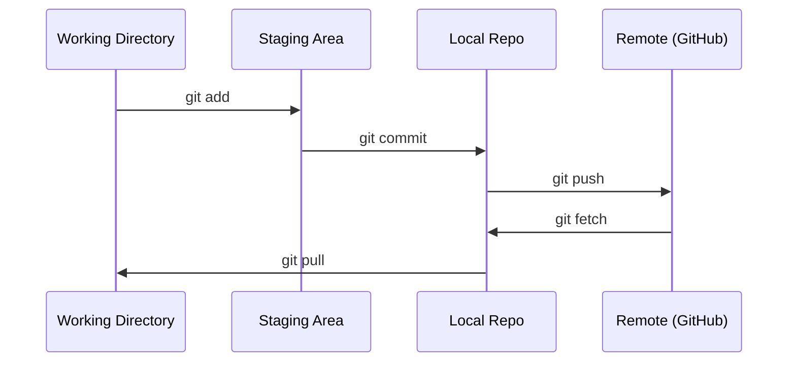

# 关键字和协作

> 版本控制不是可选的. 你在这里构建的每一个实验,每一个模型,每一个课程都必须被追踪.

**Type:** Learn
**Languages:** --
**Prerequisites:** Phase 0, Lesson 01
**Time:** ~30 分钟

## 学习目标
- 配置 git 身份,并使用添加,承诺和推的日常工作流程
- 为隔离实验 创建并合并分支,避免破坏主
- 编写一个`.gitignore`排除模型检查站和大型二元文件
- 使用 `git log`浏览 提交历史,理解项目进化

## 问题
你将跨越20个阶段编写数百个代码文件.没有版本控制,你会失去工作.

吉特是工具.吉特是代码所在的地方.本课只覆盖本课程的内容,不多不少.

## 概念


记住三件事:
1. 经常保存(`git commit`)
2. 推到远程`git push`)
3. 为实验创建分公司`git checkout -b experiment`)


```figure
s0-commit-dag
```

## 构建它
### 步骤1: 配置 git

```bash
git config --global user.name "Your Name"
git config --global user.email "you@example.com"
```

### 步骤2:日常工作流

```bash
git status
git add file.py
git commit -m "Add perceptron implementation"
git push origin main
```

### 步骤3:为实验创建分支

```bash
git checkout -b experiment/new-optimizer

# ... make changes, commit ...

git checkout main
git merge experiment/new-optimizer
```

### 步骤 4: 使用这个课程

```bash
git clone https://github.com/cluster1900/ai-engineering-from-scratch-zh.git
cd ai-engineering-from-scratch-zh

git checkout -b my-progress
# work through lessons, commit your code
git push origin my-progress
```

## 使用它
对于本课程,你只需要这些命令:

| Command | When |
|---------|------|
| `git clone` | 获取 course repo |
| `git add` + `git commit` | 保存你的工作 |
| `git push` | 备份到 GitHub |
| `git checkout -b` | 在不破坏 main 的情况下尝试东西 |
| `git log --oneline` | 查看你做过什么 |

课程不需要重建基础,选或子模块.

## 练习
1. 克隆这个 repo,创建一个名为`my-progress`建立一个文件,提交它,推它
2. 创建一个`.gitignore`排除模型检查站文件`.pt`,我知道.`.pth`,我知道.`.safetensors`)
3. 用`git log --oneline`查看这个 repo 的提交历史,并阅读教训是如何添加的

## 关键术语
| Term | What people say | What it actually means |
|------|----------------|----------------------|
| Commit | “保存” | 你的整个 project 在某个时间点的 snapshot |
| Branch | “一个副本” | 指向某个 commit 的 pointer，会随着你的工作向前移动 |
| Merge | “合并 code” | 把一个 branch 的 changes 应用到另一个 branch |
| Remote | “云端” | 托管在其他地方的 repo 副本（GitHub、GitLab） |
