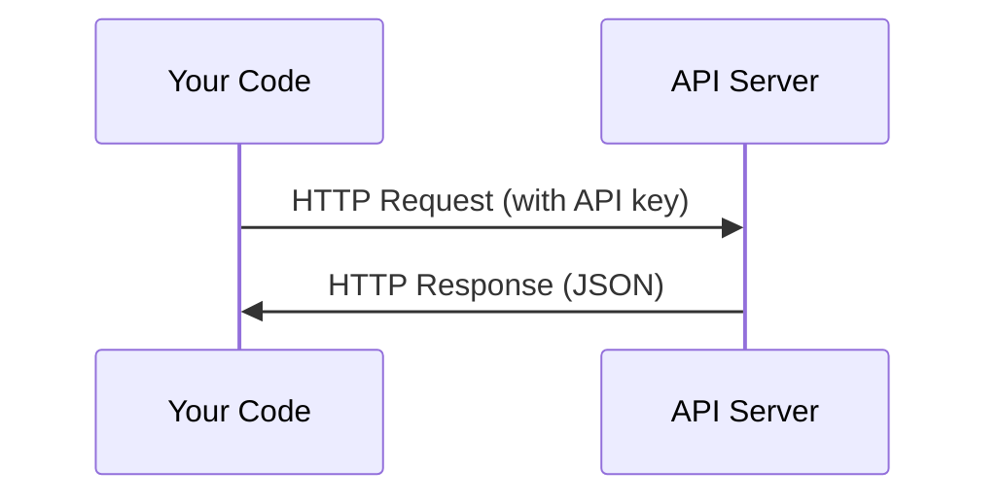

# 应用程序和关键

> 每个AI API的工作方式都一样:发送请求,得到回应.

**Type:** Build
**Languages:** Python, TypeScript
**Prerequisites:** Phase 0, Lesson 01
**Time:** ~30 分钟

## 学习目标
- 使用环境变量和`.env`文件安全存储 API 密钥
- 同时使用人类 Python SDK 和原始 HTTP 发起一次LLM API调用
- 基于SDK和原始HTTP的请求/响应格式进行比较,以便调试
- 识别并处理常见的API错误,包括验证和速度限制

## 问题
从第11阶段开始,你将使用LLMAPI (Anthropic、OpenAI、Google) 进行调用.在第13-16阶段,你将在循环中构建这些API的代理人.

## 概念


每次API通话都有:
1. 一个终点 (URL)
2. 一个API密钥 (认证)
3. 一个要求身体 (你想要什么)
4. 一个反应器 (你得到什么)


```figure
s0-secret-inject
```

## 构建它
### 步骤1:安全存储API密钥

绝对不要把API密钥放进代码.

```bash
export ANTHROPIC_API_KEY="sk-ant-..."
export OPENAI_API_KEY="sk-..."
```

或使用`.env`文件把它加入`.gitignore`):

```
ANTHROPIC_API_KEY=sk-ant-...
OPENAI_API_KEY=sk-...
```

### 步骤 2:第一次API调用 (Python)

```python
import anthropic

client = anthropic.Anthropic()

response = client.messages.create(
    model="claude-sonnet-4-20250514",
    max_tokens=256,
    messages=[{"role": "user", "content": "What is a neural network in one sentence?"}]
)

print(response.content[0].text)
```

### 步骤3: 第一次 API调用 (TypeScript)

```typescript
import Anthropic from "@anthropic-ai/sdk";

const client = new Anthropic();

const response = await client.messages.create({
  model: "claude-sonnet-4-20250514",
  max_tokens: 256,
  messages: [{ role: "user", content: "What is a neural network in one sentence?" }],
});

console.log(response.content[0].text);
```

### 步骤 4: 原始 HTTP (没有 SDK)

```python
import os
import urllib.request
import json

url = "https://api.anthropic.com/v1/messages"
headers = {
    "Content-Type": "application/json",
    "x-api-key": os.environ["ANTHROPIC_API_KEY"],
    "anthropic-version": "2023-06-01",
}
body = json.dumps({
    "model": "claude-sonnet-4-20250514",
    "max_tokens": 256,
    "messages": [{"role": "user", "content": "What is a neural network in one sentence?"}],
}).encode()

req = urllib.request.Request(url, data=body, headers=headers, method="POST")
with urllib.request.urlopen(req) as resp:
    result = json.loads(resp.read())
    print(result["content"][0]["text"])
```

这就是SDK在背后做的事情. 了解原始的HTTP调用,帮助调试.

## 使用它
对于本课程:

| API | When you need it | Free tier |
|-----|-----------------|-----------|
| Anthropic (Claude) | Phases 11-16（agents, tools） | 注册赠送 $5 credit |
| OpenAI | Phase 11（comparison） | 注册赠送 $5 credit |
| Hugging Face | Phases 4-10（models, datasets） | Free |

你现在不需要全部设置.等课需要重新设置.

## 交付它
本课 会产出:
- `outputs/prompt-api-troubleshooter.md`- 诊断常见API错误

## 练习
1. 获取一个人类API密钥,发起你的第一次API电话
2. 尝试原始 HTTP 版本,并将响应格式与 SDK 版本进行比较
3. 故意使用错误的API键,并阅读错误信息

## 关键术语
| Term | What people say | What it actually means |
|------|----------------|----------------------|
| API key | "Password for the API" | 一个唯一字符串，用于标识你的 account 并授权 requests |
| Rate limit | "They're throttling me" | 每分钟/每小时最大 requests 数量，用于防止滥用并确保公平使用 |
| Token | "A word"（在 API 语境中） | 一个 billing unit：input 和 output Tokens 会被分别计数并收费 |
| Streaming | "Real-time responses" | 逐词获取 response，而不是等待完整 response |
