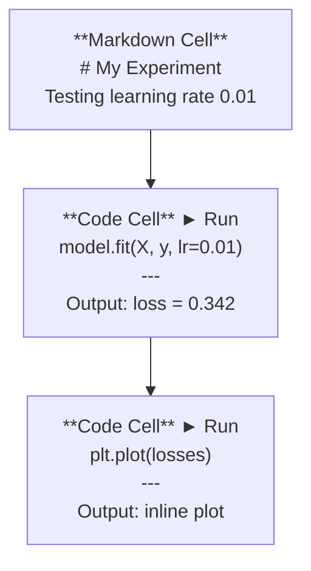
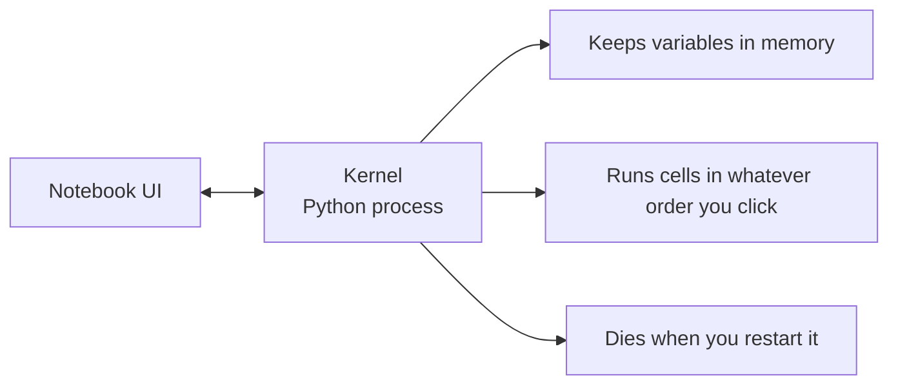

# 朱皮特笔记本

> 笔记本是人工智能工程的实验台.

**类型：**建立
**语言：**字符串
**前置要求：**阶段0:第一课
**时间：**约30分钟

## 学习目标

- 装备并启动JupyterLab、Jupyter笔记本,或带Jupyter扩展的 VS代码
- 使用魔术命令`%timeit`,我知道.`%%time`,我知道.`%matplotlib inline`) 进行基准并在线可视化
- 区分何时使用笔记本,何时使用脚本,并应用在笔记本中探索,在脚本中交付的工作流
- 识别并避免常见笔记本 陷:乱序执行、隐藏状态和内存泄漏

## 问题

每篇AI论文、教程和Kaggle竞赛都使用Jupyter笔记本.它们让你分段运行代码、在线查看输出、混合代码与说明,并快速代.如果你试图不使用笔记本学习AI,就像做数学作业却没有草稿纸.

但笔记本确实有陷. 人们把它们用于所有事情,包括它们非常不擅长的事情.

## 概念

笔记本是由一组单元组成的列表.



核是后台运行的Python进程.当你运行一个细胞时,它将代码发送到内核,内核执行代码并将结果发送回来.所有细胞共享一个内核,所以变量会在细胞之间保留.



你按什么顺序运行,这既是超能力,也很容易踩到坑.


```figure
s0-cell-order
```

## 构建

### 步骤1: 选择你的界面

三种选择,同一种格式:

| Interface | Install | Best for |
|-----------|---------|----------|
| JupyterLab | `pip install jupyterlab` then `jupyter lab` | 完整 IDE 体验、多标签、文件浏览器、terminal |
| Jupyter Notebook | `pip install notebook` then `jupyter notebook` | 简单、轻量、一次一个 notebook |
| VS Code | Install "Jupyter" extension | 已在你的 editor 中、git 集成、debugging |

三者都读写同一个`.ipynb`文件――选你喜欢的即可――JupyterLab是人工智能工作中最常见的选择――

```bash
pip install jupyterlab
jupyter lab
```

### 步骤2: 重要键盘快捷键

你会在两种模式中操作.`Escape`进入命令模式 (左侧蓝色),按`Enter`进入编辑模式 (绿色)

**Command mode（最常用）：**

| Key | Action |
|-----|--------|
| `Shift+Enter` | 运行 cell，移动到下一个 |
| `A` | 在上方插入 cell |
| `B` | 在下方插入 cell |
| `DD` | 删除 cell |
| `M` | 转换为 markdown |
| `Y` | 转换为 code |
| `Z` | 撤销 cell 操作 |
| `Ctrl+Shift+H` | 显示所有快捷键 |

**Edit mode：**

| Key | Action |
|-----|--------|
| `Tab` | Autocomplete |
| `Shift+Tab` | 显示函数签名 |
| `Ctrl+/` | 切换 comment |

`Shift+Enter`你每天都会使用千次快捷键.

### 步骤3:细胞类型

**Code cells**运行 Python 并显示输出:

```python
import numpy as np
data = np.random.randn(1000)
data.mean(), data.std()
```

输出:`(0.0032, 0.9987)`

**Markdown cells**染色格式化文本──用它们记录你正在做什么以及为什么这样做──支持标题、大胆、 italic、LaTeX数学(`$E = mc^2$`)、表和图片

### 步骤 4: 魔术命令

这些不是Python. 这些是木星特有的命令,`%`没有什么可怕的东西.`%%`开头.

**为你的代码计时：**

```python
%timeit np.random.randn(10000)
```

输出:`45.2 us +/- 1.3 us per loop`

```python
%%time
model.fit(X_train, y_train, epochs=10)
```

输出:`Wall time: 2.34 s`

`%timeit`经历了多次运行代码并获得平均.`%%time`只有一次运行.`%timeit`做微型标记,用`%%time`进行训练.

**启用 inline plots：**

```python
%matplotlib inline
```

现在每个人都`plt.plot()`或`plt.show()`城市会直接在笔记本中染.

**不离开 notebook 安装 packages：**

```python
!pip install scikit-learn
```

`!`预览: 运行任意的器命令

**检查环境变量：**

```python
%env CUDA_VISIBLE_DEVICES
```

### 步骤 5: 线上显示丰富输出

笔记本会自动显示细胞中最后一个表达式.

```python
import pandas as pd

df = pd.DataFrame({
    "model": ["Linear", "Random Forest", "Neural Net"],
    "accuracy": [0.72, 0.89, 0.94],
    "training_time": [0.1, 2.3, 45.6]
})
df
```

这将染色一个格式化的HTML表,而不是文本垃圾.

```python
import matplotlib.pyplot as plt

plt.figure(figsize=(8, 4))
plt.plot([1, 2, 3, 4], [1, 4, 2, 3])
plt.title("Inline Plot")
plt.show()
```

图案会出现在细胞 正下方. 这就是笔记本. 主导AI工作的原因.

对于图像:

```python
from IPython.display import Image, display
display(Image(filename="architecture.png"))
```

### 步骤 6:谷歌协作

提供GPU,预装库和谷歌驱动器集成.

1. 前往 [colab.research.google.com](https://colab.research.google.com)
2. 上传本课程中的任意`.ipynb`文件
3. 运行时间 > 改变运行时间类型 > T4 GPU(免费)

哥拉布与本地木星的区别:
- 文件 不会在会议之间保留 (保存到驱动或下载)
- 预装:,,,,,,,,,,,,,,,,,,,,,,,,,,,,,,,,,,,,,,,,,,,,,,,,,,,,,,,,,,,,,,,,,,,,,,,,,,,,,,,,,,,,,,,,,,,,,,,,,,,,,,,,,,,,,,,,,,,,,,,,,,,,,,,,,,,,,,,,,,,,,,,,,,,,,,,,,,,,,,,,,,,,,,,,,,,,,,,,,,,,,,,,,,,,,,,,,,,,,,,,,,,,,,,,,,,,,
- 使用 `from google.colab import files`上传/下载文件
- 使用 `from google.colab import drive; drive.mount('/content/drive')`进行持久存储
- 免费的会议在90分钟不活动后会超时

## 使用

### 笔记本与脚本:何时使用哪一个

| Use notebooks for | Use scripts for |
|-------------------|-----------------|
| 探索 dataset | Training pipelines |
| Prototype model | Reusable utilities |
| 可视化结果 | 任何包含 `if __name__` 的东西 |
| 解释你的工作 | 按计划运行的 code |
| 快速 experiments | Production code |
| Course exercises | Packages and libraries |

规则:**在 notebooks 中探索，在 scripts 中交付**,我知道.

常见工作流:
1. 在笔记本中探索数据
2. 在笔记本中原型你的模型
3. 一旦可以,就把代码移动到`.py`文件
4. 让这些`.py`文件重新进口回笔记本,用于进一步的实验

### 常见陷

**乱序执行。**你先运行细胞 5,再运行细胞 2,再运行细胞 7――笔记本 在你的机器上能使用,但其他人从上到下运行时会坏――修复:分享前执行内核> 重启运行所有――

**隐藏状态。**你删除了一个细胞,但它创建的变量仍然存在内存中.

**内存泄漏。**装载4GB数据集,训练模型,再加载另一个数据集.`del variable_name`和 `gc.collect()`核核或重启核核核

## 交付

本课会产出:
- `outputs/prompt-notebook-helper.md`用于调试笔记本问题

## 练习

1. 打开JupyterLab,创建一个笔记本,并使用`%timeit`与创建100,000个随机数组的区别
2. 创建一个同时包含标记和代码细胞的笔记本,加载CSV、显示数据框架,并绘制图片――然后运行内核>重启和运行所有验证它可以从上到下正常运行
3. 让我`code/notebook_tips.py`中的代码 粘贴到Colab笔记本 中,并使用免费的GPU运行

## 关键术语

| Term | What people say | What it actually means |
|------|----------------|----------------------|
| Kernel | “运行我代码的东西” | 一个独立的 Python process，用来执行 cells 并在内存中保存变量 |
| Cell | “一个 code block” | Notebook 中可独立运行的单元，可以是 code 或 markdown |
| Magic command | “Jupyter 技巧” | 以 `%` 或 `%%` 为前缀、用于控制 notebook 环境的特殊命令 |
| `.ipynb` | “Notebook file” | 一个包含 cells、outputs 和 metadata 的 JSON 文件。代表 IPython Notebook |

## 延伸阅读

- [JupyterLab Docs](https://jupyterlab.readthedocs.io/)查看完整功能集
- [Google Colab FAQ](https://research.google.com/colaboratory/faq.html)查看 Colab 特定限制与功能
- [28 Jupyter Notebook Tips](https://www.dataquest.io/blog/jupyter-notebook-tips-tricks-shortcuts/)查看进阶快捷键
