# 字符串环境

> 虚拟环境是解药.

**Type:** Build
**Languages:** Shell
**Prerequisites:** Phase 0, Lesson 01
**Time:** ~30 分钟

## 学习目标

- 使用 `uv`,我知道.`venv`或`conda`创建隔离的虚拟环境
- 编写带有可选的依赖群体的`pyproject.toml`为了保证可复现性,并生成锁文件
- 诊断并修复常见陷:全球安装、pip/conda 混用、CUDA版本不匹配
- 实现阶段分类环境战略

## 问题

你为一个细节调整项目安装了PyTorch 2.4──下周,另一个项目需要PyTorch 2.1,因为它的CUDA构建已经固定了──你全局升级后,第一个项目坏了──你降级后,第二个项目又坏了──

这就是依赖地狱. 在AI/ML工作中经常发生,因为:

- 鱼,JAX和光流,各个携带自己的CUDA绑定
- 模型库会固定特定框架版本
- 全局`pip install`会覆盖之前的内容
- 配合使用,反之亦然

解决方案:每个项目都有自己的隔离环境,以及自己的包裹.

## 概念

```mermaid
graph TD
    subgraph without["Without virtual environments"]
        SP[System Python] --> T24["torch 2.4.0 (CUDA 12.4)\nProject A needs this"]
        SP --> T21["torch 2.1.0 (CUDA 11.8)\nProject B needs this"]
        SP --> CONFLICT["CONFLICT: only one\ntorch version can exist"]
    end

    subgraph with["With virtual environments"]
        PA["Project A (.venv/)"] --> PA1["torch 2.4.0 (CUDA 12.4)"]
        PA --> PA2["transformers 4.44"]
        PB["Project B (.venv/)"] --> PB1["torch 2.1.0 (CUDA 11.8)"]
        PB --> PB2["diffusers 0.28"]
    end
```




```figure
s0-env-isolation
```

## 建立它

### 选项 1:uv venv(推)

`uv`是最快的Python包管理器 (比Pip快10-100倍) ⋅它在一个工具中处理虚拟环境、Python版本和依赖分辨率──

```bash
curl -LsSf https://astral.sh/uv/install.sh | sh

uv python install 3.12

cd your-project
uv venv
source .venv/bin/activate
```

装备包:

```bash
uv pip install torch numpy
```

一步创建带`pyproject.toml`的项目:

```bash
uv init my-ai-project
cd my-ai-project
uv add torch numpy matplotlib
```

### 选项 2:venv(内置)

如果你无法安装`uv`石自带`venv`其他:

```bash
python3 -m venv .venv
source .venv/bin/activate  # Linux/macOS
.venv\Scripts\activate     # Windows

pip install torch numpy
```

比比`uv`慢慢,但在安装了Python的地方都能工作.

### 选项 3:需要时使用)

管理CUDA工具包,cuDNN和C库等非Python依赖性.

- 你需要特定的CUDA工具包版本,但不想在系统范围内的安装
- 你在共享集群上,无法安装系统包
- 某个图书馆的装备说明写着使用公寓

```bash
# Install miniconda (not the full Anaconda)
curl -LsSf https://repo.anaconda.com/miniconda/Miniconda3-latest-Linux-x86_64.sh -o miniconda.sh
bash miniconda.sh -b

conda create -n myproject python=3.12
conda activate myproject

conda install pytorch torchvision torchaudio pytorch-cuda=12.4 -c pytorch -c nvidia
```

一条规则:如果你在某个环境中使用一个套件,就用一个套件管理该环境中的所有包装.`pip install`混入了房子,会造成依赖冲突,而且调试起来很痛苦.

### 本课程:按阶段的策略

您可以为整个课程创造一个环境. 不要这样做.

策略:

```
ai-engineering-from-scratch/
├── .venv/                    <-- phases 0-3 共用的轻量 env
├── phases/
│   ├── 04-neural-networks/
│   │   └── .venv/            <-- PyTorch env
│   ├── 05-cnns/
│   │   └── .venv/            <-- 同一个 PyTorch env（symlink 或 shared）
│   ├── 08-transformers/
│   │   └── .venv/            <-- 可能需要不同的 transformer versions
│   └── 11-llm-apis/
│       └── .venv/            <-- API SDKs，不需要 torch
```

`code/env_setup.sh`中文书写会为本课程创建基础环境.

## 基础项目

每个Python项目都应该有一个`pyproject.toml`,它用一个文件替代.`setup.py`,我知道.`setup.cfg`和 `requirements.txt`,我知道.

```toml
[project]
name = "ai-engineering-from-scratch"
version = "0.1.0"
requires-python = ">=3.11"
dependencies = [
    "numpy>=1.26",
    "matplotlib>=3.8",
    "jupyter>=1.0",
    "scikit-learn>=1.4",
]

[project.optional-dependencies]
torch = ["torch>=2.3", "torchvision>=0.18"]
llm = ["anthropic>=0.39", "openai>=1.50"]
```

然后安装:

```bash
uv pip install -e ".[torch]"    # base + PyTorch
uv pip install -e ".[llm]"     # base + LLM SDKs
uv pip install -e ".[torch,llm]" # everything
```

## 锁文件

锁文件将把每个依赖性 (包括过渡式依赖性) 固定到精确版本.

```bash
# uv generates uv.lock automatically when using uv add
uv add numpy

# pip-tools approach
uv pip compile pyproject.toml -o requirements.lock
uv pip install -r requirements.lock
```

让你的锁文件提交到 Git. 其他人复制后,从锁文件安装,就会得到完全一致的版本.

## 常见错误

### 1. 全局安装

```bash
pip install torch  # BAD: installs to system Python

source .venv/bin/activate
pip install torch  # GOOD: installs to virtual environment
```

检查你的包裹会安装到哪里:

```bash
which python       # should show .venv/bin/python, not /usr/bin/python
which pip           # should show .venv/bin/pip
```

### 2. 混用管和房子

```bash
conda create -n myenv python=3.12
conda activate myenv
conda install pytorch -c pytorch
pip install some-other-package   # BAD: can break conda's dependency tracking
conda install some-other-package # GOOD: let conda manage everything
```

如果您必须在房间内使用管道,首先安装所有管道,最后重新安装管道.

### 3. 忘记激活

```bash
python train.py           # uses system Python, missing packages
source .venv/bin/activate
python train.py           # uses project Python, packages found
```

你的 shell提示应显示环境名称:

```
(.venv) $ python train.py
```

### 4. 让.Vv 承诺到 Git

```bash
echo ".venv/" >> .gitignore
```

虚拟环境通常有200MB-2GB.它们是本地的,不能在机器之间移植.`pyproject.toml`和锁文件.

### 5.  CUDA版本不匹配

```bash
nvidia-smi                # shows driver CUDA version (e.g., 12.4)
python -c "import torch; print(torch.version.cuda)"  # shows PyTorch CUDA version

# These must be compatible.
# PyTorch CUDA version must be <= driver CUDA version.
```

## 用它

运行设置脚本 创建你的课程环境:

```bash
bash phases/00-setup-and-tooling/06-python-environments/code/env_setup.sh
```

这将在 repo 根创建一个`.venv`并安装和验证核心依赖性.

## 练习

1. 运行`env_setup.sh`并确认所有检查都通过
2. 创建第二个虚拟环境,在其中安装不同的版本的 numpy,并确认两个环境相互隔离
3. 为了同时需要 PyTorch 和人类 SDK 的项目 编写`pyproject.toml`
4. 为了整局安装一个包,然后把它卸下.

## 关键术语

| Term | What people say | What it actually means |
|------|----------------|----------------------|
| Virtual environment | “A venv” | 一个隔离目录，包含 Python interpreter 和 packages，并与 system Python 分离 |
| Lockfile | “Pinned dependencies” | 一个列出每个 package 及其精确 version 的文件，保证跨机器安装一致 |
| pyproject.toml | “The new setup.py” | 标准 Python project 配置文件，替代 setup.py/setup.cfg/requirements.txt |
| Transitive dependency | “A dependency of a dependency” | Package B 依赖 C；如果你安装依赖 B 的 A，那么 C 就是 A 的 transitive dependency |
| CUDA mismatch | “My GPU isn't working” | PyTorch 编译所用的 CUDA version 与你的 GPU driver 支持的版本不同 |
