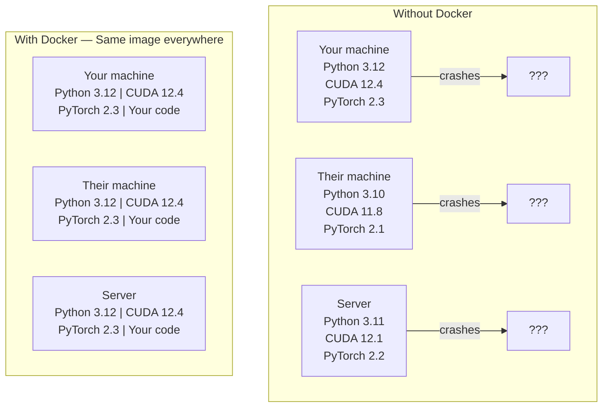

# 对于AI的Docker

> 容器让我机器上能跑成为过去式.

**Type:** Build
**Languages:** Docker
**Prerequisites:** Phase 0, Lessons 01 and 03
**Time:** ~60 分钟

## 学习目标

- 从Docker文件 构建启用GPU的Docker图像,包含CUDA、PyTorch和AI库
- 将主机目录作为卷集,以便在容器中重建 之间持久化模型、数据集和代码
- 配置NVIDIA容器工具包,让容器内部可以访问GPU
- 使用Docker 编排多服务 AI应用程序(输入服务器+矢量数据库)

## 问题

你在笔记本电脑上使用PyTorch 2.3、CUDA 12.4 和 Python 3.12 训练一个模型──你的同事使用PyTorch 2.1、CUDA 11.8 和 Python 3.10──你的模型在他们的机器上崩──你的Docker文件在两边都能工作──

基于AI的项目是依赖性梦. 一个典型的堆包括Python,PyTorch,CUDA驱动程序,cuDNN,系统级C库以及像Flash-attn这样需要精确的编译版本的专业包.Docker将所有这些包装到一个图像中,并在任何地方以相同的方式运行.

## 概念

达克将你的代码,运行时间,图书馆和系统工具包装在一个称为容器的隔离单元中. 可以把它看作轻量级虚拟机,只是它共享主机操作系统内核,而不是运行自己的内核,因此启动只需要几秒,而不是几分钟.



### 为什么人工智能项目比大多数项目更需要Docker

1. **GPU drivers 很脆弱。**通过NVIDIA 集装箱工具包共享主机GPU驱动器.

2. **Model weights 很大。**一个7B参数模型在fp16下有14GB──你不会想在每次重建时重新下载它──Docker卷 允许你从主机安装一个模型目录──

3. **Multi-service architectures 很常见。**一个真正的AI应用程序不仅仅是一个Python脚本. 它是推断服务器. 它用于RAG的向量数据库,可能还有Web前端.

### 关键词汇

| Term | What it means |
|------|---------------|
| Image | 只读 template。你的 recipe。由 Dockerfile 构建。 |
| Container | image 的运行实例。你的 kitchen。 |
| Dockerfile | 构建 image 的 instructions。逐层构建。 |
| Volume | 可在 container restarts 后保留的持久化 storage。 |
| docker-compose | 用 YAML 定义 multi-container applications 的工具。 |

### 常见的容器模式

```
Dev Container
  完整 toolkit。Editor support。Jupyter。Debugging tools。
  用于 development 和 experimentation。

Training Container
  最小化。只有 training script 和 dependencies。
  在 GPU clusters 上运行。没有 editor，没有 Jupyter。

Inference Container
  为 serving 优化。Small image。Fast cold start。
  在 production 中运行于 load balancer 后方。
```


```figure
s0-image-layers
```

## 建立它

### 步骤1:安装Docker

```bash
# macOS
brew install --cask docker
open /Applications/Docker.app

# Ubuntu
curl -fsSL https://get.docker.com | sh
sudo usermod -aG docker $USER
# Log out and back in for group change to take effect
```

验证:

```bash
docker --version
docker run hello-world
```

### 步骤 2:安装NVIDIA集装箱工具包 (带NVIDIA GPU的Linux)

这让Docker容器能够访问你的GPU──macOS和Windows──WSL2) 用户可以跳过;Docker桌面在这些平台上以不同的方式处理GPU通过──

```bash
distribution=$(. /etc/os-release;echo $ID$VERSION_ID)
curl -fsSL https://nvidia.github.io/libnvidia-container/gpgkey | sudo gpg --dearmor -o /usr/share/keyrings/nvidia-container-toolkit-keyring.gpg
curl -s -L https://nvidia.github.io/libnvidia-container/$distribution/libnvidia-container.list | \
    sed 's#deb https://#deb [signed-by=/usr/share/keyrings/nvidia-container-toolkit-keyring.gpg] https://#g' | \
    sudo tee /etc/apt/sources.list.d/nvidia-container-toolkit.list

sudo apt-get update
sudo apt-get install -y nvidia-container-toolkit
sudo nvidia-ctk runtime configure --runtime=docker
sudo systemctl restart docker
```

在容器内测试GPU访问:

```bash
docker run --rm --gpus all nvidia/cuda:12.4.1-base-ubuntu22.04 nvidia-smi
```

如果你看到GPU信息,说明工具包 正常工作.

### 步骤3:理解基础图像

选择正确的基image可以节省几个小时调试时间.

```
nvidia/cuda:12.4.1-devel-ubuntu22.04
  完整 CUDA toolkit。包含 compilers。
  Use for: 构建需要 nvcc 的 packages（flash-attn、bitsandbytes）
  Size: ~4 GB

nvidia/cuda:12.4.1-runtime-ubuntu22.04
  仅 CUDA runtime。没有 compilers。
  Use for: 运行 pre-built code
  Size: ~1.5 GB

pytorch/pytorch:2.3.1-cuda12.4-cudnn9-runtime
  基于 CUDA 预装 PyTorch。
  Use for: 跳过 PyTorch install step
  Size: ~6 GB

python:3.12-slim
  没有 CUDA。仅 CPU。
  Use for: CPU inference、lightweight tools
  Size: ~150 MB
```

### 步骤4:为人工智能开发编写Dockerfile

这是`code/Dockerfile`现在,我们要做什么?

```dockerfile
FROM nvidia/cuda:12.4.1-devel-ubuntu22.04

ENV DEBIAN_FRONTEND=noninteractive
ENV PYTHONUNBUFFERED=1

RUN apt-get update && apt-get install -y --no-install-recommends \
    python3.12 \
    python3.12-venv \
    python3.12-dev \
    python3-pip \
    git \
    curl \
    build-essential \
    && rm -rf /var/lib/apt/lists/*

RUN update-alternatives --install /usr/bin/python python /usr/bin/python3.12 1

RUN python -m pip install --no-cache-dir --upgrade pip setuptools wheel

RUN python -m pip install --no-cache-dir \
    torch==2.3.1 \
    torchvision==0.18.1 \
    torchaudio==2.3.1 \
    --index-url https://download.pytorch.org/whl/cu124

RUN python -m pip install --no-cache-dir \
    numpy \
    pandas \
    scikit-learn \
    matplotlib \
    jupyter \
    transformers \
    datasets \
    accelerate \
    safetensors

WORKDIR /workspace

VOLUME ["/workspace", "/models"]

EXPOSE 8888

CMD ["python"]
```

构建它:

```bash
docker build -t ai-dev -f phases/00-setup-and-tooling/07-docker-for-ai/code/Dockerfile .
```

第一次会花一些时间(下载CUDA基图 + PyTorch) ――后续构建 会使用缓存层――

运行它:

```bash
docker run --rm -it --gpus all \
    -v $(pwd):/workspace \
    -v ~/models:/models \
    ai-dev python -c "import torch; print(f'PyTorch {torch.__version__}, CUDA: {torch.cuda.is_available()}')"
```

在容器内运行 Jupyter:

```bash
docker run --rm -it --gpus all \
    -v $(pwd):/workspace \
    -v ~/models:/models \
    -p 8888:8888 \
    ai-dev jupyter notebook --ip=0.0.0.0 --port=8888 --no-browser --allow-root
```

### 步骤5:用于数据和模型的音量挂

没有它们,你的14GB模型下载会在容器中停止后消失.

```bash
# Mount your code
-v $(pwd):/workspace

# Mount a shared models directory
-v ~/models:/models

# Mount datasets
-v ~/datasets:/data
```

在你的训练脚本中,从安装路径加载:

```python
from transformers import AutoModel

model = AutoModel.from_pretrained("/models/llama-7b")
```

模型 位于您的主机文件系统 上――你可以随意重建容器,而无需重新下载――

### 步骤 6: 用于多服务人工智能应用程序的Docker编译

一个真实的RAG应用程序需要推断服务器和向量数据库――Docker 编译 用一条命令运行两者――

见`code/docker-compose.yml`其他:

```yaml
services:
  ai-dev:
    build:
      context: .
      dockerfile: Dockerfile
    deploy:
      resources:
        reservations:
          devices:
            - driver: nvidia
              count: all
              capabilities: [gpu]
    volumes:
      - ../../../:/workspace
      - ~/models:/models
      - ~/datasets:/data
    ports:
      - "8888:8888"
    stdin_open: true
    tty: true
    command: jupyter notebook --ip=0.0.0.0 --port=8888 --no-browser --allow-root

  qdrant:
    image: qdrant/qdrant:v1.12.5
    ports:
      - "6333:6333"
      - "6334:6334"
    volumes:
      - qdrant_data:/qdrant/storage

volumes:
  qdrant_data:
```

启动所有服务:

```bash
cd phases/00-setup-and-tooling/07-docker-for-ai/code
docker compose up -d
```

现在你的AI开发容器可以通过服务名称在`http://qdrant:6333`访问向量数据库──Docker Compose 会自动创建共享网络──

从AI容器内测试连接:

```python
from qdrant_client import QdrantClient

client = QdrantClient(host="qdrant", port=6333)
print(client.get_collections())
```

停止所有服务:

```bash
docker compose down
```

加上`-v`也会删除Qdrant的卷:

```bash
docker compose down -v
```

### 步骤7:AI 工作中实用Docker命令

```bash
# List running containers
docker ps

# List all images and their sizes
docker images

# Remove unused images (reclaim disk space)
docker system prune -a

# Check GPU usage inside a running container
docker exec -it <container_id> nvidia-smi

# Copy a file from container to host
docker cp <container_id>:/workspace/results.csv ./results.csv

# View container logs
docker logs -f <container_id>
```

## 用它

你现在拥有可复制的AI开发环境.

- 使用 `docker compose up`同时启动你的开发环境和向量数据库
- 作为数量组,确保重建之间不会丢失任何内容
- 当某节课时需要新的Python包时,把它添加到Docker文件并重建
- 让他们与队友分享你的Docker文件.

### 没有GPU?

移除`--gpus all`旗和NVIDIA部署区块──容器 仍然适用于基于CPU的课程──PyTorch 会自动检测没有CUDA,并倒退到CPU──

## 练习

1. 构建Docker文件,并运行在容器内`python -c "import torch; print(torch.__version__)"`
2. 启动机器组合堆,并验证可从AI容器访问`http://qdrant:6333/collections`上的
3. 将`flask`添加到Docker文件,重建,并运行一个简单的API服务器.`-p 5000:5000`地图端口
4. 使用 `docker images`测量图像大小――试把基础图像从 `devel`切换到`runtime`并比较大小

## 关键术语

| Term | What people say | What it actually means |
|------|----------------|----------------------|
| Container | “Lightweight VM” | 使用 host kernel 的隔离进程，拥有自己的 filesystem 和 network |
| Image layer | “Cached step” | 每条 Dockerfile instruction 都会创建一个 layer。未变化的 layers 会被 cached，因此 rebuilds 很快。 |
| NVIDIA Container Toolkit | “GPU in Docker” | 一个 runtime hook，通过 `--gpus` flag 将 host GPUs 暴露给 containers |
| Volume mount | “Shared folder” | host 上映射进 container 的目录。container 停止后 changes 仍会保留。 |
| Base image | “Starting point” | 你的 Dockerfile 基于其构建的 `FROM` image。它决定了预装内容。 |
