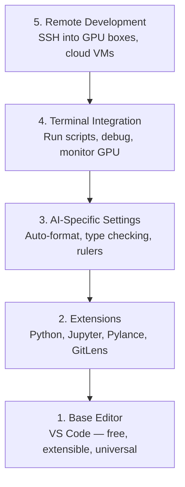

# 编辑器设置

> 你的编辑器是你的合作伙伴. 一次配置它,让它不再困扰,并开始真正发挥作用.

**Type:** Build
**Languages:** --
**Prerequisites:** Phase 0, Lesson 01
**Time:** ~20 分钟

## 学习目标
- 安装 VS Code,并配置 Python、Jupyter、linting 和远程SSH所需的核心扩展
- 为AI工作流程配置格式-保存,类型检查和笔记本表输出滚动
- 配置远程SSH,像编辑本地代码一样在远程GPU机器上编辑和调试代码
- 评估其他编辑器选择(Cursor、Windsurf、Neovim) 以及它们在人工智能工作中所取舍的

## 问题
你将在编辑器里花费数千小时:编写Python、运行笔记本,调试训练循环,以及SSH到GPU机器――配置不当的编辑器将使每次工作都充满阻力:没有自动完成、没有类型提示、没有内线错误、需要手动格式化,以及重的终端工作流程――

准确配置只需要20分钟. 跳过它,每天都会损失20分钟.

## 概念
人工智能工程编辑器配置需要五种东西:




```figure
s0-lsp-roundtrip
```

## 构建它
### 步骤1:安装VS代码

推使用 VS Code──它免费可在所有操作系统上运行──对Jupyter笔记本电脑有一流支持,并且扩展生态模式覆盖了人工智能工作所需的一切──

从[code.visualstudio.com](https://code.visualstudio.com/)下载

在终端中验证:

```bash
code --version
```

如果macOS上找不到`code`打开 VS 代码,按`Cmd+Shift+P`输入"Shell Command",然后选择"安装"代码"命令在PATH中"──

### 步骤2:安装必要扩展

在 VS Code 中打开集成终端`Ctrl+`` `或 `` Cmd+```),安装人工智能工作需要的扩展:

```bash
code --install-extension ms-python.python
code --install-extension ms-python.vscode-pylance
code --install-extension ms-toolsai.jupyter
code --install-extension eamodio.gitlens
code --install-extension ms-vscode-remote.remote-ssh
code --install-extension ms-python.debugpy
code --install-extension ms-python.black-formatter
code --install-extension charliermarsh.ruff
```

每个延长的作用:

| Extension | Why |
|-----------|-----|
| Python | Language 支持、virtual env 检测、run/debug |
| Pylance | 快速 type checking、autocomplete、import resolution |
| Jupyter | 在 VS Code 内运行 notebooks、variable explorer |
| GitLens | 查看谁改了什么、inline git blame |
| Remote SSH | 像本地一样打开远程 GPU 机器上的文件夹 |
| Debugpy | Python 的 step-through debugging |
| Black Formatter | 保存时自动格式化，保持风格一致 |
| Ruff | 快速 linting，捕获常见错误 |

本课中`code/.vscode/extensions.json`文件包含完整的推列表. 当你打开项目文件时,VS Code 会提示你安装它们.

### 步骤3:配置设置

复制本课`code/.vscode/settings.json`通过中部设置`Settings > Open Settings (JSON)`动作应用

关键设置:

```jsonc
{
    "python.analysis.typeCheckingMode": "basic",
    "editor.formatOnSave": true,
    "editor.rulers": [88, 120],
    "notebook.output.scrolling": true,
    "files.autoSave": "afterDelay"
}
```

为什么这些很重要:

- **Type checking on basic**在运行前捕获错误的参数类型――能节省调试子形状不匹配 和错误的API参数的时间――
- **Format on save**现在,我们还需要考虑格式化.
- **Rulers at 88 and 120**黑色在 88 处换行;;120 标记显示文档字符串和评论 什么时候过长;;
- **Notebook output scrolling**训练循环会打印数千行. 没有滚动.
- **Auto-save**你会忘记保存. 你的训练脚本会运行旧代码.

### 步骤 4:终端集成

VS Code 的集成终端是运行训练脚本,监控GPU,管理环境的地方.

正确配置它:

```jsonc
{
    "terminal.integrated.defaultProfile.osx": "zsh",
    "terminal.integrated.defaultProfile.linux": "bash",
    "terminal.integrated.fontSize": 13,
    "terminal.integrated.scrollback": 10000
}
```

有用的快捷键:

| Action | macOS | Linux/Windows |
|--------|-------|---------------|
| Toggle terminal | `` Ctrl+` `` | `` Ctrl+` `` |
| New terminal | `Ctrl+Shift+`` ` | `Ctrl+Shift+`` ` |
| Split terminal | `Cmd+\` | `Ctrl+\` |

分开终端很有用:一个用于运行你的脚本,另一个用于使用`nvidia-smi -l 1`或`watch -n 1 nvidia-smi`监控GPU.

### 步骤 5:远程开发(SSH到GPU机器)

这就是人工智能工作的最重要的扩展. 你将在远程机器上运行训练.

设置:

1. 安装远程SSH扩展已在第二步完成) 』
2. 按 `Ctrl+Shift+P`(或 `Cmd+Shift+P`),输入"远程SSH:连接到主机"──
3. 输入`user@your-gpu-box-ip`,我知道.
4. VS Code 将自动安装在远程机器上的服务器组件.

如果需要无密码访问,配置SSH密钥:

```bash
ssh-keygen -t ed25519 -C "your-email@example.com"
ssh-copy-id user@your-gpu-box-ip
```

为了方便,把主机添加到`~/.ssh/config`其他:

```
Host gpu-box
    HostName 203.0.113.50
    User ubuntu
    IdentityFile ~/.ssh/id_ed25519
    ForwardAgent yes
```

现在`Remote-SSH: Connect to Host > gpu-box`立即连接.

## 其他方法

### 曲者

[cursor.com](https://cursor.com)是一个内置的AI代码生成的 VS代码叉──它使用相同的扩展态度和设置格式──如果你使用Cursor,本课程中的所有内容仍然适用──导入相同的部分`settings.json`和 `extensions.json`,我知道.

### 风冲浪

[windsurf.com](https://windsurf.com)是另一个AI-第一的 VS Code fork――情况相同:相同的扩展、相同的设置 格式、相同的远程SSH 支持──

### 维姆/尼奥姆

如果你已经使用Vim或Neovim,并且效率很高,那就继续使用.

- **pyright**或**pylsp**用于检查类型 (通过 Mason 或手动安装)
- **nvim-lspconfig**用于语言服务器集成
- **jupyter-vim**或**molten-nvim**用于类似笔记本的执行
- **telescope.nvim**用于文件/符号搜索
- **none-ls.nvim**搭配黑和,用于格式化/接

如果你还没有使用Vim,不要现在开始――学习曲线会和学习人工智能工程竞争――使用VS Code――

## 使用它
通过这个配置,你的日常工作流程看起来像这样:

1. 在 VS Code 中打开项目文件 (或通过远程SSH 连接到GPU机器) 。
2. 在编辑器中编写Python,使用自动完成,类型提示和内线错误.
3. 使用Jupyter扩展内联运行Jupyter笔记本.
4. 使用集成终端运行训练脚本`uv pip install`监控GPU.
5. 提交前用GitLens审查变更──

## 练习
1. 安装 VS Code 和步骤 2 中列出的所有扩展
2. 将本课的`settings.json`复制到你的 VS 代码配置 中
3. 打开一个Python文件,验证Pylance 显示类型提示,并且黑 会在保存时格式化
4. 如果您可以访问远程机器,配置远程SSH并打开文件

## 关键术语
| Term | What people say | What it actually means |
|------|----------------|----------------------|
| LSP | "Autocomplete engine" | Language Server Protocol：一种标准，让 editors 可以从特定 language 的 server 获取 type info、completions 和 diagnostics |
| Pylance | "The Python plugin" | Microsoft 的 Python language server，使用 Pyright 进行 type checking 和 IntelliSense |
| Remote SSH | "Working on the server" | VS Code extension，在远程机器上运行轻量 server，并将 UI stream 到本地 editor |
| Format on save | "Auto-prettier" | 每次保存时 editor 都会运行 formatter（Black、Ruff），因此 code style 始终一致 |
