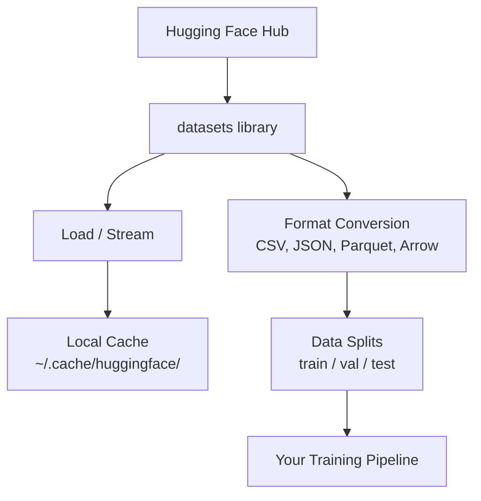

# 数据管理

> 数据是燃料.你如何管理它,决定你能快速走.

**Type:** Build
**Language:**字符串
**Prerequisites:** Phase 0, Lesson 01
**Time:** ~45 分钟

## 学习目标
- 用拥抱的脸`datasets`库 加载,流和缓存数据集
- 在 CSV、JSON、Parquet 和 Arrow 格式之间转换,并解释它们的取代
- 使用固定随机种子 创建可复现的火车/验证/测试分区
- 使用 `.gitignore`、Git LFS或DVC 管理大型模型和数据集文件

## 问题
每个AI项目都是从数据开始的.你需要找到数据集,下载它们,在格式中转换它们,分开它们,用于训练和评估,并对它们进行版本化,让实验可复现.

## 概念


拥抱着脸`datasets`图书馆是为人工智能工作的标准方式 加载数据.


```figure
s0-data-pipeline
```

## 构建它
### 步骤1:安装数据集库

```bash
pip install datasets huggingface_hub
```

### 步骤 2: 装载数据集

```python
from datasets import load_dataset

dataset = load_dataset("imdb")
print(dataset)
print(dataset["train"][0])
```

这将下载IMDB电影评论数据集.`~/.cache/huggingface/datasets/`预备的加载.

### 步骤3:流式处理大型数据集

有些数据集太大,无法完全放入磁盘.

```python
dataset = load_dataset("wikimedia/wikipedia", "20220301.en", split="train", streaming=True)

for i, example in enumerate(dataset):
    print(example["title"])
    if i >= 4:
        break
```

流媒体会给你一个`IterableDataset`,你会在行列中处理它们. 无论数据集多大,内存使用都保持恒定.

### 步骤 4:数据集格式

`datasets`根据管道的需要,你可以转换为其他格式.

```python
dataset = load_dataset("imdb", split="train")

dataset.to_csv("imdb_train.csv")
dataset.to_json("imdb_train.json")
dataset.to_parquet("imdb_train.parquet")
```

格式对比:

| Format | Size | Read Speed | Best For |
|--------|------|-----------|----------|
| CSV | 大 | 慢 | Human readability、spreadsheets |
| JSON | 大 | 慢 | APIs、nested data |
| Parquet | 小 | 快 | Analytics、columnar queries |
| Arrow | 小 | 最快 | In-memory processing（`datasets` 内部使用的格式） |

对于人工智能工作,Parquet是最佳存储格式.

### 步骤 5:数据分开

每个ML项目都需要三个分区:

- **Train**模型从这里学习 (通常是80%).
- **Validation**您正在培训过程中检查进展 (通常是10%)
- **Test**培训 完成后的最终评估 (通常是10%)

有些数据集已经预先分开了.

```python
dataset = load_dataset("imdb", split="train")

split = dataset.train_test_split(test_size=0.2, seed=42)
train_val = split["train"].train_test_split(test_size=0.125, seed=42)

train_ds = train_val["train"]
val_ds = train_val["test"]
test_ds = split["test"]

print(f"Train: {len(train_ds)}, Val: {len(val_ds)}, Test: {len(test_ds)}")
```

始终设置种子以确保可复生性.

### 步骤 6: 下载并缓存模型

模型是大型文件.`huggingface_hub`库 会处理下载和缓存.

```python
from huggingface_hub import hf_hub_download, snapshot_download

model_path = hf_hub_download(
    repo_id="sentence-transformers/all-MiniLM-L6-v2",
    filename="config.json"
)
print(f"Cached at: {model_path}")

model_dir = snapshot_download("sentence-transformers/all-MiniLM-L6-v2")
print(f"Full model at: {model_dir}")
```

模型将被保存到`~/.cache/huggingface/hub/`◎ 下载一次后,后续运行会立即加载──

### 步骤 7:处理大文件

模型重量和大型数据集不应该进入 git.

**Option A: .gitignore（最简单）**

```
*.bin
*.safetensors
*.pt
*.onnx
data/*.parquet
data/*.csv
models/
```

**Option B: Git LFS（在 git 中跟踪大型文件）**

```bash
git lfs install
git lfs track "*.bin"
git lfs track "*.safetensors"
git add .gitattributes
```

在 Git LFS 中存储指标中,并将实际文件存储在单独的服务器上.

**Option C: DVC（data version control）**

```bash
pip install dvc
dvc init
dvc add data/training_set.parquet
git add data/training_set.parquet.dvc data/.gitignore
git commit -m "Track training data with DVC"
```

公司会创建小型`.dvc`文件,指向你的数据. 数据本身存储在S3、GCS或其他远程存储后端中.

| Approach | Complexity | Best For |
|----------|-----------|----------|
| .gitignore | 低 | 个人项目、可重新获取的 downloaded data |
| Git LFS | 中 | 通过 git 共享 model weights 的团队 |
| DVC | 高 | 可复现 experiments、大型 datasets、团队 |

对于本课程,`.gitignore`已经足够了. 当你需要跨机器复现精确实验时,再使用DVC.

### 步骤 8: 存储模式

**Local storage**适用于小于10GB的数据集──HF缓存 会自动处理──

**Cloud storage**适用于更大的内容,或需要跨机器共享内容:

```python
import os

local_path = os.path.expanduser("~/.cache/huggingface/datasets/")

# s3_path = "s3://my-bucket/datasets/"
# gcs_path = "gs://my-bucket/datasets/"
```

直接与S3和GCS集成:

```bash
dvc remote add -d myremote s3://my-bucket/dvc-store
dvc push
```

对于本课程,本地存储 足够.云存储将在您的远程GPU实例上变得相关.

## 本课程使用的数据集

| Dataset | Lessons | Size | What It Teaches |
|---------|---------|------|----------------|
| IMDB | Tokenization、classification | 84 MB | Text classification 基础 |
| WikiText | Language modeling | 181 MB | Next-token prediction |
| SQuAD | QA systems | 35 MB | Question answering、spans |
| Common Crawl (subset) | Embeddings | 不定 | Large-scale text processing |
| MNIST | Vision basics | 21 MB | Image classification fundamentals |
| COCO (subset) | Multimodal | 不定 | Image-text pairs |

你现在不需要下载所有这些. 每个节目会说明它需要什么.

## 使用它
运行实用脚本 验证一切正常:

```bash
python code/data_utils.py
```

这将下载一个小数据集,转换它,分开它,并打印总结.

## 交付它
本课产出:
- `code/data_utils.py`- 可重复使用的数据加载和缓存工具
- `outputs/prompt-data-helper.md`- 用于任务寻找合适的数据集的提示

## 练习
1. 使用 `mrpc`配置加载`glue`数据集,并检查前 5个例子
2. 流量`c4`数据集,并统计 10 秒内可以处理多少个例子
3. 将数据集转换为Parquet,将文件大小与CSV相比
4. 使用固定种子 创建 70/15/15火车/值/测试分,并验证尺寸

## 关键术语
| Term | What people say | What it actually means |
|------|----------------|----------------------|
| Dataset split | "Training data" | 一个命名 subset（train/val/test），用于 ML lifecycle 的不同阶段 |
| Streaming | "Load it lazily" | 从远程 source 逐行处理 data，而不下载完整 dataset |
| Parquet | "Compressed CSV" | 一种 columnar file format，针对 analytical queries 和 storage efficiency 优化 |
| Arrow | "Fast dataframe" | `datasets` library 内部使用的 in-memory columnar format，用于 zero-copy reads |
| Git LFS | "Git for big files" | 一个 extension，将大型文件存储在 git repo 外，同时在 version control 中保留 pointers |
| DVC | "Git for data" | 一个用于 datasets 和 models 的 version control system，可与 cloud storage 集成 |
| Cache | "Already downloaded" | 之前获取过的 data 的本地副本，默认存储在 ~/.cache/huggingface/ |
