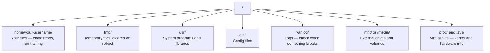

# 面向人工智能的Linux

> 大多数人工智能都运行在Linux上.

**类型：**学习 课程
**语言：**现在,我们要做什么?
**先修要求：**阶段0:第一课
**时间：**时间: 30 分钟

## 学习目标

- 浏览Linux文件系统,并从命令行执行基本文件操作
- 使用 `chmod`和 `chown`管理文件权限,以解决"拒绝权限"错误
- 使用 `apt`安装系统包,并为AI 工作设置一台新的GPU盒
- 识别从macOS 转换到Linux 时,开发人员经常踩在远程机器上的坑

## 问题

你在 macOS 或 Windows 上开发. 但是一旦你 SSH 到云GPU盒,租用Lambda实例,或启动EC2机器,就会进入Ubuntu.终端是你唯一的接口.没有Finder,没有 Explorer,没有GUI. 如果你不能从命令行浏览文件系统,安装包,管理过程,就会一边为置置GPU 付费,一边搜索如何在Linux中解锁文件.

这是一个生存指南. 它只涵盖你在远程Linux机器上做人工智能工作所需的内容.

## 文件系统布局

 Linux 将一切都组织在一个根.`/`下面没有`C:\`或`/Volumes`你实际会接触的目录:



你的家庭目录是`~`或`/home/your-username`几乎所有的操作都在此发生.

## 必须有命令

下面有15个命令覆盖了您在远程GPU盒上 95%的操作.

### 移动位置

```bash
pwd                         # Where am I?
ls                          # What's here?
ls -la                      # What's here, including hidden files with details?
cd /path/to/dir             # Go there
cd ~                        # Go home
cd ..                       # Go up one level
```

### 文件和目录

```bash
mkdir my-project            # Create a directory
mkdir -p a/b/c              # Create nested directories in one shot

cp file.txt backup.txt      # Copy a file
cp -r src/ src-backup/      # Copy a directory (recursive)

mv old.txt new.txt          # Rename a file
mv file.txt /tmp/           # Move a file

rm file.txt                 # Delete a file (no trash, it's gone)
rm -rf my-dir/              # Delete a directory and everything inside
```

`rm -rf`是永久性的.没有撤销.按回车前请再次确认路径.

### 读取文件

```bash
cat file.txt                # Print entire file
head -20 file.txt           # First 20 lines
tail -20 file.txt           # Last 20 lines
tail -f log.txt             # Follow a log file in real time (Ctrl+C to stop)
less file.txt               # Scroll through a file (q to quit)
```

### 搜索

```bash
grep "error" training.log           # Find lines containing "error"
grep -r "learning_rate" .           # Search all files in current directory
grep -i "cuda" config.yaml          # Case-insensitive search

find . -name "*.py"                 # Find all Python files under current dir
find . -name "*.ckpt" -size +1G     # Find checkpoint files larger than 1GB
```

## 许可证

每个文件都具有所有者和许可的部分. 当脚本无法执行,或者你无法写入某个目录时,我们会遇到这个问题.

```bash
ls -l train.py
# -rwxr-xr-- 1 user group 2048 Mar 19 10:00 train.py
#  ^^^             owner permissions: read, write, execute
#     ^^^          group permissions: read, execute
#        ^^        everyone else: read only
```

常见修复方式:

```bash
chmod +x train.sh           # Make a script executable
chmod 755 deploy.sh         # Owner: full, others: read+execute
chmod 644 config.yaml       # Owner: read+write, others: read only

chown user:group file.txt   # Change who owns a file (needs sudo)
```

当某处提示"被拒绝许可"时,几乎总是许可问题.`chmod +x`或`sudo`可以修复大多数情况.

## 包装管理 (适用)

 ubuntu 使用`apt`,这是安装系统级软件的方式.

```bash
sudo apt update             # Refresh the package list (always do this first)
sudo apt install -y htop    # Install a package (-y skips confirmation)
sudo apt install -y build-essential  # C compiler, make, etc. Needed by many Python packages
sudo apt install -y tmux    # Terminal multiplexer (keep sessions alive after disconnect)

apt list --installed        # What's installed?
sudo apt remove htop        # Uninstall
```

你会在新的GPU盒上常安装的包:

```bash
sudo apt update && sudo apt install -y \
    build-essential \
    git \
    curl \
    wget \
    tmux \
    htop \
    unzip \
    python3-venv
```

## 用户和 sudo

你通常以普通用户登录. 有些操作需要根源管理权限.

```bash
whoami                      # What user am I?
sudo command                # Run a single command as root
sudo su                     # Become root (exit to go back, use sparingly)
```

在云GPU实例上,你通常是唯一的用户,并且已经有Sudo访问.

## 过程和系统d

当训练卡住,或者你需要检查正在运行的内容时:

```bash
htop                        # Interactive process viewer (q to quit)
ps aux | grep python        # Find running Python processes
kill 12345                  # Gracefully stop process with PID 12345
kill -9 12345               # Force kill (use when graceful doesn't work)
nvidia-smi                  # GPU processes and memory usage
```

如果运行推断服务器,会使用它:

```bash
sudo systemctl start nginx          # Start a service
sudo systemctl stop nginx           # Stop it
sudo systemctl restart nginx        # Restart it
sudo systemctl status nginx         # Check if it's running
sudo systemctl enable nginx         # Start automatically on boot
```

## 磁盘空间

图像和数据集会很快填满它.

```bash
df -h                       # Disk usage for all mounted drives
df -h /home                 # Disk usage for /home specifically

du -sh *                    # Size of each item in current directory
du -sh ~/.cache             # Size of your cache (pip, huggingface models land here)
du -sh /data/checkpoints/   # Check how big your checkpoints are

# Find the biggest space hogs
du -h --max-depth=1 / 2>/dev/null | sort -hr | head -20
```

常见省空间方式:

```bash
# Clear pip cache
pip cache purge

# Clear apt cache
sudo apt clean

# Remove old checkpoints you don't need
rm -rf checkpoints/epoch_01/ checkpoints/epoch_02/
```

## 网络

你会从命令行下载模型,传输文件,并调用API.

```bash
# Download files
wget https://example.com/model.bin                   # Download a file
curl -O https://example.com/data.tar.gz              # Same thing with curl
curl -s https://api.example.com/health | python3 -m json.tool  # Hit an API, pretty-print JSON

# Transfer files between machines
scp model.bin user@remote:/data/                     # Copy file to remote machine
scp user@remote:/data/results.csv .                  # Copy file from remote to local
scp -r user@remote:/data/checkpoints/ ./local-dir/   # Copy directory

# Sync directories (faster than scp for large transfers, resumes on failure)
rsync -avz --progress ./data/ user@remote:/data/
rsync -avz --progress user@remote:/results/ ./results/
```

对于任何大型传输,优先使用`rsync`而不是`scp`△它只传输发生变化的字节,并且可以处理连接中断.

## 保持会议 存活

当你在远程箱上时, 合上笔记本电脑会杀死你的训练运行.

```bash
tmux new -s train           # Start a new session named "train"
# ... start your training, then:
# Ctrl+B, then D            # Detach (training keeps running)

tmux ls                     # List sessions
tmux attach -t train        # Reattach to session

# Inside tmux:
# Ctrl+B, then %            # Split pane vertically
# Ctrl+B, then "            # Split pane horizontally
# Ctrl+B, then arrow keys   # Switch between panes
```

长时间训练任务总是放在运行中.

## 面向Windows用户的WSL2

如果在Windows上,WSL2可以提供无需双启动的情况下真正的Linux环境.

```bash
# In PowerShell (admin)
wsl --install -d Ubuntu-24.04

# After restart, open Ubuntu from Start menu
sudo apt update && sudo apt upgrade -y
```

 WSL2 运行真实Linux内核──本课中的所有内容都能在其中工作──从 WSL 内部看,你的Windows文件 位于`/mnt/c/Users/YourName/`,我知道.

通过GPU 需要Windows 侧安装NVIDIA驱动程序──安装Windows NVIDIA驱动程序(不是Linux驱动程序),CUDA 就会在WSL2内可用──

## 接下来,我们将把它转到Linux.

如果你来自macOS,这些事情会让你:

| macOS | Linux | 说明 |
|-------|-------|-------|
| `brew install` | `sudo apt install` | package names 有时不同。`brew install htop` 和 `sudo apt install htop` 效果相同，但 `brew install readline` 和 `sudo apt install libreadline-dev` 不同。 |
| `open file.txt` | `xdg-open file.txt` | 但远程 box 上通常没有 GUI。使用 `cat` 或 `less`。 |
| `pbcopy` / `pbpaste` | 不可用 | SSH 上不存在 pipe 到/来自 clipboard 的能力。 |
| `~/.zshrc` | `~/.bashrc` | macOS 默认使用 zsh。大多数 Linux servers 使用 bash。 |
| `/opt/homebrew/` | `/usr/bin/`, `/usr/local/bin/` | Binaries 位于不同位置。 |
| `sed -i '' 's/a/b/' file` | `sed -i 's/a/b/' file` | macOS sed 需要在 `-i` 后加一个空字符串。Linux 不需要。 |
| Case-insensitive filesystem | Case-sensitive filesystem | 在 Linux 上，`Model.py` 和 `model.py` 是两个不同文件。 |
| Line endings `\n` | Line endings `\n` | 相同。但 Windows 使用 `\r\n`，会破坏 bash scripts。运行 `dos2unix` 修复。 |

## 快速参考卡

```
Navigation:     pwd, ls, cd, find
Files:          cp, mv, rm, mkdir, cat, head, tail, less
Search:         grep, find
Permissions:    chmod, chown, sudo
Packages:       apt update, apt install
Processes:      htop, ps, kill, nvidia-smi
Services:       systemctl start/stop/restart/status
Disk:           df -h, du -sh
Network:        curl, wget, scp, rsync
Sessions:       tmux new/attach/detach
```


```figure
s0-process-fork
```

## 练习

1. 通过 SSH 到任意的Linux机器 (或打开WSL2),并导航到您的家庭目录.`touch`创建三个空文件,然后使用`ls -la`列出它们.
2. 用适合安装`htop`运行它,并找出使用最多的内存的过程.
3. 启动一个tmux会议,其中运行`sleep 300`脱离,列出,然后重新连接.
4. 使用 `df -h`检查可用磁盘空间,然后使用`du -sh ~/.cache/*`找出空间中占占据的内容.
5. 使用 `scp`将文件从本地机器传输到远程机器,然后使用`rsync`让我们做同样的传输,并比较体验.
