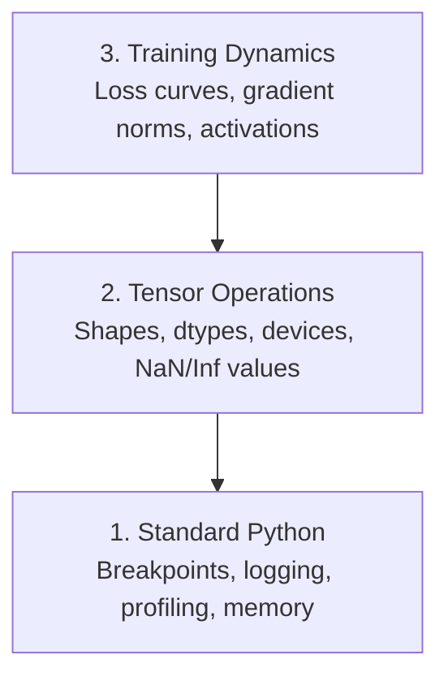

# 调整和配置

> 最糟糕的AI bug 不会崩.它们会静静地训练在垃圾数据上,并报告一个漂亮的损失曲线.

**类型：**构建
**语言：**字符串
**先修要求：**基本Pytorch 熟悉度
**时间：**时间60分钟

## 学习目标

- 使用条件 `breakpoint()`和 `debug_print`在训练中检查子形状,类型和NAN值
- 使用 `cProfile`,我知道.`line_profiler`和 `tracemalloc`分析 训练循环,找出瓶
- 检测常见AI bug:形状不匹配,NaN损失,数据泄露和错误设备器
- 设置度板 来可视化损失曲线,重量 histogram 和梯度分布

## 问题

AI代码的失败方式与普通代码不同.网络应用程序会带上堆痕迹崩.配置错误的训练循环会运行8小时,烧掉200美元的GPU时间,然后产生一个对每个输入的预测平均值模型.`.detach()`标签 漏洞 功能

你需要调试工具,在这些沉默失败中浪费你的时间和计算 之前抓住它们.

## 概念

智能化调试分为三个层次:



大多数人会直接跳到第三层. 但80%的AI错误都在第一层和第二层.


```figure
s0-flame-hot
```

## 构建它

### 部分 1: 打印 调试 ()

打印调试通常被轻视.但不该如此.对于色码,一个有针对性的打印语句往往胜过逐步调试器,因为你需要一次看到形状,类型和值范围.

```python
def debug_print(name, tensor):
    print(f"{name}: shape={tensor.shape}, dtype={tensor.dtype}, "
          f"device={tensor.device}, "
          f"min={tensor.min().item():.4f}, max={tensor.max().item():.4f}, "
          f"mean={tensor.mean().item():.4f}, "
          f"has_nan={tensor.isnan().any().item()}")
```

在每个可疑操作中调用它. 找到错误后,移除这些打印.

### 部分 2:  Python 调试器 (pdb 和 破解点)

在人工智能工作中被低估了.`breakpoint()`放入训练循环,并交互式检查子――

```python
def training_step(model, batch, criterion, optimizer):
    inputs, labels = batch
    outputs = model(inputs)
    loss = criterion(outputs, labels)

    if loss.item() > 100 or torch.isnan(loss):
        breakpoint()

    loss.backward()
    optimizer.step()
```

当调试器停下来时,有用的命令:

- `p outputs.shape`检查形状
- `p loss.item()`查看损失值
- `p torch.isnan(outputs).sum()`统计纳粹
- `p model.fc1.weight.grad`检查梯度
- `c`继续,`q`退出

这就是条件式调试. 只有看起来不对待时间才停止.

### 第三部分:Python记录

当你的调试时,使用记录替换打印声明.

```python
import logging

logging.basicConfig(
    level=logging.INFO,
    format="%(asctime)s [%(levelname)s] %(message)s",
    handlers=[
        logging.FileHandler("training.log"),
        logging.StreamHandler()
    ]
)
logger = logging.getLogger(__name__)

logger.info("Starting training: lr=%.4f, batch_size=%d", lr, batch_size)
logger.warning("Loss spike detected: %.4f at step %d", loss.item(), step)
logger.error("NaN loss at step %d, stopping", step)
```

登录提供时间标签,严重程度水平和文件输出. 当训练运行在凌晨3点失败时,你想要的是日志文件,而不是已经滚出屏幕的终端输出.

### 第四部分: 为代码区段计时

知道时间花在哪里,是优化的第一步.

```python
import time

class Timer:
    def __init__(self, name=""):
        self.name = name

    def __enter__(self):
        self.start = time.perf_counter()
        return self

    def __exit__(self, *args):
        elapsed = time.perf_counter() - self.start
        print(f"[{self.name}] {elapsed:.4f}s")

with Timer("data loading"):
    batch = next(dataloader_iter)

with Timer("forward pass"):
    outputs = model(batch)

with Timer("backward pass"):
    loss.backward()
```

常见发现:数据加载占训练时间的60%──修复方式是您的数据载体中设置的`num_workers > 0`而不是更快的GPU.

### 第5部分:cProfile 和 line_profiiler

当你需要更多信息时:

```bash
python -m cProfile -s cumtime train.py
```

这将显示每个函数调用,并按累积时间排序.

```bash
pip install line_profiler
```

```python
@profile
def train_step(model, data, target):
    output = model(data)
    loss = F.cross_entropy(output, target)
    loss.backward()
    return loss

# Run with: kernprof -l -v train.py
```

### 第六部分:记忆分析

#### 使用tracemalloc 查看CPU内存

```python
import tracemalloc

tracemalloc.start()

# your code here
model = build_model()
data = load_dataset()

snapshot = tracemalloc.take_snapshot()
top_stats = snapshot.statistics("lineno")
for stat in top_stats[:10]:
    print(stat)
```

#### 使用存储_个人资料 查看CPU存储器

```bash
pip install memory_profiler
```

```python
from memory_profiler import profile

@profile
def load_data():
    raw = read_csv("data.csv")       # watch memory jump here
    processed = preprocess(raw)       # and here
    return processed
```

用`python -m memory_profiler your_script.py`运行,以查看逐行记忆使用.

#### 使用Pytorch 查看GPU内存

```python
import torch

if torch.cuda.is_available():
    print(torch.cuda.memory_summary())

    print(f"Allocated: {torch.cuda.memory_allocated() / 1e9:.2f} GB")
    print(f"Cached: {torch.cuda.memory_reserved() / 1e9:.2f} GB")
```

当你遇到OOM时:

1. 减小批量量,永远是第一个要尝试的)
2. 使用 `torch.cuda.empty_cache()`释放缓存存
3. 对大型中介品使用`del tensor`随后调用`torch.cuda.empty_cache()`
4. 使用混合精度`torch.cuda.amp`)将使用内存减半
5. 对非常深层的模型使用梯度检查点

### 第7部分:常见人工智能虫以及如何捕获它们

#### 形状不匹配

最常见的虫子.`[batch, features]`模型期望`[batch, channels, height, width]`,我知道.

```python
def check_shapes(model, sample_input):
    print(f"Input: {sample_input.shape}")
    hooks = []

    def make_hook(name):
        def hook(module, inp, out):
            in_shape = inp[0].shape if isinstance(inp, tuple) else inp.shape
            out_shape = out.shape if hasattr(out, "shape") else type(out)
            print(f"  {name}: {in_shape} -> {out_shape}")
        return hook

    for name, module in model.named_modules():
        hooks.append(module.register_forward_hook(make_hook(name)))

    with torch.no_grad():
        model(sample_input)

    for h in hooks:
        h.remove()
```

用一个样本批量运行一次. 它会映射模型中每一次的形状转换.

#### 损失

,我知道,我知道,我知道.

- 学习率太高
- 定制损失 中除以零
- 对于零或负数取日志
- 爆炸中梯度的RNA

```python
def detect_nan(model, loss, step):
    if torch.isnan(loss):
        print(f"NaN loss at step {step}")
        for name, param in model.named_parameters():
            if param.grad is not None:
                if torch.isnan(param.grad).any():
                    print(f"  NaN gradient in {name}")
                if torch.isinf(param.grad).any():
                    print(f"  Inf gradient in {name}")
        return True
    return False
```

#### 数据泄露

你的模型在测试组上达到99%的准确性.听起来很棒.

```python
def check_data_leakage(train_set, test_set, id_column="id"):
    train_ids = set(train_set[id_column].tolist())
    test_ids = set(test_set[id_column].tolist())
    overlap = train_ids & test_ids
    if overlap:
        print(f"DATA LEAKAGE: {len(overlap)} samples in both train and test")
        return True
    return False
```

还要检查时间泄漏:用未来数据预测过去――分开前先按时间标签排序――

#### 错误的设备

不同设备的子将导致运行时间错误. 但有时一个子会静静停在CPU上,而其他的一切都在GPU上,训练只是运行很慢.

```python
def check_devices(model, *tensors):
    model_device = next(model.parameters()).device
    print(f"Model device: {model_device}")
    for i, t in enumerate(tensors):
        if t.device != model_device:
            print(f"  WARNING: tensor {i} on {t.device}, model on {model_device}")
```

### 第8部分:机板基础

机板会展示训练过程中发生了什么.

```bash
pip install tensorboard
```

```python
from torch.utils.tensorboard import SummaryWriter

writer = SummaryWriter("runs/experiment_1")

for step in range(num_steps):
    loss = train_step(model, batch)

    writer.add_scalar("loss/train", loss.item(), step)
    writer.add_scalar("lr", optimizer.param_groups[0]["lr"], step)

    if step % 100 == 0:
        for name, param in model.named_parameters():
            writer.add_histogram(f"weights/{name}", param, step)
            if param.grad is not None:
                writer.add_histogram(f"grads/{name}", param.grad, step)

writer.close()
```

启动它:

```bash
tensorboard --logdir=runs
```

关注什么:

- **Loss 不下降**学习率太低,或模型架构问题
- **Loss 剧烈震荡**学习率太高
- **Loss 变成 NaN**部分:数量不稳定性
- **Train loss 下降，val loss 上升**过度配件
- **Weight histograms 坍缩到零**变化梯度:
- **Gradient histograms 爆炸**需要梯度剪切

### 第9部分: VS代码调试器

对于交互式调试,用`launch.json`配置 VS 代码:

```json
{
    "version": "0.2.0",
    "configurations": [
        {
            "name": "Debug Training",
            "type": "debugpy",
            "request": "launch",
            "program": "${file}",
            "console": "integratedTerminal",
            "justMyCode": false
        }
    ]
}
```

点击沟通 设置断点──使用变量表格──检查子属性──调试控制台──让你在执行中运行任意的Python表达式──

这对于逐步查看数据预处理管道很有用, 特别是当你想看到每次转型时.

## 使用它

下面的调试工作流程可以捕获大多数人工智能错误:

1. **训练前**:用样本批量运行`check_shapes`△验证输入和输出尺寸符合预期.
2. **前 10 步**对于损失,输出和梯度 使用`debug_print`△确认没有 NaN,并且在合理范围内有价值.
3. **训练期间**记录损失,学习率和梯度标准.
4. **出问题时**:在失败点 放置`breakpoint()`交互式检查子
5. **针对性能**计时数据加载,前进,后退通行.

## 交付它

运行调试工具包脚本:

```bash
python phases/00-setup-and-tooling/12-debugging-and-profiling/code/debug_tools.py
```

查看`outputs/prompt-debug-ai-code.md`它们中的一个是帮助诊断AI特定的错误的提示.

## 练习

1. 运行`debug_tools.py`修改模特引入一个NaN(提示:在前进通过中除以零),观察探测器捕获它──
2. 使用 `cProfile`分析一个训练循环,并识别最慢的功能.
3. 使用 `tracemalloc`找出数据加载管道 中哪一行分配了最多的内存.
4. 为一个简单的训练运行设置机板,并识别模型是否过度适合.
5. 在训练循环内使用`breakpoint()`△从调试器提示练习 检查子形状、设备和梯度值──
